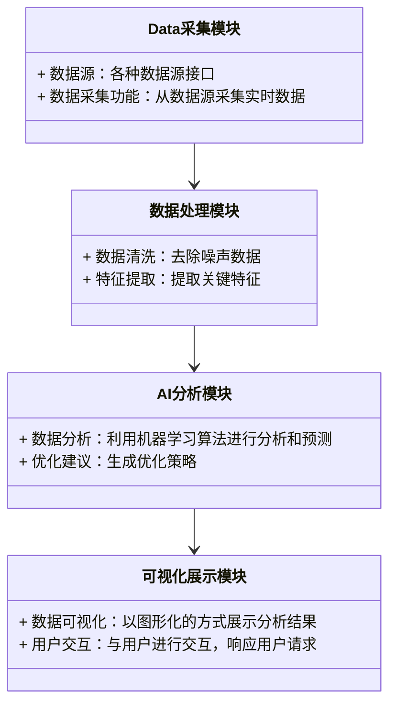
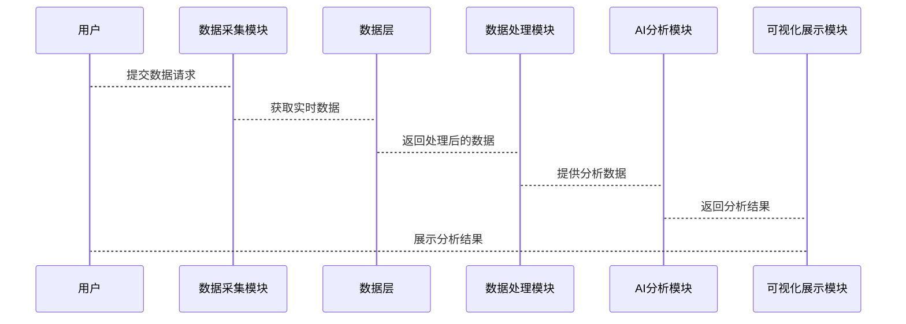

                 


# AI驱动的企业战略执行仪表盘：实时KPI追踪与自动调整

## 关键词：AI，KPI，企业战略，实时追踪，自动调整，仪表盘

## 摘要：AI驱动的企业战略执行仪表盘利用实时数据分析和自动调整机制，优化企业KPI管理。通过AI技术，企业能够实现高效、精准的战略执行监控与优化。

---

# 第1章: 企业战略执行仪表盘的核心概念

## 1.1 企业战略执行仪表盘的背景与意义

### 1.1.1 企业战略执行的重要性

企业战略是指导企业长期发展的蓝图，其成功与否直接关系到企业的生存与发展。有效的战略执行需要实时监控关键绩效指标（KPI），以确保战略目标的实现。传统的企业战略执行依赖于定期报告和人工分析，这种方式难以满足现代企业对实时性、准确性和高效性的要求。

### 1.1.2 传统KPI管理的局限性

传统的KPI管理方式存在以下问题：
- 数据滞后：依赖于定期报告，无法实时反映企业运营状况。
- 数据孤岛：各个部门和系统的数据分散，难以整合和分析。
- 分析复杂：人工分析需要大量时间和资源，且容易出错。
- 调整缓慢：发现问题后，制定和实施调整措施的时间较长，难以应对快速变化的市场环境。

### 1.1.3 AI驱动的KPI管理的优势

AI技术的应用能够显著提升KPI管理的效率和效果：
- 实时监控：通过实时数据流处理，确保KPI的实时更新和分析。
- 智能预测：利用机器学习模型，预测KPI的变化趋势，提前采取措施。
- 自动调整：基于AI算法，自动优化KPI，确保战略执行的高效性。
- 数据整合：AI能够整合来自不同系统和部门的数据，提供全面的视角。

## 1.2 AI驱动的仪表盘定义与特点

### 1.2.1 仪表盘的核心功能

AI驱动的企业战略执行仪表盘具有以下核心功能：
- 实时数据可视化：通过图表、仪表盘等形式，实时展示企业的关键指标。
- 数据分析与预测：利用AI算法，分析数据，预测未来趋势。
- 自动调整与优化：基于分析结果，自动调整战略执行策略，优化KPI。
- 可视化报告：生成动态报告，帮助管理层快速了解企业运营状况。

### 1.2.2 AI在仪表盘中的作用

AI在仪表盘中的作用主要体现在以下几个方面：
- 数据处理：AI能够实时处理大量数据，确保数据的准确性和及时性。
- 智能分析：利用机器学习模型，分析数据，发现潜在问题和机会。
- 自动决策：基于分析结果，AI能够自动生成优化建议和调整策略。
- 个性化展示：根据用户需求，个性化展示数据，提供定制化的视角。

### 1.2.3 仪表盘的实时性与动态调整能力

实时性是AI驱动仪表盘的核心特点之一：
- 数据实时更新：仪表盘能够实时获取最新数据，确保信息的准确性。
- 实时分析：AI算法能够快速分析数据，提供实时的洞察和建议。
- 动态调整：根据实时分析结果，仪表盘能够自动调整战略执行策略，确保KPI的最优表现。

## 1.3 仪表盘的核心要素与架构

### 1.3.1 数据源的多样性

企业战略执行仪表盘的数据源通常包括：
- 企业内部数据：如销售数据、财务数据、生产数据等。
- 第三方数据：如市场数据、竞争对手数据、行业趋势数据等。
- 社交媒体数据：如客户评价、社交媒体情绪分析等。

### 1.3.2 KPI的多层次与多维度

KPI的多层次与多维度体现在以下几个方面：
- 层次：从企业整体到部门、项目、个人等不同层次的KPI。
- 维度：包括财务、客户、内部流程、学习与发展等多个维度。

### 1.3.3 AI算法的实时分析能力

AI算法在实时分析中的作用：
- 时间序列分析：用于预测未来趋势。
- 实时数据处理：确保数据的准确性和及时性。
- 异常检测：及时发现数据中的异常情况，提供预警。

## 1.4 仪表盘的用户与应用场景

### 1.4.1 仪表盘的主要用户群体

- 企业管理层：通过仪表盘了解企业整体运营状况，制定战略决策。
- 部门经理：通过仪表盘监控部门KPI，优化部门绩效。
- 项目经理：通过仪表盘跟踪项目进度，确保项目按时完成。
- 数据分析师：通过仪表盘获取数据洞察，支持决策。

### 1.4.2 仪表盘的应用场景分析

- 战略执行监控：实时监控企业战略执行情况，确保战略目标的实现。
- 问题诊断：通过数据分析，发现企业运营中的问题，并提供解决方案。
- 机会挖掘：识别市场机会，优化资源配置，提升企业竞争力。
- 持续改进：通过实时数据分析，不断优化企业运营，提升绩效。

### 1.4.3 不同行业中的差异化应用

不同行业在使用仪表盘时，会根据自身特点和需求进行定制化应用：
- 制造业：实时监控生产效率、成本控制等KPI，优化生产流程。
- 零售业：实时监控销售数据、库存水平、客户满意度等，优化供应链管理。
- 金融行业：实时监控风险指标、客户行为，防范金融风险。

## 1.5 本章小结

本章介绍了企业战略执行仪表盘的核心概念，包括其背景、意义、定义、特点以及核心要素与架构。通过分析传统KPI管理的局限性和AI驱动仪表盘的优势，明确了仪表盘在现代企业管理中的重要性。接下来的章节将详细探讨仪表盘的实时追踪与自动调整机制，系统架构设计以及项目实战等内容。

---

# 第2章: KPI实时追踪的核心算法

## 2.1 数据采集与预处理

### 2.1.1 数据源的多样性与标准化

为了确保数据的准确性和一致性，需要对来自不同数据源的数据进行标准化处理：
- 数据清洗：去除噪声数据，处理缺失值。
- 数据转换：将数据转换为统一的格式，便于后续分析。
- 数据归约：通过降维技术，减少数据量，提高处理效率。

### 2.1.2 数据流的实时处理

实时数据流处理是AI驱动仪表盘的核心能力之一：
- 数据流处理框架：如Apache Kafka、Apache Pulsar等，用于高效处理实时数据流。
- 流数据处理算法：如基于滑动窗口的实时统计、增量学习等。

### 2.1.3 数据清洗与特征提取

数据清洗和特征提取是数据预处理的重要步骤：
- 数据清洗：去除异常值、重复数据，处理无效数据。
- 特征提取：从原始数据中提取具有代表性的特征，用于后续的分析和建模。

### 2.1.4 代码示例：数据清洗与特征提取

```python
import pandas as pd
import numpy as np

# 加载数据
data = pd.read_csv('kpi_data.csv')

# 数据清洗：去除重复数据
data.drop_duplicates(inplace=True)

# 处理缺失值
data.dropna(inplace=True)

# 特征提取：提取关键特征
selected_features = ['revenue', 'profit', 'customer_satisfaction']
filtered_data = data[selected_features]
```

## 2.2 KPI预测与异常检测

### 2.2.1 时间序列分析模型

时间序列分析是预测KPI的重要方法：
- 简单移动平均（SMA）：基于过去若干期的平均值预测未来值。
- 加权移动平均（WMA）：基于过去若干期的加权平均值预测未来值。
- 自回归积分滑动平均（ARIMA）：通过分析数据的自相关性和部分相关性进行预测。

### 2.2.2 基于机器学习的异常检测

异常检测是实时监控KPI的重要手段：
- 基于统计的方法：如Z-score、孤立森林等。
- 基于机器学习的方法：如随机森林、支持向量机（SVM）、深度学习模型（如LSTM）。

### 2.2.3 KPI预测的数学模型

KPI预测的数学模型示例：
$$ y_t = \alpha y_{t-1} + (1-\alpha)y_{t-2} $$

其中，$y_t$ 是当前时间点的预测值，$\alpha$ 是平滑因子，$y_{t-1}$ 和 $y_{t-2}$ 是过去两个时间点的实际值。

### 2.2.4 代码示例：KPI预测与异常检测

```python
import pandas as pd
import numpy as np
from sklearn.ensemble import IsolationForest

# 加载数据
data = pd.read_csv('kpi_data.csv')

# 训练异常检测模型
model = IsolationForest(random_state=42)
model.fit(data[['revenue', 'profit']])

# 预测异常值
data['is_anomaly'] = model.predict(data[['revenue', 'profit']]) == -1
```

## 2.3 自动调整机制的设计

### 2.3.1 基于反馈的动态优化

动态优化是自动调整机制的核心：
- 反馈机制：根据实时数据和模型预测结果，调整战略执行策略。
- 动态权重分配：根据不同KPI的重要性，动态调整优化目标的权重。

### 2.3.2 多目标优化算法

多目标优化算法用于在多个目标之间找到平衡：
- 基于帕累托最优的多目标优化：寻找在多个目标下都无法再进一步优化的解。
- 基于权重分配的多目标优化：根据各目标的重要性，分配不同的权重，进行综合优化。

### 2.3.3 调整策略的可解释性

调整策略的可解释性是实际应用中的重要考虑因素：
- 解释性模型：如线性回归、决策树等，能够提供清晰的解释。
- 解释性分析：通过可视化和案例分析，帮助用户理解调整策略的依据。

### 2.3.4 代码示例：多目标优化

```python
import numpy as np
from scipy.optimize import minimize

# 定义目标函数
def objective(x):
    return (x[0] + x[1]) ** 2

# 定义约束条件
def constraint1(x):
    return x[0] + x[1] - 2 <= 0

# 求解多目标优化问题
x0 = [1, 1]
result = minimize(objective, x0, constraints=[{'type': 'ineq', 'fun': constraint1}])
print(result.x)
```

## 2.4 本章小结

本章详细探讨了KPI实时追踪的核心算法，包括数据采集与预处理、KPI预测与异常检测以及自动调整机制的设计。通过具体的代码示例和数学模型，展示了如何利用AI技术实现KPI的实时监控和自动调整。接下来的章节将重点讨论仪表盘的系统架构与实现，以及项目实战与案例分析。

---

# 第3章: 仪表盘的系统架构与实现

## 3.1 系统架构设计

### 3.1.1 系统功能模块划分

AI驱动的企业战略执行仪表盘系统主要由以下几个模块组成：
- 数据采集模块：负责从各种数据源采集实时数据。
- 数据处理模块：对采集到的数据进行清洗、转换和特征提取。
- AI分析模块：利用机器学习算法对数据进行分析和预测，生成优化建议。
- 可视化展示模块：将分析结果以图形化的方式展示给用户。

### 3.1.2 系统架构的分层设计

系统的分层设计包括：
- 数据层：负责数据的存储和管理。
- 服务层：负责数据的处理、分析和计算。
- 表现层：负责用户界面的展示和交互。

### 3.1.3 系统接口设计

系统接口设计包括：
- 数据接口：与其他系统的数据接口进行交互，获取实时数据。
- 用户接口：提供给最终用户的可视化界面，支持用户交互。
- API接口：提供给其他系统的API接口，支持外部系统的集成。

### 3.1.4 系统交互流程

系统交互流程包括：
1. 用户通过可视化界面提交请求。
2. 数据采集模块从数据源获取实时数据。
3. 数据处理模块对数据进行预处理，提取关键特征。
4. AI分析模块利用机器学习算法进行分析，生成预测结果和优化建议。
5. 可视化展示模块将分析结果以图形化的方式展示给用户。

### 3.1.5 本节小结

本节详细讨论了仪表盘系统的架构设计，包括功能模块划分、分层设计、接口设计和交互流程。通过合理的系统架构设计，能够确保系统的高效性、可靠性和可扩展性。

## 3.2 系统功能设计

### 3.2.1 领域模型设计

领域模型设计是系统功能设计的基础，通过领域模型可以清晰地理解系统的功能结构和各个模块之间的关系。以下是领域模型的Mermaid类图：



### 3.2.2 系统架构设计

系统架构设计是系统实现的基础，以下是系统架构的Mermaid架构图：

```mermaid
container 系统架构 {
    系统功能模块划分
    数据采集模块
    数据处理模块
    AI分析模块
    可视化展示模块
}

container 数据层 {
    数据库
    数据存储
}

container 服务层 {
    数据处理服务
    AI分析服务
}

container 表现层 {
    用户界面
    图表展示
}

数据采集模块 --> 数据层
数据处理模块 --> 服务层
AI分析模块 --> 服务层
可视化展示模块 --> 表现层
```

### 3.2.3 系统交互设计

系统交互设计是用户与系统之间进行有效沟通的关键，以下是系统交互的Mermaid序列图：



## 3.3 本章小结

本章详细探讨了仪表盘的系统架构与实现，包括系统功能模块划分、系统架构设计、系统接口设计和系统交互设计。通过合理的系统架构设计和功能实现，能够确保仪表盘的高效性、准确性和可扩展性。接下来的章节将重点讨论仪表盘的项目实战与案例分析。

---

# 第4章: 项目实战与案例分析

## 4.1 项目实战

### 4.1.1 项目背景

假设我们是一家跨国制造企业，希望通过AI驱动的仪表盘实时监控和优化生产效率、成本控制、产品质量等关键指标。

### 4.1.2 项目需求

- 实时监控生产效率、成本控制、产品质量等KPI。
- 自动预测未来趋势，发现潜在问题，提供优化建议。
- 提供直观的可视化界面，方便管理层和生产部门实时了解运营状况。

### 4.1.3 项目实施步骤

1. 数据采集：从生产系统、财务系统、质量控制系统等数据源采集实时数据。
2. 数据处理：对采集到的数据进行清洗、转换和特征提取。
3. AI分析：利用机器学习算法对数据进行分析和预测，生成优化建议。
4. 可视化展示：将分析结果以图形化的方式展示给用户。

### 4.1.4 代码实现

以下是项目的核心代码实现：

```python
import pandas as pd
from sklearn.ensemble import RandomForestRegressor
from sklearn.metrics import mean_absolute_error

# 数据采集与预处理
data = pd.read_csv('production_data.csv')
data_processed = data.dropna().drop_duplicates()

# 特征工程
features = ['production_time', 'cost', 'quality_score']
target = 'efficiency'

# 训练预测模型
model = RandomForestRegressor(n_estimators=100, random_state=42)
model.fit(data_processed[features], data_processed[target])

# 模型评估
predictions = model.predict(data_processed[features])
print(mean_absolute_error(data_processed[target], predictions))
```

### 4.1.5 案例分析

通过上述代码实现，我们可以实时监控生产效率，预测未来趋势，并根据模型预测结果优化生产流程。例如，如果预测显示生产效率将下降，系统会自动生成优化建议，如调整生产班次、优化设备维护策略等。

## 4.2 本章小结

本章通过一个具体的项目实战案例，详细探讨了AI驱动的企业战略执行仪表盘的实施过程。从项目背景、需求分析到实施步骤和代码实现，展示了如何将理论应用于实际。接下来的章节将总结仪表盘的应用价值，并提供最佳实践和未来展望。

---

# 第5章: 总结与展望

## 5.1 总结

AI驱动的企业战略执行仪表盘通过实时监控和自动调整KPI，显著提升了企业战略执行的效率和效果。本文详细探讨了仪表盘的核心概念、实时追踪与自动调整的算法原理、系统架构设计以及项目实战与案例分析。通过理论与实践相结合，展示了如何利用AI技术优化企业运营。

## 5.2 未来展望

未来，AI驱动的企业战略执行仪表盘将朝着以下几个方向发展：
- 更加智能化：通过深度学习和强化学习，进一步提升预测和优化的准确性。
- 更加个性化：根据企业的个性化需求，提供定制化的仪表盘功能。
- 更加集成化：与其他企业系统（如ERP、CRM）深度集成，提供更加全面的解决方案。
- 更加实时化：通过边缘计算和物联网技术，进一步提升数据处理的实时性。

## 5.3 最佳实践

为了确保仪表盘的成功实施，建议企业在实施过程中注意以下几点：
- 数据质量：确保数据的准确性和完整性，建立数据质量管理机制。
- 系统集成：与其他企业系统深度集成，充分利用现有数据资源。
- 用户培训：对用户进行充分的培训，确保其能够正确使用仪表盘。
- 持续优化：根据实际使用情况，不断优化仪表盘的功能和性能。

---

# 作者：AI天才研究院/AI Genius Institute & 禅与计算机程序设计艺术/Zen And The Art of Computer Programming

---

这篇博客文章详细探讨了AI驱动的企业战略执行仪表盘的设计与实现，从理论到实践，为读者提供了全面的指导和深入的分析。

