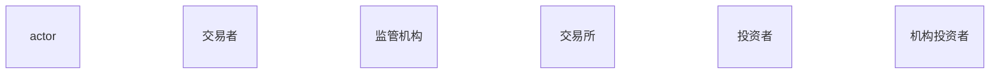
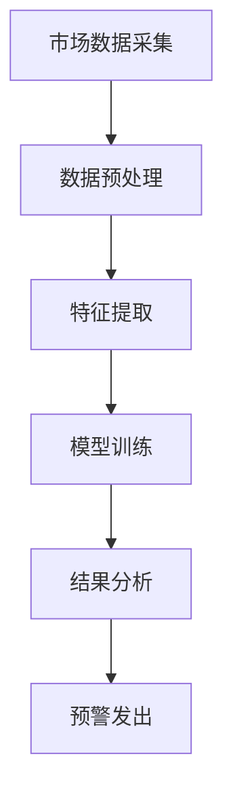
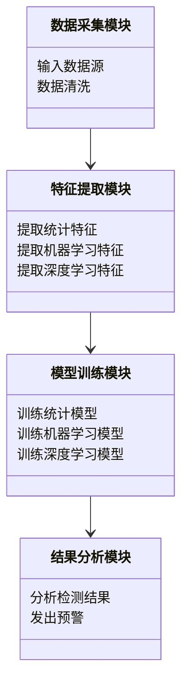
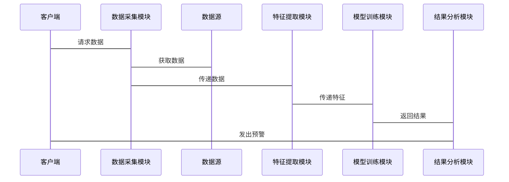

                 


# AI驱动的市场微观结构变化检测

> 关键词：AI, 市场微观结构, 市场变化检测, 机器学习, 深度学习

> 摘要：本文探讨了如何利用人工智能技术检测市场微观结构的变化。从背景介绍、核心概念到算法原理、系统架构，再到项目实战和最佳实践，全面分析了AI在这一领域的应用。

---

# 第1章: AI驱动的市场微观结构变化检测概述

## 1.1 什么是市场微观结构

### 1.1.1 市场微观结构的定义
市场微观结构是指市场中的参与者、交易规则、价格形成机制等的集合。它描述了市场的运作方式和交易行为的特征。

### 1.1.2 市场微观结构的构成要素
- **参与者**：包括买方、卖方、交易商等。
- **交易规则**：包括订单类型、交易时间限制等。
- **价格形成机制**：包括拍卖机制、撮合交易等。
- **市场深度**：包括订单簿、未成交订单的数量等。

### 1.1.3 市场微观结构的变化特征
- **稳定性**：市场在正常情况下的价格波动。
- **突变性**：突发事件导致的市场剧烈波动。
- **渐变性**：市场逐渐变化的过程。

## 1.2 AI在金融市场中的应用

### 1.2.1 AI在金融数据分析中的作用
- **高频交易**：利用AI快速分析市场数据，做出交易决策。
- **风险管理**：通过AI预测市场风险，帮助投资者规避损失。
- **市场预测**：利用AI模型预测市场走势。

### 1.2.2 AI驱动的市场微观结构变化检测的意义
- **及时发现异常**：通过AI检测市场中的异常波动，帮助投资者做出决策。
- **提高交易效率**：通过自动化检测，减少人工干预，提高交易效率。
- **优化投资策略**：通过分析市场微观结构的变化，优化投资策略。

### 1.2.3 当前AI在金融市场中的技术趋势
- **深度学习**：在市场预测和风险评估中应用广泛。
- **强化学习**：在高频交易和自动化决策中逐渐普及。
- **自然语言处理**：用于分析新闻和社交媒体对市场的影响。

## 1.3 问题背景与目标

### 1.3.1 市场微观结构变化检测的背景
随着金融市场的复杂化，传统的市场分析方法难以应对高频交易和算法交易带来的挑战。AI技术的应用为市场微观结构变化检测提供了新的可能性。

### 1.3.2 问题描述与目标
- **问题描述**：如何利用AI技术检测市场微观结构的变化。
- **问题目标**：开发一种基于AI的市场微观结构变化检测系统，能够实时监测市场变化，及时发出预警。

### 1.3.3 边界与外延
- **边界**：仅关注市场微观结构的变化，不涉及宏观经济因素。
- **外延**：包括市场参与者的交易行为、订单簿的变化等。

### 1.3.4 核心概念与组成要素
- **核心概念**：市场微观结构变化的检测方法。
- **组成要素**：数据采集、特征提取、模型训练、结果分析。

## 1.4 本章小结
本章介绍了市场微观结构的定义、构成要素及其变化特征，探讨了AI在金融市场中的应用及其意义，并明确了本文的研究目标和核心概念。

---

# 第2章: 市场微观结构变化检测的核心概念与联系

## 2.1 市场微观结构变化的检测方法

### 2.1.1 统计方法
统计方法通过分析市场数据的分布特征，检测市场微观结构的变化。常用的方法包括均值检验、方差分析等。

### 2.1.2 机器学习方法
机器学习方法通过训练模型，学习市场数据的特征，检测市场微观结构的变化。常用的方法包括支持向量机、随机森林等。

### 2.1.3 深度学习方法
深度学习方法通过多层神经网络，学习市场数据的复杂特征，检测市场微观结构的变化。常用的方法包括卷积神经网络、循环神经网络等。

## 2.2 不同方法的对比分析

### 2.2.1 统计方法与机器学习方法的对比
- **统计方法**：简单易懂，但难以捕捉复杂特征。
- **机器学习方法**：能够捕捉复杂特征，但需要大量数据。

### 2.2.2 机器学习方法与深度学习方法的对比
- **机器学习方法**：适用于小规模数据，训练时间短。
- **深度学习方法**：适用于大规模数据，训练时间长，但能够捕捉更复杂的特征。

### 2.2.3 各种方法的优缺点
| 方法         | 优点                     | 缺点                     |
|--------------|--------------------------|--------------------------|
| 统计方法     | 简单易懂，计算速度快      | 难以捕捉复杂特征         |
| 机器学习方法 | 能够捕捉复杂特征，计算速度较快 | 需要大量数据             |
| 深度学习方法 | 能够捕捉非常复杂的特征    | 计算速度慢，需要大量数据 |

## 2.3 实体关系图与流程图

### 2.3.1 实体关系图（ER图）


### 2.3.2 流程图（使用 Mermaid）


## 2.4 本章小结
本章介绍了市场微观结构变化检测的主要方法，包括统计方法、机器学习方法和深度学习方法，并对其优缺点进行了对比分析，最后通过ER图和流程图展示了系统的核心概念与联系。

---

# 第3章: 基于统计的方法

## 3.1 统计方法概述

### 3.1.1 统计方法的原理
统计方法通过分析市场数据的分布特征，检测市场微观结构的变化。常用的方法包括均值检验、方差分析等。

### 3.1.2 统计方法的实现步骤
1. 数据采集：收集市场数据，包括价格、成交量等。
2. 数据预处理：清洗数据，处理缺失值和异常值。
3. 特征提取：提取市场数据的统计特征，如均值、方差等。
4. 数据分析：通过统计检验，检测市场微观结构的变化。

## 3.2 统计方法的数学模型

### 3.2.1 基于均值和方差的统计检验
- **均值检验**：通过t检验或z检验，判断数据的均值是否发生变化。
- **方差分析**：通过F检验，判断数据的方差是否发生变化。

### 3.2.2 统计模型的公式推导
$$ t = \frac{\bar{x} - \mu}{s / \sqrt{n}} $$
其中，$\bar{x}$是样本均值，$\mu$是假设的均值，$s$是样本标准差，$n$是样本数量。

### 3.2.3 示例代码实现
```python
import numpy as np
from scipy import stats

# 数据集
data = [1, 2, 3, 4, 5]

# 均值检验
t_stat, p_value = stats.ttest_1samp(data, 3)
print(f"t统计量: {t_stat}, p值: {p_value}")

# 方差分析
f_stat, p_value = stats.f_oneway(data, [2, 3, 4, 5, 6])
print(f"F统计量: {f_stat}, p值: {p_value}")
```

## 3.3 本章小结
本章介绍了基于统计的方法，通过均值和方差的统计检验，检测市场微观结构的变化，并通过示例代码展示了方法的实现。

---

# 第4章: 基于机器学习的方法

## 4.1 机器学习方法概述

### 4.1.1 机器学习的基本原理
机器学习通过训练模型，学习市场数据的特征，检测市场微观结构的变化。常用的方法包括支持向量机、随机森林等。

### 4.1.2 常用算法介绍
- **支持向量机（SVM）**：适用于分类问题，能够处理非线性可分的数据。
- **随机森林**：适用于分类和回归问题，能够处理高维数据。

## 4.2 机器学习方法的数学模型

### 4.2.1 支持向量机模型
$$ \text{目标函数} = \sum_{i=1}^{n} \alpha_i y_i (w \cdot x_i + b) + C \sum_{i=1}^{n} \alpha_i $$
其中，$\alpha_i$是拉格朗日乘子，$y_i$是标签，$w$是权重向量，$b$是偏置项。

### 4.2.2 随机森林模型
随机森林通过集成多个决策树，提高模型的准确性和鲁棒性。

### 4.2.3 示例代码实现
```python
from sklearn import svm
from sklearn.ensemble import RandomForestClassifier

# 数据集
X = [[1, 2], [3, 4], [5, 6], [7, 8], [9, 10]]
y = [0, 1, 0, 1, 0]

# 支持向量机
model_svm = svm.SVC()
model_svm.fit(X, y)
print(f"SVM模型准确率: {model_svm.score(X, y)}")

# 随机森林
model_rf = RandomForestClassifier()
model_rf.fit(X, y)
print(f"随机森林模型准确率: {model_rf.score(X, y)}")
```

## 4.3 本章小结
本章介绍了基于机器学习的方法，通过支持向量机和随机森林模型，检测市场微观结构的变化，并通过示例代码展示了方法的实现。

---

# 第5章: 基于深度学习的方法

## 5.1 深度学习方法概述

### 5.1.1 深度学习的基本原理
深度学习通过多层神经网络，学习市场数据的复杂特征，检测市场微观结构的变化。常用的方法包括卷积神经网络、循环神经网络等。

### 5.1.2 常用深度学习模型介绍
- **卷积神经网络（CNN）**：适用于图像数据，能够提取局部特征。
- **循环神经网络（RNN）**：适用于序列数据，能够捕捉时间序列特征。

## 5.2 深度学习方法的数学模型

### 5.2.1 卷积神经网络模型
$$ y = \sigma(W x + b) $$
其中，$W$是权重矩阵，$x$是输入数据，$b$是偏置项，$\sigma$是激活函数。

### 5.2.2 循环神经网络模型
$$ h_t = \sigma(W h_{t-1} + U x_t + b) $$
其中，$h_t$是当前时刻的隐藏状态，$W$是权重矩阵，$U$是输入权重矩阵，$b$是偏置项，$\sigma$是激活函数。

### 5.2.3 Transformer模型
$$ \text{Query} = Q \times K^T $$
$$ \text{Key} = K \times V^T $$
其中，$Q$是查询矩阵，$K$是键矩阵，$V$是值矩阵。

### 5.2.4 示例代码实现
```python
import tensorflow as tf
from tensorflow import keras

# 数据集
X = tf.random.normal((100, 10))
y = tf.random.binary((100, 1))

# 卷积神经网络
model_cnn = keras.Sequential([
    tf.keras.layers.Conv1D(32, 3, activation='relu', input_shape=(10,)),
    tf.keras.layers.MaxPooling1D(2),
    tf.keras.layers.Dense(64, activation='relu'),
    tf.keras.layers.Dense(1, activation='sigmoid')
])
model_cnn.compile(optimizer='adam', loss='binary_crossentropy', metrics=['accuracy'])
model_cnn.fit(X, y, epochs=10)

# 循环神经网络
model_rnn = keras.Sequential([
    tf.keras.layers.SimpleRNN(64, activation='relu', input_shape=(10,)),
    tf.keras.layers.Dense(1, activation='sigmoid')
])
model_rnn.compile(optimizer='adam', loss='binary_crossentropy', metrics=['accuracy'])
model_rnn.fit(X, y, epochs=10)
```

## 5.3 本章小结
本章介绍了基于深度学习的方法，通过卷积神经网络、循环神经网络和Transformer模型，检测市场微观结构的变化，并通过示例代码展示了方法的实现。

---

# 第6章: 系统架构与实现

## 6.1 问题场景介绍
市场微观结构变化检测系统需要实时监测市场数据，及时发出预警，帮助投资者做出决策。

## 6.2 系统功能设计

### 6.2.1 领域模型（Mermaid类图）


### 6.2.2 系统架构设计（Mermaid架构图）
```mermaid
container 客户端 {
    浏览器
    API接口
}
container 服务端 {
    数据采集模块
    特征提取模块
    模型训练模块
    结果分析模块
}
container 数据源 {
    交易数据
    市场数据
}
```

### 6.2.3 系统接口设计（Mermaid序列图）


## 6.3 系统实现

### 6.3.1 数据采集模块
```python
import requests

def get_market_data(api_key):
    url = f"https://api.example.com/market_data?api_key={api_key}"
    response = requests.get(url)
    return response.json()
```

### 6.3.2 特征提取模块
```python
def extract_features(data):
    features = []
    for d in data:
        # 提取统计特征
        mean = np.mean(d)
        var = np.var(d)
        features.append([mean, var])
    return features
```

### 6.3.3 模型训练模块
```python
from sklearn.ensemble import RandomForestClassifier

def train_model(features, labels):
    model = RandomForestClassifier()
    model.fit(features, labels)
    return model
```

### 6.3.4 结果分析模块
```python
def analyze_results(model, new_data):
    features = extract_features(new_data)
    prediction = model.predict(features)
    if prediction == 1:
        print("检测到市场微观结构变化，发出预警！")
```

## 6.4 本章小结
本章介绍了市场微观结构变化检测系统的架构设计和实现过程，包括数据采集、特征提取、模型训练和结果分析等模块，并通过代码示例展示了系统的核心实现。

---

# 第7章: 项目实战

## 7.1 环境搭建

### 7.1.1 安装Python环境
```bash
python --version
pip install numpy scikit-learn tensorflow keras
```

### 7.1.2 安装依赖库
```bash
pip install requests mermaid4jupyter jupyter notebook
```

## 7.2 数据集准备

### 7.2.1 数据采集
```python
import requests

def get_market_data(api_key):
    url = f"https://api.example.com/market_data?api_key={api_key}"
    response = requests.get(url)
    return response.json()

# 获取数据
data = get_market_data("your_api_key")
```

### 7.2.2 数据预处理
```python
import pandas as pd
import numpy as np

# 数据清洗
data_clean = data.dropna()
data_clean = data_clean.replace([np.inf, -np.inf], np.nan).dropna()
```

## 7.3 系统核心实现

### 7.3.1 特征提取
```python
def extract_features(data):
    features = []
    for d in data:
        mean = np.mean(d)
        var = np.var(d)
        features.append([mean, var])
    return features
```

### 7.3.2 模型训练
```python
from sklearn.ensemble import RandomForestClassifier

def train_model(features, labels):
    model = RandomForest

