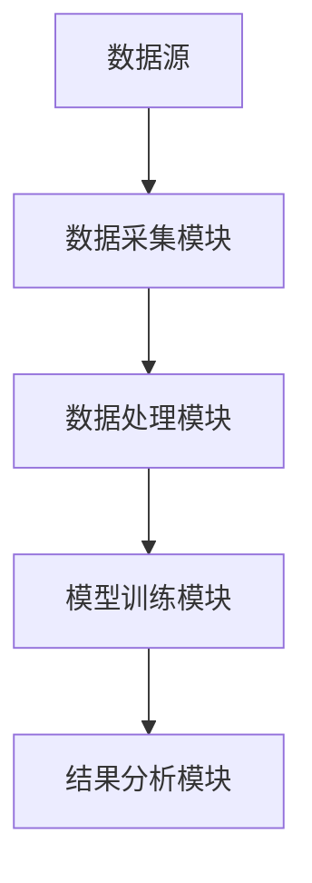
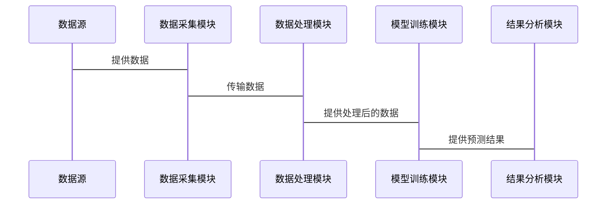

                 

# 利用AI进行全球资金流动分析：预测市场走向

> 关键词：AI技术，全球资金流动分析，金融市场预测，时间序列预测，机器学习算法，深度学习模型，NLP文本分析

> 摘要：本文将深入探讨如何利用人工智能技术进行全球资金流动分析，预测市场走向。通过分析资金流动的背景、理论基础、AI算法、系统架构、项目实战等多个方面，详细阐述AI技术在全球资金流动分析中的应用及其对未来金融市场预测的深远影响。

---

# 第1章: 全球资金流动分析概述

## 1.1 全球资金流动的基本概念

### 1.1.1 资金流动的定义与分类

资金流动是指资金在全球范围内的跨国流动，通常分为国际资本流动、外汇交易、跨境投资等多种形式。根据流动的方向和目的，资金流动可以分为短期资本流动和长期资本流动。

### 1.1.2 全球资金流动的特征与趋势

全球资金流动的特征包括：  
1. **波动性**：受经济政策、市场情绪等多种因素影响，资金流动具有高度波动性。  
2. **复杂性**：涉及多个金融市场和参与者，资金流动路径复杂。  
3. **信息依赖性**：资金流动决策高度依赖于市场信息和数据。  

近年来，随着全球化进程加速和金融市场的开放，全球资金流动规模不断扩大，同时受到技术进步和政策变化的双重影响。

### 1.1.3 资金流动对市场的影响

资金流动对金融市场的影响主要体现在以下几个方面：  
1. **资产价格波动**：大量资金流入或流出会导致资产价格的剧烈波动。  
2. **市场流动性**：资金流动的增加或减少会影响市场的流动性。  
3. **经济政策**：资金流动对各国货币政策和汇率政策具有重要影响。  

---

## 1.2 AI技术在资金流动分析中的作用

### 1.2.1 AI技术的基本概念

人工智能（AI）是指计算机系统模拟人类智能的技术，包括学习、推理、自我改进等功能。在金融领域，AI技术广泛应用于数据分析、预测和决策支持。

### 1.2.2 AI在金融领域的应用现状

目前，AI技术在金融领域的应用主要包括：  
1. **智能投顾**：通过算法为投资者提供个性化的投资建议。  
2. **风险控制**：利用AI技术识别和预测金融风险。  
3. **市场预测**：通过大数据分析和机器学习模型预测市场走势。  

### 1.2.3 AI如何助力资金流动分析

AI技术在资金流动分析中的优势在于：  
1. **数据处理能力**：AI能够快速处理海量数据，提取有用信息。  
2. **预测能力**：通过机器学习模型，AI可以预测资金流动的趋势和方向。  
3. **实时性**：AI技术能够实现实时数据分析和预测，帮助投资者做出快速决策。  

---

## 1.3 全球资金流动分析的实际应用场景

### 1.3.1 金融市场预测

通过分析历史资金流动数据，AI模型可以预测未来市场的走势，帮助投资者做出投资决策。

### 1.3.2 资产配置优化

基于资金流动分析的结果，投资者可以优化资产配置，降低投资风险。

### 1.3.3 风险管理与控制

AI技术可以帮助识别潜在的市场风险，并制定相应的风险管理策略。

---

## 1.4 本章小结

本章介绍了全球资金流动的基本概念、特征和对市场的影响，同时探讨了AI技术在资金流动分析中的作用和实际应用场景。AI技术的引入为资金流动分析提供了强大的工具，能够帮助投资者更好地理解市场动态，做出更明智的决策。

---

# 第2章: 资金流动分析的理论基础

## 2.1 国际金融理论基础

### 2.1.1 汇率与国际收支平衡

汇率是两国货币之间的兑换比率，影响国际收支平衡。资金流动的分析需要考虑汇率波动对国际收支的影响。

### 2.1.2 利率与资本流动

利率水平是影响资本流动的重要因素。根据利率平价理论，高利率国家会吸引更多的资本流入。

### 2.1.3 资本资产定价模型（CAPM）

CAPM模型用于评估资产的预期收益，考虑了市场风险和无风险利率。在资金流动分析中，CAPM可以用于评估不同资产的风险和收益。

### 2.1.4 时间序列分析的基础理论

时间序列分析是研究数据随时间变化的规律，常用于预测未来市场走势。常用的时间序列模型包括ARIMA和GARCH。

---

## 2.2 数据来源与特征分析

### 2.2.1 资金流动数据的获取渠道

资金流动数据可以通过央行报告、金融市场交易数据、国际机构报告等多种渠道获取。

### 2.2.2 数据的特征与预处理

资金流动数据通常具有高维性、非线性、噪声多等特点。预处理步骤包括数据清洗、标准化和特征提取。

### 2.2.3 数据的可视化与初步分析

通过数据可视化，可以直观地观察资金流动的趋势和周期性。常用工具包括Matplotlib和Tableau。

---

## 2.3 统计学基础与时间序列分析

### 2.3.1 时间序列的基本概念

时间序列是指按时间顺序排列的数据，分析时间序列的目的是发现数据中的趋势、周期性和异常值。

### 2.3.2 常见的时间序列模型

1. **ARIMA模型**：自回归积分滑动模型，适用于线性时间序列数据。  
2. **GARCH模型**：广义自回归条件异方差模型，用于捕捉数据的波动性。  
3. **LSTM模型**：长短期记忆网络，适用于非线性时间序列数据。  

### 2.3.3 时间序列的分解与预测

时间序列分解通常包括趋势、周期性和随机性三个部分。通过分解数据，可以更好地理解其内在规律，并提高预测的准确性。

---

## 2.4 本章小结

本章介绍了国际金融理论基础、数据来源与特征分析以及时间序列分析的基本理论。这些理论为后续的AI算法应用奠定了基础。

---

# 第3章: AI技术在资金流动分析中的核心算法

## 3.1 机器学习基础

### 3.1.1 监督学习与无监督学习

- **监督学习**：基于标签数据进行学习，适用于分类和回归任务。  
- **无监督学习**：基于无标签数据进行学习，适用于聚类和降维任务。  

### 3.1.2 神经网络的基本原理

神经网络是一种受生物神经元启发的计算模型，由多个层次组成，能够学习数据的非线性关系。

### 3.1.3 深度学习的核心概念

深度学习是指通过多层神经网络进行学习，能够捕捉数据的高层次特征。

---

## 3.2 常见的AI算法及其在资金流动分析中的应用

### 3.2.1 线性回归与逻辑回归

- **线性回归**：用于预测连续型变量，如资产价格。  
- **逻辑回归**：用于分类任务，如判断市场趋势。  

### 3.2.2 支持向量机（SVM）

SVM适用于分类和回归任务，能够处理高维数据，适合于金融数据的分析。

### 3.2.3 随机森林与梯度提升树

- **随机森林**：基于决策树的集成学习方法，适用于分类和回归任务。  
- **梯度提升树**：通过多次迭代提升模型性能，适用于复杂的数据关系。  

---

## 3.3 自然语言处理（NLP）在金融文本分析中的应用

### 3.3.1 NLP的基本概念

NLP是研究人机交互中自然语言处理的技术，能够对文本数据进行理解和分析。

### 3.3.2 金融文本数据的处理流程

1. **文本清洗**：去除停用词、标点符号等无用信息。  
2. **分词**：将文本分割成词语或短语。  
3. **向量表示**：将文本转换为数值向量，如词袋模型和词嵌入模型。  
4. **模型训练**：基于向量进行分类或回归任务。  

---

## 3.4 本章小结

本章介绍了机器学习和深度学习的核心算法，以及NLP在金融文本分析中的应用。这些算法为全球资金流动分析提供了强大的工具。

---

# 第4章: 算法原理与数学模型

## 4.1 时间序列预测的数学模型

### 4.1.1 ARIMA模型的数学表达式

ARIMA模型的数学表达式为：  
$$ y_t = \phi_1 y_{t-1} + \phi_2 y_{t-2} + \epsilon_t $$  

其中，$\phi_1$和$\phi_2$是模型的参数，$\epsilon_t$是随机误差项。

### 4.1.2 LSTM模型的数学表达式

LSTM模型的数学表达式为：  
$$ f_t = \sigma(W_f \cdot [h_{t-1}, x_t] + b_f) $$  
$$ i_t = \sigma(W_i \cdot [h_{t-1}, x_t] + b_i) $$  
$$ o_t = \sigma(W_o \cdot [h_{t-1}, x_t] + b_o) $$  
$$ c_t = i_t \cdot c_{t-1} + f_t \cdot x_t $$  
$$ h_t = o_t \cdot \tanh(c_t) $$  

其中，$f_t$、$i_t$和$o_t$分别是遗忘门、输入门和输出门，$c_t$是单元状态，$h_t$是隐藏层输出。

---

## 4.2 机器学习算法的数学模型

### 4.2.1 随机森林的数学模型

随机森林是一种基于决策树的集成学习方法，通过随机采样和特征选择来提高模型的泛化能力。

### 4.2.2 深度学习模型的数学模型

深度学习模型通常包含多个层次，每个层次通过非线性变换提取数据的高层次特征。

---

## 4.3 本章小结

本章详细介绍了时间序列预测和机器学习算法的数学模型，为后续的系统设计和项目实战奠定了理论基础。

---

# 第5章: 系统分析与架构设计

## 5.1 系统功能设计

### 5.1.1 数据采集模块

数据采集模块负责从各种数据源获取资金流动数据，包括API接口和数据库。

### 5.1.2 数据处理模块

数据处理模块负责对采集到的数据进行清洗、转换和特征提取。

### 5.1.3 模型训练模块

模型训练模块负责对数据进行建模和训练，生成预测模型。

### 5.1.4 结果分析模块

结果分析模块负责对模型的预测结果进行分析和可视化。

---

## 5.2 系统架构设计

### 5.2.1 系统架构图

### 5.2.2 接口设计

系统接口设计包括数据接口、模型接口和结果接口，分别用于数据传输、模型调用和结果展示。

### 5.2.3 系统交互流程

---

## 5.3 本章小结

本章详细描述了系统的功能设计和架构设计，为后续的项目实施提供了清晰的指导。

---

# 第6章: 项目实战

## 6.1 环境配置

### 6.1.1 安装Python

安装Python 3.8及以上版本，确保环境支持深度学习框架。

### 6.1.2 安装必要的库

安装NumPy、Pandas、Scikit-learn、Keras和TensorFlow等库。

---

## 6.2 数据获取与处理

### 6.2.1 数据获取

通过API接口获取全球资金流动数据，例如使用Yahoo Finance API。

### 6.2.2 数据清洗

对数据进行清洗，去除缺失值和异常值。

### 6.2.3 特征工程

根据业务需求，提取相关特征，如移动平均线、波动率等。

---

## 6.3 模型训练

### 6.3.1 数据分割

将数据分为训练集和测试集。

### 6.3.2 模型选择

选择合适的模型，如LSTM或随机森林。

### 6.3.3 模型训练

使用训练数据训练模型，调整模型参数，优化模型性能。

### 6.3.4 模型评估

通过回测和绩效指标评估模型的预测能力。

---

## 6.4 结果分析

### 6.4.1 预测结果展示

通过可视化工具展示模型的预测结果。

### 6.4.2 绩效评估

计算模型的准确率、召回率和F1值等指标。

### 6.4.3 模型优化

根据评估结果，优化模型参数和结构。

---

## 6.5 本章小结

本章通过一个具体的项目实战，详细展示了如何利用AI技术进行全球资金流动分析，从数据获取到模型训练，再到结果分析，为读者提供了宝贵的实践经验。

---

# 第7章: 总结与展望

## 7.1 本章总结

本文详细探讨了如何利用AI技术进行全球资金流动分析，涵盖了理论基础、算法原理、系统设计和项目实战等多个方面。

## 7.2 对未来的展望

随着AI技术的不断发展，全球资金流动分析将更加智能化和精准化。未来的研究方向包括更复杂的时间序列模型、多模态数据融合以及实时预测系统开发。

---

# 第8章: 最佳实践与注意事项

## 8.1 最佳实践

### 8.1.1 数据质量的重要性

确保数据的准确性和完整性，避免因数据问题导致模型性能下降。

### 8.1.2 模型选择的策略

根据具体问题选择合适的模型，避免盲目使用复杂模型。

### 8.1.3 模型解释性的重要性

选择具有解释性的模型，便于分析和优化。

---

## 8.2 注意事项

### 8.2.1 数据隐私与安全

在处理金融数据时，需要注意数据隐私和安全问题。

### 8.2.2 模型的可解释性

复杂的模型可能难以解释，需要权衡模型的准确性和可解释性。

### 8.2.3 模型的实时性

在实际应用中，需要考虑模型的实时性和响应速度。

---

## 8.3 本章小结

本章总结了全球资金流动分析中的最佳实践和注意事项，帮助读者在实际应用中更好地利用AI技术。

---

# 附录: 参考文献

1. 刘军. (2020). 《人工智能在金融领域的应用》. 北京: 清华大学出版社.  
2. 张伟. (2019). 《时间序列分析与预测》. 北京: 人民邮电出版社.  
3. 李明. (2021). 《深度学习实战》. 北京: 机械工业出版社.  

---

# 作者：AI天才研究院/AI Genius Institute & 禅与计算机程序设计艺术 /Zen And The Art of Computer Programming

---

**本文是《利用AI进行全球资金流动分析：预测市场走向》的部分内容，转载请注明出处。**

