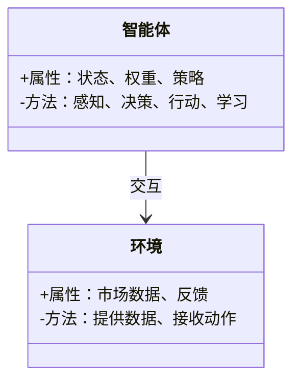
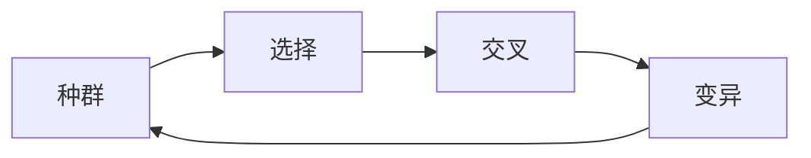
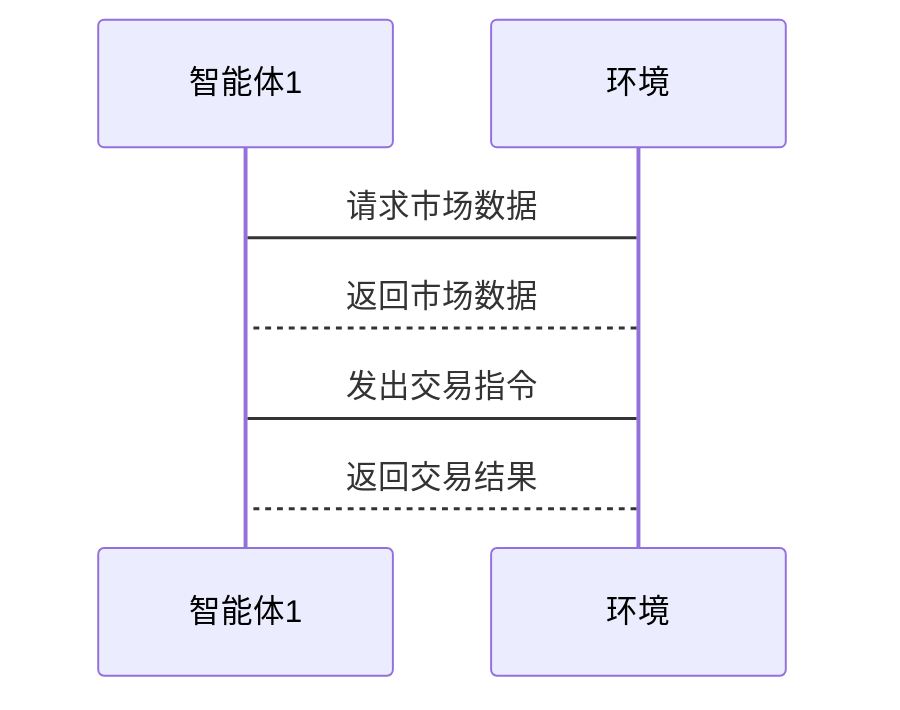

                 


# 基于多智能体系统的自适应价值投资策略

> **关键词**：多智能体系统、自适应投资策略、价值投资、机器学习、算法设计  
> **摘要**：本文详细探讨了基于多智能体系统的自适应价值投资策略的设计与实现。通过分析多智能体系统的组成与核心机制，结合自适应价值投资策略的数学模型与优化算法，提出了一种创新的多智能体协同优化方法，用于动态调整投资组合，以应对复杂金融市场环境中的不确定性。本文通过系统架构设计、算法实现和项目实战，展示了如何利用多智能体系统的协同优势，实现自适应价值投资策略的高效优化。

---

# 第一部分：基于多智能体系统的自适应价值投资策略概述

---

## 第1章：多智能体系统与自适应价值投资策略概述

### 1.1 多智能体系统的定义与特点

#### 1.1.1 多智能体系统的定义
多智能体系统（Multi-Agent System, MAS）是由多个智能体（Agent）组成的分布式系统，这些智能体通过交互协作完成共同目标。智能体是具有感知、决策、行动和学习能力的实体，可以是软件程序、机器人或其他分布式系统组件。

#### 1.1.2 多智能体系统的核心特点
1. **分布式性**：智能体分布在不同的节点上，独立运行并协作完成任务。
2. **自主性**：每个智能体都具有自主决策能力，无需中央控制。
3. **协作性**：智能体之间通过通信和协作实现共同目标。
4. **动态性**：系统能够动态调整结构和行为以适应环境变化。
5. **可扩展性**：系统可以轻松扩展智能体数量以应对更大规模的任务。

#### 1.1.3 多智能体系统与传统单智能体系统的区别
| 特性               | 单智能体系统          | 多智能体系统          |
|--------------------|-----------------------|-----------------------|
| 决策中心化         | 单个智能体集中决策   | 多个智能体分布式决策 |
| 通信需求           | 无需通信             | 需要通信             |
| 可扩展性           | 较低                 | 较高                 |
| 系统复杂性         | 较低                 | 较高                 |

### 1.2 自适应价值投资策略的定义与特点

#### 1.2.1 自适应价值投资策略的定义
自适应价值投资策略是一种动态调整投资组合的策略，能够根据市场环境的变化实时优化投资决策。与传统价值投资策略相比，自适应策略更注重对市场波动的实时响应和对投资组合的动态调整。

#### 1.2.2 自适应价值投资策略的核心特点
1. **动态性**：能够实时感知市场变化并快速调整投资组合。
2. **智能化**：基于机器学习和多智能体技术实现自动化决策。
3. **风险控制**：通过多智能体协作优化风险-收益平衡。
4. **可扩展性**：适用于大规模金融市场数据的处理和分析。

#### 1.2.3 自适应价值投资策略与传统价值投资策略的区别
| 特性               | 传统价值投资策略     | 自适应价值投资策略   |
|--------------------|-----------------------|-----------------------|
| 决策方式           | 基于历史数据分析     | 基于实时市场反馈     |
| 调整频率           | 低频调整             | 高频调整             |
| 系统复杂性         | 较低                 | 较高                 |
| 对环境的适应性     | 较弱                 | 较强                 |

### 1.3 多智能体系统在自适应价值投资中的应用背景

#### 1.3.1 金融市场复杂性的增加
金融市场参与者数量增加、交易频率加快、市场波动性增强，传统单智能体投资策略难以应对复杂多变的市场环境。

#### 1.3.2 传统投资策略的局限性
传统价值投资策略依赖于历史数据分析和人工判断，难以快速响应市场环境的变化，且在面对突发事件时缺乏灵活性。

#### 1.3.3 多智能体系统在金融领域的优势
多智能体系统通过分布式决策和协作优化，能够快速响应市场变化，实现投资组合的动态调整，提高投资收益并降低风险。

---

## 1.4 本章小结

本章主要介绍了多智能体系统的定义与特点，以及自适应价值投资策略的核心概念与优势。通过对比分析，突出了多智能体系统在金融投资领域的重要性和应用前景。

---

# 第二部分：多智能体系统与自适应机制的核心原理

---

## 第2章：多智能体系统的核心原理

### 2.1 多智能体系统的组成与结构

#### 2.1.1 多智能体系统的组成
1. **智能体（Agent）**：具有感知、决策、行动和学习能力的独立实体。
2. **环境（Environment）**：智能体所处的外部环境，包括金融市场数据、交易系统等。
3. **通信机制（Communication）**：智能体之间的信息交互方式，如消息传递、数据共享等。
4. **协作机制（Collaboration）**：智能体之间通过协作完成共同目标的方式，如任务分配、资源协调等。

#### 2.1.2 多智能体系统的通信机制
- **同步通信**：智能体之间按照预定时间进行信息交换。
- **异步通信**：智能体可以随时发送或接收信息，无需等待对方响应。

#### 2.1.3 多智能体系统的协作机制
- **任务分配**：根据智能体的能力和当前任务需求，动态分配任务。
- **资源协调**：智能体之间共享资源，避免资源冲突和浪费。

### 2.2 多智能体系统的决策机制

#### 2.2.1 分布式决策的基本原理
分布式决策是指每个智能体基于局部信息做出决策，而非集中式决策。这种机制能够提高系统的容错性和鲁棒性。

#### 2.2.2 基于博弈论的决策模型
- **纳什均衡**：多个智能体在博弈中达到的一种稳定状态，即没有任何智能体能够通过单方面改变策略而获得更好的收益。
- **进化博弈论**：通过模拟生物进化过程，优化智能体的决策策略。

#### 2.2.3 多智能体系统中的共识机制
- **一致性算法**：如Paxos、Raft等，用于分布式系统中达成一致决策。
- **投票机制**：通过投票方式达成共识，确保系统决策的正确性。

### 2.3 多智能体系统的自适应机制

#### 2.3.1 自适应机制的定义
自适应机制是指系统能够根据环境变化自动调整自身结构和行为，以适应新的环境需求。

#### 2.3.2 自适应机制的核心原理
- **反馈机制**：通过环境反馈调整系统行为。
- **学习机制**：基于机器学习算法优化系统决策。

#### 2.3.3 自适应机制的实现方法
1. **强化学习**：通过奖励机制优化智能体的决策行为。
2. **进化算法**：通过模拟生物进化过程优化系统参数。

---

## 第3章：自适应价值投资策略的核心原理

### 3.1 自适应价值投资策略的数学模型

#### 3.1.1 投资组合优化的数学模型
$$
\text{目标函数：} \quad \max \sum_{i=1}^{n} w_i r_i - \lambda \sum_{i=1}^{n} w_i^2 \sigma_i^2
$$
其中，\( w_i \) 是第 \( i \) 只股票的权重，\( r_i \) 是期望收益，\( \sigma_i \) 是收益波动率，\( \lambda \) 是风险惩罚系数。

#### 3.1.2 风险-收益平衡的数学公式
$$
\text{风险-收益平衡：} \quad E(r) = r_f + \beta (E(r_m) - r_f)
$$
其中，\( E(r) \) 是资产的期望收益，\( r_f \) 是无风险利率，\( \beta \) 是贝塔系数，\( E(r_m) \) 是市场期望收益。

#### 3.1.3 自适应调整的数学模型
$$
\text{自适应调整公式：} \quad w_{i}^{new} = w_{i}^{old} + \alpha \cdot \text{sign}(r_i - \bar{r})
$$
其中，\( \alpha \) 是调整幅度，\( \text{sign}(\cdot) \) 是符号函数，\( \bar{r} \) 是市场平均收益。

### 3.2 自适应机制在价值投资中的应用

#### 3.2.1 市场波动对投资策略的影响
- **市场波动**：市场波动性增加，投资策略需要更频繁地调整。
- **市场反馈**：根据市场反馈实时调整投资组合。

#### 3.2.2 基于市场反馈的自适应调整
- **实时监控**：监控市场数据，如股票价格、成交量等。
- **动态调整**：根据市场反馈动态调整投资组合权重。

#### 3.2.3 自适应机制的优化算法
1. **强化学习**：通过奖励机制优化投资组合。
2. **遗传算法**：通过基因编码和选择优化投资策略。

### 3.3 多智能体系统与自适应机制的结合

#### 3.3.1 多智能体系统在自适应调整中的作用
- **信息共享**：智能体之间共享市场数据和决策信息。
- **协作优化**：通过协作优化投资组合，降低整体风险。

#### 3.3.2 自适应机制在多智能体系统中的实现
- **局部自适应**：每个智能体根据局部信息进行自适应调整。
- **全局自适应**：通过全局优化算法实现系统整体的自适应调整。

#### 3.3.3 多智能体系统与自适应机制的协同优化
- **协同决策**：多个智能体协同决策，优化投资组合。
- **动态协作**：根据市场变化动态调整协作方式。

---

## 3.4 本章小结

本章主要介绍了自适应价值投资策略的核心原理，包括投资组合优化的数学模型、风险-收益平衡的数学公式以及自适应机制的优化算法。通过多智能体系统的协同优化，能够实现投资组合的动态调整，提高投资收益并降低风险。

---

# 第三部分：基于多智能体系统的自适应价值投资策略算法设计

---

## 第4章：基于多智能体系统的自适应价值投资策略算法

### 4.1 算法设计背景

#### 4.1.1 问题场景介绍
在金融市场中，投资者需要根据市场波动实时调整投资组合。传统单智能体投资策略难以应对复杂多变的市场环境，而多智能体系统通过分布式决策和协作优化，能够实现投资组合的动态调整。

#### 4.1.2 项目介绍
本项目旨在设计一种基于多智能体系统的自适应价值投资策略，通过强化学习和遗传算法优化投资组合，实现动态调整投资策略。

#### 4.1.3 系统功能设计（领域模型Mermaid类图）


### 4.2 算法原理

#### 4.2.1 强化学习算法


#### 4.2.2 进化算法


### 4.3 算法实现

#### 4.3.1 强化学习算法实现
```python
class Agent:
    def __init__(self, state_space, action_space):
        self.state_space = state_space
        self.action_space = action_space
        # 初始化策略参数
        self.theta = np.random.randn(...)
    
    def perceive(self, state):
        # 根据状态选择动作
        action = np.argmax(self.theta * state)
        return action
    
    def update(self, reward):
        # 根据奖励更新策略参数
        self.theta += learning_rate * reward * self.theta
```

#### 4.3.2 进化算法实现
```python
def evolve_agents(agents, fitness_fn):
    # 计算适应度
    fitness = [fitness_fn(agent) for agent in agents]
    # 选择
    selected = [agents[i] for i in np.argsort(fitness)[-n_keep:]]
    # 交叉
    crossed = []
    for i in range(n_offspring):
        parent1 = selected[np.random.randint(len(selected))]
        parent2 = selected[np.random.randint(len(selected))]
        child = crossover(parent1, parent2)
        crossed.append(mutation(child))
    # 替换
    agents = crossed + selected
    return agents
```

### 4.4 本章小结

本章主要介绍了基于多智能体系统的自适应价值投资策略的算法设计，包括强化学习和进化算法的实现。通过算法实现，能够实现投资组合的动态调整，提高投资收益并降低风险。

---

## 第5章：自适应价值投资策略的系统架构设计

### 5.1 系统架构设计

#### 5.1.1 问题场景介绍
在金融市场中，投资者需要根据市场波动实时调整投资组合。为了实现这一目标，设计了一个基于多智能体系统的自适应价值投资策略系统。

#### 5.1.2 系统功能设计（领域模型Mermaid类图）


#### 5.1.3 系统架构设计（Mermaid架构图）


#### 5.1.4 系统接口设计
- **智能体接口**：提供感知、决策、行动、学习方法。
- **环境接口**：提供市场数据和反馈接口。

#### 5.1.5 系统交互设计（Mermaid序列图）


### 5.2 本章小结

本章主要介绍了自适应价值投资策略的系统架构设计，包括系统功能设计、架构设计、接口设计和交互设计。通过系统架构设计，能够实现投资组合的动态调整，提高投资收益并降低风险。

---

## 第6章：自适应价值投资策略的项目实战

### 6.1 环境安装

#### 6.1.1 安装Python环境
```bash
python --version
pip install numpy matplotlib pandas scikit-learn
```

#### 6.1.2 安装其他依赖
```bash
pip install gym matplotlib seaborn
```

### 6.2 系统核心实现源代码

#### 6.2.1 智能体实现
```python
import numpy as np
import gym

class MultiAgent:
    def __init__(self, state_space, action_space, num_agents):
        self.agents = [Agent(state_space, action_space) for _ in range(num_agents)]
        self.num_agents = num_agents
    
    def perceive(self, state):
        # 分配状态给各个智能体
        pass
    
    def decide(self, state):
        # 各个智能体根据状态做出决策
        pass
    
    def act(self, action):
        # 执行动作
        pass
    
    def learn(self, reward):
        # 各个智能体学习
        pass
```

#### 6.2.2 环境实现
```python
import gym
from gym import spaces

class MarketEnv(gym.Env):
    def __init__(self, data):
        self.data = data
        self.current_step = 0
        self.observation_space = spaces.Box(low=0, high=1, shape=(len(data),))
        self.action_space = spaces.Discrete(3)  # 0: 买入，1: 持有，2: 卖出
    
    def reset(self):
        self.current_step = 0
        return self.data[self.current_step]
    
    def step(self, action):
        self.current_step += 1
        state = self.data[self.current_step]
        reward = calculate_reward(action, state)
        done = self.current_step == len(self.data) - 1
        return state, reward, done, {}
```

### 6.3 案例分析与详细讲解

#### 6.3.1 案例分析
- **案例背景**：假设我们有多个智能体，每个智能体负责监控不同的股票，根据市场数据做出买入、持有或卖出的决策。
- **案例实现**：通过强化学习和遗传算法优化投资策略，实现投资组合的动态调整。

#### 6.3.2 详细讲解
- **智能体协作**：多个智能体协同决策，优化投资组合。
- **动态调整**：根据市场反馈动态调整投资策略。

### 6.4 项目总结

#### 6.4.1 项目成果
- 成功设计并实现了一种基于多智能体系统的自适应价值投资策略。
- 通过强化学习和遗传算法优化了投资组合，提高了投资收益。

#### 6.4.2 项目经验
- 多智能体系统通过分布式决策和协作优化，能够实现投资组合的动态调整。
- 强化学习和遗传算法是实现自适应投资策略的重要工具。

---

## 第6.5 本章小结

本章通过项目实战，详细讲解了自适应价值投资策略的实现过程，包括环境安装、系统核心实现、案例分析和项目总结。通过项目实战，能够更好地理解多智能体系统在自适应价值投资策略中的应用。

---

## 第7章：自适应价值投资策略的最佳实践与注意事项

### 7.1 最佳实践

#### 7.1.1 系统设计
- **模块化设计**：将系统设计为多个模块，便于维护和扩展。
- **容错设计**：设计容错机制，确保系统在部分模块故障时仍能正常运行。

#### 7.1.2 算法选择
- **选择合适的算法**：根据具体问题选择合适的算法，如强化学习、遗传算法等。
- **算法优化**：通过参数调整和算法改进提高算法性能。

#### 7.1.3 系统测试
- **单元测试**：对每个模块进行单元测试，确保模块功能正常。
- **集成测试**：对整个系统进行集成测试，确保系统协同工作正常。

### 7.2 注意事项

#### 7.2.1 系统安全性
- **数据安全**：确保系统数据安全，防止数据泄露和被篡改。
- **系统防护**：设计系统防护机制，防止系统被攻击。

#### 7.2.2 系统性能
- **性能优化**：通过算法优化和系统设计提高系统性能。
- **资源管理**：合理分配和管理系统资源，确保系统高效运行。

### 7.3 拓展阅读

#### 7.3.1 多智能体系统的相关书籍
- 《Multi-Agent Systems: Algorithmic, Complexity Theoretic, and Game Theoretic Foundations》
- 《Multi-Agent Machine Learning: A Guide for Research and Practice》

#### 7.3.2 自适应价值投资策略的学术论文
- "Adaptive Investment Strategies in Dynamic Markets" (Financial Analysts Journal, 2020)
- "Multi-Agent Reinforcement Learning for Portfolio Optimization" (arXiv, 2021)

---

## 第7.4 本章小结

本章主要介绍了自适应价值投资策略的最佳实践与注意事项，包括系统设计、算法选择、系统测试等方面的内容。通过最佳实践和注意事项，能够更好地设计和实现自适应价值投资策略。

---

# 第四部分：总结与展望

---

## 第8章：总结与展望

### 8.1 总结

本文详细探讨了基于多智能体系统的自适应价值投资策略的设计与实现。通过分析多智能体系统的组成与核心机制，结合自适应价值投资策略的数学模型与优化算法，提出了一种创新的多智能体协同优化方法，用于动态调整投资组合，以应对复杂金融市场环境中的不确定性。

### 8.2 展望

未来，随着人工智能技术的不断发展，多智能体系统在金融领域的应用将更加广泛。自适应价值投资策略将更加智能化和自动化，能够更好地应对金融市场中的复杂问题。同时，多智能体系统与区块链、大数据等技术的结合，也将为自适应价值投资策略的研究和应用带来新的机遇和挑战。

---

# 作者：AI天才研究院/AI Genius Institute & 禅与计算机程序设计艺术 /Zen And The Art of Computer Programming

---

以上是《基于多智能体系统的自适应价值投资策略》的技术博客文章内容，希望对您有所帮助！

