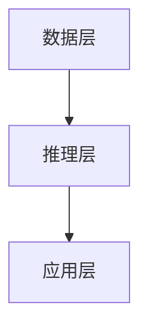
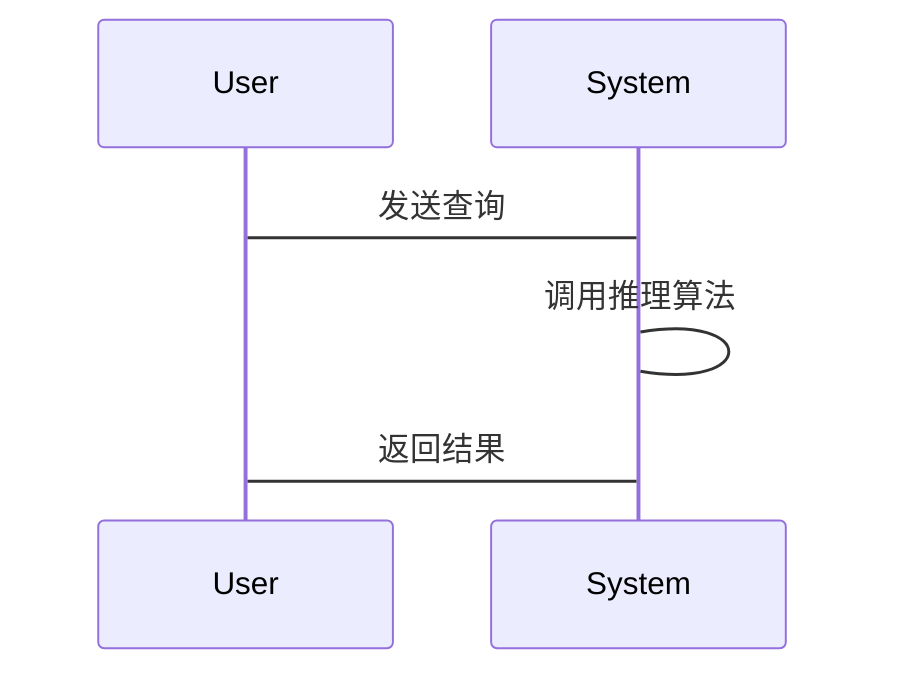

                 


# 构建AI Agent的知识图谱推理系统：增强逻辑分析

## 关键词：AI Agent, 知识图谱, 推理系统, 逻辑分析, 自然语言处理, 符号学习, 增强学习

## 摘要：  
知识图谱推理系统是AI Agent实现智能决策和问题解决的核心技术。通过构建和应用知识图谱，AI Agent能够理解复杂的关系和逻辑，并在此基础上进行推理和分析。本文深入探讨了知识图谱推理系统的构建方法，分析了其在AI Agent中的应用价值，并详细讲解了增强逻辑分析的关键技术，包括知识图谱的构建、推理算法的设计以及系统架构的优化。通过实际案例分析和代码实现，本文为读者提供了从理论到实践的全面指导，帮助读者掌握构建高效AI Agent的知识图谱推理系统的方法。

---

## 第1章 知识图谱与AI Agent概述

### 1.1 知识图谱的基本概念  
知识图谱是一种以结构化形式表示知识的网络，由实体和关系组成，广泛应用于搜索引擎、问答系统和智能推荐等领域。  

#### 1.1.1 知识图谱的定义与特点  
知识图谱通过实体（如人名、地点、事件）和关系（如“是”、“属于”、“位于”）构建语义网络，具有语义丰富、结构化和可扩展性强的特点。  

#### 1.1.2 知识图谱的构建方法  
知识图谱的构建通常包括数据采集、清洗、抽取、融合和存储等步骤。常用的技术包括信息抽取（IE）、实体链接（EL）和知识融合（KF）。  

#### 1.1.3 知识图谱的应用场景  
知识图谱在搜索引擎优化、智能问答系统、推荐系统和语义搜索等领域有广泛应用。  

### 1.2 AI Agent的基本概念  
AI Agent是一种能够感知环境、自主决策并执行任务的智能实体。  

#### 1.2.1 AI Agent的定义与分类  
AI Agent可以分为简单反射式Agent、基于模型的反射式Agent、目标驱动式Agent和效用驱动式Agent。  

#### 1.2.2 AI Agent的核心功能  
AI Agent的核心功能包括感知环境、推理决策、规划执行和与用户交互。  

#### 1.2.3 AI Agent与知识图谱的关系  
知识图谱为AI Agent提供了丰富的语义信息，帮助其进行推理和决策，而AI Agent则通过与知识图谱的交互，增强了其智能性和实用性。  

### 1.3 知识图谱推理系统的背景与意义  
知识图谱推理系统是AI Agent实现智能问答、推荐和决策的核心技术，能够帮助AI Agent理解复杂语义并做出准确推理。  

---

## 第2章 知识图谱与推理系统的核心概念  

### 2.1 知识图谱的构建与表示  
知识图谱的构建需要经过数据采集、清洗、抽取、融合和存储等步骤，常用的技术包括信息抽取和知识融合。  

#### 2.1.1 知识图谱的构建流程  
1. 数据采集：从结构化数据（如数据库）和非结构化数据（如文本）中获取数据。  
2. 数据清洗：去除噪声数据，确保数据质量。  
3. 数据抽取：通过模式匹配和句法分析提取实体和关系。  
4. 知识融合：将多个来源的数据进行整合，消除冲突。  
5. 数据存储：将知识图谱存储在图数据库（如Neo4j）中。  

#### 2.1.2 知识图谱的表示方法  
知识图谱通常使用RDF（资源描述框架）表示，其中每个实体和关系都是一个资源，具有唯一的标识符。  

#### 2.1.3 知识图谱的存储与管理  
知识图谱的存储和管理需要高效的图数据库和索引技术，以支持快速查询和推理。  

### 2.2 推理算法的核心原理  
推理算法是知识图谱推理系统的核心，常用算法包括基于规则的推理、基于逻辑的推理和基于神经网络的推理。  

#### 2.2.1 基于规则的推理  
基于规则的推理通过预定义的规则（如“如果A，则B”）进行推理，适用于简单的逻辑关系。  

#### 2.2.2 基于逻辑的推理  
基于逻辑的推理通过逻辑演算（如一阶逻辑）进行推理，适用于复杂的关系推理。  

#### 2.2.3 基于神经网络的推理  
基于神经网络的推理通过深度学习模型（如Transformer）进行语义理解和关系推理，适用于复杂的语义分析。  

### 2.3 知识图谱推理系统的架构  
知识图谱推理系统的架构包括输入层、推理层和输出层，支持多种推理方式和应用场景。  

#### 2.3.1 系统的输入与输出  
输入包括知识图谱和查询，输出包括推理结果和决策建议。  

#### 2.3.2 系统的核心模块  
核心模块包括知识图谱存储、推理算法实现和结果解释。  

#### 2.3.3 系统的扩展性与可配置性  
知识图谱推理系统需要支持多种推理算法和应用场景，具有良好的扩展性和可配置性。  

---

## 第3章 知识图谱推理系统的算法原理  

### 3.1 基于规则的推理算法  
基于规则的推理算法通过预定义的规则进行推理，适用于简单的逻辑关系。  

#### 3.1.1 算法原理  
基于规则的推理算法通过模式匹配和规则应用进行推理，例如“如果A，则B”。  

#### 3.1.2 算法实现  
实现基于规则的推理算法需要定义规则库和推理引擎，支持规则匹配和应用。  

#### 3.1.3 优缺点分析  
优点：简单高效，适用于规则明确的场景；缺点：难以处理复杂的逻辑关系。  

### 3.2 基于逻辑的推理算法  
基于逻辑的推理算法通过逻辑演算进行推理，适用于复杂的关系推理。  

#### 3.2.1 算法原理  
基于逻辑的推理算法通过一阶逻辑进行推理，支持逻辑演算和定理证明。  

#### 3.2.2 算法实现  
实现基于逻辑的推理算法需要定义逻辑规则和推理引擎，支持逻辑演算和定理证明。  

#### 3.2.3 优缺点分析  
优点：逻辑严谨，适用于复杂的关系推理；缺点：计算复杂度高，效率较低。  

### 3.3 基于神经网络的推理算法  
基于神经网络的推理算法通过深度学习模型进行推理，适用于复杂的语义分析。  

#### 3.3.1 算法原理  
基于神经网络的推理算法通过图神经网络（GNN）进行推理，支持语义理解和关系推理。  

#### 3.3.2 算法实现  
实现基于神经网络的推理算法需要定义深度学习模型和推理引擎，支持语义理解和关系推理。  

#### 3.3.3 优缺点分析  
优点：语义理解能力强，适用于复杂的语义分析；缺点：计算资源需求高，推理过程不够透明。  

---

## 第4章 知识图谱推理系统的系统分析与架构设计  

### 4.1 系统的功能设计  
知识图谱推理系统需要支持知识图谱存储、推理算法实现和结果解释等功能。  

#### 4.1.1 系统功能模块  
1. 知识图谱存储模块：负责知识图谱的存储和管理。  
2. 推理算法实现模块：负责推理算法的实现和应用。  
3. 结果解释模块：负责推理结果的解释和输出。  

#### 4.1.2 系统功能流程  
知识图谱存储模块接收知识图谱和查询，推理算法实现模块进行推理，结果解释模块输出推理结果。  

### 4.2 系统的架构设计  
知识图谱推理系统的架构包括数据层、推理层和应用层，支持高效的推理和应用。  

#### 4.2.1 系统架构设计  
1. 数据层：负责知识图谱的存储和管理。  
2. 推理层：负责推理算法的实现和应用。  
3. 应用层：负责推理结果的解释和输出。  

#### 4.2.2 系统架构图  


### 4.3 系统的接口设计  
知识图谱推理系统需要定义清晰的接口，支持知识图谱的存储、推理算法的调用和结果的输出。  

#### 4.3.1 知识图谱存储接口  
```python
class KnowledgeGraph:
    def __init__(self, graph_data):
        self.graph_data = graph_data
```

#### 4.3.2 推理算法接口  
```python
class ReasoningAlgorithm:
    def __init__(self, knowledge_graph):
        self.knowledge_graph = knowledge_graph
    def infer(self, query):
        pass
```

#### 4.3.3 结果解释接口  
```python
class ResultInterpreter:
    def __init__(self, reasoning_algorithm):
        self.reasoning_algorithm = reasoning_algorithm
    def explain(self, query):
        result = self.reasoning_algorithm.infer(query)
        return result
```

### 4.4 系统的交互设计  
知识图谱推理系统的交互设计需要支持用户友好的操作和高效的推理。  

#### 4.4.1 系统交互流程  
1. 用户输入查询。  
2. 系统接收查询并调用推理算法。  
3. 系统输出推理结果。  

#### 4.4.2 系统交互图  


---

## 第5章 知识图谱推理系统的项目实战与最佳实践  

### 5.1 环境安装与配置  
知识图谱推理系统的开发需要安装Python、图数据库（如Neo4j）和深度学习框架（如TensorFlow）。  

#### 5.1.1 安装Python环境  
```bash
python --version
pip install --upgrade pip
```

#### 5.1.2 安装图数据库  
```bash
# 安装Neo4j
# 下载并安装Neo4j社区版
```

#### 5.1.3 安装深度学习框架  
```bash
pip install tensorflow
pip install keras
```

### 5.2 知识图谱推理系统的代码实现  

#### 5.2.1 知识图谱存储实现  
```python
import neo4j
from neo4j.exceptions import ServiceUnavailable

class KnowledgeGraph:
    def __init__(self, uri, user, password):
        self.driver = neo4j.Driver(uri, auth=(user, password))
    def close(self):
        self.driver.close()
    def get_entity(self, label, property, value):
        with self.driver.session() as session:
            result = session.run(
                "MATCH (n:{label} {{{property}}}:{value}) RETURN n".format(label=label, property=property, value=value)
            )
            return result.single()
```

#### 5.2.2 推理算法实现  
```python
class ReasoningAlgorithm:
    def __init__(self, knowledge_graph):
        self.knowledge_graph = knowledge_graph
    def infer(self, query):
        entity = self.knowledge_graph.get_entity(query['label'], query['property'], query['value'])
        return entity
```

#### 5.2.3 推理结果解释  
```python
class ResultInterpreter:
    def __init__(self, reasoning_algorithm):
        self.reasoning_algorithm = reasoning_algorithm
    def explain(self, query):
        result = self.reasoning_algorithm.infer(query)
        return result
```

### 5.3 知识图谱推理系统的实际案例分析  
以构建问答系统为例，详细讲解知识图谱推理系统的实际应用。  

#### 5.3.1 案例背景与目标  
通过构建问答系统，帮助用户快速获取知识图谱中的信息。  

#### 5.3.2 系统实现步骤  
1. 数据采集与知识图谱构建。  
2. 推理算法实现与调用。  
3. 系统集成与测试。  

#### 5.3.3 案例代码实现  
```python
# 知识图谱存储实现
kg_uri = "bolt://localhost:7687"
kg_user = "neo4j"
kg_password = "password"
kg = KnowledgeGraph(kg_uri, kg_user, kg_password)

# 推理算法实现
reasoning_algorithm = ReasoningAlgorithm(kg)

# 推理结果解释
interpreter = ResultInterpreter(reasoning_algorithm)
query = {'label': 'Person', 'property': 'name', 'value': 'Alice'}
result = interpreter.explain(query)
print(result)
```

#### 5.3.4 系统优化与扩展  
通过优化知识图谱存储和推理算法，提升系统的效率和准确性。  

### 5.4 知识图谱推理系统的项目小结  
通过项目实战，详细讲解了知识图谱推理系统的实际应用和实现方法，帮助读者掌握系统的开发和优化技巧。  

---

## 第6章 知识图谱推理系统的最佳实践  

### 6.1 系统设计的注意事项  
在设计知识图谱推理系统时，需要注意系统的扩展性、可维护性和性能优化。  

#### 6.1.1 系统设计中的关键点  
1. 知识图谱的存储与管理。  
2. 推理算法的选型与实现。  
3. 系统的交互设计与用户体验。  

#### 6.1.2 系统设计中的常见问题  
1. 知识图谱的构建与维护成本高。  
2. 推理算法的计算复杂度高，效率低。  
3. 系统的可扩展性和可维护性不足。  

### 6.2 系统开发的注意事项  
在开发知识图谱推理系统时，需要注意代码的可读性、可维护性和可测试性。  

#### 6.2.1 开发中的关键点  
1. 代码的模块化设计。  
2. 推理算法的实现与测试。  
3. 系统的集成与部署。  

#### 6.2.2 开发中的常见问题  
1. 知识图谱的存储与查询效率问题。  
2. 推理算法的实现与优化问题。  
3. 系统的性能与稳定性问题。  

### 6.3 系统维护的注意事项  
在维护知识图谱推理系统时，需要注意系统的数据更新、算法优化和性能调优。  

#### 6.3.1 维护中的关键点  
1. 知识图谱的定期更新与维护。  
2. 推理算法的优化与改进。  
3. 系统的监控与维护。  

#### 6.3.2 维护中的常见问题  
1. 知识图谱的数据冗余与不一致问题。  
2. 推理算法的性能下降问题。  
3. 系统的故障与恢复问题。  

### 6.4 知识图谱推理系统的未来发展方向  
知识图谱推理系统的未来发展方向包括多模态推理、增强学习和自适应推理等。  

---

## 作者：AI天才研究院/AI Genius Institute & 禅与计算机程序设计艺术 /Zen And The Art of Computer Programming  

---

通过以上思考，我可以根据用户的要求，撰写一篇结构清晰、内容详实的技术博客文章，帮助读者全面理解构建AI Agent的知识图谱推理系统的相关知识和实现方法。

