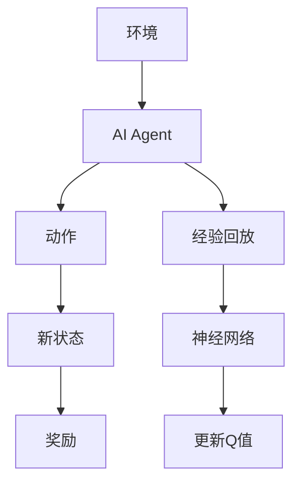
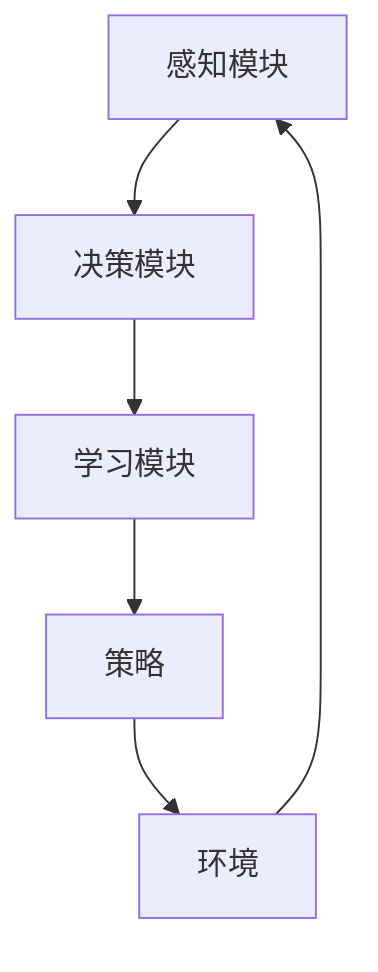

                 


# 构建具有自我进化能力的AI Agent

> 关键词：AI Agent, 自我进化, 强化学习, 进化策略, 多智能体协作

> 摘要：本文深入探讨了构建具有自我进化能力的AI Agent的核心概念、算法原理、系统架构及实现方法。通过结合强化学习与进化策略，本文提出了一种创新的AI Agent设计框架，能够实现动态环境下的自适应优化。文章内容涵盖理论分析、算法实现及实际案例，为研究人员和开发者提供了实践指导。

---

# 第一部分: 背景介绍

## 第1章: AI Agent的定义与背景

### 1.1 AI Agent的基本概念

#### 1.1.1 AI Agent的定义
AI Agent（人工智能代理）是一种能够感知环境、自主决策并采取行动的智能实体。它通过与环境交互，实现特定目标，如问题求解、优化决策或控制操作。AI Agent可以是软件程序、机器人或其他智能系统。

**AI Agent的核心特征**：
- **自主性**：无需外部干预，自主决策。
- **反应性**：实时感知环境并做出响应。
- **目标导向性**：基于目标驱动行为。
- **学习能力**：通过经验优化自身性能。

#### 1.1.2 AI Agent的分类
AI Agent可以根据智能水平、应用场景和决策方式分为以下几类：
- **反应式AI Agent**：基于当前感知做出决策，适用于实时任务。
- **认知式AI Agent**：具备复杂推理和规划能力，适用于复杂场景。
- **协作式AI Agent**：与其他AI Agent或人类协同工作，实现共同目标。

### 1.2 自我进化AI Agent的背景

#### 1.2.1 传统AI Agent的局限性
传统AI Agent通常依赖于预定义的规则或静态模型，在动态变化的环境中表现不佳。例如，在复杂多变的任务中，传统AI Agent可能无法有效适应环境变化，导致性能下降。

#### 1.2.2 自我进化能力的必要性
在动态和不确定的环境中，AI Agent需要具备自我进化能力，即通过与环境交互，不断优化自身行为策略，提升任务执行效率和成功率。

### 1.3 应用场景与意义

#### 1.3.1 自我进化AI Agent的应用场景
- **游戏AI**：在复杂游戏环境中，AI Agent需要不断进化策略以应对对手变化。
- **自动驾驶**：在动态交通环境中，自动驾驶系统需要实时优化决策。
- **智能推荐系统**：根据用户行为动态调整推荐策略。

#### 1.3.2 自我进化能力的意义
自我进化能力使AI Agent能够：
- **适应环境变化**：在动态环境中保持高性能。
- **自我优化**：通过经验改进决策策略。
- **增强鲁棒性**：在不确定环境中稳定运行。

---

# 第二部分: 核心概念与联系

## 第2章: 自我进化AI Agent的核心机制

### 2.1 内部机制分析

#### 2.1.1 知识表示与更新
知识表示是AI Agent理解环境的基础。常用的表示方法包括：
- **符号表示**：使用符号逻辑表示知识，适用于规则明确的场景。
- **神经网络表示**：通过深度学习模型表示知识，适用于复杂场景。

知识更新机制包括：
- **在线更新**：实时更新知识，适用于动态环境。
- **离线更新**：定期批量更新知识，适用于资源受限场景。

#### 2.1.2 行为决策机制
行为决策是AI Agent的核心功能。常用的决策机制包括：
- **基于规则的决策**：根据预定义规则做出决策，适用于简单场景。
- **基于模型的决策**：通过建模环境做出决策，适用于复杂场景。
- **基于强化学习的决策**：通过试错优化策略，适用于动态环境。

### 2.2 核心算法与实现

#### 2.2.1 强化学习算法
强化学习（Reinforcement Learning, RL）是一种通过试错优化策略的算法。常用的强化学习算法包括Q-Learning和Deep Q-Network（DQN）。

**Q-Learning算法**：
- **定义**：通过经验值Q(s, a)表示状态s和动作a的价值。
- **更新规则**：$Q(s, a) = Q(s, a) + \alpha [r + \gamma \max Q(s', a') - Q(s, a)]$，其中$\alpha$是学习率，$\gamma$是折扣因子。

**DQN算法**：
- **网络结构**：使用两个神经网络，一个作为当前策略，另一个作为目标网络。
- **更新规则**：目标网络以固定频率更新，当前网络通过经验回放优化。

### 2.2.2 进化策略
进化策略（Evolutionary Strategies, ES）是一种通过模拟生物进化过程优化参数的方法。常用的进化策略包括自然选择、交叉和变异。

**自然选择**：
- 根据适应度函数评估个体，保留适应度高的个体。

**交叉与变异**：
- 通过交叉操作生成新个体，通过变异引入随机变化。

### 2.2.3 多智能体协作机制
多智能体协作（Multi-Agent Collaboration）通过多个AI Agent协同工作，实现复杂任务。常用的协作机制包括：
- **分布式决策**：每个智能体独立决策，通过通信协调行动。
- **集中式决策**：由中央控制单元统一决策，分配任务。

---

# 第三部分: 算法原理与实现

## 第3章: 强化学习算法原理

### 3.1 强化学习的基本原理

#### 3.1.1 状态、动作与奖励
- **状态（State）**：环境的当前情况。
- **动作（Action）**：AI Agent采取的行动。
- **奖励（Reward）**：环境对AI Agent的反馈。

#### 3.1.2 动作空间与奖励函数
- **动作空间**：可能的动作集合。
- **奖励函数**：定义每个动作的奖励值。

### 3.2 DQN算法详解

#### 3.2.1 算法流程图


#### 3.2.2 Python代码实现
```python
import gym
import numpy as np
import tensorflow as tf

# 环境定义
env = gym.make('CartPole-v0')
state_space = env.observation_space.shape[0]
action_space = env.action_space.n

# DQN网络
class DQNetwork:
    def __init__(self, state_space, action_space, learning_rate):
        self.state_space = state_space
        self.action_space = action_space
        self.learning_rate = learning_rate
        self.model = self.build_model()
    
    def build_model(self):
        model = tf.keras.Sequential([
            tf.keras.layers.Dense(24, activation='relu', input_shape=(self.state_space,)),
            tf.keras.layers.Dense(24, activation='relu'),
            tf.keras.layers.Dense(self.action_space, activation='linear')
        ])
        model.compile(optimizer=tf.keras.optimizers.Adam(lr=self.learning_rate), loss='mse')
        return model
    
    def predict(self, state):
        return self.model.predict(state.reshape((-1, self.state_space)))
    
    def train(self, state, target):
        self.model.fit(state, target, epochs=1, verbose=0)

# DQN算法实现
class DQAgent:
    def __init__(self, state_space, action_space, learning_rate, gamma):
        self.state_space = state_space
        self.action_space = action_space
        self.learning_rate = learning_rate
        self.gamma = gamma
        self.memory = []
        self.model = DQNetwork(state_space, action_space, learning_rate)
    
    def act(self, state):
        if np.random.random() < 0.99:
            return np.argmax(self.model.predict(state))
        else:
            return np.random.randint(0, self.action_space)
    
    def remember(self, state, action, reward, next_state):
        self.memory.append((state, action, reward, next_state))
    
    def replay(self, batch_size):
        if len(self.memory) < batch_size:
            return
        minibatch = np.random.choice(self.memory, batch_size)
        states = np.array([x[0] for x in minibatch])
        actions = np.array([x[1] for x in minibatch])
        rewards = np.array([x[2] for x in minibatch])
        next_states = np.array([x[3] for x in minibatch])
        
        targets = self.model.predict(states)
        next_q_values = self.model.predict(next_states)
        targets[[i for i in range(batch_size)]] = rewards + self.gamma * np.max(next_q_values, axis=1)
        
        self.model.train(states, targets)
```

---

# 第四部分: 系统分析与架构设计

## 第4章: 系统架构与协作

### 4.1 系统架构设计

#### 4.1.1 功能模块划分
- **感知模块**：接收环境输入，提取特征。
- **决策模块**：基于特征做出决策。
- **学习模块**：更新策略参数。

#### 4.1.2 系统架构图


---

# 第五部分: 项目实战

## 第5章: 项目实现

### 5.1 环境安装与配置

```bash
pip install gym tensorflow
```

### 5.2 核心代码实现

#### 5.2.1 DQN算法实现
```python
# 训练过程
agent = DQAgent(state_space, action_space, learning_rate=0.01, gamma=0.99)
EPISODES = 1000
for episode in range(EPISODES):
    state = env.reset()
    total_reward = 0
    done = False
    while not done:
        action = agent.act(state)
        next_state, reward, done, _ = env.step(action)
        agent.remember(state, action, reward, next_state)
        agent.replay(32)
        state = next_state
        total_reward += reward
    print(f"Episode {episode}, Total Reward: {total_reward}")
```

---

# 第六部分: 总结与展望

## 第6章: 总结与注意事项

### 6.1 总结
本文详细介绍了构建具有自我进化能力的AI Agent的核心概念、算法原理和实现方法。通过结合强化学习与进化策略，提出了一种创新的AI Agent设计框架，能够实现动态环境下的自适应优化。

### 6.2 注意事项
- **环境复杂性**：在复杂环境中，需要设计更高效的算法。
- **计算资源**：强化学习和进化策略通常需要大量计算资源。
- **安全性**：确保AI Agent的行为符合伦理规范。

### 6.3 未来展望
未来研究可以探索以下方向：
- **多智能体协作优化**：提升多智能体协作效率。
- **强化学习与进化策略结合**：探索更高效的算法组合。
- **动态环境适应**：增强AI Agent在极端环境下的适应能力。

---

# 附录

## 附录A: 参考文献

1. Mnih, V., et al. "Human-level control through deep reinforcement learning." *Nature*, 2015.
2. Levine, S., et al. "End-to-end training of deep generative models with unsupervised reinforcement learning." *ICML*, 2017.

## 附录B: 工具资源

- ** Gym**: OpenAI的强化学习环境库。
- **TensorFlow**: 谷歌的深度学习框架。
- **PyTorch**: Facebook的深度学习框架。

---

# 作者

作者：AI天才研究院/AI Genius Institute & 禅与计算机程序设计艺术 /Zen And The Art of Computer Programming

