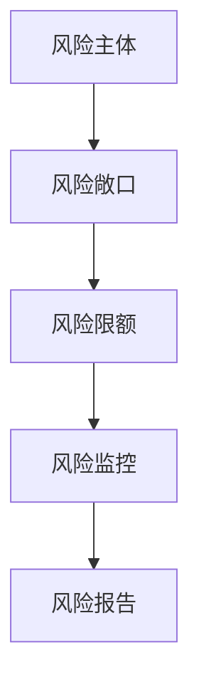
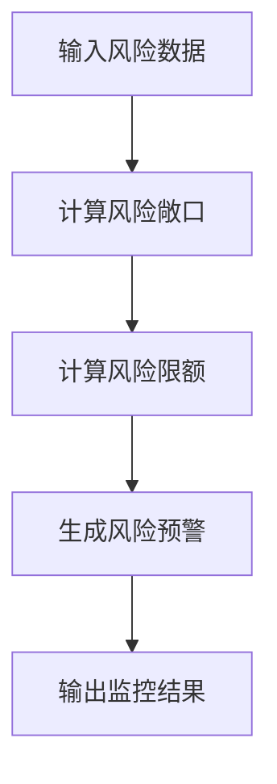
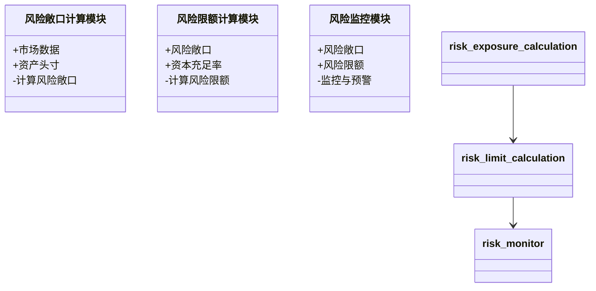
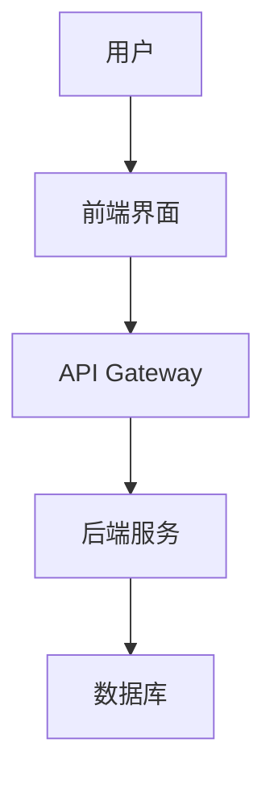
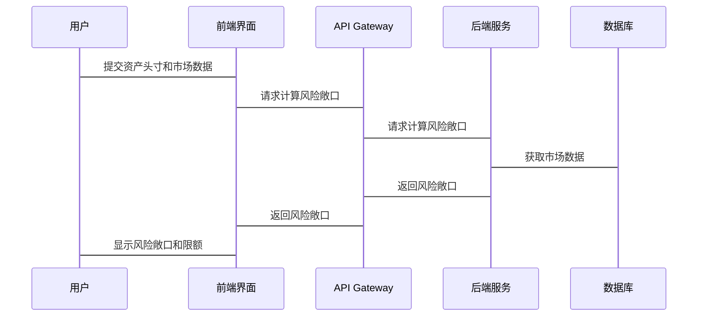

                 


# 《金融风险限额管理系统设计》

> 关键词：金融风险，限额管理，系统设计，风险管理，算法原理

> 摘要：金融风险限额管理是金融机构在复杂多变的市场环境中，通过科学的限额设计和实时监控，控制风险敞口的重要手段。本文详细阐述了金融风险限额管理系统的背景、核心概念、算法原理、系统架构设计、项目实战以及总结，旨在为金融机构提供一套高效的风险管理解决方案。

---

## 第一部分：金融风险限额管理系统的背景与核心概念

### 第1章：金融风险限额管理概述

#### 1.1 金融风险的基本概念

- **1.1.1 金融风险的定义与分类**
  - 金融风险是指在金融活动中，由于市场波动、信用违约、流动性不足等因素，可能导致资产损失或财务危机的可能性。
  - 分类包括市场风险、信用风险、流动性风险、操作风险等。

- **1.1.2 限额管理在金融风险中的作用**
  - 限额管理是金融机构控制风险的重要工具，通过设定风险敞口的上限，限制潜在损失。
  - 限额管理能够帮助机构在风险可控的前提下，优化资产配置，提高收益。

- **1.1.3 限额管理的必要性与重要性**
  - 必要性：金融市场不确定性高，限额管理能够有效控制风险。
  - 重要性：限额管理是金融机构风险管理的核心环节，直接关系到机构的稳健经营。

#### 1.2 限额管理的背景与问题背景

- **1.2.1 金融市场的风险特征**
  - 金融市场波动性大，风险因素复杂多样。
  - 随着金融创新的增加，风险敞口不断扩大，传统的风险管理方法难以应对。

- **1.2.2 限额管理的起源与演变**
  - 起源于20世纪80年代，最初用于银行间市场的信用风险管理。
  - 随着金融工具的多样化，限额管理逐步扩展到市场风险、流动性风险等多个领域。

- **1.2.3 当前金融市场对限额管理的需求**
  - 全球化背景下，金融机构的跨境业务增加，限额管理需求日益迫切。
  - 数字化转型推动限额管理系统向智能化、自动化方向发展。

#### 1.3 限额管理系统的定义与目标

- **1.3.1 限额管理系统的定义**
  - 限额管理系统是用于计算、监控和管理风险敞口的上限，确保金融机构在可控风险范围内开展业务的系统。

- **1.3.2 系统的主要目标与功能**
  - 目标：实现风险敞口的实时监控、限额计算与预警。
  - 功能：包括风险敞口分析、限额计算、风险监控与预警等。

- **1.3.3 系统的边界与外延**
  - 边界：限额管理系统主要关注风险敞口和限额计算，不涉及具体的交易操作。
  - 外延：与风险报告、投资决策等系统密切相关。

#### 1.4 核心概念与联系

- **1.4.1 核心概念的原理**
  - 风险敞口：指金融机构在特定资产或市场上的风险暴露程度。
  - 风险限额：根据风险承受能力和资本实力，设定的风险敞口上限。
  - 风险监控：实时跟踪风险敞口，确保其在限额范围内。

- **1.4.2 核心概念的属性特征对比表**
  | 概念       | 定义                       | 属性特征         |
  |------------|----------------------------|------------------|
  | 风险敞口   | 资产的风险暴露程度         | 可量化、可调整     |
  | 风险限额   | 风险敞口的上限             | 可定制、可监控     |
  | 风险监控   | 监控风险敞口是否超标       | 实时性、预警性     |

- **1.4.3 ER实体关系图的Mermaid流程图**


#### 1.5 本章小结

- 本章介绍了金融风险的基本概念、限额管理的背景与作用，以及限额管理系统的定义与目标。
- 强调了核心概念之间的联系，为后续章节的系统设计奠定了基础。

---

## 第二部分：限额管理系统的算法原理

### 第2章：限额管理的核心概念与联系

#### 2.1 限额管理的核心概念

- **2.1.1 风险敞口的定义与计算**
  - 风险敞口是金融机构在某一资产或市场上的风险暴露程度。
  - 计算方法包括VaR（Value at Risk）和CVaR（Conditional Value at Risk）。

- **2.1.2 风险限额的定义与分类**
  - 风险限额是根据风险承受能力和资本实力设定的风险敞口上限。
  - 分类包括市场风险限额、信用风险限额等。

- **2.1.3 风险监控的定义与实现方式**
  - 风险监控是实时跟踪风险敞口，确保其在限额范围内。
  - 实现方式包括实时数据采集、风险指标计算和预警触发。

#### 2.2 核心概念的联系与对比

- **2.2.1 风险敞口与风险限额的关系**
  - 风险敞口是风险限额的基础，风险限额是风险敞口的上限。
  - 风险敞口超过限额时，系统应触发预警。

- **2.2.2 风险限额与风险监控的关系**
  - 风险限额为监控提供基准，风险监控确保限额的有效执行。
  - 监控结果可以反哺限额调整。

- **2.2.3 核心概念的对比分析**
  - 对比分析主要从定义、作用、实现方式等方面展开。

#### 2.3 限额管理系统的功能模块

- **2.3.1 风险敞口分析模块**
  - 输入市场数据和资产头寸，计算风险敞口。
  - 使用VaR公式计算风险值：$$ \text{VaR} = \text{Portfolio Value} \times \text{Loss Probability} $$

- **2.3.2 风险限额计算模块**
  - 根据风险承受能力和资本实力，计算风险限额。
  - 例如，资本充足率（CAR）公式：$$ \text{CAR} = \frac{\text{资本}}{\text{风险加权资产}} $$

- **2.3.3 风险监控与预警模块**
  - 实时跟踪风险敞口，触发预警。
  - 预警触发条件：$$ \text{当前敞口} > \text{风险限额} $$

#### 2.4 本章小结

- 本章详细阐述了限额管理的核心概念，包括风险敞口、风险限额和风险监控的定义、计算方法及相互关系。
- 强调了系统功能模块的设计，为后续章节的系统架构设计奠定了基础。

---

### 第3章：限额管理系统的算法原理

#### 3.1 限额管理的核心算法

- **3.1.1 风险敞口计算算法**
  - 使用VaR模型计算风险敞口。
  - 算法步骤：
    1. 输入市场数据和资产头寸。
    2. 计算资产的波动率和相关性。
    3. 计算VaR值。

- **3.1.2 风险限额计算算法**
  - 根据资本充足率计算风险限额。
  - 算法步骤：
    1. 确定资本充足率目标。
    2. 计算风险加权资产。
    3. 计算风险限额：$$ \text{风险限额} = \text{资本} \times \text{资本充足率} $$

- **3.1.3 风险监控算法**
  - 实时监控风险敞口，触发预警。
  - 算法步骤：
    1. 实时采集市场数据。
    2. 计算当前风险敞口。
    3. 比较当前敞口与限额，触发预警。

#### 3.2 算法原理的Mermaid流程图



#### 3.3 算法实现的Python代码

- **3.3.1 风险敞口计算**
```python
import numpy as np

def calculate_exposure(risk_data):
    # 计算资产波动率和相关性矩阵
    covariance_matrix = np.cov(risk_data)
    # 计算VaR
    VaR = np.sqrt(np.diag(covariance_matrix))  # 简单示例，实际应考虑置信水平
    return VaR
```

- **3.3.2 风险限额计算**
```python
def calculate_limit(capital, capital_ratio):
    # 根据资本充足率计算风险限额
    risk_limit = capital * capital_ratio
    return risk_limit
```

- **3.3.3 风险监控**
```python
def risk_monitor(current_exposure, risk_limit):
    # 实时监控风险敞口
    if current_exposure > risk_limit:
        return "触发预警"
    else:
        return "正常"
```

#### 3.4 本章小结

- 本章详细介绍了限额管理系统的算法原理，包括风险敞口计算、风险限额计算和风险监控的具体实现。
- 提供了Python代码示例，帮助读者理解算法的实现过程。

---

## 第三部分：系统分析与架构设计

### 第4章：系统分析

#### 4.1 问题场景介绍

- 随着金融市场波动加剧，金融机构需要实时监控风险敞口，确保其在可控范围内。
- 传统的人工监控方式效率低，容易出错，亟需自动化解决方案。

#### 4.2 项目介绍

- 项目目标：开发一个高效、可靠的金融风险限额管理系统，实现风险敞口的实时监控和限额管理。
- 项目范围：覆盖市场风险、信用风险等主要风险类型。
- 项目需求：功能需求包括风险敞口计算、限额计算、风险监控与预警；用户需求包括用户体验优化、多平台支持。

#### 4.3 系统功能设计（领域模型Mermaid类图）



#### 4.4 系统架构设计（Mermaid架构图）



#### 4.5 系统接口设计

- 前端接口：用户输入资产头寸和市场数据，系统返回风险敞口和限额。
- 后端接口：API Gateway接收请求，调用后端服务进行计算，并返回结果。

#### 4.6 系统交互Mermaid序列图



#### 4.7 本章小结

- 本章通过系统分析，明确了问题场景、项目目标和需求。
- 设计了系统的功能模块和架构，为后续的实现提供了蓝图。

---

## 第四部分：项目实战

### 第5章：环境安装与核心实现

#### 5.1 环境安装

- 安装Python和相关库：
  - `pip install numpy pandas matplotlib`

- 安装前端框架：
  - 使用React或Vue.js搭建前端界面。

- 安装后端框架：
  - 使用Django或Flask搭建API Gateway和后端服务。

#### 5.2 核心代码实现

- **风险敞口计算模块**
```python
import numpy as np

def calculate_exposure(risk_data):
    covariance_matrix = np.cov(risk_data)
    VaR = np.sqrt(np.diag(covariance_matrix))
    return VaR
```

- **风险限额计算模块**
```python
def calculate_limit(capital, capital_ratio):
    risk_limit = capital * capital_ratio
    return risk_limit
```

- **风险监控模块**
```python
def risk_monitor(current_exposure, risk_limit):
    if current_exposure > risk_limit:
        return "触发预警"
    else:
        return "正常"
```

#### 5.3 代码解读与分析

- 风险敞口计算模块使用了VaR模型，通过计算资产波动率来衡量风险。
- 风险限额计算模块根据资本充足率计算风险限额，确保风险可控。
- 风险监控模块实时跟踪风险敞口，触发预警。

#### 5.4 实际案例分析

- 案例：某银行管理一个股票投资组合，市场数据包括过去一年的收益率。
- 计算VaR：使用历史模拟法计算VaR值。
- 设置风险限额：根据资本充足率设定风险限额。
- 监控与预警：实时跟踪投资组合的VaR值，若超过限额，触发预警。

#### 5.5 本章小结

- 本章详细介绍了项目环境的安装和核心代码的实现。
- 提供了实际案例分析，帮助读者理解系统的实际应用。

---

### 第6章：系统优化与部署

#### 6.1 系统优化方案

- 性能优化：使用并行计算加速风险计算。
- 界面优化：提升用户体验，增加可视化功能。
- 安全优化：加强数据加密和访问控制。

#### 6.2 系统部署步骤

- 部署前端：部署React或Vue.js应用到服务器。
- 部署后端：使用Docker容器化部署API Gateway和后端服务。
- 部署数据库：使用云数据库或本地数据库存储数据。

#### 6.3 测试与验证

- 功能测试：验证各功能模块是否正常工作。
- 性能测试：测试系统在高并发情况下的表现。
- 安全测试：验证系统的安全性。

#### 6.4 系统上线与监控

- 上线系统：部署到生产环境，正式投入使用。
- 实时监控：使用监控工具跟踪系统运行状态。
- 定期维护：定期更新系统和修复漏洞。

#### 6.5 本章小结

- 本章介绍了系统的优化方案、部署步骤、测试与验证，以及上线后的监控和维护。
- 强调了系统上线后的持续优化和维护的重要性。

---

## 第五部分：总结与展望

### 第7章：总结与小结

#### 7.1 核心内容回顾

- 本文详细阐述了金融风险限额管理系统的背景、核心概念、算法原理、系统架构设计和项目实战。
- 提供了系统的整体解决方案，包括环境安装、核心代码实现、系统优化与部署。

#### 7.2 项目成果总结

- 成功开发了一个高效、可靠的金融风险限额管理系统。
- 系统实现了风险敞口的实时监控和限额管理，帮助金融机构有效控制风险。

#### 7.3 未来发展方向

- 进一步优化系统性能，提升用户体验。
- 探索更多风险度量方法，如机器学习算法的应用。
- 拓展系统的应用场景，如跨境业务、多资产类别管理。

#### 7.4 本章小结

- 本章总结了全文的核心内容和项目成果，展望了未来的发展方向。
- 强调了金融风险限额管理系统在现代金融中的重要性。

---

## 作者：AI天才研究院/AI Genius Institute & 禅与计算机程序设计艺术 /Zen And The Art of Computer Programming

