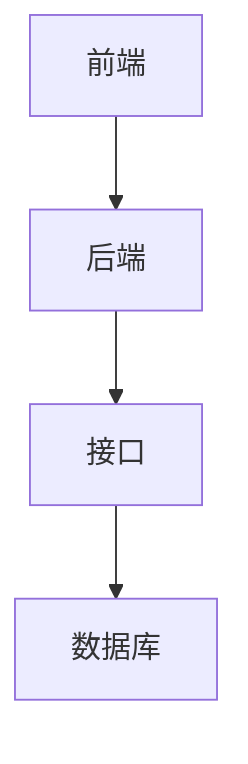

                 


# 第一部分: AI Agent的自然语言接口优化技术概述

# 第1章: AI Agent与自然语言接口概述

## 1.1 AI Agent的基本概念
### 1.1.1 AI Agent的定义与特点
AI Agent（人工智能代理）是指能够感知环境并采取行动以实现目标的智能实体。AI Agent可以是软件程序、机器人或其他智能系统，它们通过传感器获取信息，利用计算能力进行决策，并通过执行器与环境交互。

AI Agent的特点包括：
- **自主性**：能够自主决策和行动。
- **反应性**：能够实时感知环境并做出反应。
- **目标导向性**：所有行动都是为了实现特定目标。
- **社交能力**：能够与其他Agent或人类进行交互和协作。

### 1.1.2 自然语言处理在AI Agent中的作用
自然语言处理（NLP）是AI Agent与人类交互的核心技术。通过NLP，AI Agent能够理解人类的语言输入并生成符合人类习惯的语言输出。NLP在AI Agent中的作用包括：
- **理解意图**：识别用户的需求和意图。
- **生成回应**：以自然语言形式生成回复，使交互更自然。
- **上下文管理**：保持对话的连贯性，理解上下文关系。

### 1.1.3 AI Agent的应用场景与挑战
AI Agent的应用场景广泛，包括智能音箱、聊天机器人、虚拟助手、智能客服等。在这些场景中，AI Agent需要处理复杂的语言信息，理解用户的深层需求，并提供准确的响应。

AI Agent在自然语言处理方面面临的主要挑战包括：
- **语义理解的复杂性**：人类语言具有模糊性和多义性，如何准确理解用户的意图是一个难题。
- **对话的连贯性**：保持对话的流畅性，避免重复和不连贯。
- **个性化需求**：不同用户有不同的表达习惯和需求，如何实现个性化的交互是一个挑战。

## 1.2 自然语言接口的核心概念
### 1.2.1 自然语言接口的基本原理
自然语言接口（NLI）是用户与AI Agent之间的桥梁。它通过解析用户的语言输入，将其转换为系统能够理解的指令或数据，并将系统的响应转换为自然语言输出。

NLI的基本原理包括：
1. **语言理解**：通过NLP技术解析用户的输入，提取关键信息。
2. **意图识别**：识别用户的意图，确定用户的需求。
3. **生成回应**：根据用户的意图生成合适的语言回应。
4. **反馈优化**：根据用户反馈不断优化回应的质量。

### 1.2.2 用户需求与系统响应的关系
用户需求与系统响应是NLI优化的核心。用户通过语言表达需求，系统通过语言回应满足需求。理解用户需求的准确性和生成回应的质量直接影响用户体验。

为了优化NLI，需要：
- **准确理解用户需求**：通过上下文分析和意图识别，确保系统能够准确理解用户需求。
- **生成高质量的回应**：通过语言生成技术，确保系统回应符合用户期望。
- **动态调整交互策略**：根据用户反馈不断优化交互策略，提升用户体验。

### 1.2.3 自然语言接口的优化目标
NLI的优化目标包括：
1. **提高准确性**：确保系统能够准确理解用户需求并生成正确的回应。
2. **提升响应速度**：优化系统处理语言请求的速度，减少用户等待时间。
3. **增强可理解性**：使系统生成的回应更易于理解和自然。
4. **提升用户体验**：通过优化交互流程，提升用户的整体体验。

## 1.3 本书内容与结构
### 1.3.1 本书的核心主题
本书的核心主题是AI Agent的自然语言接口优化技术。我们将深入探讨NLI的原理、算法、系统架构以及实际应用，帮助读者全面理解并掌握NLI优化的技术和方法。

### 1.3.2 目录结构概览
本书分为以下几个部分：
1. **概述**：介绍AI Agent和NLI的基本概念、应用场景和优化目标。
2. **核心概念**：详细讲解对话生成模型和理解模型的核心原理。
3. **算法原理**：分析NLI优化的算法原理，包括生成模型和理解模型的数学推导。
4. **系统架构**：设计NLI优化的系统架构，包括功能模块、接口设计和交互流程。
5. **项目实战**：通过具体案例展示NLI优化的实现过程。
6. **最佳实践**：总结NLI优化的经验和注意事项，提供实用的优化策略。

### 1.3.3 学习方法与注意事项
为了更好地理解和掌握NLI优化技术，读者需要注意以下几点：
- **理论与实践结合**：不仅要理解理论知识，还要通过实际项目巩固所学内容。
- **持续学习**：NLP技术发展迅速，需持续关注最新技术和研究。
- **动手实践**：通过实际项目锻炼编程和问题解决能力。

# 第2章: 自然语言接口优化的核心概念

## 2.1 对话生成模型
### 2.1.1 基于生成模型的对话优化
对话生成模型是NLI优化的重要组成部分。通过生成模型，系统能够根据上下文生成自然流畅的回复。

#### 生成模型的分类
1. **基于规则的生成模型**：通过预定义的规则生成回复，适用于简单场景。
2. **基于统计的生成模型**：利用概率统计方法生成回复，考虑上下文信息。
3. **基于深度学习的生成模型**：使用神经网络生成回复，效果更自然。

#### 对话生成模型的优缺点
- **优点**：生成的回复更自然，能够处理复杂场景。
- **缺点**：生成的回复可能缺乏准确性，需要大量训练数据。

### 2.1.2 常见的对话生成算法
常用的对话生成算法包括：
- **Seq2Seq模型**：通过编码器-解码器结构生成回复。
- **Transformer架构**：利用自注意力机制生成更长的回复。
- **GPT模型**：基于生成式预训练模型生成对话。

### 2.1.3 对话生成模型的评估指标
评估对话生成模型的指标包括：
1. **BLEU**：基于n-gram的精确度评估。
2. **ROUGE**：基于召回率的评估。
3. **METEOR**：结合准确率和生成长度的评估。
4. **人工评估**：通过人工评分评估回复的质量。

## 2.2 对话理解模型
### 2.2.1 基于理解模型的对话优化
对话理解模型是NLI优化的另一重要部分。通过理解模型，系统能够准确解析用户的意图。

#### 理解模型的分类
1. **基于关键词匹配的理解模型**：通过关键词匹配理解用户意图。
2. **基于语义向量的理解模型**：利用向量空间模型理解语义。
3. **基于深度学习的理解模型**：利用神经网络理解复杂语义。

#### 对话理解模型的优缺点
- **优点**：能够准确理解用户意图，适用于复杂场景。
- **缺点**：需要大量标注数据，计算成本较高。

### 2.2.2 常见的对话理解算法
常用的对话理解算法包括：
- **词嵌入模型**：如Word2Vec，将词语转换为向量表示。
- **注意力机制**：如Transformer模型，聚焦重要信息。
- **序列标注模型**：如CRF，用于序列级别的意图识别。

### 2.2.3 对话理解模型的评估指标
评估对话理解模型的指标包括：
1. **准确率**：分类正确的样本比例。
2. **召回率**：分类正确且被识别的样本比例。
3. **F1值**：准确率和召回率的调和平均值。
4. **困惑度**：语言模型的预测难度。

## 2.3 对话生成与理解的结合
### 2.3.1 对话生成与理解的协同优化
对话生成与理解的协同优化是NLI优化的关键。通过协同优化，系统能够实现更高效的对话。

#### 协同优化的策略
1. **联合训练**：同时优化生成和理解模型。
2. **反馈机制**：利用生成的回复优化理解模型。
3. **交替优化**：交替优化生成和理解模型，逐步提升性能。

### 2.3.2 基于上下文的对话优化
上下文是对话优化的重要因素。通过分析上下文，系统能够更好地理解用户意图并生成合适的回复。

#### 上下文分析的方法
1. **滑动窗口法**：分析当前对话历史。
2. **注意力机制**：聚焦重要的上下文信息。
3. **记忆网络**：利用外部存储设备记录上下文信息。

### 2.3.3 对话生成与理解的对比分析
对话生成与理解在优化目标和实现方法上有所不同，但它们共同的目标是提升对话质量。

#### 对比分析的维度
1. **目标**：生成模型注重生成回复，理解模型注重解析意图。
2. **算法**：生成模型基于生成式模型，理解模型基于判别式模型。
3. **评估**：生成模型注重生成质量，理解模型注重分类准确率。

## 2.4 本章小结
本章主要介绍了对话生成模型和理解模型的核心概念，探讨了协同优化的策略和方法。通过理解生成与理解的协同优化，我们可以实现更高效的对话，提升NLI的性能。

# 第3章: 自然语言接口优化的算法原理

## 3.1 对话生成模型的算法原理
### 3.1.1 基于Seq2Seq模型的对话生成
Seq2Seq模型是一种经典的对话生成模型。它通过编码器和解码器结构将输入转换为输出。

#### Seq2Seq模型的结构
1. **编码器**：将输入序列编码为固定长度的向量。
2. **解码器**：将编码向量解码为输出序列。

#### Seq2Seq模型的优缺点
- **优点**：能够生成连贯的对话。
- **缺点**：在长序列生成中容易出现信息丢失。

### 3.1.2 基于Transformer的对话生成
Transformer模型是另一种常用的对话生成模型。它利用自注意力机制捕捉全局信息。

#### Transformer模型的结构
1. **编码器**：通过自注意力机制捕捉全局信息。
2. **解码器**：通过自注意力和交叉注意力生成回复。

#### Transformer模型的优缺点
- **优点**：能够生成更长的回复，捕捉全局信息。
- **缺点**：计算成本较高。

### 3.1.3 对话生成的数学模型与公式
对话生成的数学模型可以通过概率生成模型表示。常用的公式包括：
- **条件概率**：P(y|x)表示在输入x下生成y的概率。
- **最大似然估计**：通过最大化条件概率进行参数优化。

## 3.2 对话理解模型的算法原理
### 3.2.1 基于词嵌入的对话理解
词嵌入是对话理解的重要技术。通过将词语映射到向量空间，模型可以更好地理解语义。

#### 词嵌入的方法
1. **Word2Vec**：通过上下文预测词语。
2. **GloVe**：基于全局词频统计生成词向量。
3. **BERT**：基于预训练的语言模型生成词向量。

### 3.2.2 基于注意力机制的对话理解
注意力机制是对话理解的关键技术。通过注意力机制，模型能够聚焦重要的上下文信息。

#### 注意力机制的实现
1. **自注意力机制**：模型在生成回复时关注重要的对话历史。
2. **交叉注意力机制**：模型在理解输入时关注相关的对话历史。

### 3.2.3 对话理解的数学模型与公式
对话理解的数学模型可以通过概率分类模型表示。常用的公式包括：
- **条件概率**：P(y|x)表示在输入x下生成y的概率。
- **最大似然估计**：通过最大化条件概率进行参数优化。

## 3.3 对话生成与理解的联合优化
### 3.3.1 联合优化的算法框架
联合优化是对话生成与理解协同优化的核心。通过联合优化，模型能够同时提升生成和理解性能。

#### 联合优化的策略
1. **联合训练**：同时优化生成和理解模型。
2. **反馈机制**：利用生成的回复优化理解模型。
3. **交替优化**：交替优化生成和理解模型，逐步提升性能。

### 3.3.2 联合优化的数学推导
联合优化的数学推导可以通过优化目标函数表示。常用的公式包括：
- **联合损失函数**：L = L_gen + L_under，分别表示生成和理解的损失函数。
- **梯度下降**：通过梯度下降优化目标函数，同时优化生成和理解模型。

### 3.3.3 联合优化的实现细节
联合优化的实现细节包括：
1. **模型结构**：设计联合优化的模型结构，如共享参数的生成和理解模型。
2. **训练数据**：使用对话数据进行联合训练。
3. **优化算法**：选择合适的优化算法，如Adam优化器。

## 3.4 本章小结
本章主要介绍了对话生成与理解的算法原理，探讨了联合优化的策略和方法。通过联合优化，我们可以实现生成和理解的协同提升，提升NLI的整体性能。

# 第4章: 自然语言接口优化的系统架构

## 4.1 系统架构概述
### 4.1.1 系统整体架构
NLI优化的系统架构包括前端、后端和接口三部分。前端负责用户交互，后端负责处理请求，接口负责数据传输。

#### 系统架构图


### 4.1.2 系统功能模块划分
系统功能模块包括：
1. **输入模块**：接收用户输入，解析语言请求。
2. **处理模块**：分析用户需求，生成回复。
3. **输出模块**：将回复返回给用户，实现交互。

### 4.1.3 系统架构的优缺点
- **优点**：模块化设计，易于扩展和维护。
- **缺点**：模块之间可能存在通信延迟，影响整体性能。

## 4.2 系统功能设计
### 4.2.1 对话生成模块设计
对话生成模块负责根据用户需求生成回复。其实现步骤包括：
1. **解析输入**：将用户输入转换为系统能够理解的格式。
2. **生成回复**：通过生成模型生成自然语言回复。
3. **返回结果**：将生成的回复返回给用户。

### 4.2.2 对话理解模块设计
对话理解模块负责解析用户输入，理解用户意图。其实现步骤包括：
1. **接收输入**：获取用户的语言输入。
2. **解析意图**：通过理解模型识别用户需求。
3. **返回结果**：将解析结果返回给生成模块。

### 4.2.3 系统交互流程设计
系统交互流程包括：
1. **用户输入**：用户输入语言请求。
2. **解析请求**：系统解析用户的语言请求。
3. **生成回复**：系统生成回复。
4. **返回回复**：系统将回复返回给用户。

## 4.3 系统接口设计
### 4.3.1 API接口设计
API接口是系统与外界交互的重要接口。常用的API包括：
1. **GET请求**：获取系统的状态信息。
2. **POST请求**：提交用户的语言请求。

### 4.3.2 接口调用流程
接口调用流程包括：
1. **发送请求**：用户发送语言请求。
2. **处理请求**：系统处理请求，生成回复。
3. **返回结果**：系统返回回复结果。

### 4.3.3 接口兼容性设计
接口兼容性设计包括：
1. **协议兼容性**：支持多种通信协议，如HTTP、WebSocket等。
2. **格式兼容性**：支持多种数据格式，如JSON、XML等。

## 4.4 系统架构的实现细节
### 4.4.1 模块间的通信机制
模块间的通信机制包括：
1. **队列机制**：使用队列进行异步通信。
2. **发布-订阅机制**：使用消息中间件进行通信。

### 4.4.2 系统性能
系统性能包括：
1. **响应时间**：系统处理请求的时延。
2. **吞吐量**：系统单位时间处理的请求数量。
3. **资源利用率**：系统的CPU、内存等资源使用情况。

## 4.5 本章小结
本章主要介绍了NLI优化的系统架构，包括功能模块设计、接口设计和交互流程设计。通过合理的系统架构设计，我们可以实现高效、可靠的NLI优化系统。

# 第5章: 自然语言接口优化的项目实战

## 5.1 项目背景与目标
### 5.1.1 项目背景
本项目旨在优化一个智能客服系统的自然语言接口，提升用户体验。

### 5.1.2 项目目标
1. **提高准确率**：准确理解用户的意图，生成符合需求的回复。
2. **提升响应速度**：优化系统处理请求的速度，减少用户等待时间。
3. **增强可理解性**：使系统生成的回复更自然、更易于理解。

## 5.2 项目环境与工具
### 5.2.1 环境安装
项目需要以下环境和工具：
1. **Python**：编程语言。
2. **TensorFlow**：深度学习框架。
3. **Keras**：深度学习库。
4. **NLTK**：自然语言处理工具包。

### 5.2.2 工具安装
安装所需的工具：
```bash
pip install numpy
pip install tensorflow
pip install keras
pip install nltk
```

## 5.3 系统核心实现
### 5.3.1 对话生成模块实现
对话生成模块的实现代码如下：
```python
import numpy as np
from tensorflow import keras
from tensorflow.keras.layers import Dense, LSTM, Input
from tensorflow.keras.models import Model

# 定义生成模型
def build_generator_model(vocab_size, embedding_dim, hidden_dim):
    input_layer = Input(shape=(None,))
    embedding_layer = keras.layers.Embedding(vocab_size, embedding_dim)(input_layer)
    lstm_layer = LSTM(hidden_dim)(embedding_layer)
    dense_layer = Dense(vocab_size, activation='softmax')(lstm_layer)
    model = Model(inputs=input_layer, outputs=dense_layer)
    return model

# 定义生成模型的训练函数
def train_generator_model(model, X_train, y_train, epochs):
    model.compile(optimizer='adam', loss='sparse_categorical_crossentropy')
    model.fit(X_train, y_train, epochs=epochs, batch_size=32)
    return model
```

### 5.3.2 对话理解模块实现
对话理解模块的实现代码如下：
```python
import numpy as np
from tensorflow import keras
from tensorflow.keras.layers import Dense, Attention, Input
from tensorflow.keras.models import Model

# 定义理解模型
def build_understanding_model(vocab_size, embedding_dim, hidden_dim):
    input_layer = Input(shape=(None,))
    embedding_layer = keras.layers.Embedding(vocab_size, embedding_dim)(input_layer)
    attention_layer = Attention()([embedding_layer, embedding_layer])
    dense_layer = Dense(hidden_dim, activation='relu')(attention_layer)
    output_layer = Dense(vocab_size, activation='softmax')(dense_layer)
    model = Model(inputs=input_layer, outputs=output_layer)
    return model

# 定义理解模型的训练函数
def train_understanding_model(model, X_train, y_train, epochs):
    model.compile(optimizer='adam', loss='sparse_categorical_crossentropy')
    model.fit(X_train, y_train, epochs=epochs, batch_size=32)
    return model
```

### 5.3.3 系统交互流程实现
系统交互流程的实现代码如下：
```python
import numpy as np
from tensorflow import keras
from tensorflow.keras.layers import Input, Dense
from tensorflow.keras.models import Model

# 定义交互流程模型
def build_interaction_model(vocab_size, embedding_dim, hidden_dim):
    input_layer = Input(shape=(None,))
    embedding_layer = keras.layers.Embedding(vocab_size, embedding_dim)(input_layer)
    dense_layer = Dense(hidden_dim, activation='relu')(embedding_layer)
    output_layer = Dense(vocab_size, activation='softmax')(dense_layer)
    model = Model(inputs=input_layer, outputs=output_layer)
    return model

# 定义交互流程模型的训练函数
def train_interaction_model(model, X_train, y_train, epochs):
    model.compile(optimizer='adam', loss='sparse_categorical_crossentropy')
    model.fit(X_train, y_train, epochs=epochs, batch_size=32)
    return model
```

## 5.4 项目测试与优化
### 5.4.1 项目测试
项目测试包括：
1. **单元测试**：测试各个模块的功能是否正常。
2. **集成测试**：测试系统整体功能是否正常。
3. **性能测试**：测试系统的响应时间和吞吐量。

### 5.4.2 项目优化
项目优化包括：
1. **模型优化**：优化生成和理解模型的结构和参数。
2. **算法优化**：优化对话生成和理解的算法。
3. **系统优化**：优化系统的架构和接口设计。

## 5.5 本章小结
本章通过一个具体的项目实战，展示了NLI优化的实现过程。通过实际项目，我们可以更好地理解和掌握NLI优化的技术和方法。

# 第6章: 自然语言接口优化的最佳实践

## 6.1 最佳实践 tips
### 6.1.1 理论与实践结合
理论知识是基础，但实践是关键。通过实际项目巩固所学内容，提升技术水平。

### 6.1.2 持续学习
NLP技术发展迅速，需持续关注最新技术和研究，保持技术领先。

### 6.1.3 动手实践
通过实际项目锻炼编程和问题解决能力，提升实战经验。

## 6.2 小结
通过本章的学习，我们总结了NLI优化的最佳实践，包括理论与实践结合、持续学习和动手实践。

## 6.3 注意事项
在实际项目中，需要注意以下几点：
1. **数据质量**：确保训练数据的多样性和质量。
2. **模型选择**：根据具体场景选择合适的模型。
3. **性能优化**：优化系统的性能，提升用户体验。

## 6.4 拓展阅读
为了进一步提升技术水平，可以阅读以下资料：
1. **《深度学习》**：深入理解深度学习的原理和应用。
2. **《自然语言处理入门》**：系统学习自然语言处理的技术和方法。
3. **《Transformer: 一个关于注意力机制的调查》**：深入了解Transformer模型的原理和应用。

## 6.5 本章小结
本章总结了NLI优化的最佳实践，提供了实用的优化策略和注意事项，帮助读者在实际项目中更好地应用NLI优化技术。

# 第7章: 总结与展望

## 7.1 本书总结
本书系统地介绍了AI Agent的自然语言接口优化技术，涵盖了从理论到实践的各个方面，帮助读者全面理解并掌握NLI优化的技术和方法。

## 7.2 未来展望
随着NLP技术的不断发展，AI Agent的自然语言接口优化技术将更加智能化和个性化。未来的研究方向包括：
1. **多模态交互**：结合视觉、听觉等多种模态信息，提升交互体验。
2. **个性化优化**：根据用户的个性化需求，定制化的NLI优化策略。
3. **实时优化**：实现实时对话优化，提升用户体验。

## 7.3 结束语
AI Agent的自然语言接口优化技术是一个充满挑战和机遇的领域。通过不断学习和实践，我们可以推动NLI技术的发展，为人类带来更智能、更便捷的交互体验。

# 作者：AI天才研究院/AI Genius Institute & 禅与计算机程序设计艺术 /Zen And The Art of Computer Programming

