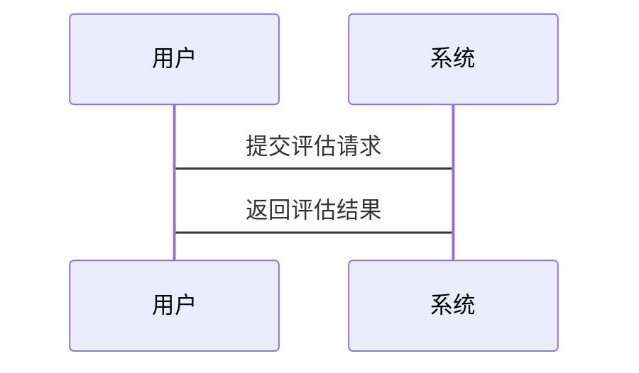

                 


# AI agents在公司无形资产价值评估中的创新应用

> 关键词：AI代理、无形资产评估、机器学习、深度学习、数学建模

> 摘要：本文深入探讨了AI代理在公司无形资产价值评估中的创新应用，从核心概念、算法原理到系统架构，再到项目实战，全面解析了AI代理如何提升无形资产评估的效率和准确性。通过具体案例分析和代码实现，展示了AI代理在无形资产评估中的实际应用价值。

---

# 第1章: 公司无形资产与AI代理概述

## 1.1 无形资产的基本概念

### 1.1.1 无形资产的定义与分类

无形资产是指企业拥有的非实物资产，通常包括专利、商标、品牌、客户关系、商誉、技术诀窍等。这些资产无法被物理地触摸或看到，但它们为企业创造了价值。

根据国际会计准则（IAS）和美国会计准则（US GAAP），无形资产可以分为可识别和不可识别的两类：
- **可识别无形资产**：如专利、商标、软件等，可以单独识别并从企业中分离出来。
- **不可识别无形资产**：如商誉，无法单独识别，通常与企业整体价值相关。

### 1.1.2 无形资产在企业中的重要性

无形资产在企业的价值创造中扮演着关键角色。例如：
- **技术创新**：专利和专有技术可以为企业带来竞争优势。
- **品牌价值**：强大的品牌可以帮助企业吸引客户并提高产品溢价能力。
- **客户关系**：稳定的客户关系可以降低企业的营销成本并提高客户忠诚度。
- **商誉**：商誉反映了企业整体的市场声誉和客户信任。

### 1.1.3 无形资产价值评估的难点

无形资产的评估具有以下难点：
- **主观性**：无形资产的价值往往依赖于市场参与者的主观判断。
- **动态性**：无形资产的价值可能因市场环境、技术进步等因素而快速变化。
- **难以量化**：许多无形资产缺乏直接的市场报价或可比数据。

## 1.2 AI代理的核心概念

### 1.2.1 AI代理的基本定义

AI代理（Artificial Intelligence Agent）是一种智能体，能够感知环境并采取行动以实现特定目标。AI代理可以是软件程序、机器人或其他智能系统，其核心能力包括感知、推理、学习和决策。

### 1.2.2 AI代理的主要特点

AI代理具有以下特点：
- **自主性**：能够在没有外部干预的情况下自主运行。
- **反应性**：能够实时感知环境并做出反应。
- **目标导向**：根据预设目标采取行动。
- **学习能力**：能够通过数据和经验不断优化自身性能。

### 1.2.3 AI代理与传统评估方法的区别

AI代理在无形资产评估中的优势体现在以下几个方面：
- **数据驱动**：AI代理能够处理大量非结构化数据，发现传统方法难以察觉的模式。
- **实时性**：AI代理可以实时更新评估结果，适应市场动态变化。
- **个性化**：AI代理可以根据企业的具体情况定制评估模型。

## 1.3 AI代理在无形资产价值评估中的应用背景

### 1.3.1 传统无形资产评估的局限性

传统无形资产评估方法主要依赖于市场比较法、收益法和成本法，存在以下局限性：
- **数据不足**：许多无形资产缺乏可比交易数据。
- **主观性强**：评估结果往往依赖评估师的主观判断。
- **静态性**：评估结果难以动态更新。

### 1.3.2 AI技术在资产评估中的潜力

AI技术在资产评估中的潜力主要体现在以下几个方面：
- **数据处理能力**：AI能够处理大量非结构化数据，发现潜在的价值驱动因素。
- **预测能力**：通过机器学习模型，AI可以预测无形资产的未来价值。
- **实时更新**：AI系统可以实时更新评估结果，适应市场变化。

### 1.3.3 AI代理在无形资产评估中的创新点

AI代理在无形资产评估中的创新点包括：
- **自动化评估**：AI代理可以自动收集和分析数据，生成评估结果。
- **动态评估**：AI代理可以实时更新评估结果，反映市场变化。
- **个性化模型**：AI代理可以根据企业的具体情况定制评估模型。

## 1.4 本章小结

本章介绍了无形资产的基本概念、评估难点以及AI代理的核心概念和特点。AI代理在无形资产评估中的应用背景被详细阐述，为后续章节的分析奠定了基础。

---

# 第2章: AI代理的核心原理与技术

## 2.1 AI代理的基本原理

### 2.1.1 代理的定义与分类

代理（Agent）是指能够感知环境并采取行动以实现目标的智能体。根据智能水平，代理可以分为以下几类：
- **反应式代理**：根据当前感知做出反应，不依赖内部状态。
- **认知式代理**：具有复杂的状态表示和推理能力。
- **学习式代理**：能够通过经验改进自身性能。

### 2.1.2 AI代理的工作原理

AI代理的工作原理可以分为以下几个步骤：
1. **感知环境**：通过传感器或其他数据源获取环境信息。
2. **目标设定**：根据任务要求设定目标。
3. **决策制定**：基于当前状态和目标，制定行动方案。
4. **行动执行**：根据决策采取行动。
5. **反馈学习**：根据行动结果更新知识库，改进未来决策。

### 2.1.3 AI代理与传统评估方法的区别

AI代理与传统评估方法的区别主要体现在以下几个方面：
- **数据处理能力**：AI代理能够处理大量非结构化数据。
- **自动化能力**：AI代理可以自动完成评估过程。
- **学习能力**：AI代理能够通过经验不断优化评估模型。

## 2.2 无形资产评估的核心要素

### 2.2.1 无形资产的生命周期

无形资产的生命周期包括以下几个阶段：
1. **创造阶段**：通过研发或其他方式创造无形资产。
2. **使用阶段**：将无形资产应用于企业运营中。
3. **评估阶段**：定期评估无形资产的价值。
4. **处置阶段**：将无形资产出售或报废。

### 2.2.2 无形资产的评估维度

无形资产的评估维度包括以下几个方面：
- **经济价值**：无形资产为企业带来的经济收益。
- **市场价值**：无形资产在市场上的交易价格。
- **风险价值**：无形资产的风险敞口和潜在损失。

### 2.2.3 无形资产的评估方法

无形资产的评估方法包括市场比较法、收益法和成本法。AI代理在这些方法中的应用需要结合具体场景。

## 2.3 AI代理与无形资产评估的结合点

### 2.3.1 数据驱动的评估方法

AI代理可以通过数据驱动的方法，利用机器学习模型对无形资产进行评估。这种方法的优势在于能够处理大量非结构化数据，并发现潜在的价值驱动因素。

### 2.3.2 AI代理在数据处理中的优势

AI代理在数据处理中的优势包括：
- **自动化**：AI代理可以自动收集和处理数据。
- **高效性**：AI代理能够快速处理大量数据，提高评估效率。
- **准确性**：AI代理可以通过机器学习算法提高评估结果的准确性。

### 2.3.3 AI代理在评估模型中的应用

AI代理在评估模型中的应用包括：
- **特征提取**：AI代理可以提取关键特征，用于评估模型。
- **模型训练**：AI代理可以训练机器学习模型，优化评估结果。
- **实时更新**：AI代理可以实时更新模型，适应市场变化。

## 2.4 本章小结

本章详细介绍了AI代理的核心原理和其在无形资产评估中的应用。AI代理通过数据驱动的方法和机器学习算法，能够显著提高无形资产评估的效率和准确性。

---

# 第3章: 无形资产评估的数学模型与算法原理

## 3.1 无形资产评估的数学模型

### 3.1.1 基于机器学习的评估模型

#### 3.1.1.1 线性回归模型

线性回归是一种简单但有效的机器学习模型，适用于线性关系的数据。其数学表达式为：
$$y = \beta_0 + \beta_1 x_1 + \beta_2 x_2 + \dots + \beta_n x_n$$
其中，$y$ 是预测值，$x_i$ 是特征变量，$\beta_i$ 是模型参数。

#### 3.1.1.2 支持向量回归(SVR)

支持向量回归是一种基于支持向量机的回归模型，适用于非线性关系的数据。其核心思想是通过映射函数将数据映射到高维空间，并在高维空间中进行线性回归。

#### 3.1.1.3 神经网络模型

神经网络是一种强大的机器学习模型，适用于复杂非线性关系的数据。其数学表达式为：
$$y = f(Wx + b)$$
其中，$W$ 是权重矩阵，$x$ 是输入向量，$b$ 是偏置项，$f$ 是激活函数。

### 3.1.2 基于深度学习的评估模型

#### 3.1.2.1 长短期记忆网络(LSTM)

长短期记忆网络是一种特殊的循环神经网络，能够有效处理序列数据。其核心思想是通过记忆单元和门控机制，保留长期依赖关系。

#### 3.1.2.2 图神经网络(GNN)

图神经网络是一种适用于图结构数据的深度学习模型。其数学表达式为：
$$h_i^{(l+1)} = \sigma\left(\sum_{j \in N(i)} W_{ij} h_j^{(l)} + b_i\right)$$
其中，$h_i^{(l)}$ 是节点$i$在第$l$层的表示，$N(i)$ 是节点$i$的邻居节点集合，$W_{ij}$ 是权重矩阵，$b_i$ 是偏置项，$\sigma$ 是激活函数。

### 3.1.3 算法选择与优化

在选择算法时，需要考虑以下因素：
- **数据类型**：如果数据是结构化数据，可以使用线性回归或随机森林；如果数据是非结构化数据，可以使用神经网络。
- **模型复杂度**：复杂的数据需要复杂的模型，简单数据可以使用简单模型。
- **计算资源**：深度学习模型需要较高的计算资源，而传统机器学习模型计算资源需求较低。

## 3.2 算法实现与优化

### 3.2.1 算法实现

以下是基于线性回归的Python代码示例：

```python
import numpy as np
from sklearn.linear_model import LinearRegression

# 生成训练数据
X = np.array([[1], [2], [3], [4], [5]])
y = np.array([2, 4, 5, 4, 5])

# 训练模型
model = LinearRegression()
model.fit(X, y)

# 预测
X_new = np.array([[6]])
y_new = model.predict(X_new)
print(y_new)
```

### 3.2.2 算法优化

算法优化可以从以下几个方面入手：
- **特征选择**：通过特征重要性分析，选择对评估结果影响较大的特征。
- **超参数优化**：通过网格搜索或随机搜索，找到最优的模型参数。
- **模型融合**：将多个模型的预测结果进行融合，提高评估准确性。

## 3.3 本章小结

本章详细介绍了无形资产评估的数学模型和算法原理，包括机器学习和深度学习模型的选择与优化。通过具体的代码示例，展示了如何实现这些模型并优化其性能。

---

# 第4章: 系统分析与架构设计

## 4.1 无形资产评估系统的功能设计

### 4.1.1 系统功能模块

无形资产评估系统主要包括以下几个功能模块：
- **数据采集**：收集无形资产的相关数据。
- **特征提取**：从数据中提取关键特征。
- **模型训练**：训练机器学习模型。
- **评估预测**：根据模型预测无形资产价值。
- **结果展示**：展示评估结果。

### 4.1.2 系统功能流程

以下是系统功能流程的Mermaid图：

```mermaid
graph TD
    A[开始] -> B[数据采集]
    B -> C[特征提取]
    C -> D[模型训练]
    D -> E[评估预测]
    E -> F[结果展示]
    F -> G[结束]
```

## 4.2 无形资产评估系统的架构设计

### 4.2.1 系统架构图

以下是系统架构图的Mermaid图：

```mermaid
graph TD
    A[数据源] -> B[数据采集模块]
    B -> C[特征提取模块]
    C -> D[模型训练模块]
    D -> E[评估预测模块]
    E -> F[结果展示模块]
```

### 4.2.2 系统接口设计

系统接口设计包括以下几个方面：
- **数据接口**：与数据库或其他数据源的接口。
- **模型接口**：与机器学习模型的接口。
- **用户接口**：与用户的交互界面。

### 4.2.3 系统交互设计

以下是系统交互设计的Mermaid图：



## 4.3 本章小结

本章详细介绍了无形资产评估系统的功能设计和架构设计，为后续章节的实现奠定了基础。

---

# 第5章: 项目实战

## 5.1 项目背景与目标

### 5.1.1 项目背景

本项目旨在利用AI代理技术，提高公司无形资产的价值评估效率和准确性。

### 5.1.2 项目目标

项目的具体目标包括：
- 实现无形资产的自动化评估。
- 提高评估结果的准确性。
- 实现评估结果的动态更新。

## 5.2 项目环境与工具

### 5.2.1 环境要求

项目环境要求如下：
- 操作系统：Linux/Windows/MacOS
- Python版本：3.6+
- 依赖库：numpy, pandas, scikit-learn, keras, tensorflow

### 5.2.2 工具选择

项目中主要使用的工具包括：
- 数据处理工具：Pandas, NumPy
- 机器学习库：Scikit-learn, Keras, TensorFlow
- 可视化工具：Matplotlib, Seaborn

## 5.3 系统核心实现

### 5.3.1 数据采集与预处理

以下是数据采集与预处理的Python代码示例：

```python
import pandas as pd

# 数据采集
data = pd.read_csv('asset_data.csv')

# 数据预处理
data = data.dropna()
data = pd.get_dummies(data)
```

### 5.3.2 特征提取与选择

以下是特征提取与选择的Python代码示例：

```python
from sklearn.feature_selection import SelectKBest, f_regression

# 特征选择
selector = SelectKBest(score_func=f_regression, k=5)
selected_features = selector.fit_transform(data, target)
```

### 5.3.3 模型训练与优化

以下是模型训练与优化的Python代码示例：

```python
from sklearn.model

