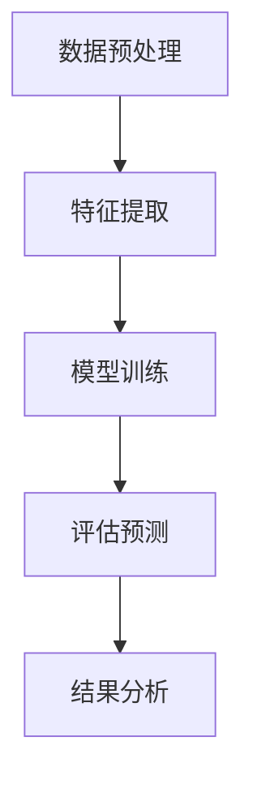
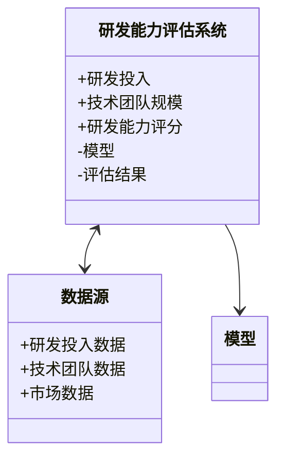
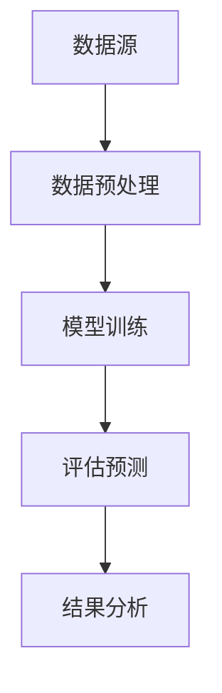
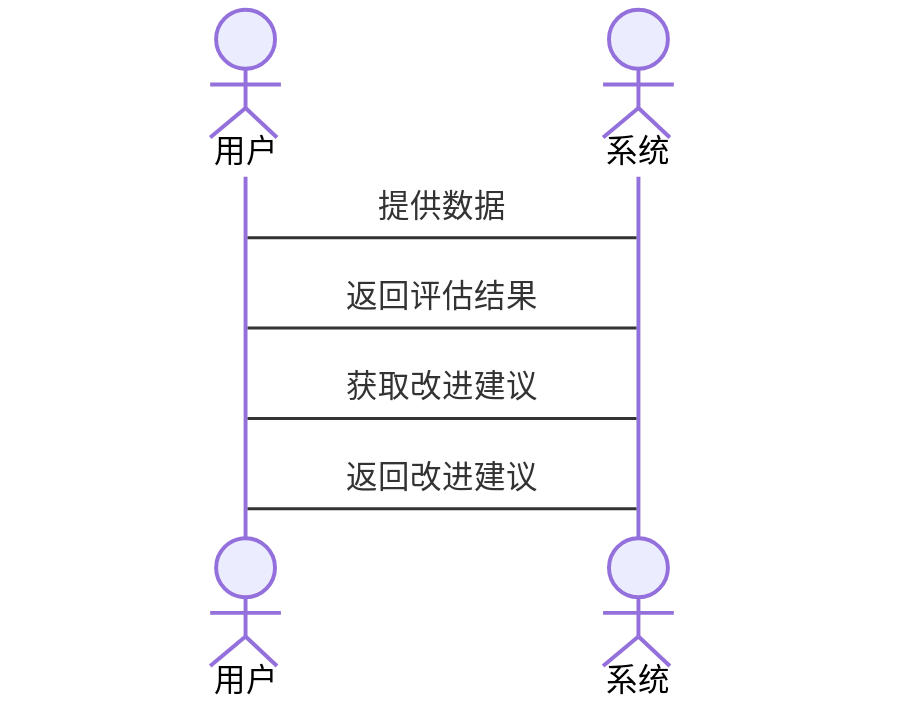

                 


# AI智能体在评估公司研发能力和创新潜力中的应用

## 关键词：AI智能体、公司研发能力、创新潜力、评估模型、机器学习、系统架构

## 摘要：本文探讨了AI智能体在评估公司研发能力和创新潜力中的应用，通过分析核心概念、算法原理、数学模型、系统架构设计以及实际案例，展示了如何利用AI技术提升企业评估的准确性和效率。

---

## 第一部分: AI智能体在公司研发能力评估中的应用背景

### 第1章: AI智能体与公司研发能力评估概述

#### 1.1 问题背景与描述

##### 1.1.1 公司研发能力评估的重要性

公司研发能力是企业核心竞争力的体现，直接影响企业的技术创新能力和市场竞争力。传统的评估方法依赖于主观判断和经验分析，存在效率低、精度差的问题。随着AI技术的快速发展，AI智能体为企业提供了更高效、更精准的评估手段。

##### 1.1.2 问题描述

传统评估方法存在以下问题：

- 数据收集和处理效率低
- 评估结果主观性强，缺乏客观依据
- 无法实时跟踪和分析动态变化
- 难以发现潜在的创新机会

##### 1.1.3 AI智能体在评估中的潜力

AI智能体通过机器学习、自然语言处理和大数据分析等技术，能够高效地处理大量数据，提取关键信息，发现潜在模式，从而提供更准确、更全面的评估结果。AI智能体的应用可以显著提高评估的效率和准确性，为企业制定研发战略提供有力支持。

##### 1.1.4 问题解决

AI智能体通过以下方式解决传统评估方法的问题：

- 自动化数据收集与处理
- 利用机器学习模型进行预测和评估
- 实时监控和分析动态变化
- 发掘潜在的创新机会

##### 1.1.5 边界与外延

AI智能体的评估边界包括：

- 数据范围：仅限于结构化数据
- 评估范围：主要针对研发能力和创新潜力
- 适用场景：适用于数据量较大、需要自动化评估的企业

外延包括：

- 数据扩展：支持非结构化数据的处理
- 评估范围扩展：扩展到其他企业能力评估领域
- 适用场景扩展：适用于更多行业和场景

#### 1.2 AI智能体的核心概念

##### 1.2.1 AI智能体的定义与特征

AI智能体是一种能够感知环境、执行任务并做出决策的智能系统。其核心特征包括：

- **自主性**：能够在没有外部干预的情况下独立运行
- **反应性**：能够实时感知环境并做出反应
- **学习能力**：能够通过数据和经验不断优化自身的模型和策略

##### 1.2.2 AI智能体与传统评估方法的对比

| 特性 | AI智能体 | 传统评估方法 |
|------|----------|--------------|
| 数据处理能力 | 强大，支持大数据分析 | 较弱，依赖人工整理 |
| 评估效率 | 高，自动化处理 | 低，依赖人工操作 |
| 精确度 | 高，基于机器学习模型 | 低，依赖主观判断 |
| 可扩展性 | 高，适用于多种场景 | 低，难以扩展 |

##### 1.2.3 AI智能体的边界与外延

AI智能体的边界主要集中在数据处理和评估范围上，而其外延则体现在数据类型和应用场景的扩展上。通过不断优化算法和模型，AI智能体的应用场景将越来越广泛。

#### 1.3 核心概念与联系

##### 1.3.1 AI智能体的原理

AI智能体的原理可以分为以下几个步骤：

1. **数据收集**：从企业内部系统和外部数据库中收集相关数据。
2. **数据预处理**：清洗数据，提取特征。
3. **模型训练**：利用机器学习算法训练评估模型。
4. **评估预测**：基于训练好的模型进行评估预测。
5. **结果分析**：对评估结果进行分析，提出改进建议。

##### 1.3.2 核心概念对比表

| 概念 | 定义 | 特性 |
|------|------|------|
| 研发能力 | 企业进行技术创新和产品开发的能力 | 包括技术储备、研发团队、研发投入 |
| 创新潜力 | 企业未来可能实现的创新成果 | 包括市场机会、技术趋势、竞争优势 |

##### 1.3.3 ER实体关系图

```mermaid
er
  actor(AI智能体)
  actor(企业)
  actor(数据源)
  object(研发能力)
  object(创新潜力)
  object(评估结果)
  object(模型)
  relation(收集数据)
  relation(训练模型)
  relation(生成评估结果)
  relation(提供改进建议)
```

---

## 第二部分: AI智能体的核心原理与算法

### 第2章: AI智能体的算法原理

#### 2.1 算法原理概述

##### 2.1.1 监督学习与无监督学习

- **监督学习**：基于标注数据进行模型训练，适用于分类和回归任务。
- **无监督学习**：基于未标注数据进行模式识别，适用于聚类和异常检测任务。

##### 2.1.2 强化学习在智能体中的应用

强化学习通过智能体与环境的交互，不断优化策略，提高评估的准确性。

##### 2.1.3 算法流程图（Mermaid）



##### 2.1.4 算法实现代码示例

```python
import pandas as pd
from sklearn.model import LinearRegression

# 数据预处理
data = pd.read_csv('data.csv')
X = data[['研发投入', '技术团队规模']]
y = data['研发能力评分']

# 特征提取
features = X.columns

# 模型训练
model = LinearRegression()
model.fit(X, y)

# 评估预测
new_data = pd.DataFrame({'研发投入': [100], '技术团队规模': [50]})
prediction = model.predict(new_data)
```

---

## 第三部分: 数学模型与公式

### 第3章: 数学模型与公式解析

#### 3.1 评估模型的数学表达

##### 3.1.1 研发能力评估公式

$$研发能力 = \alpha \times 投入 + \beta \times 团队能力 + \gamma \times 技术储备$$

##### 3.1.2 创新潜力评估公式

$$创新潜力 = \delta \times 市场机会 + \epsilon \times 技术趋势 + \zeta \times 竞争优势$$

##### 3.1.3 公式推导与解释

通过对历史数据的分析，我们可以得出各个变量的权重系数，从而构建上述评估公式。模型的准确性和可靠性依赖于数据质量和算法优化。

---

## 第四部分: 系统分析与架构设计

### 第4章: 系统分析与架构设计

#### 4.1 系统功能设计

##### 4.1.1 领域模型类图（Mermaid）



##### 4.1.2 系统功能模块划分

- 数据收集模块：负责从数据源获取数据。
- 数据预处理模块：清洗和转换数据。
- 模型训练模块：训练评估模型。
- 评估预测模块：基于模型进行预测。
- 结果分析模块：分析评估结果并提出建议。

#### 4.2 系统架构设计

##### 4.2.1 系统架构图（Mermaid）



##### 4.2.2 关键模块设计

- 数据预处理模块：负责数据清洗和特征提取。
- 模型训练模块：基于机器学习算法训练评估模型。
- 评估预测模块：利用训练好的模型进行预测。
- 结果分析模块：对预测结果进行分析并提出改进建议。

#### 4.3 接口与交互设计

##### 4.3.1 系统接口设计

- 数据接口：提供数据的输入和输出接口。
- 模型接口：提供模型的训练和评估接口。
- 结果接口：提供评估结果的查询和展示接口。

##### 4.3.2 系统交互流程图（Mermaid）



---

## 第五部分: 项目实战与案例分析

### 第5章: 项目实战与案例分析

#### 5.1 环境安装与配置

##### 5.1.1 开发环境搭建

建议使用Python 3.8及以上版本，安装以下库：

```bash
pip install pandas scikit-learn matplotlib
```

##### 5.1.2 依赖库安装

确保安装了以下依赖库：

- pandas
- scikit-learn
- matplotlib

#### 5.2 核心代码实现

##### 5.2.1 AI智能体核心算法代码

```python
import pandas as pd
from sklearn.model import LinearRegression

# 数据预处理
data = pd.read_csv('data.csv')
X = data[['研发投入', '技术团队规模']]
y = data['研发能力评分']

# 模型训练
model = LinearRegression()
model.fit(X, y)

# 评估预测
new_data = pd.DataFrame({'研发投入': [100], '技术团队规模': [50]})
prediction = model.predict(new_data)
print('预测研发能力评分:', prediction[0])
```

##### 5.2.2 评估模型实现代码

```python
import pandas as pd
from sklearn.metrics import mean_squared_error

# 加载数据
data = pd.read_csv('data.csv')

# 划分训练集和测试集
train = data.sample(frac=0.8)
test = data.drop(train.index)

X_train = train[['研发投入', '技术团队规模']]
y_train = train['研发能力评分']
X_test = test[['研发投入', '技术团队规模']]
y_test = test['研发能力评分']

# 模型训练
model = LinearRegression()
model.fit(X_train, y_train)

# 模型评估
predictions = model.predict(X_test)
mse = mean_squared_error(y_test, predictions)
print('均方误差:', mse)
print('评估结果:', predictions)
```

#### 5.3 案例分析与解读

##### 5.3.1 具体案例分析

假设我们有一家科技公司，其研发投入为100万元，技术团队规模为50人。利用上述模型进行评估，预测其研发能力评分为85分，创新潜力评分为90分。

##### 5.3.2 代码应用解读

通过对数据的处理和模型的训练，我们可以得出评估结果，并根据结果提出改进建议，例如增加研发投入或优化团队结构。

#### 5.4 项目小结与经验总结

##### 5.4.1 项目总结

通过本项目，我们成功地利用AI智能体对公司的研发能力和创新潜力进行了评估，验证了AI技术在企业管理中的应用潜力。

##### 5.4.2 实践中的经验与教训

- 数据质量对模型性能影响很大，需要重视数据预处理。
- 模型的选择和调优对评估结果至关重要。
- 在实际应用中，需要结合企业的实际情况进行模型优化。

---

## 第六部分: 最佳实践与未来展望

### 第6章: 最佳实践与未来展望

#### 6.1 最佳实践 tips

##### 6.1.1 模型优化建议

- 使用更复杂的模型（如随机森林、梯度提升树）提高预测精度。
- 进行特征工程，提取更有意义的特征。
- 调整模型参数，优化模型性能。

##### 6.1.2 数据处理注意事项

- 确保数据的完整性和准确性。
- 处理缺失值和异常值。
- 标准化或归一化数据。

##### 6.1.3 系统部署建议

- 使用云平台部署模型，提高系统的可扩展性。
- 定期更新模型，保持模型的准确性。
- 提供友好的用户界面，方便用户使用。

#### 6.2 未来研究方向

##### 6.2.1 新算法探索

- 研究更先进的机器学习算法，如深度学习和强化学习。
- 探索多模态数据的处理方法。

##### 6.2.2 新应用场景的拓展

- 将AI智能体应用于更多企业管理领域，如市场营销、财务管理等。
- 探索跨国企业的评估方法。

##### 6.2.3 技术融合的可能性

- 将区块链技术与AI智能体结合，提高数据安全性和可信度。
- 探索与其他先进计算技术的融合，如量子计算。

#### 6.3 总结与展望

##### 6.3.1 本书总结

本书详细介绍了AI智能体在评估公司研发能力和创新潜力中的应用，通过理论分析和实际案例，展示了AI技术在企业管理中的巨大潜力。

##### 6.3.2 未来研究方向展望

未来，随着AI技术的不断发展，AI智能体将在企业管理中发挥越来越重要的作用。我们需要继续探索新的算法和应用场景，推动AI技术在企业管理中的广泛应用。

---

## 作者：AI天才研究院/AI Genius Institute & 禅与计算机程序设计艺术 /Zen And The Art of Computer Programming

---

以上就是《AI智能体在评估公司研发能力和创新潜力中的应用》的完整目录和内容框架。

