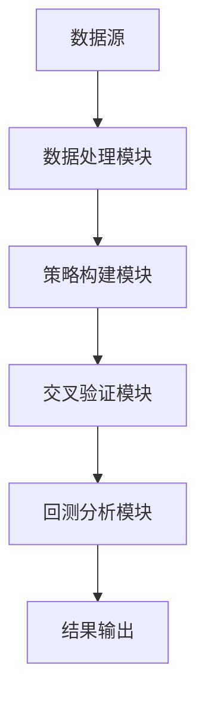

                 


# AI驱动的价值投资策略交叉验证

> 关键词：AI，价值投资，策略交叉验证，金融数据分析，机器学习，深度学习

> 摘要：本文将探讨如何利用人工智能技术驱动价值投资策略，并通过交叉验证的方法来验证策略的有效性。文章从AI和价值投资的基本概念出发，深入分析AI在金融数据分析中的应用，详细讲解价值投资策略的构建与优化方法，重点介绍AI驱动的策略交叉验证技术，结合实际案例进行系统架构设计和实现，最后通过实战案例展示如何利用AI技术实现价值投资策略的交叉验证。

---

# 第一部分: AI驱动的价值投资策略交叉验证基础

## 第1章: AI与价值投资的背景介绍

### 1.1 问题背景与核心概念

#### 1.1.1 价值投资的核心概念
- 价值投资的定义：寻找被市场低估的股票，长期持有，获得超额收益。
- 核心概念： intrinsic value（内在价值）、margin of safety（安全边际）、Mr. Market（市场先生）。
- 价值投资的核心思想：通过分析企业的基本面，寻找具有持续竞争优势的企业，进行长期投资。

#### 1.1.2 AI在金融领域的应用背景
- AI在金融领域的应用：算法交易、风险管理、客户画像、智能投顾等。
- 金融数据分析的挑战：数据量大、维度高、噪声多、非线性关系复杂。
- AI的优势：强大的数据处理能力、模式识别能力和自动化决策能力。

#### 1.1.3 价值投资与AI结合的必要性
- 传统价值投资的局限性：依赖主观判断，难以量化，难以应对市场变化。
- AI的优势：数据驱动、自动化、可量化。
- 结合AI的价值投资：通过数据驱动的方式，优化选股逻辑，提高投资效率。

### 1.2 价值投资策略的定义与特点

#### 1.2.1 价值投资的定义
- 价值投资是一种投资策略，通过分析企业的基本面，寻找具有持续竞争优势和低估价格的股票进行投资。

#### 1.2.2 价值投资的核心特点
- 长期投资：注重长期价值，而非短期波动。
- 选股标准：低市盈率、低市净率、高股息率等。
- 安全边际：买入价格低于内在价值，降低投资风险。

#### 1.2.3 价值投资与AI结合的优势
- 数据驱动：利用AI处理大量数据，发现潜在的投资机会。
- 自动化：AI可以自动筛选股票，优化投资组合。
- 高效性：AI可以快速分析市场变化，及时调整投资策略。

### 1.3 AI驱动的策略交叉验证

#### 1.3.1 策略交叉验证的定义
- 策略交叉验证：通过不同的数据集和方法，验证策略的有效性和稳定性。

#### 1.3.2 策略交叉验证的必要性
- 避免过拟合：确保策略在不同市场环境下的有效性。
- 提高策略的稳定性：通过交叉验证，确保策略在不同时间段和市场条件下的表现一致。

#### 1.3.3 AI在策略交叉验证中的作用
- 提供多样化的验证方法：如K折交叉验证、时间序列交叉验证等。
- 利用机器学习模型：通过模型的泛化能力，验证策略的有效性。

### 1.4 本章小结
- 介绍了价值投资的核心概念和AI在金融领域的应用背景。
- 分析了价值投资与AI结合的必要性和优势。
- 引入了策略交叉验证的概念和AI在其中的作用。

---

## 第2章: AI在金融数据分析中的应用

### 2.1 金融数据分析的挑战

#### 2.1.1 数据的复杂性
- 金融数据具有高度的非线性关系，传统统计方法难以捕捉。
- 数据量大、维度高，需要高效的数据处理方法。

#### 2.1.2 数据的不完全性
- 数据可能存在缺失、噪声和偏差。
- 数据的不完全性会影响模型的准确性。

#### 2.1.3 数据的实时性
- 金融市场数据具有实时性，需要快速响应和处理。

### 2.2 AI技术在金融数据分析中的应用

#### 2.2.1 机器学习在金融数据分析中的应用
- 监督学习：用于分类和回归问题，如股票价格预测。
- 无监督学习：用于聚类分析，如客户画像和风险分组。
- 强化学习：用于算法交易和动态投资组合优化。

#### 2.2.2 深度学习在金融数据分析中的应用
- 卷积神经网络（CNN）：用于图像识别和模式识别。
- 循序贯网络（RNN）：用于时间序列分析和自然语言处理。
- Transformer模型：用于复杂的模式识别和时间序列预测。

#### 2.2.3 自然语言处理在金融数据分析中的应用
- 用于分析财经新闻、公司公告和社交媒体数据。
- 通过NLP技术提取情感倾向和关键词，辅助投资决策。

### 2.3 价值投资策略中的数据驱动方法

#### 2.3.1 数据驱动的价值投资策略
- 利用大数据分析企业的基本面数据，如财务报表和行业数据。
- 通过数据挖掘发现潜在的投资机会。

#### 2.3.2 数据驱动策略的优缺点
- 优点：数据驱动策略具有客观性和可量化性。
- 缺点：过于依赖数据质量和模型的泛化能力。

#### 2.3.3 数据驱动策略的实现方法
- 数据清洗：处理缺失值、异常值和噪声数据。
- 数据特征提取：提取有用的特征，降低维度。
- 模型训练：利用机器学习模型进行策略优化。

### 2.4 本章小结
- 分析了金融数据分析的挑战和AI技术的应用。
- 探讨了数据驱动的价值投资策略及其优缺点。
- 提出了数据驱动策略的实现方法。

---

## 第3章: 价值投资策略的构建与优化

### 3.1 价值投资策略的构建

#### 3.1.1 基本面分析
- 通过分析企业的财务报表，评估企业的盈利能力和成长性。
- 关键指标：市盈率（P/E）、市净率（P/B）、股息率等。

#### 3.1.2 技术分析
- 利用技术指标和图表模式，预测股票价格的短期走势。
- 关键指标：移动平均线（MA）、相对强弱指数（RSI）、MACD等。

#### 3.1.3 量化分析
- 利用量化模型进行选股和投资组合优化。
- 量化指标：夏普比率、最大回撤、收益波动比等。

### 3.2 AI驱动的策略优化

#### 3.2.1 策略优化的定义
- 策略优化：通过调整策略参数，提高策略的收益和风险比。

#### 3.2.2 基于AI的策略优化方法
- 使用机器学习模型，自动调整策略参数。
- 利用遗传算法，优化投资组合。

#### 3.2.3 策略优化的实现步骤
1. 数据清洗与特征提取。
2. 建立策略模型，设定目标函数和约束条件。
3. 使用优化算法，调整策略参数。
4. 验证优化后的策略，确保其有效性和稳定性。

### 3.3 策略的有效性验证

#### 3.3.1 策略有效性的定义
- 策略的有效性：策略在不同市场环境下的收益和风险比。

#### 3.3.2 策略有效性验证的方法
- 回测分析：通过历史数据验证策略的收益和风险比。
- 前瞻性验证：通过模拟交易验证策略在未来的表现。

#### 3.3.3 策略有效性验证的指标
- 夏普比率：衡量策略的风险调整后收益。
- 最大回撤：衡量策略的最大亏损幅度。
- 净收益：策略的总收益。

### 3.4 本章小结
- 介绍了价值投资策略的构建方法，包括基本面分析、技术分析和量化分析。
- 探讨了基于AI的策略优化方法，及其实现步骤。
- 分析了策略有效性的验证方法和相关指标。

---

## 第4章: AI驱动的策略交叉验证方法

### 4.1 策略交叉验证的基本原理

#### 4.1.1 交叉验证的定义
- 交叉验证：通过将数据分成训练集和验证集，反复验证模型的泛化能力。

#### 4.1.2 交叉验证的核心步骤
1. 数据划分：将数据分成训练集和验证集。
2. 模型训练：在训练集上训练模型。
3. 模型验证：在验证集上评估模型的性能。
4. 模型优化：调整模型参数，提高模型性能。

#### 4.1.3 AI在策略交叉验证中的作用
- 提供多样化的验证方法，如K折交叉验证。
- 通过机器学习模型的泛化能力，验证策略的有效性。

### 4.2 策略交叉验证的具体方法

#### 4.2.1 K折交叉验证
- K折交叉验证：将数据分成K个互不相交的子集，每次使用K-1个子集作为训练集，1个子集作为验证集，反复进行K次，取平均性能指标。

#### 4.2.2 时间序列交叉验证
- 时间序列交叉验证：适用于时间序列数据，确保验证集的顺序与实际市场一致。

#### 4.2.3 基于机器学习的交叉验证
- 使用机器学习模型进行策略交叉验证，如随机森林、支持向量机等。

### 4.3 回测分析与风险控制

#### 4.3.1 回测分析的定义
- 回测分析：通过历史数据验证策略的收益和风险比。

#### 4.3.2 回测分析的步骤
1. 数据准备：选择历史数据，设置回测区间。
2. 策略实现：根据策略逻辑，编写回测代码。
3. 性能评估：计算回测的收益、风险指标等。

#### 4.3.3 风险控制
- 风险控制：通过止损、止盈等方法，控制投资风险。

### 4.4 本章小结
- 介绍了策略交叉验证的基本原理和具体方法。
- 探讨了回测分析与风险控制的重要性。
- 提出了基于机器学习的策略交叉验证方法。

---

## 第5章: 系统架构设计

### 5.1 问题场景介绍

#### 5.1.1 价值投资策略交叉验证的系统需求
- 系统需求：支持多策略交叉验证、数据处理、回测分析和风险控制。

#### 5.1.2 系统目标
- 提供一个高效、可靠的系统，支持AI驱动的价值投资策略交叉验证。

### 5.2 系统功能设计

#### 5.2.1 领域模型
- 领域模型：包括数据处理模块、策略构建模块、交叉验证模块和回测分析模块。

#### 5.2.2 系统功能模块
1. 数据处理模块：负责数据清洗、特征提取和数据存储。
2. 策略构建模块：负责策略设计、参数调整和模型训练。
3. 交叉验证模块：负责策略验证、性能评估和结果输出。
4. 回测分析模块：负责回测模拟、风险控制和结果可视化。

### 5.3 系统架构设计

#### 5.3.1 系统架构图


#### 5.3.2 系统接口设计
- 数据处理模块接口：数据清洗、特征提取。
- 策略构建模块接口：策略设计、参数调整。
- 交叉验证模块接口：策略验证、性能评估。
- 回测分析模块接口：回测模拟、风险控制。

#### 5.3.3 系统交互流程
1. 数据处理模块接收数据源的数据，进行清洗和特征提取。
2. 策略构建模块根据策略逻辑，设计策略并调整参数。
3. 交叉验证模块对策略进行验证，评估策略的性能。
4. 回测分析模块进行回测模拟，评估策略的收益和风险。
5. 最终结果输出，包括策略的收益、风险指标等。

### 5.4 本章小结
- 介绍了系统架构设计的思路和方法。
- 绘制了系统的架构图和交互流程图。
- 提出了系统的功能模块和接口设计。

---

## 第6章: 实战案例

### 6.1 环境搭建

#### 6.1.1 工具安装
- 安装Python、机器学习库（如scikit-learn、xgboost）和数据处理库（如pandas、numpy）。

#### 6.1.2 数据源选择
- 数据源：选择历史股票数据，如Yahoo Finance或Alpha Vaffiliate。

### 6.2 核心实现

#### 6.2.1 数据处理代码
```python
import pandas as pd
import numpy as np

# 数据加载
data = pd.read_csv('stock_data.csv')

# 数据清洗
data.dropna(inplace=True)

# 特征提取
data['moving_avg'] = data['close'].rolling(10).mean()
```

#### 6.2.2 策略构建代码
```python
from sklearn.model import SVC

# 策略构建
model = SVC()
model.fit(data[['moving_avg', 'volume'], data['label'])
```

#### 6.2.3 交叉验证代码
```python
from sklearn.model_selection import KFold

# 交叉验证
kf = KFold(n_splits=5)
scores = []
for train_index, test_index in kf.split(data):
    X_train, X_test = data.iloc[train_index], data.iloc[test_index]
    model.fit(X_train, y_train)
    scores.append(model.score(X_test, y_test))

print('平均准确率：', np.mean(scores))
```

### 6.3 项目小结

#### 6.3.1 实战案例总结
- 通过实战案例，展示了如何利用AI技术驱动价值投资策略。
- 详细讲解了数据处理、策略构建和交叉验证的实现步骤。

#### 6.3.2 项目总结
- 总结了项目的核心内容和实现方法。
- 提出了进一步优化的方向，如引入更多的数据源和优化策略参数。

---

## 第7章: 高级主题与拓展

### 7.1 强化学习在价值投资中的应用

#### 7.1.1 强化学习的基本原理
- 强化学习：通过与环境交互，学习最优策略。

#### 7.1.2 强化学习在价值投资中的应用
- 算法交易：通过强化学习模型，优化交易策略。
- 动态投资组合管理：根据市场变化，动态调整投资组合。

### 7.2 多因子模型与AI结合

#### 7.2.1 多因子模型的定义
- 多因子模型：通过多个因子来评估股票的投资价值。

#### 7.2.2 多因子模型与AI结合
- 利用AI技术优化因子选择和权重分配。
- 通过机器学习模型，预测因子的未来表现。

### 7.3 外部数据源的结合

#### 7.3.1 外部数据源的定义
- 外部数据源：如社交媒体数据、新闻数据等。

#### 7.3.2 外部数据源的结合方法
- 利用NLP技术分析新闻和社交媒体数据。
- 将外部数据源与基本面数据结合，优化投资策略。

### 7.4 本章小结
- 探讨了强化学习在价值投资中的应用。
- 分析了多因子模型与AI结合的可能性。
- 提出了利用外部数据源优化投资策略的方法。

---

## 附录

### 附录A: 常用的数据源

#### A.1 股票数据源
- Yahoo Finance
- Alpha Vaffiliate
- Quandl

#### A.2 文本数据源
- Twitter
- Bloomberg
- Reuters

### 附录B: 工具安装指南

#### B.1 Python工具安装
- 安装Python：https://www.python.org/
- 安装机器学习库：pip install scikit-learn xgboost
- 安装数据处理库：pip install pandas numpy

#### B.2 其他工具
- Jupyter Notebook：用于数据处理和模型训练。
- Git：用于代码管理和版本控制。

### 附录C: 参考文献

#### C.1 经典书籍
- 《The Intelligent Investor》 by Benjamin Graham
- 《Machine Learning: A Probabilistic Perspective》 by Kevin P. Murphy

#### C.2 论文
- "Deep Learning for Stock Market Prediction" by various authors
- "Reinforcement Learning for Algorithmic Trading" by various authors

---

## 作者：AI天才研究院/AI Genius Institute & 禅与计算机程序设计艺术/Zen And The Art of Computer Programming

---

**文章小结：**
本文系统地探讨了AI驱动的价值投资策略交叉验证的方法，从基础概念到系统架构设计，再到实战案例，详细讲解了如何利用AI技术优化价值投资策略，并通过交叉验证验证策略的有效性。文章内容丰富，逻辑清晰，为读者提供了理论和实践相结合的指导，帮助读者深入理解AI在金融投资中的应用。

