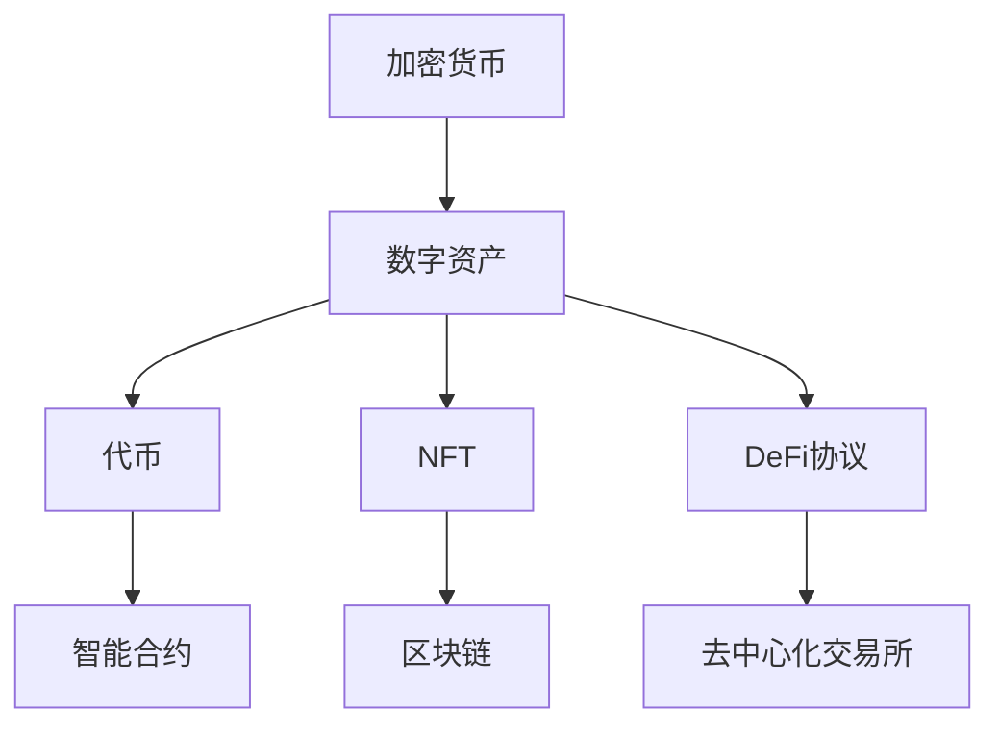
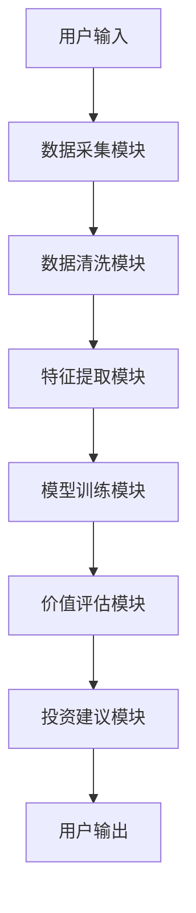
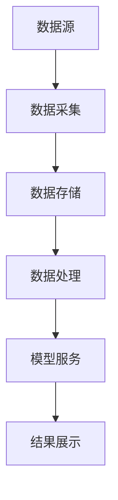
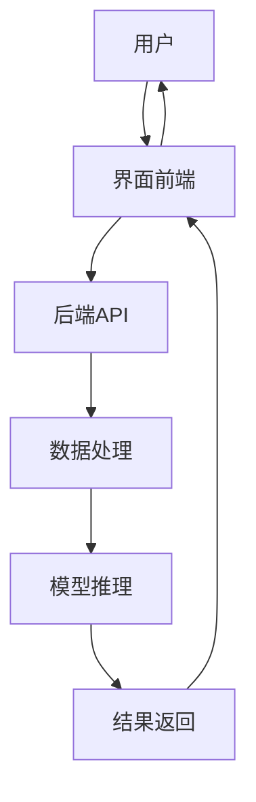

                 


# 价值投资者如何看待加密货币和数字资产

> 关键词：价值投资，加密货币，数字资产，区块链，DeFi，NFT，投资策略

> 摘要：本文从价值投资的视角，系统分析加密货币和数字资产的特性、投资策略和风险控制，探讨如何在数字化时代运用价值投资理念捕捉数字资产的投资机会。

---

## 第一部分：价值投资与加密货币的背景介绍

### 第1章：加密货币与数字资产的起源与现状

#### 1.1 加密货币的起源与演变

##### 1.1.1 从比特币到以太坊：加密货币的演进历程
- 比特币：2009年，中本聪提出的去中心化电子货币，解决了传统货币的双重支付问题。
- 智能合约：以太坊（2015年）引入智能合约，使数字资产具备更多可能性。
- 第三代区块链：波卡、Solana等公链的崛起，推动了数字资产的多样化发展。

##### 1.1.2 加密货币的核心技术：区块链的原理与特点
- 区块链的去中心化特性：分布式账本、共识机制（PoW、PoS、DPoS）。
- 区块链的安全性：密码学、 Merkel树、哈希函数。
- 区块链的可扩展性：交易速度、 GAS费用、 Layer2解决方案。

##### 1.1.3 数字资产的多样性：代币、NFT与DeFi的崛起
- 代币：ERC-20、BEP-2等标准，用于支付、治理、激励。
- NFT：非同质化代币，用于数字艺术品、虚拟资产的所有权证明。
- DeFi：去中心化金融，通过智能合约提供借贷、交易所、资产管理等服务。

#### 1.2 价值投资的核心理念

##### 1.2.1 价值投资的定义与原则
- 价值投资：买入低于内在价值的资产，长期持有，等待市场重新评估。
- 格雷厄姆的“烟蒂理论”：寻找被市场忽视的优质资产。
- 巴菲特的“护城河”：投资具备竞争优势的企业。

##### 1.2.2 价值投资在传统金融中的应用
- 市盈率（P/E）、市净率（P/B）：评估资产是否被低估。
- 内在价值计算：DCF模型（ discounted cash flow）。
- 股票分析：基本面分析、技术分析的结合。

##### 1.2.3 价值投资与加密货币的结合：机遇与挑战
- 加密货币的去中心化特性与价值投资的长期视角的契合。
- 数字资产市场的高波动性与价值投资的稳定性要求的冲突。

---

## 第二部分：加密货币与数字资产的核心概念与联系

### 第2章：加密货币与数字资产的核心概念与联系

#### 2.1 加密货币与数字资产的定义与分类

##### 2.1.1 加密货币的定义与分类
- 加密货币：基于密码学的数字货币，具有去中心化、匿名性等特点。
- 主流币（Bitcoin、Ethereum）与小币（Dogecoin、Shiba Inu）。
- 加密货币的功能：货币、价值存储、计价单位。

##### 2.1.2 数字资产的定义与分类
- 数字资产：数字化的资产，包括代币、NFT、稳定币等。
- 代币：可分割的数字资产，用于支付、激励。
- NFT：不可分割的数字资产，用于表示独特性。
- 稳定币：与法币挂钩的数字资产，用于降低波动性风险。

##### 2.1.3 加密货币与数字资产的异同对比

| 属性 | 加密货币 | 数字资产 |
|------|----------|----------|
| 去中心化 | 高 | 高 |
| 可分割性 | 可能性（如比特币不可分割） | 可分割（如代币） |
| 用途 | 支付、价值存储 | 支付、投资、收藏 |

#### 2.2 加密货币与数字资产的核心属性

##### 2.2.1 去中心化：区块链技术的核心特征
- 去中心化的优势：抗审查、防止数据篡改。
- 去中心化的挑战：治理难度、效率问题。

##### 2.2.2 可编程性：智能合约的功能与优势
- 智能合约：自动执行的协议，实现自动化的金融工具。
- 可编程性带来的创新：DeFi、NFT市场的繁荣。

##### 2.2.3 资产流动性：数字资产的交易与市场深度
- 数字资产的流动性：高流动性的代币 vs 低流动性的NFT。
- 市场深度：影响交易价格和滑点。

#### 2.3 加密货币与数字资产的实体关系图



---

## 第三部分：价值投资在加密货币中的算法原理

### 第3章：价值评估的数学模型与算法

#### 3.1 价值评估的数学模型

##### 3.1.1 市场价值公式
$$ V = P \times Q $$
- $V$：市场价值
- $P$：价格
- $Q$：数量

##### 3.1.2 内在价值公式
$$ V = \sum_{t=1}^{\infty} \frac{CF_t}{(1 + r)^t} $$
- $CF_t$：第$t$期的现金流
- $r$：折现率

##### 3.1.3 市盈率与市净率的比较
- 市盈率：$$ P/E = \frac{P}{E} $$
- 市净率：$$ P/B = \frac{P}{B} $$

#### 3.2 投资组合优化的算法

##### 3.2.1 马科维茨投资组合理论
$$ \text{目标：} \min \sigma^2 \text{，在 } E[r] \text{ 固定} $$
$$ \text{约束：} \sum w_i = 1 $$

##### 3.2.2 现实中的简化策略
- 等权重分配：$$ w_i = \frac{1}{n} $$
- 风险平价：$$ w_i = \frac{\sigma_i}{\sum \sigma_j} $$

#### 3.3 数字资产的价值评估框架

##### 3.3.1 项目基本面分析
- 团队背景：开发团队的经验、信誉。
- 技术路线：区块链技术的创新性、可行性。
- 代币经济模型：供应量、分配机制、通胀率。

##### 3.3.2 市场需求分析
- 用户基数：活跃地址数、日交易量。
- 价格弹性：$$ \text{弹性} = \frac{\% \Delta Q}{\% \Delta P} $$
- 市场情绪：恐慌指数、社交媒体热度。

#### 3.4 算法实现

##### 3.4.1 数据采集
```python
import pandas as pd
import requests
import json

def get_price_data(coin):
    url = f"https://api.coinmarketcap.com/v2/ticker/{coin}/"
    response = requests.get(url)
    data = json.loads(response.text)
    return data
```

##### 3.4.2 模型训练
```python
from sklearn.linear_model import LinearRegression

model = LinearRegression()
X = df[['volume', 'market_cap']]
y = df['price']
model.fit(X, y)
```

##### 3.4.3 结果解读
```python
print(f"系数：{model.coef_}")
print(f"截距：{model.intercept_}")
```

---

## 第四部分：加密货币投资的系统分析与架构设计

### 第4章：系统分析与架构设计

#### 4.1 系统功能设计

##### 4.1.1 领域模型
- 输入：市场数据、项目信息、用户需求。
- 处理：数据清洗、特征提取、模型训练。
- 输出：价值评估、投资建议。

##### 4.1.2 系统架构



#### 4.2 系统架构设计

##### 4.2.1 系统架构图



##### 4.2.2 系统交互图



#### 4.3 系统实现

##### 4.3.1 环境安装
- Python 3.8+
- Pandas、NumPy、Scikit-learn
- requests库、CoinMarketCap API

##### 4.3.2 核心代码实现

```python
import pandas as pd
from sklearn.linear_model import LinearRegression
import requests

def fetch_data(coin):
    url = f"https://api.example.com/coins/{coin}"
    response = requests.get(url)
    return pd.DataFrame(response.json())

def preprocess(data):
    data['log_price'] = data['price'].apply(lambda x: np.log(x))
    return data

def train_model(data, target):
    X = data.drop(target, axis=1)
    y = data[target]
    model = LinearRegression()
    model.fit(X, y)
    return model

def main():
    coin = 'ethereum'
    data = fetch_data(coin)
    data_preprocessed = preprocess(data)
    model = train_model(data_preprocessed, 'price')
    print(f"模型训练完成，系数：{model.coef_}")

if __name__ == "__main__":
    main()
```

#### 4.4 项目实战

##### 4.4.1 案例分析：以太坊的价值评估
- 数据来源：CoinMarketCap API
- 模型训练：使用以太坊的历史价格数据进行回归分析。
- 投资建议：基于模型预测，制定长期持有策略。

##### 4.4.2 代码实现
```python
import pandas as pd
import numpy as np
from sklearn.linear_model import LinearRegression
import requests

def get_ethereum_data():
    url = "https://api.example.com/ethereum"
    response = requests.get(url)
    return pd.DataFrame(response.json())

def prepare_data(data):
    data['log_price'] = np.log(data['price'])
    return data

def train_model(data):
    X = data.drop('price', axis=1)
    y = data['price']
    model = LinearRegression()
    model.fit(X, y)
    return model

def main():
    eth_data = get_ethereum_data()
    eth_prepared = prepare_data(eth_data)
    model = train_model(eth_prepared)
    print(f"模型训练完成，R²: {model.score(X, y)}")

if __name__ == "__main__":
    main()
```

#### 4.5 项目小结

##### 4.5.1 项目总结
- 成功实现了以太坊的价值评估模型。
- 验证了价值投资理念在数字资产中的可行性。

##### 4.5.2 投资建议
- 长期持有优质数字资产：选择具备技术优势、团队靠谱、市场需求大的项目。
- 分散投资：避免过度集中，降低风险。
- 定期复盘：根据市场变化和项目进展，动态调整投资组合。

---

## 第五部分：加密货币投资的最佳实践

### 第5章：价值投资者的加密货币投资策略

#### 5.1 最佳实践

##### 5.1.1 投资策略
- 质优股策略：选择具备竞争优势的项目，如以太坊、Solana等。
- 价值重估策略：寻找被市场低估的数字资产。
- 分阶段投资策略：根据市场周期，逐步建仓或减仓。

##### 5.1.2 风险管理
- 设置止损：当资产价格下跌至一定比例时，立即卖出。
- 分散投资：避免将所有资金投入单一资产。
- 定期复盘：定期评估投资组合的表现，及时调整。

#### 5.2 注意事项

##### 5.2.1 避免常见错误
- 过度追求高收益：忽视风险，盲目跟风。
- 短期波动干扰：受市场情绪影响，频繁交易。
- 忽略基本面：仅关注价格走势，不分析项目质量。

##### 5.2.2 技术风险
- 区块链技术的不确定性：技术漏洞、升级风险。
- 监管政策的变化：各国对加密货币的监管趋严。
- 市场操纵风险：部分项目可能存在操纵行为。

#### 5.3 拓展阅读

##### 5.3.1 推荐书籍
- 《The加密货币百万aires》
- 《加密货币投资策略》
- 《区块链与价值投资》

##### 5.3.2 推荐资源
- 研究报告：CoinMarketCap、CoinGecko、Glassnode。
- 社区讨论：Reddit、Bitcointalk、Twitter。

---

## 第六部分：结论与展望

### 第6章：价值投资与加密货币的未来展望

#### 6.1 研究结论
- 价值投资理念适用于数字资产的投资。
- 技术创新推动数字资产的多样化发展。
- 市场监管逐步完善，投资环境趋于规范。

#### 6.2 未来展望
- 更多应用场景的出现：DeFi、NFT的进一步发展。
- 技术进步：Layer3解决方案、跨链技术的发展。
- 投资工具的丰富：指数基金、ETF的推出。

---

## 作者：AI天才研究院/AI Genius Institute & 禅与计算机程序设计艺术/Zen And The Art of Computer Programming

---

**总结**：本文从价值投资的视角，系统分析了加密货币和数字资产的特性、投资策略和风险控制，探讨了如何在数字化时代运用价值投资理念捕捉数字资产的投资机会。通过详细的理论分析、数学模型和实际案例，为读者提供了全面的指导和深入的见解。

