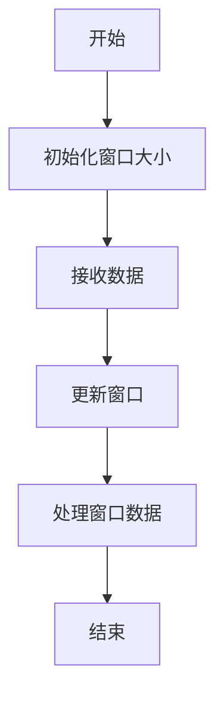
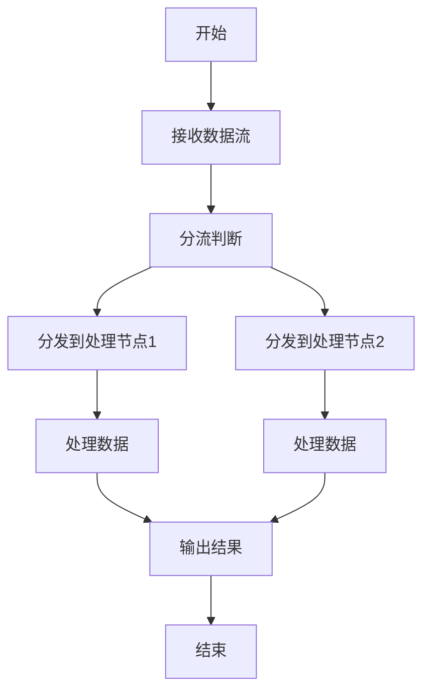
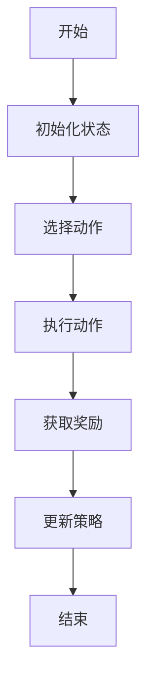
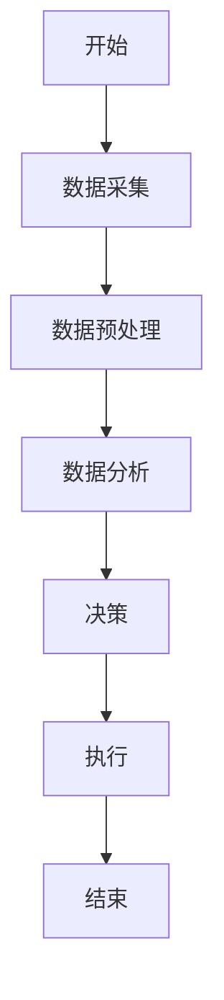
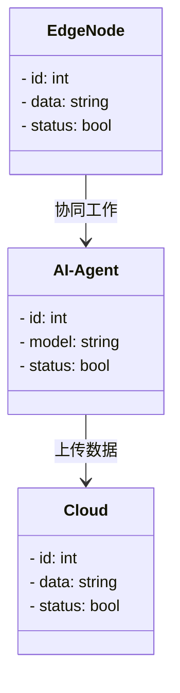
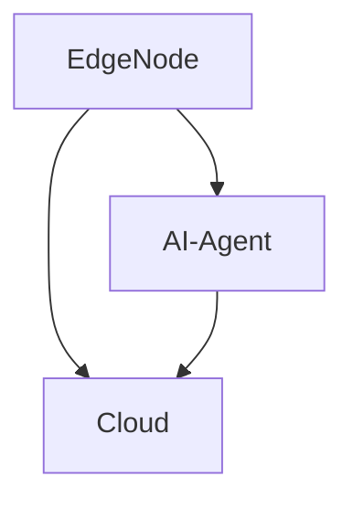
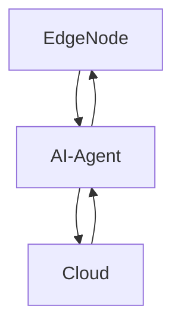

                 


# 企业AI Agent的边缘计算应用：实时处理与响应

> **关键词**：企业AI Agent，边缘计算，实时处理，响应机制，分布式系统，智能边缘节点，协同计算

> **摘要**：本文深入探讨了企业AI Agent在边缘计算环境中的应用，重点分析了实时数据处理与快速响应的实现机制。文章从核心概念、算法原理、系统架构、项目实战等多个维度展开，结合具体案例和代码实现，全面解析企业AI Agent在边缘计算中的技术创新与实践应用。

---

# 第1章: 企业AI Agent与边缘计算概述

## 1.1 企业AI Agent的定义与特点

### 1.1.1 什么是企业AI Agent

企业AI Agent是一种具备智能感知、自主决策和执行能力的计算机程序，能够根据实时数据和环境变化做出响应。它通常由感知层、决策层和执行层组成，能够处理复杂的企业级任务。

### 1.1.2 AI Agent的核心特点

- **自主性**：能够在没有人工干预的情况下独立运行。
- **反应性**：能够实时感知环境变化并做出响应。
- **目标导向**：具备明确的目标导向性，能够优化决策以实现目标。
- **分布式协作**：能够与其他AI Agent或系统协同工作，完成复杂任务。

### 1.1.3 企业AI Agent的应用场景

- **智能制造**：实时监控生产线状态，优化生产流程。
- **智能客服**：提供实时响应的客户支持服务。
- **金融风控**：实时分析交易数据，防范金融风险。

## 1.2 边缘计算的定义与特点

### 1.2.1 边缘计算的基本概念

边缘计算是一种分布式计算范式，数据在靠近数据源的边缘设备上进行处理，而不是将所有数据上传到云端。这种模式能够减少延迟、提高数据处理效率。

### 1.2.2 边缘计算的核心优势

- **低延迟**：数据在边缘节点实时处理，减少传输延迟。
- **带宽优化**：仅传输关键数据，降低网络带宽消耗。
- **隐私保护**：数据在本地处理，减少敏感数据外泄风险。

### 1.2.3 边缘计算与云计算的区别

- **计算位置**：边缘计算在边缘节点处理数据，云计算在云端处理数据。
- **延迟**：边缘计算延迟更低，云计算延迟较高。
- **数据量**：边缘计算处理局部数据，云计算处理全局数据。

## 1.3 企业AI Agent与边缘计算的结合

### 1.3.1 边缘计算在AI Agent中的作用

- 提供低延迟的实时数据处理能力。
- 支持AI Agent的分布式协作。
- 优化资源利用效率。

### 1.3.2 AI Agent在边缘计算中的应用

- **实时监控与反馈**：在边缘节点实时处理数据，快速做出反馈。
- **边缘智能决策**：基于边缘数据进行智能决策，减少对云端的依赖。
- **分布式任务调度**：通过AI Agent协调多个边缘节点的任务执行。

### 1.3.3 企业AI Agent边缘计算的典型场景

- **智能制造中的设备协同**：通过AI Agent在边缘节点实时处理设备数据，优化生产流程。
- **智能交通中的实时调度**：利用边缘计算的低延迟优势，实时调整交通信号灯。
- **智能安防中的快速响应**：通过边缘计算快速识别异常情况并做出响应。

## 1.4 本章小结

本章介绍了企业AI Agent和边缘计算的基本概念、特点及其结合方式。企业AI Agent具备自主性、反应性和目标导向性等特点，能够在边缘计算环境中实现低延迟的实时数据处理和快速响应。边缘计算为AI Agent提供了分布式协作和资源优化的平台，二者结合能够实现高效的实时处理和智能决策。

---

# 第2章: 企业AI Agent边缘计算的核心原理

## 2.1 AI Agent的感知与决策机制

### 2.1.1 感知层的核心原理

感知层负责从边缘设备中获取实时数据，并进行初步处理。常见的感知方式包括传感器数据采集、网络数据接收等。

### 2.1.2 决策层的算法模型

决策层基于感知数据，利用机器学习或规则引擎做出决策。常用的算法包括随机森林、支持向量机和强化学习模型。

### 2.1.3 执行层的实现方式

执行层负责根据决策结果执行具体操作，例如发送控制指令或触发报警。

## 2.2 边缘计算的实时处理机制

### 2.2.1 边缘节点的数据处理流程

1. 数据采集：通过传感器或其他边缘设备获取实时数据。
2. 数据预处理：对数据进行清洗、转换和归约。
3. 数据分析：利用算法对数据进行分析，生成决策结果。
4. 数据反馈：将结果反馈给边缘设备或其他系统。

### 2.2.2 边缘计算的实时性保障

- **本地缓存**：将常用数据缓存到边缘节点，减少对云端的依赖。
- **分布式计算**：将任务分发到多个边缘节点并行处理。
- **优先级调度**：根据任务优先级动态调整计算资源。

### 2.2.3 边缘计算的资源分配策略

- **动态资源分配**：根据当前负载动态分配计算资源。
- **静态资源分配**：根据预期负载静态分配计算资源。
- **混合分配**：结合动态和静态策略进行资源分配。

## 2.3 AI Agent与边缘计算的协同工作原理

### 2.3.1 数据流的协同处理

1. 数据从边缘设备上传到AI Agent。
2. AI Agent对数据进行分析和处理。
3. 处理结果反馈给边缘设备或其他系统。

### 2.3.2 计算资源的协同分配

- **本地计算**：在边缘节点本地完成计算任务。
- **分布式计算**：将任务分发到多个边缘节点并行计算。
- **云端协同**：在本地计算的基础上，必要时调用云端资源进行辅助计算。

### 2.3.3 任务调度的协同机制

- **本地调度**：在边缘节点本地完成任务调度。
- **集中调度**：由云端统一调度多个边缘节点的任务执行。
- **混合调度**：结合本地和集中调度策略进行任务调度。

## 2.4 本章小结

本章详细介绍了企业AI Agent在边缘计算环境中的核心原理。感知层负责数据采集与初步处理，决策层基于数据做出智能决策，执行层负责将决策结果转化为具体操作。边缘计算通过实时数据处理和资源优化，保障了AI Agent的高效运行。AI Agent与边缘计算的协同工作，进一步提升了系统的实时处理能力和智能化水平。

---

# 第3章: 边缘计算中的实时处理算法

## 3.1 实时数据处理算法概述

### 3.1.1 滑动窗口算法

滑动窗口算法是一种常用的实时数据处理算法，适用于需要处理连续数据流的场景。

#### 滑动窗口算法流程图（使用Mermaid）



### 3.1.2 分流算法

分流算法用于将数据分发到不同的处理节点，提高处理效率。

#### 分流算法流程图（使用Mermaid）



### 3.1.3 实时数据压缩算法

实时数据压缩算法用于减少数据传输量，提高处理效率。

#### 数据压缩算法代码示例

```python
import zlib

# 压缩数据
def compress(data):
    return zlib.compress(data)

# 解压数据
def decompress(compressed_data):
    return zlib.decompress(compressed_data)
```

---

## 3.2 AI Agent中的实时决策算法

### 3.2.1 基于规则的实时决策

基于规则的实时决策是一种简单有效的决策方法，适用于规则明确的场景。

#### 基于规则的实时决策代码示例

```python
def make_decision(rules, data):
    for rule in rules:
        if rule['condition'](data):
            return rule['action'](data)
    return default_action(data)
```

### 3.2.2 基于模型的实时预测

基于模型的实时预测利用机器学习模型进行预测，适用于复杂场景。

#### 基于模型的实时预测代码示例

```python
import joblib

# 加载预训练模型
model = joblib.load('model.pkl')

# 预测函数
def predict(data):
    return model.predict(data)
```

### 3.2.3 基于强化学习的实时优化

基于强化学习的实时优化能够动态调整决策策略，提升系统性能。

#### 强化学习算法流程图（使用Mermaid）



---

## 3.3 算法实现与优化

### 3.3.1 算法实现的代码示例

```python
# 滑动窗口算法实现
def sliding_window(data_stream, window_size):
    window = []
    results = []
    for data in data_stream:
        window.append(data)
        if len(window) > window_size:
            window.pop(0)
        results.append(process(window))
    return results
```

### 3.3.2 算法优化策略

- **并行计算**：利用多核处理器提高计算效率。
- **增量计算**：仅对变化的数据进行处理，减少计算量。
- **模型优化**：使用更高效的算法或优化模型结构。

### 3.3.3 算法性能评估

- **处理延迟**：从数据输入到结果输出的时间。
- **资源消耗**：CPU、内存等资源的使用情况。
- **处理精度**：算法的预测准确率。

---

## 3.4 本章小结

本章介绍了边缘计算中的实时处理算法，包括滑动窗口算法、分流算法和数据压缩算法等。同时，详细讲解了AI Agent中的实时决策算法，如基于规则的决策、基于模型的预测和基于强化学习的优化。通过代码示例和流程图，展示了算法的实现和优化策略。

---

# 第4章: 企业AI Agent边缘计算的系统架构

## 4.1 系统功能

### 4.1.1 系统功能描述

企业AI Agent边缘计算系统需要实现数据采集、实时处理、智能决策和快速响应等功能。

### 4.1.2 系统功能模块划分

- **数据采集模块**：负责从边缘设备中采集实时数据。
- **数据处理模块**：对数据进行预处理和分析。
- **决策模块**：基于数据做出决策。
- **执行模块**：根据决策结果执行具体操作。

### 4.1.3 系统功能流程图（使用Mermaid）



## 4.2 系统架构设计

### 4.2.1 领域模型类图（使用Mermaid）



### 4.2.2 系统架构图（使用Mermaid）



---

## 4.3 系统接口设计

### 4.3.1 边缘节点与AI Agent的接口

- **数据传输接口**：将边缘节点的数据传输给AI Agent。
- **命令控制接口**：接收AI Agent的控制命令。

### 4.3.2 AI Agent与云端的接口

- **数据上传接口**：将处理后的数据上传到云端。
- **模型更新接口**：接收云端的模型更新指令。

## 4.4 系统交互流程图（使用Mermaid）



---

## 4.5 本章小结

本章详细介绍了企业AI Agent边缘计算系统的架构设计，包括系统功能模块、领域模型类图和系统交互流程图。通过合理的架构设计，能够实现数据的实时处理和快速响应，提升系统的整体性能。

---

# 第5章: 项目实战

## 5.1 环境安装

### 5.1.1 安装Python环境

```bash
python --version
pip install --upgrade pip
```

### 5.1.2 安装依赖库

```bash
pip install numpy
pip install pandas
pip install scikit-learn
pip install joblib
```

---

## 5.2 核心代码实现

### 5.2.1 数据采集模块

```python
import serial

# 串口数据采集
def read_serial(port, baud_rate):
    ser = serial.Serial(port, baud_rate)
    data = ser.readline()
    ser.close()
    return data
```

### 5.2.2 数据处理模块

```python
import numpy as np

# 数据预处理
def preprocess(data):
    return np.array(data)
```

### 5.2.3 决策模块

```python
from sklearn.ensemble import RandomForestClassifier

# 随机森林模型训练
def train_model(X_train, y_train):
    model = RandomForestClassifier()
    model.fit(X_train, y_train)
    return model
```

### 5.2.4 执行模块

```python
# 执行决策
def execute_decision(action):
    print(f"执行动作：{action}")
```

---

## 5.3 案例分析与详细解读

### 5.3.1 案例背景

假设我们正在开发一个智能交通系统，需要实时监控交通流量并做出调整。

### 5.3.2 数据采集与处理

```python
data = read_serial('COM3', 9600)
processed_data = preprocess(data)
```

### 5.3.3 模型训练与决策

```python
X_train = processed_data[['speed', 'occupancy']]
y_train = processed_data['status']
model = train_model(X_train, y_train)
prediction = model.predict(X_train)
```

### 5.3.4 执行决策

```python
execute_decision(prediction[0])
```

---

## 5.4 本章小结

本章通过一个实际项目展示了企业AI Agent边缘计算系统的实现过程，包括环境安装、核心代码实现和案例分析。通过具体的代码示例，读者可以更好地理解和实现类似系统。

---

# 第6章: 最佳实践与小结

## 6.1 最佳实践

### 6.1.1 系统设计

- **模块化设计**：将系统划分为多个功能模块，便于维护和扩展。
- **容错设计**：设计容错机制，确保系统在异常情况下的稳定运行。
- **性能优化**：通过并行计算、缓存优化等手段提升系统性能。

### 6.1.2 代码实现

- **代码规范**：遵循Python代码规范，确保代码可读性和可维护性。
- **单元测试**：编写单元测试用例，确保代码质量。
- **日志记录**：添加日志记录功能，便于调试和监控。

### 6.1.3 系统部署

- **环境配置**：确保部署环境与开发环境一致。
- **依赖管理**：使用虚拟环境管理依赖，避免版本冲突。
- **监控与报警**：部署监控工具，及时发现和处理异常情况。

## 6.2 小结

企业AI Agent在边缘计算中的应用为企业智能化转型提供了强大的技术支持。通过实时数据处理和快速响应，企业能够更高效地应对复杂挑战。本文从核心概念、算法原理、系统架构到项目实战，全面解析了企业AI Agent边缘计算的实现过程。

## 6.3 注意事项

- **数据隐私**：在边缘计算中，需要特别注意数据隐私保护，避免敏感数据泄露。
- **资源分配**：合理分配计算资源，确保系统的高效运行。
- **系统容错**：设计完善的容错机制，确保系统在异常情况下的稳定运行。

## 6.4 拓展阅读

- **《边缘计算入门与实践》**：深入理解边缘计算的基本概念和实践应用。
- **《AI Agent实战》**：掌握AI Agent的设计与实现技巧。
- **《分布式系统与边缘计算》**：学习分布式系统与边缘计算的结合应用。

---

# 作者：AI天才研究院 & 禅与计算机程序设计艺术

---

以上是《企业AI Agent的边缘计算应用：实时处理与响应》的技术博客文章的详细目录大纲和内容。文章涵盖了企业AI Agent和边缘计算的核心概念、算法原理、系统架构、项目实战以及最佳实践，内容详尽，逻辑清晰，适合技术爱好者和企业IT人员阅读和参考。

