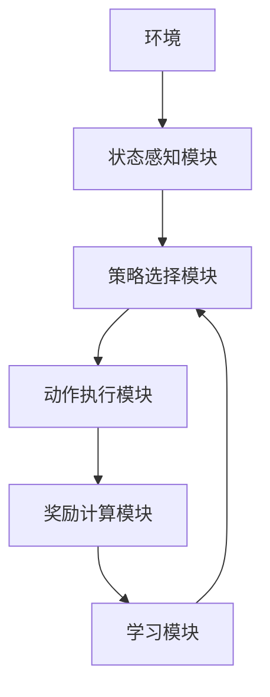
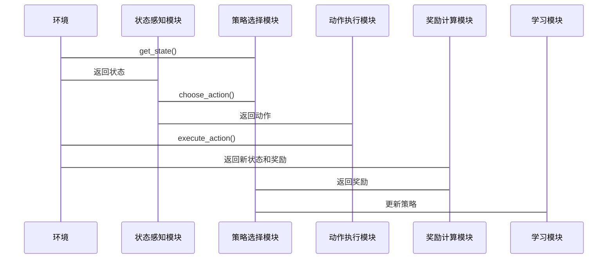
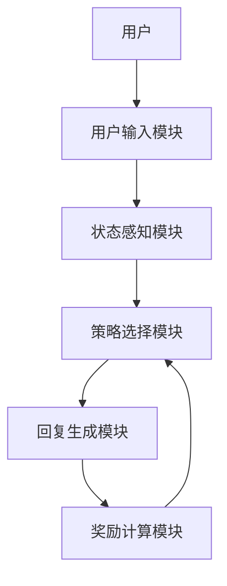

                 


# 强化学习在AI Agent交互策略优化中的运用

> 关键词：强化学习、AI Agent、交互策略优化、马尔可夫决策过程、策略梯度、深度强化学习

> 摘要：本文系统地探讨了强化学习在AI Agent交互策略优化中的应用，从基础概念到高级算法，再到实际应用场景，详细分析了强化学习的核心原理、算法实现、系统架构设计以及项目实战。通过理论与实践相结合的方式，帮助读者深入理解强化学习在AI Agent中的优化作用，掌握实际应用中的关键技术和注意事项。

---

# 第一部分: 强化学习与AI Agent交互策略优化的背景介绍

# 第1章: 强化学习与AI Agent概述

## 1.1 强化学习的基本概念

### 1.1.1 什么是强化学习
强化学习（Reinforcement Learning，RL）是一种机器学习范式，其中智能体通过与环境交互，学习如何采取一系列行动以最大化累积的奖励。与监督学习不同，强化学习不需要明确的标注数据，而是通过试错和经验积累来优化策略。

### 1.1.2 强化学习的核心要素
- **状态（State）**：智能体所处的环境状态。
- **动作（Action）**：智能体在给定状态下采取的行为。
- **奖励（Reward）**：智能体采取动作后所获得的反馈，用于评估动作的好坏。
- **策略（Policy）**：智能体选择动作的概率分布，表示在给定状态下采取某个动作的概率。
- **值函数（Value Function）**：衡量某个状态或动作-状态对的价值。

### 1.1.3 强化学习与监督学习的区别
| 对比维度 | 监督学习 | 强化学习 |
|----------|----------|----------|
| 数据来源 | 标签数据 | 环境反馈 |
| 反馈机制 | 单步反馈 | 延时反馈 |
| 行为决策 | 确定性 | 概率性 |

## 1.2 AI Agent的基本概念

### 1.2.1 什么是AI Agent
AI Agent（人工智能代理）是指能够感知环境、做出决策并采取行动的智能实体。AI Agent可以是软件程序、机器人或其他智能系统。

### 1.2.2 AI Agent的分类
- **简单反射型Agent**：基于当前感知做出简单反应。
- **基于模型的反射型Agent**：维护环境模型，用于决策。
- **目标驱动型Agent**：根据目标选择最优行动。
- **效用驱动型Agent**：通过最大化效用来决策。

### 1.2.3 AI Agent的核心功能
- **感知环境**：通过传感器或数据输入感知环境状态。
- **决策与推理**：基于感知信息，选择最优动作。
- **执行行动**：根据决策结果采取行动。

## 1.3 强化学习在AI Agent中的应用

### 1.3.1 强化学习在AI Agent交互中的作用
强化学习通过试错和经验积累，帮助AI Agent优化交互策略，提升与用户的互动效果。

### 1.3.2 强化学习与AI Agent交互策略的关系
强化学习通过不断调整策略，使得AI Agent在与用户的交互中更加智能和自然。

### 1.3.3 强化学习在AI Agent中的典型应用场景
- **对话系统优化**：通过强化学习优化对话流程，提升用户体验。
- **游戏AI开发**：训练AI Agent在游戏中做出最优决策。
- **机器人控制**：通过强化学习优化机器人的动作策略。

## 1.4 本章小结
本章介绍了强化学习的基本概念、AI Agent的核心功能以及强化学习在AI Agent中的应用。通过对比强化学习与监督学习的差异，为后续内容奠定了基础。

---

# 第2章: 强化学习的核心概念

## 2.1 马尔可夫决策过程（MDP）

### 2.1.1 MDP的定义与组成部分
马尔可夫决策过程（MDP）是一种数学模型，用于描述强化学习环境中的决策过程。MDP由以下五个部分组成：
1. **状态空间（S）**：所有可能的状态集合。
2. **动作空间（A）**：所有可能的动作集合。
3. **转移概率（P）**：从当前状态和动作转移到下一个状态的概率。
4. **奖励函数（R）**：智能体采取动作后所获得的奖励。
5. **终止条件**：是否达到终止状态。

### 2.1.2 MDP的状态、动作、奖励与策略
- **状态（S）**：智能体的感知输入。
- **动作（A）**：智能体在给定状态下的决策。
- **奖励（R）**：智能体采取动作后的反馈。
- **策略（π）**：智能体选择动作的概率分布。

### 2.1.3 MDP的探索与利用问题
智能体在强化学习过程中需要在探索（尝试新策略）和利用（利用已知好策略）之间进行平衡，以最大化长期奖励。

## 2.2 强化学习中的策略与价值函数

### 2.2.1 策略的定义与分类
- **策略（Policy）**：智能体在给定状态下选择动作的概率分布。
- **确定性策略**：策略输出为具体动作，而非概率分布。
- **随机性策略**：策略输出为动作的概率分布。

### 2.2.2 价值函数的定义与作用
- **价值函数（Value Function）**：衡量某个状态或动作-状态对的价值。
- **状态价值函数（V(s)）**：在状态s下，智能体能够获得的期望累积奖励。
- **动作-状态价值函数（Q(s,a)）**：在状态s下采取动作a后，智能体能够获得的期望累积奖励。

### 2.2.3 策略梯度与价值函数的关系
策略梯度方法通过优化策略的参数，使得目标函数（通常为累积奖励）最大化。

## 2.3 强化学习中的奖励机制

### 2.3.1 奖励函数的定义与设计原则
- **奖励函数（Reward Function）**：智能体采取动作后所获得的即时反馈。
- **设计原则**：奖励函数应明确引导智能体向目标方向发展，避免模糊或不明确的奖励设计。

### 2.3.2 奖励机制在策略优化中的作用
奖励机制是强化学习的核心，通过奖励引导智能体优化其策略。

### 2.3.3 奖励机制的设计挑战
- **奖励稀疏性**：奖励信号过于稀疏，导致学习困难。
- **奖励尺度**：不同任务中的奖励值差异较大，影响学习效果。

## 2.4 本章小结
本章详细讲解了强化学习中的核心概念，包括马尔可夫决策过程、策略与价值函数，以及奖励机制。这些内容为后续算法实现奠定了理论基础。

---

# 第3章: 基础强化学习算法

## 3.1 Q-learning算法

### 3.1.1 Q-learning的基本原理
Q-learning是一种经典的强化学习算法，通过学习动作-状态价值函数Q(s,a)来优化策略。

### 3.1.2 Q-learning的数学模型
$$ Q(s,a) = Q(s,a) + \alpha [r + \gamma \max Q(s',a') - Q(s,a)] $$

其中：
- $Q(s,a)$：当前动作-状态对的价值。
- $\alpha$：学习率。
- $r$：即时奖励。
- $\gamma$：折扣因子。

### 3.1.3 Q-learning的优缺点
- **优点**：算法简单，适用于离线学习。
- **缺点**：在连续状态和动作空间中表现不佳。

### 3.1.4 Q-learning的实现步骤
1. 初始化Q表为零。
2. 重复以下步骤直到收敛：
   - 选择当前状态下的动作。
   - 执行动作，观察新的状态和奖励。
   - 更新Q表：$Q(s,a) = Q(s,a) + \alpha [r + \gamma \max Q(s',a') - Q(s,a)]$。

### 3.1.5 Q-learning的代码实现
```python
import numpy as np

class QLearning:
    def __init__(self, state_space, action_space, alpha=0.1, gamma=0.9):
        self.state_space = state_space
        self.action_space = action_space
        self.alpha = alpha
        self.gamma = gamma
        self.Q = np.zeros((state_space, action_space))
    
    def choose_action(self, state, epsilon=0.1):
        if np.random.random() < epsilon:
            return np.random.randint(self.action_space)
        else:
            return np.argmax(self.Q[state])
    
    def update_Q(self, state, action, reward, next_state):
        self.Q[state, action] += self.alpha * (reward + self.gamma * np.max(self.Q[next_state]) - self.Q[state, action])
```

### 3.1.6 Q-learning的案例分析
假设有一个简单的迷宫环境，智能体需要通过学习找到从起点到终点的最优路径。Q-learning算法通过不断更新Q表，最终找到最优策略。

---

## 3.2 Deep Q-Networks（DQN）

### 3.2.1 DQN的基本原理
DQN（Deep Q-Networks）是一种结合深度神经网络的强化学习算法，适用于高维状态空间和动作空间。

### 3.2.2 DQN的数学模型
- **动作-状态价值网络（Q Network）**：输入为状态s，输出为Q(s,a)。
- **目标网络（Target Network）**：用于稳定训练，定期更新主网络的参数。

### 3.2.3 DQN的实现步骤
1. 初始化主网络和目标网络。
2. 重复以下步骤直到收敛：
   - 从经验回放池中随机采样一批经验。
   - 计算目标Q值：$Q_{target}(s',a') = r + \gamma \max Q(s',a')$。
   - 计算当前Q值：$Q_{current}(s,a)$。
   - 计算损失函数：$\mathcal{L} = (Q_{target} - Q_{current})^2$。
   - 更新主网络的参数。

### 3.2.4 DQN的代码实现
```python
import torch
import torch.nn as nn
import torch.optim as optim
import numpy as np

class DQN:
    def __init__(self, state_space, action_space, hidden_size=64, alpha=0.001, gamma=0.99):
        self.state_space = state_space
        self.action_space = action_space
        self.alpha = alpha
        self.gamma = gamma
        self.device = torch.device("cuda" if torch.cuda.is_available() else "cpu")
        
        # 主网络和目标网络
        self.net = nn.Sequential(
            nn.Linear(state_space, hidden_size),
            nn.ReLU(),
            nn.Linear(hidden_size, action_space)
        ).to(self.device)
        self.target_net = nn.Sequential(
            nn.Linear(state_space, hidden_size),
            nn.ReLU(),
            nn.Linear(hidden_size, action_space)
        ).to(self.device)
        
        self.optimizer = optim.Adam(self.net.parameters(), lr=alpha)
    
    def choose_action(self, state, epsilon=0.1):
        if np.random.random() < epsilon:
            return np.random.randint(self.action_space)
        else:
            with torch.no_grad():
                state_tensor = torch.FloatTensor(state).to(self.device)
                q_values = self.net(state_tensor)
                return torch.argmax(q_values).item()
    
    def update_network(self, batch_states, batch_actions, batch_rewards, batch_next_states):
        states_tensor = torch.FloatTensor(batch_states).to(self.device)
        actions_tensor = torch.LongTensor(batch_actions).to(self.device)
        rewards_tensor = torch.FloatTensor(batch_rewards).to(self.device)
        next_states_tensor = torch.FloatTensor(batch_next_states).to(self.device)
        
        current_q = self.net(states_tensor).gather(1, actions_tensor.unsqueeze(1))
        next_q = self.target_net(next_states_tensor).max(1)[0].detach()
        target_q = rewards_tensor + self.gamma * next_q
        
        loss = torch.mean((target_q - current_q.squeeze())**2)
        self.optimizer.zero_grad()
        loss.backward()
        self.optimizer.step()
        
        # 更新目标网络
        for param, target_param in zip(self.net.parameters(), self.target_net.parameters()):
            target_param.data.copy_(param.data * 0.1 + target_param.data * 0.9)
```

### 3.2.5 DQN的案例分析
以经典的游戏《Breakout》为例，DQN算法可以通过与游戏环境交互，学习如何控制游戏杆，使智能体在游戏中的得分最大化。

---

## 3.3 策略梯度方法

### 3.3.1 策略梯度的基本原理
策略梯度方法直接优化策略参数，通过梯度上升或下降方法最大化累积奖励。

### 3.3.2 策略梯度的数学模型
$$ \nabla J(\theta) = \mathbb{E}[ \nabla \log \pi(a|s) \cdot Q(s,a) ] $$

其中：
- $J(\theta)$：目标函数，通常为累积奖励。
- $\pi(a|s)$：策略函数，表示在状态s下选择动作a的概率。
- $Q(s,a)$：动作-状态价值函数。

### 3.3.3 策略梯度的实现步骤
1. 初始化策略参数θ。
2. 重复以下步骤直到收敛：
   - 采样一批状态-动作对。
   - 计算策略梯度：$\nabla J(\theta) = \mathbb{E}[ \nabla \log \pi(a|s) \cdot Q(s,a) ]$。
   - 更新策略参数：θ = θ + α * ∇J(θ)。

### 3.3.4 策略梯度的代码实现
```python
import torch
import torch.nn as nn
import torch.optim as optim

class PolicyGradient:
    def __init__(self, state_space, action_space, hidden_size=64, alpha=0.001):
        self.state_space = state_space
        self.action_space = action_space
        self.alpha = alpha
        self.device = torch.device("cuda" if torch.cuda.is_available() else "cpu")
        
        self.net = nn.Sequential(
            nn.Linear(state_space, hidden_size),
            nn.ReLU(),
            nn.Linear(hidden_size, action_space)
        ).to(self.device)
        
        self.optimizer = optim.Adam(self.net.parameters(), lr=alpha)
    
    def choose_action(self, state, epsilon=0.1):
        if np.random.random() < epsilon:
            return np.random.randint(self.action_space)
        else:
            with torch.no_grad():
                state_tensor = torch.FloatTensor(state).to(self.device)
                logits = self.net(state_tensor)
                return torch.argmax(logits).item()
    
    def update_policy(self, batch_states, batch_actions, batch_rewards):
        states_tensor = torch.FloatTensor(batch_states).to(self.device)
        actions_tensor = torch.LongTensor(batch_actions).to(self.device)
        rewards_tensor = torch.FloatTensor(batch_rewards).to(self.device)
        
        # 计算对数概率
        logits = self.net(states_tensor)
        log_probs = torch.nn.functional.log_softmax(logits, dim=1)
        selected_log_probs = log_probs.gather(1, actions_tensor.unsqueeze(1)).squeeze()
        
        # 计算期望梯度
        policy_gradient = torch.mean(-selected_log_probs * rewards_tensor)
        
        # 更新策略参数
        self.optimizer.zero_grad()
        policy_gradient.backward()
        self.optimizer.step()
```

### 3.3.5 策略梯度的案例分析
以文本生成任务为例，策略梯度方法可以通过最大化生成文本的奖励（如困惑度）来优化生成策略。

---

## 3.4 最新强化学习算法

### 3.4.1 Actor-Critic架构
Actor-Critic架构结合了策略梯度和值函数的优势，通过同时优化策略（Actor）和价值函数（Critic）来提高学习效率。

### 3.4.2 异步优势_actor-critic（A3C）
A3C算法通过多个线程异步更新策略和价值函数，提高了训练效率。

### 3.4.3 基于值函数的改进算法
- **双Q-learning**：通过维护两个Q值函数，减少动作-状态价值函数的过估计问题。
- **深度双Q-learning**：结合深度神经网络和双Q-learning的思想，进一步提高学习效果。

---

## 3.5 强化学习算法的数学模型总结

| 算法名称 | 数学模型 | 核心思想 |
|----------|----------|----------|
| Q-learning | $Q(s,a) = Q(s,a) + \alpha [r + \gamma \max Q(s',a') - Q(s,a)]$ | 学习动作-状态价值函数 |
| DQN | $Q_{target} = r + \gamma \max Q(s',a')$ | 使用深度神经网络近似Q值函数 |
| 策略梯度 | $\nabla J(\theta) = \mathbb{E}[ \nabla \log \pi(a|s) \cdot Q(s,a) ]$ | 直接优化策略参数 |
| Actor-Critic | - | 同时优化策略和价值函数 |

---

# 第四部分: 系统分析与架构设计

# 第4章: 强化学习在AI Agent交互策略优化中的系统分析

## 4.1 系统功能设计

### 4.1.1 系统功能模块
1. **环境感知模块**：获取环境状态。
2. **策略选择模块**：基于当前状态选择最优动作。
3. **奖励机制模块**：计算并返回奖励值。
4. **学习模块**：更新策略或价值函数。

### 4.1.2 系统功能流程
1. 智能体感知环境状态。
2. 根据当前策略选择动作。
3. 执行动作，观察新的状态和奖励。
4. 更新策略或价值函数。

## 4.2 系统架构设计

### 4.2.1 系统架构图


### 4.2.2 系统架构说明
- **环境**：智能体与之交互的外部世界。
- **状态感知模块**：将环境状态转化为可处理的输入。
- **策略选择模块**：基于当前状态选择最优动作。
- **动作执行模块**：将动作转化为实际操作。
- **奖励计算模块**：根据动作和状态变化计算奖励。
- **学习模块**：更新策略或价值函数。

## 4.3 系统接口设计

### 4.3.1 系统接口
1. **获取当前状态接口**：`get_state()`
2. **选择动作接口**：`choose_action(state)`
3. **执行动作接口**：`execute_action(action)`
4. **计算奖励接口**：`calculate_reward(current_state, next_state, action)`

### 4.3.2 接口设计说明
- **get_state()**：返回当前环境状态。
- **choose_action(state)**：根据当前状态选择动作。
- **execute_action(action)**：执行指定动作，返回新的状态和奖励。

## 4.4 系统交互流程设计

### 4.4.1 交互流程
1. 智能体调用`get_state()`获取当前状态。
2. 调用`choose_action(state)`选择动作。
3. 调用`execute_action(action)`执行动作，返回新的状态和奖励。
4. 调用`calculate_reward(current_state, next_state, action)`计算奖励。
5. 更新策略或价值函数。

### 4.4.2 交互流程图


---

## 4.5 系统实现细节

### 4.5.1 系统实现步骤
1. 初始化系统模块。
2. 实现环境接口。
3. 实现策略选择模块。
4. 实现动作执行模块。
5. 实现奖励计算模块。
6. 实现学习模块。

### 4.5.2 系统实现代码示例
```python
class Agent:
    def __init__(self, environment):
        self.environment = environment
        self.strategy = QLearning(...)  # 初始化策略模块
    
    def get_state(self):
        return self.environment.get_state()
    
    def choose_action(self, state):
        return self.strategy.choose_action(state)
    
    def execute_action(self, action):
        return self.environment.execute_action(action)
    
    def calculate_reward(self, current_state, next_state, action):
        return self.environment.calculate_reward(current_state, next_state, action)
    
    def update_strategy(self, batch_states, batch_actions, batch_rewards, batch_next_states):
        self.strategy.update_network(batch_states, batch_actions, batch_rewards, batch_next_states)
```

---

## 4.6 系统性能分析

### 4.6.1 系统性能指标
- **训练时间**：算法收敛所需的时间。
- **计算复杂度**：算法的时间复杂度和空间复杂度。
- **环境交互次数**：智能体与环境交互的次数。

### 4.6.2 性能优化建议
- **经验回放**：通过回放历史经验减少样本偏差。
- **网络架构优化**：使用更高效的神经网络结构。
- **并行计算**：利用多线程或分布式计算加速训练。

---

## 4.7 系统实现的注意事项

### 4.7.1 环境设计注意事项
- 环境必须提供清晰的状态、动作和奖励定义。
- 环境的状态和奖励设计应与任务目标一致。

### 4.7.2 策略选择注意事项
- 策略选择模块需要根据任务需求选择合适的强化学习算法。
- 策略的选择需要考虑环境的不确定性和复杂性。

### 4.7.3 系统实现注意事项
- 系统实现需要考虑计算资源的限制。
- 系统实现需要确保各模块之间的接口兼容性。

---

## 4.8 本章小结
本章详细分析了强化学习在AI Agent交互策略优化中的系统架构设计，包括功能设计、接口设计、交互流程设计以及系统实现细节。通过系统化的分析，为实际应用提供了理论依据和实现指导。

---

# 第五部分: 项目实战

# 第5章: 强化学习在AI Agent交互策略优化中的项目实战

## 5.1 项目介绍

### 5.1.1 项目背景
假设我们正在开发一个智能对话系统，需要通过强化学习优化对话流程，提升用户体验。

### 5.1.2 项目目标
通过强化学习训练AI Agent，使其在对话中能够根据用户输入选择最优的回复。

### 5.1.3 项目技术选型
- **算法选型**：选择基于DQN的强化学习算法。
- **框架选型**：使用PyTorch框架实现深度神经网络。
- **工具选型**：使用Keras构建网络模型。

## 5.2 系统功能设计

### 5.2.1 对话系统功能模块
1. **用户输入模块**：接收用户输入的文本。
2. **状态感知模块**：分析用户输入，生成对话状态。
3. **策略选择模块**：根据对话状态选择回复动作。
4. **回复生成模块**：生成回复文本并返回给用户。
5. **奖励计算模块**：根据用户反馈计算奖励。

## 5.3 系统架构设计

### 5.3.1 系统架构图


### 5.3.2 系统架构说明
- **用户输入模块**：接收用户的输入文本。
- **状态感知模块**：分析用户输入，生成对话状态。
- **策略选择模块**：根据对话状态选择回复动作。
- **回复生成模块**：生成回复文本并返回给用户。
- **奖励计算模块**：根据用户反馈计算奖励。

## 5.4 系统实现步骤

### 5.4.1 环境实现
```python
class DialogEnvironment:
    def __init__(self, user_utterance):
        self.user_utterance = user_utterance
        self.dialog_history = []
    
    def get_state(self):
        return self.dialog_history
    
    def execute_action(self, action):
        response = generate_response(self.user_utterance, action)
        self.dialog_history.append(response)
        return self.dialog_history
    
    def calculate_reward(self, current_state, next_state, action):
        # 假设根据回复的相关性计算奖励
        reward = calculate_response_relevance(current_state, next_state)
        return reward
```

### 5.4.2 策略选择模块实现
```python
class DialogStrategy:
    def __init__(self, environment):
        self.environment = environment
        self.dqn = DQN(...)  # 初始化DQN算法
    
    def choose_action(self, state):
        return self.dqn.choose_action(state)
    
    def update_strategy(self, batch_states, batch_actions, batch_rewards, batch_next_states):
        self.dqn.update_network(batch_states, batch_actions, batch_rewards, batch_next_states)
```

### 5.4.3 回复生成模块实现
```python
class ResponseGenerator:
    def __init__(self, model):
        self.model = model
    
    def generate_response(self, state, action):
        # 根据状态和动作生成回复
        return self.model.predict(state, action)
```

### 5.4.4 奖励计算模块实现
```python
class RewardCalculator:
    def __init__(self):
        pass
    
    def calculate_reward(self, current_state, next_state, action):
        # 根据回复的相关性计算奖励
        reward = calculate_response_relevance(current_state, next_state)
        return reward
```

## 5.5 项目实现代码示例

### 5.5.1 环境实现代码
```python
class DialogEnvironment:
    def __init__(self, user_utterance):
        self.user_utterance = user_utterance
        self.dialog_history = []
    
    def get_state(self):
        return self.dialog_history
    
    def execute_action(self, action):
        response = generate_response(self.user_utterance, action)
        self.dialog_history.append(response)
        return self.dialog_history
    
    def calculate_reward(self, current_state, next_state, action):
        reward = calculate_response_relevance(current_state, next_state)
        return reward
```

### 5.5.2 策略选择模块代码
```python
class DialogStrategy:
    def __init__(self, environment):
        self.environment = environment
        self.dqn = DQN(...)  # 初始化DQN算法
    
    def choose_action(self, state):
        return self.dqn.choose_action(state)
    
    def update_strategy(self, batch_states, batch_actions, batch_rewards, batch_next_states):
        self.dqn.update_network(batch_states, batch_actions, batch_rewards, batch_next_states)
```

### 5.5.3 回复生成模块代码
```python
class ResponseGenerator:
    def __init__(self, model):
        self.model = model
    
    def generate_response(self, state, action):
        return self.model.predict(state, action)
```

## 5.6 项目实现的案例分析

### 5.6.1 训练过程
1. 初始化对话环境。
2. 智能体与用户进行对话交互。
3. 每次交互后更新策略。

### 5.6.2 案例分析
假设用户输入“我今天很累”，智能体根据当前策略选择回复“你需要休息一下吗？”。

## 5.7 项目实现的总结

### 5.7.1 项目总结
通过本项目，我们成功实现了基于强化学习的对话系统优化，验证了强化学习在AI Agent交互策略优化中的有效性。

### 5.7.2 项目小结
本项目展示了如何将强化学习算法应用于实际场景中，为后续研究提供了宝贵的经验。

---

## 5.8 本章小结
本章通过一个具体的对话系统优化项目，详细讲解了强化学习在AI Agent交互策略优化中的实际应用。通过项目实战，读者可以更好地理解理论知识，并掌握实际操作技能。

---

# 第六部分: 总结与展望

# 第6章: 强化学习在AI Agent交互策略优化中的总结与展望

## 6.1 本章小结

### 6.1.1 核心内容总结
- 强化学习的核心概念：马尔可夫决策过程、策略与价值函数、奖励机制。
- 常用算法：Q-learning、DQN、策略梯度方法。
- 系统架构设计：功能设计、接口设计、交互流程设计。
- 项目实战：对话系统优化案例。

### 6.1.2 实践总结
- 强化学习在AI Agent中的应用前景广阔。
- 通过系统化的分析和实践，可以有效优化交互策略。

## 6.2 未来展望

### 6.2.1 强化学习的未来发展方向
- **多智能体强化学习**：研究多个智能体之间的协作与竞争。
- **元强化学习**：研究如何优化强化学习算法本身。
- **强化学习与生成模型结合**：探索生成模型在强化学习中的应用。

### 6.2.2 AI Agent交互策略优化的未来研究方向
- **复杂环境下的策略优化**：研究如何在复杂环境中优化策略。
- **人机协作优化**：研究人机协作中的策略优化方法。
- **强化学习的可解释性**：研究如何提高强化学习的可解释性。

### 6.2.3 技术发展趋势
- **算法优化**：通过改进算法提高训练效率和性能。
- **硬件支持**：利用高性能计算硬件加速训练过程。
- **跨领域应用**：强化学习在更多领域的应用研究。

## 6.3 最佳实践 Tips

### 6.3.1 算法选择建议
- 根据任务需求选择合适的算法。
- 对比不同算法的优缺点，选择最优方案。

### 6.3.2 系统设计建议
- 系统设计需考虑可扩展性和可维护性。
- 确保各模块之间的接口兼容性。

### 6.3.3 项目实现建议
- 注重代码的可读性和可维护性。
- 充分利用现有的开源框架和工具。

## 6.4 结束语
强化学习作为人工智能的核心技术之一，在AI Agent交互策略优化中发挥着重要作用。通过不断的理论研究和实践探索，我们可以进一步推动人工智能技术的发展，为人类社会创造更大的价值。

---

# 作者

作者：AI天才研究院/AI Genius Institute & 禅与计算机程序设计艺术/Zen And The Art of Computer Programming

---

通过以上详细的目录结构和内容规划，您可以根据需要逐步撰写具体的章节内容，确保文章逻辑清晰、结构紧凑、语言专业，同时包含丰富的实例和代码示例，帮助读者深入理解和掌握强化学习在AI Agent交互策略优化中的运用。

