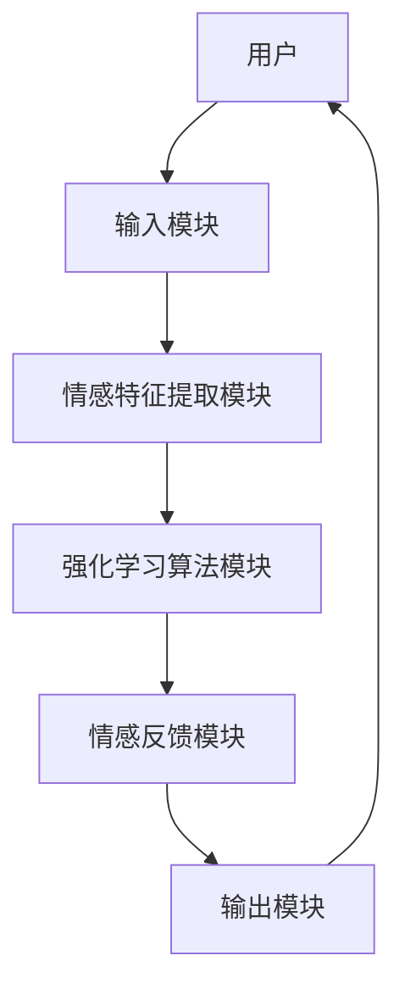
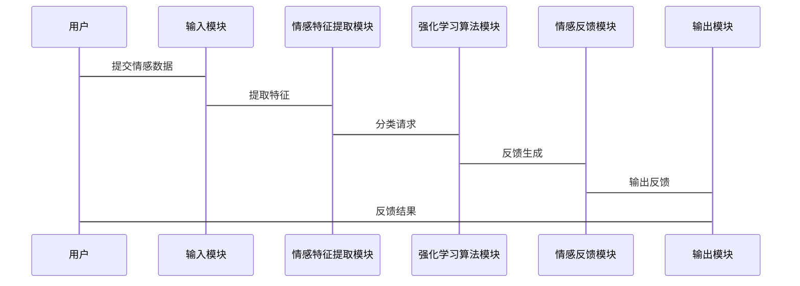

                 


# 强化学习在AI Agent情感计算中的创新应用

> 关键词：强化学习、情感计算、AI Agent、机器学习、深度学习

> 摘要：本文探讨了强化学习在AI Agent情感计算中的创新应用。通过分析情感计算的核心概念、强化学习的算法原理及其在情感计算中的结合，展示了如何利用强化学习优化AI Agent的情感理解与交互能力。文章从背景与基础、核心概念、算法实现、系统架构、项目实战到最佳实践，全面阐述了强化学习在情感计算中的应用，并通过具体案例展示了其实现与应用。

---

# 第一部分: 强化学习与情感计算的背景与基础

## 第1章: 强化学习与情感计算概述

### 1.1 情感计算的定义与应用背景

#### 1.1.1 情感计算的定义
情感计算（Affective Computing）是计算机科学的一个分支，旨在理解和计算人类情感。它通过分析面部表情、语音语调、文本内容等多模态数据，推断出人类的情感状态，如快乐、悲伤、愤怒等。

#### 1.1.2 情感计算的核心目标
情感计算的核心目标是通过技术手段，使计算机能够理解和模拟人类的情感，从而实现更自然的人机交互。其主要目标包括：
1. 情感识别：从输入数据中识别出特定的情感状态。
2. 情感建模：建立情感状态的数学模型。
3. 情感反馈：通过反馈机制优化情感计算的准确性。

#### 1.1.3 情感计算在AI Agent中的作用
AI Agent（智能代理）需要与人类进行交互，情感计算在其中扮演了关键角色：
1. 提供情感支持：AI Agent能够理解用户的情感状态，并给予相应的反馈或建议。
2. 改善用户体验：通过情感计算，AI Agent能够更好地理解用户需求，提供更个性化的服务。
3. 增强交互能力：情感计算使AI Agent具备情感感知能力，从而实现更自然的对话。

### 1.2 强化学习的基本概念

#### 1.2.1 强化学习的定义
强化学习（Reinforcement Learning, RL）是一种机器学习方法，通过智能体与环境的交互，逐步优化决策策略。智能体通过在环境中执行动作，获得奖励或惩罚，从而学习如何做出最优决策。

#### 1.2.2 强化学习的核心要素
1. 状态（State）：环境中的当前情况。
2. 动作（Action）：智能体在给定状态下选择的行为。
3. 奖励（Reward）：智能体执行动作后获得的反馈，用于评估动作的好坏。
4. 策略（Policy）：智能体选择动作的概率分布。
5. 值函数（Value Function）：衡量某状态下策略的优劣。

#### 1.2.3 强化学习与监督学习的区别
| 特性 | 强化学习 | 监督学习 |
|------|----------|----------|
| 数据来源 | 环境反馈 | 标签数据 |
| 目标 | 最大化累积奖励 | 分类或回归 |
| 决策 | 延时反馈 | 即时反馈 |

### 1.3 强化学习在情感计算中的创新应用

#### 1.3.1 强化学习与情感计算的结合
强化学习可以用于优化情感计算中的决策过程，例如在情感分类或情感反馈中，通过与用户的交互，动态调整情感模型的参数。

#### 1.3.2 强化学习在情感建模中的优势
1. 动态适应性：强化学习能够根据用户的反馈动态调整情感模型。
2. 多模态数据处理：强化学习可以同时处理文本、语音、图像等多种模态的数据。
3. 实时优化：通过实时反馈，强化学习能够快速优化情感计算的准确率。

#### 1.3.3 当前研究的热点与挑战
1. 热点：强化学习与多模态数据的结合、情感计算的实时性优化。
2. 挑战：如何处理复杂的情感状态、如何设计有效的奖励函数。

### 1.4 本章小结
本章介绍了情感计算的基本概念、核心目标以及在AI Agent中的作用，同时详细阐述了强化学习的基本原理及其在情感计算中的创新应用。接下来的章节将从算法实现、系统架构等多个角度深入探讨强化学习在情感计算中的具体应用。

---

# 第二部分: 强化学习与情感计算的核心概念与联系

## 第2章: 强化学习的核心原理

### 2.1 强化学习的数学模型

#### 2.1.1 Q-learning算法
Q-learning是一种经典的强化学习算法，其核心公式为：
$$ Q(s,a) = Q(s,a) + \alpha (r + \gamma \max Q(s',a') - Q(s,a)) $$
其中：
- $Q(s,a)$：当前状态下执行动作$a$的期望奖励。
- $\alpha$：学习率。
- $r$：获得的奖励。
- $\gamma$：折扣因子。
- $s'$：下一步的状态。

#### 2.1.2 Deep Q-Networks（DQN）
DQN通过深度神经网络近似Q值函数，其核心公式为：
$$ \text{损失函数} = \mathbb{E}[(r + \gamma Q(s',a') - Q(s,a))^2] $$

### 2.2 情感计算的核心原理

#### 2.2.1 情感特征的提取
情感特征提取可以通过以下步骤实现：
1. 数据预处理：对文本、语音等数据进行清洗和标准化。
2. 特征提取：使用词袋模型、TF-IDF或深度学习模型（如CNN、RNN）提取特征。

#### 2.2.2 情感分类模型的构建
情感分类模型可以通过以下步骤实现：
1. 数据标注：将情感状态分为不同类别。
2. 模型训练：使用分类算法（如SVM、随机森林、神经网络）训练情感分类器。

#### 2.2.3 情感反馈机制的设计
情感反馈机制可以通过以下步骤实现：
1. 用户输入：用户输入文本或语音数据。
2. 情感识别：识别用户的情感状态。
3. 情感反馈：根据情感状态生成相应的反馈。

### 2.3 强化学习与情感计算的联系

#### 2.3.1 强化学习在情感反馈中的应用
通过强化学习，AI Agent可以动态调整情感反馈策略，从而提高用户体验。

#### 2.3.2 情感计算对强化学习的辅助作用
情感计算可以提供丰富的反馈信息，帮助强化学习算法更好地优化决策策略。

#### 2.3.3 两者结合的创新点
通过结合强化学习与情感计算，可以实现情感驱动的智能决策，使AI Agent具备更强的适应性和智能性。

### 2.4 本章小结
本章详细阐述了强化学习的核心原理以及情感计算的基本流程，同时探讨了两者结合的创新点。接下来的章节将从算法实现、系统架构等多个角度深入探讨强化学习在情感计算中的具体应用。

---

# 第三部分: 强化学习在情感计算中的算法实现

## 第3章: 基于强化学习的情感计算算法

### 3.1 基于Q-learning的情感计算算法

#### 3.1.1 算法流程
1. 初始化Q表。
2. 状态感知：感知当前情感状态。
3. 动作选择：根据Q表选择动作。
4. 执行动作：生成情感反馈。
5. 获取奖励：根据用户反馈更新奖励。
6. 更新Q表：根据奖励更新Q值。

#### 3.1.2 算法实现代码
```python
import numpy as np

class QLearning:
    def __init__(self, state_space, action_space, alpha=0.1, gamma=0.9):
        self.state_space = state_space
        self.action_space = action_space
        self.alpha = alpha
        self.gamma = gamma
        self.Q = np.zeros((state_space, action_space))

    def get_action(self, state):
        return np.argmax(self.Q[state])

    def update_Q(self, state, action, reward, next_state):
        self.Q[state][action] += self.alpha * (reward + self.gamma * np.max(self.Q[next_state]) - self.Q[state][action])
```

### 3.2 基于Deep Q-Networks的情感计算算法

#### 3.2.1 算法流程
1. 环境感知：感知当前情感状态。
2. 动作选择：根据DQN输出选择动作。
3. 执行动作：生成情感反馈。
4. 获取奖励：根据用户反馈更新奖励。
5. 更新DQN：通过经验回放和目标网络优化模型。

#### 3.2.2 算法实现代码
```python
import tensorflow as tf

class DQN:
    def __init__(self, state_dim, action_dim, hidden_dim=64):
        self.state_dim = state_dim
        self.action_dim = action_dim
        self.hidden_dim = hidden_dim

        self.model = self.build_model()
        self.target_model = self.build_model()

    def build_model(self):
        model = tf.keras.Sequential()
        model.add(tf.keras.layers.Dense(self.hidden_dim, input_dim=self.state_dim, activation='relu'))
        model.add(tf.keras.layers.Dense(self.hidden_dim, activation='relu'))
        model.add(tf.keras.layers.Dense(self.action_dim, activation='linear'))
        return model

    def get_action(self, state):
        prediction = self.model.predict(state.reshape(1, -1))
        return np.argmax(prediction[0])

    def update_model(self, states, actions, rewards, next_states):
        targets = self.target_model.predict(next_states)
        targets[range(len(actions)), actions] = rewards + self.gamma * np.max(targets, axis=1)
        self.model.fit(states, targets, epochs=1, verbose=0)
```

### 3.3 基于策略梯度的方法

#### 3.3.1 算法流程
1. 状态感知：感知当前情感状态。
2. 动作选择：根据策略网络输出选择动作。
3. 执行动作：生成情感反馈。
4. 获取奖励：根据用户反馈更新奖励。
5. 更新策略网络：通过策略梯度优化模型。

#### 3.3.2 算法实现代码
```python
import tensorflow as tf

class PolicyGradient:
    def __init__(self, state_dim, action_dim, hidden_dim=64, gamma=0.99):
        self.state_dim = state_dim
        self.action_dim = action_dim
        self.hidden_dim = hidden_dim
        self.gamma = gamma

        self.model = self.build_model()

    def build_model(self):
        model = tf.keras.Sequential()
        model.add(tf.keras.layers.Dense(self.hidden_dim, input_dim=self.state_dim, activation='relu'))
        model.add(tf.keras.layers.Dense(self.action_dim, activation='softmax'))
        return model

    def get_action(self, state):
        prediction = self.model.predict(state.reshape(1, -1))
        action = np.random.choice(range(self.action_dim), p=prediction[0])
        return action

    def update_model(self, states, actions, rewards):
        with tf.GradientTape() as tape:
            predictions = self.model(tf.convert_to_tensor(states))
            loss = tf.keras.losses.sparse_categorical_crossentropy(actions, predictions)
        gradients = tape.gradient(loss, self.model.trainable_weights)
        self.optimizer.apply_gradients(zip(gradients, self.model.trainable_weights))
```

### 3.4 算法实现的数学模型与公式

#### 3.4.1 Q-learning的数学模型
$$ Q(s,a) = Q(s,a) + \alpha (r + \gamma \max Q(s',a') - Q(s,a)) $$

#### 3.4.2 DQN的数学模型
$$ \text{损失函数} = \mathbb{E}[(r + \gamma Q(s',a') - Q(s,a))^2] $$

#### 3.4.3 策略梯度的数学模型
$$ \nabla \theta (\log \pi(a|s) \cdot Q(s,a)) $$

### 3.5 本章小结
本章详细介绍了几种基于强化学习的情感计算算法，包括Q-learning、DQN和策略梯度方法，并给出了具体的代码实现。接下来的章节将从系统架构和项目实战的角度，进一步探讨强化学习在情感计算中的具体应用。

---

# 第四部分: 强化学习在情感计算中的系统架构与项目实战

## 第4章: 强化学习情感计算系统的架构设计

### 4.1 系统功能设计

#### 4.1.1 系统功能模块
1. 情感特征提取模块：提取文本、语音等情感特征。
2. 情感分类模块：基于强化学习算法进行情感分类。
3. 情感反馈模块：根据情感分类结果生成反馈。

#### 4.1.2 系统功能流程
1. 用户输入：用户输入文本或语音数据。
2. 情感特征提取：提取情感特征。
3. 情感分类：基于强化学习算法进行情感分类。
4. 情感反馈：根据情感分类结果生成反馈。

### 4.2 系统架构设计

#### 4.2.1 系统架构图


#### 4.2.2 系统接口设计
1. 输入接口：文本输入、语音输入。
2. 输出接口：情感反馈输出。

### 4.3 系统交互设计

#### 4.3.1 系统交互流程
1. 用户输入情感相关数据。
2. 系统提取情感特征。
3. 系统基于强化学习算法进行情感分类。
4. 系统生成情感反馈并返回用户。

#### 4.3.2 系统交互图


## 第5章: 强化学习情感计算系统的项目实战

### 5.1 项目介绍
本项目旨在开发一个基于强化学习的情感计算系统，用于优化AI Agent的情感交互能力。

### 5.2 核心实现

#### 5.2.1 环境安装
1. Python 3.8+
2. TensorFlow 2.0+
3. NumPy 1.21+

#### 5.2.2 系统核心实现代码
```python
import tensorflow as tf
import numpy as np

# 数据预处理
def preprocess_data(data):
    # 对数据进行清洗和标准化处理
    return normalized_data

# 情感特征提取
def extract_features(data):
    # 使用深度学习模型提取特征
    return features

# 强化学习算法实现
class RLAgent:
    def __init__(self, state_dim, action_dim):
        self.state_dim = state_dim
        self.action_dim = action_dim
        self.model = self.build_model()

    def build_model(self):
        model = tf.keras.Sequential()
        model.add(tf.keras.layers.Dense(64, activation='relu', input_dim=self.state_dim))
        model.add(tf.keras.layers.Dense(self.action_dim, activation='softmax'))
        return model

    def get_action(self, state):
        prediction = self.model.predict(state.reshape(1, -1))
        action = np.argmax(prediction)
        return action

    def update_model(self, states, actions, rewards):
        # 使用策略梯度方法更新模型
        pass

# 情感反馈生成
def generate_feedback(action):
    # 根据动作生成情感反馈
    return feedback
```

### 5.3 应用案例分析

#### 5.3.1 情感分类案例
```python
# 情感分类训练
X_train, y_train = preprocess_data(train_data)
model = RLAgent(X_train.shape[1], num_classes)
model.train(X_train, y_train)
```

#### 5.3.2 情感反馈案例
```python
# 情感反馈生成
state = extract_features(user_input)
action = model.get_action(state)
feedback = generate_feedback(action)
print(feedback)
```

### 5.4 项目小结
本章通过具体的项目实战，展示了如何基于强化学习实现情感计算系统。通过代码实现和应用案例分析，进一步验证了强化学习在情感计算中的有效性。

---

# 第五部分: 强化学习在情感计算中的最佳实践

## 第6章: 强化学习与情感计算的最佳实践

### 6.1 小结
强化学习在情感计算中的应用具有广阔前景，通过结合多模态数据和实时反馈，可以进一步提升情感计算的准确性和实用性。

### 6.2 注意事项
1. 数据质量：情感计算的准确性依赖于高质量的数据。
2. 模型优化：需要不断优化强化学习算法和情感计算模型。
3. 实际应用：在实际应用中，需要考虑用户的隐私和数据安全。

### 6.3 拓展阅读
1. 研究论文：《Reinforcement Learning for Affective Computing》
2. 技术书籍：《Deep Learning for Affective Computing》
3. 开源项目：GitHub上的相关情感计算和强化学习项目。

### 6.4 本章小结
本章总结了强化学习在情感计算中的应用，并提出了实际应用中的注意事项和拓展阅读的方向，为读者提供了进一步研究和实践的参考。

---

# 结语

强化学习在情感计算中的创新应用为AI Agent的情感交互能力提供了新的可能性。通过结合强化学习的动态优化能力和情感计算的多模态分析能力，可以实现更智能、更自然的人机交互。未来，随着技术的不断进步，强化学习在情感计算中的应用将更加广泛和深入。

---

# 作者

作者：AI天才研究院/AI Genius Institute & 禅与计算机程序设计艺术 /Zen And The Art of Computer Programming

