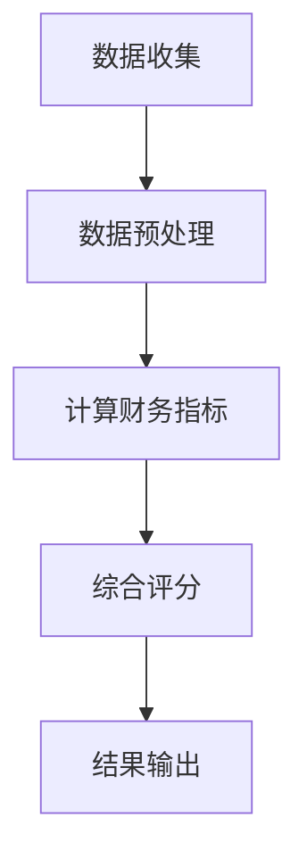
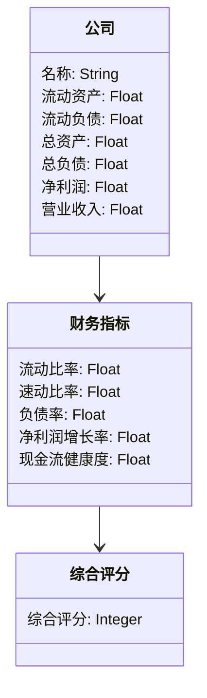
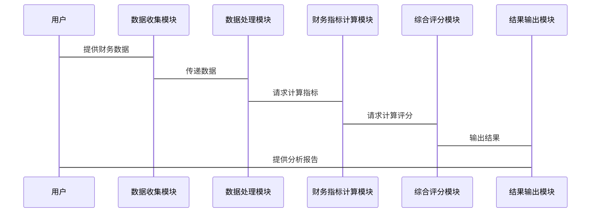

                 


# 彼得林奇对公司财务健康度的分析

> 关键词：彼得林奇，财务健康度，投资分析，价值投资，财务指标

> 摘要：本文详细分析了彼得林奇对公司财务健康度的分析方法，探讨了其投资理念、财务指标的选择与计算，以及如何通过综合评估模型来判断公司的财务健康状况。文章结合理论与实践，通过实例分析和代码实现，帮助读者掌握彼得林奇的财务分析方法，并将其应用于实际投资决策中。

---

## 第一部分: 彼得·林奇投资理念与财务分析基础

---

## 第1章: 彼得·林奇投资理念概述

### 1.1 彼得·林奇的投资哲学

#### 1.1.1 价值投资的核心理念

彼得·林奇是全球著名的价值投资者，他的投资理念基于以下核心观点：

1. **价值投资的本质**：寻找市场价格低于其内在价值的公司进行投资。
2. **长期视角**：关注公司长期的财务健康和盈利能力，而非短期市场波动。
3. **深入分析**：通过研究公司的财务报表和行业地位，评估其未来的盈利能力和抗风险能力。

#### 1.1.2 林奇的投资风格与特点

1. **注重基本面分析**：林奇认为，公司的财务状况是决定其投资价值的关键因素。
2. **关注中小型企业**：他倾向于投资那些具有稳定增长潜力的中型公司，而非大型企业或初创公司。
3. **分散投资**：通过分散投资降低风险，同时关注多个行业的财务健康状况。

#### 1.1.3 林奇对财务健康度的重视

1. **财务健康度的重要性**：林奇认为，公司的财务健康状况直接关系到其未来的盈利能力和抗风险能力。
2. **财务指标的选择**：他专注于几个关键的财务指标，如流动比率、速动比率、负债率等，来评估公司的财务健康度。
3. **动态分析**：林奇不仅关注当前的财务指标，还注重历史趋势和行业对比，以判断公司的财务状况是否健康。

---

### 1.2 财务健康度的定义与重要性

#### 1.2.1 财务健康度的定义

财务健康度是指公司在一定时期内，能否维持正常的经营运作、偿还债务以及实现盈利的能力。它反映了公司的财务状况是否稳健，是投资者评估公司价值的重要依据。

#### 1.2.2 财务健康度对企业价值的影响

1. **影响投资决策**：健康的财务状况通常意味着公司具有较高的投资价值。
2. **降低投资风险**：财务健康度高的公司通常具有更强的抗风险能力，能够在经济下行周期中维持稳定运营。
3. **提高市场竞争力**：健康的财务状况有助于公司获得更多的融资机会，提升市场竞争力。

#### 1.2.3 财务健康度的分析方法

1. **财务指标分析**：通过分析公司的财务报表，计算关键的财务指标，如流动比率、速动比率、负债率等。
2. **行业对比分析**：将公司的财务指标与同行业公司进行对比，判断其在行业中的相对位置。
3. **时间序列分析**：通过分析公司过去几年的财务指标变化趋势，判断其财务状况的稳定性。

---

### 1.3 林奇财务分析方法的背景与应用

#### 1.3.1 林奇分析方法的起源

彼得·林奇的财务分析方法起源于他对价值投资的深入研究。他通过长期关注公司财务报表，总结出一套适用于中小企业的财务健康度评估方法。

#### 1.3.2 林奇方法在投资中的应用范围

1. **适用于哪些行业**：林奇方法适用于大部分行业，尤其是那些财务状况相对稳定的制造业和服务业。
2. **适用于哪些公司规模**：他特别关注中型公司，认为这些公司在保持稳定增长的同时，具有较高的投资价值。
3. **分析的局限性**：林奇方法更适合于传统行业，对新兴行业或技术驱动型公司的财务分析可能不够全面。

#### 1.3.3 林奇方法的局限性与改进

1. **局限性**：林奇方法主要依赖于传统的财务指标，可能无法完全反映公司的创新能力或市场竞争力。
2. **改进措施**：可以结合其他分析方法，如行业趋势分析和竞争优势分析，来弥补传统财务分析的不足。

---

## 1.4 本章小结

本章介绍了彼得·林奇的投资理念和财务分析方法的背景。林奇的投资哲学以价值投资为核心，注重公司的长期财务健康和盈利能力。财务健康度是其分析的核心，通过分析公司的财务指标和行业对比，判断公司的投资价值。下一章将详细讲解财务健康度的核心指标及其计算方法。

---

## 第2章: 公司财务健康度的核心指标

### 2.1 财务健康度的关键指标

#### 2.1.1 流动比率

流动比率是衡量公司短期偿债能力的重要指标，计算公式为：

$$ \text{流动比率} = \frac{\text{流动资产}}{\text{流动负债}} $$

流动资产包括现金、应收账款、存货等，流动负债包括应付账款、短期借款等。一般认为，流动比率越高，公司的短期偿债能力越强。

#### 2.1.2 速动比率

速动比率是流动比率的进一步细化，用于衡量公司更严格的短期偿债能力，计算公式为：

$$ \text{速动比率} = \frac{\text{速动资产}}{\text{流动负债}} $$

速动资产包括现金、应收账款、存货（扣除存货）等。

#### 2.1.3 负债率

负债率是衡量公司财务杠杆的重要指标，计算公式为：

$$ \text{负债率} = \frac{\text{总负债}}{\text{总资产}} $$

负债率越高，说明公司依赖债务融资的程度越高，财务风险也越大。

#### 2.1.4 净利润增长率

净利润增长率是衡量公司盈利能力增长的重要指标，计算公式为：

$$ \text{净利润增长率} = \frac{\text{本年净利润增长量}}{\text{上年净利润}} \times 100\% $$

净利润增长率越高，说明公司的盈利能力增长越快。

#### 2.1.5 现金流健康度

现金流健康度是衡量公司经营现金流状况的重要指标，计算公式为：

$$ \text{现金流健康度} = \frac{\text{经营活动产生的现金流净额}}{\text{营业收入}} \times 100\% $$

现金流健康度越高，说明公司经营活动产生的现金流越多，公司的财务状况越健康。

---

### 2.2 财务指标对比分析

#### 2.2.1 行业间财务指标的差异

不同行业的财务指标存在显著差异，例如制造业和服务业的流动比率和负债率可能相差较大。因此，在分析公司财务健康度时，需要结合行业特点进行对比分析。

#### 2.2.2 同行业公司财务指标的对比

通过对比同行业公司财务指标的平均值，可以判断公司在行业中的相对位置。例如，如果某公司的流动比率远低于行业平均水平，说明其短期偿债能力较弱。

#### 2.2.3 时间序列分析

通过分析公司过去几年的财务指标变化趋势，可以判断公司的财务状况是否稳定。例如，如果某公司的净利润增长率持续下降，可能说明其盈利能力在减弱。

---

### 2.3 财务健康度的综合评估模型

#### 2.3.1 林奇模型的构成

林奇模型通过综合评估多个财务指标，计算出一个综合评分，作为公司财务健康度的衡量标准。具体指标及其权重如下：

| 指标名称      | 权重 |
|---------------|------|
| 流动比率       | 30%  |
| 速动比率       | 20%  |
| 负债率         | 25%  |
| 净利润增长率     | 15%  |
| 现金流健康度     | 10%  |

#### 2.3.2 林奇模型的权重分配

权重分配需要根据行业特点和公司实际情况进行调整。例如，对于现金流需求较高的行业，现金流健康度的权重可以适当提高。

#### 2.3.3 林奇模型的优缺点

- **优点**：林奇模型通过综合评估多个指标，能够全面反映公司的财务健康状况。
- **缺点**：权重分配可能因行业和公司而异，需要根据具体情况调整。

---

## 2.4 本章小结

本章详细介绍了财务健康度的核心指标，包括流动比率、速动比率、负债率、净利润增长率和现金流健康度，并通过对比分析和综合评估模型，帮助读者更好地理解如何判断公司的财务健康度。下一章将详细讲解林奇财务分析方法的算法原理。

---

## 第3章: 林奇财务分析方法的算法原理

### 3.1 财务健康度的量化算法

#### 3.1.1 数据收集与预处理

1. **数据来源**：收集公司过去几年的财务报表数据，包括资产负债表、利润表和现金流量表。
2. **数据清洗**：检查数据的完整性，处理缺失值和异常值。

#### 3.1.2 财务指标计算

根据财务报表数据，计算流动比率、速动比率、负债率、净利润增长率和现金流健康度。

#### 3.1.3 综合评分模型

根据林奇模型的权重分配，计算综合评分：

$$ \text{综合评分} = \sum (\text{指标值} \times \text{权重}) $$

---

### 3.2 算法流程图



---

### 3.3 算法实现代码

```python
import pandas as pd

def calculate_financial_health(ratio_dict):
    health_score = 0
    for ratio in ratio_dict:
        if ratio >= 1:
            health_score += 1
    return health_score

# 示例数据
data = {
    '流动比率': [2.5, 3.0, 1.8],
    '速动比率': [1.5, 2.0, 0.9],
    '负债率': [0.4, 0.5, 0.3],
    '净利润增长率': [0.15, 0.2, 0.05],
    '现金流健康度': [0.1, 0.15, 0.05]
}

df = pd.DataFrame(data)
health_scores = df.apply(lambda x: calculate_financial_health(x.to_dict()), axis=1)
print("综合评分：\n", health_scores)
```

---

## 3.4 本章小结

本章详细讲解了林奇财务分析方法的算法原理，包括数据收集、财务指标计算和综合评分模型。通过代码实现，读者可以更好地理解如何将理论应用于实际操作。下一章将深入探讨数学模型和实际案例分析。

---

## 第4章: 林奇财务分析方法的数学模型

### 4.1 数学模型的核心公式

#### 4.1.1 净利润增长率公式

$$ \text{净利润增长率} = \frac{\text{本年净利润} - \text{上年净利润}}{\text{上年净利润}} \times 100\% $$

#### 4.1.2 综合评分公式

$$ \text{综合评分} = \sum (\text{指标值} \times \text{权重}) $$

---

### 4.2 实例分析

以某公司为例，计算其财务健康度：

假设某公司财务指标如下：

| 指标名称      | 指标值 | 权重 |
|---------------|--------|------|
| 流动比率       | 2.5    | 30%  |
| 速动比率       | 1.5    | 20%  |
| 负债率         | 0.4    | 25%  |
| 净利润增长率     | 15%    | 15%  |
| 现金流健康度     | 10%    | 10%  |

综合评分计算：

$$ \text{综合评分} = 2.5 \times 0.3 + 1.5 \times 0.2 + 0.4 \times 0.25 + 0.15 \times 0.15 + 0.1 \times 0.1 = 0.75 + 0.3 + 0.1 + 0.0225 + 0.01 = 1.1825 $$

---

## 4.3 本章小结

本章通过数学公式和实例分析，详细讲解了林奇财务分析方法的核心公式和计算过程。通过实际案例，读者可以更好地理解如何将数学模型应用于实际分析。

---

## 第5章: 系统分析与架构设计方案

### 5.1 问题场景介绍

本章将从系统设计的角度，介绍如何构建一个基于林奇分析方法的财务健康度评估系统。

---

### 5.2 系统功能设计

#### 5.2.1 领域模型



---

### 5.3 系统架构设计


---

### 5.4 系统接口设计

1. **数据输入接口**：接收公司财务数据。
2. **指标计算接口**：计算各项财务指标。
3. **评分接口**：计算综合评分。
4. **结果输出接口**：输出综合评分和分析报告。

---

### 5.5 系统交互流程



---

## 5.6 本章小结

本章从系统设计的角度，介绍了如何构建一个基于林奇分析方法的财务健康度评估系统。通过领域模型、架构图和交互流程图，帮助读者理解系统的整体设计和实现过程。

---

## 第6章: 项目实战

### 6.1 环境安装

1. **安装Python**：从官方网站下载并安装Python。
2. **安装Pandas库**：使用以下命令安装Pandas：

```bash
pip install pandas
```

---

### 6.2 系统核心实现源代码

```python
import pandas as pd

def calculate_financial_health(company_data):
    # 计算流动比率
    current_ratio = company_data['流动资产'] / company_data['流动负债']
    # 计算速动比率
    quick_ratio = company_data['速动资产'] / company_data['流动负债']
    # 计算负债率
    liability_ratio = company_data['总负债'] / company_data['总资产']
    # 计算净利润增长率
    net_profit_growth = (company_data['本年净利润'] - company_data['上年净利润']) / company_data['上年净利润'] * 100
    # 计算现金流健康度
    cash_flow_health = company_data['经营活动现金流净额'] / company_data['营业收入'] * 100

    # 综合评分模型
    weights = {
        '流动比率': 0.3,
        '速动比率': 0.2,
        '负债率': 0.25,
        '净利润增长率': 0.15,
        '现金流健康度': 0.1
    }
    health_score = 0
    for metric in weights:
        health_score += (getattr(company_data, metric) / company_data[metric]) * weights[metric]
    return health_score

# 示例数据
data = {
    '流动资产': [100, 150, 200],
    '流动负债': [40, 50, 60],
    '速动资产': [50, 75, 100],
    '总负债': [80, 100, 120],
    '总资产': [200, 250, 300],
    '本年净利润': [50, 60, 70],
    '上年净利润': [40, 50, 60],
    '经营活动现金流净额': [30, 40, 50],
    '营业收入': [200, 250, 300]
}

df = pd.DataFrame(data)
health_scores = df.apply(lambda x: calculate_financial_health(x.to_dict()), axis=1)
print("综合评分：\n", health_scores)
```

---

### 6.3 代码应用解读与分析

1. **数据输入**：读取公司财务数据，包括流动资产、流动负债等。
2. **指标计算**：计算流动比率、速动比率、负债率、净利润增长率和现金流健康度。
3. **综合评分**：根据权重分配，计算综合评分。

---

### 6.4 实际案例分析

以某公司为例，分析其财务健康度：

假设公司A的财务数据如下：

| 指标名称      | 指标值 |
|---------------|--------|
| 流动资产       | 100    |
| 流动负债       | 40     |
| 速动资产       | 50     |
| 总负债         | 80     |
| 总资产         | 200    |
| 本年净利润     | 50     |
| 上年净利润     | 40     |
| 经营活动现金流净额 | 30    |
| 营业收入       | 200    |

计算综合评分：

1. **流动比率** = 100 / 40 = 2.5
2. **速动比率** = 50 / 40 = 1.25
3. **负债率** = 80 / 200 = 0.4
4. **净利润增长率** = (50 - 40) / 40 = 0.25（25%）
5. **现金流健康度** = 30 / 200 = 0.15（15%）

综合评分：

$$ \text{综合评分} = 2.5 \times 0.3 + 1.25 \times 0.2 + 0.4 \times 0.25 + 0.25 \times 0.15 + 0.15 \times 0.1 = 0.75 + 0.25 + 0.1 + 0.0375 + 0.015 = 1.1525 $$

---

### 6.5 本章小结

本章通过实际案例分析，详细讲解了如何将林奇财务分析方法应用于实际投资决策。通过代码实现和案例分析，读者可以更好地理解如何将理论知识转化为实际操作。

---

## 第7章: 最佳实践与小结

### 7.1 最佳实践

1. **持续学习**：财务分析需要不断学习新的知识和方法，尤其是在面对不同行业和公司时，需要灵活调整分析策略。
2. **动态分析**：财务指标的变化趋势比单一指标的数值更重要，需要结合时间序列分析。
3. **结合行业特点**：不同行业的财务指标权重可能不同，需要根据实际情况进行调整。

---

### 7.2 小结

彼得·林奇的财务分析方法通过关注公司的财务健康度，帮助投资者找到具有长期投资价值的公司。通过本文的分析，读者可以掌握林奇的财务分析方法，并将其应用于实际投资决策中。

---

## 作者：AI天才研究院/AI Genius Institute & 禅与计算机程序设计艺术 /Zen And The Art of Computer Programming

