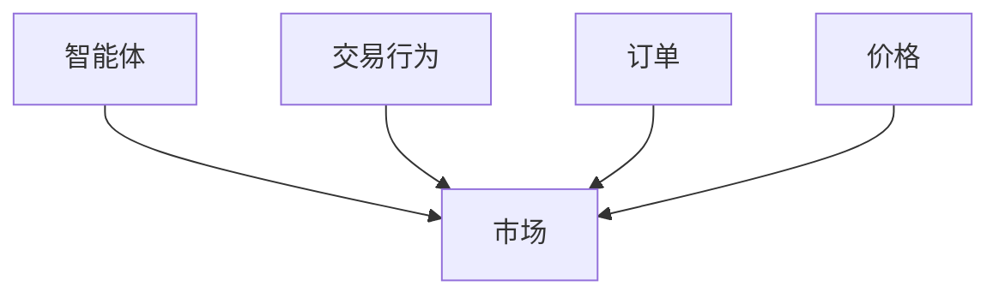
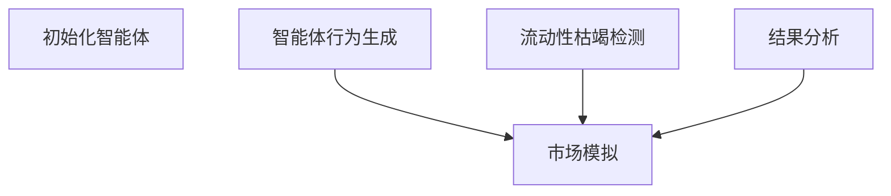

                 


# 智能体群体在模拟市场流动性枯竭中的应用

> 关键词：智能体群体，市场流动性，模拟，算法原理，系统设计

> 摘要：本文探讨了智能体群体在模拟市场流动性枯竭中的应用，从基本概念、算法原理、系统设计到项目实战，详细分析了智能体群体如何模拟市场流动性枯竭，以及其在金融风险管理和市场分析中的潜在应用价值。

---

## 第一部分：智能体群体与市场流动性概述

### 第1章：智能体群体的基本概念

#### 1.1 智能体的定义与特点

- **智能体的定义**：智能体（Agent）是指能够感知环境、做出决策并采取行动的实体。智能体可以是软件程序、机器人或其他具备自主决策能力的系统。
- **智能体的核心特征**：
  - **自主性**：智能体能够在没有外部干预的情况下独立运作。
  - **反应性**：智能体能够根据环境的变化实时调整其行为。
  - **主动性**：智能体能够主动采取行动以实现其目标。

- **智能体与传统算法的区别**：
  - 传统算法通常需要明确的规则和输入，而智能体能够根据环境动态调整其行为。
  - 智能体具备一定的学习和适应能力，能够从经验中改进其决策策略。

#### 1.2 智能体群体的形成与分类

- **智能体群体的形成机制**：多个智能体通过某种机制（如通信、协作）形成一个群体，共同完成任务或目标。
- **智能体群体的分类**：
  - **基于行为**：根据智能体的行为模式进行分类，如探索者、跟随者等。
  - **基于目标**：根据智能体的目标进行分类，如最大化利润、最小化风险等。
  - **基于角色**：根据智能体在群体中的角色进行分类，如领导者、执行者等。
- **智能体群体的特征**：
  - **多样性**：群体中的智能体可能具有不同的行为模式或目标。
  - **动态性**：群体的行为和结构可能会随环境的变化而动态调整。
  - **复杂性**：群体的决策过程可能涉及复杂的协调和互动。

#### 1.3 市场流动性枯竭的定义与表现

- **市场流动性枯竭的定义**：市场流动性枯竭是指市场中买卖双方的交易量急剧减少，导致市场深度不足，价格容易大幅波动。
- **市场流动性枯竭的表现形式**：
  - **价格波动**：市场价格可能因为缺乏买卖双方的均衡而出现剧烈波动。
  - **交易量骤减**：市场中的交易量显著减少，买卖订单稀少。
  - **市场深度下降**：市场深度是指在某一价格水平上可以成交的数量，市场深度下降意味着在某个价格点上难以找到足够的交易对手。
- **市场流动性枯竭的影响**：
  - **投资者损失**：投资者可能因为价格波动而遭受损失。
  - **市场稳定性下降**：市场的不稳定性可能导致更多的投资者撤出市场，进一步加剧流动性枯竭。
  - **系统性风险增加**：流动性枯竭可能引发系统性风险，影响整个金融市场的稳定性。

### 第2章：智能体群体与市场流动性之间的关系

#### 2.1 智能体群体在市场中的角色

- **智能体作为市场参与者**：
  - 智能体可以作为投资者、交易员或做市商参与市场交易。
  - 智能体的交易行为可能会影响市场价格和流动性。
- **智能体群体的交易行为对市场流动性的影响**：
  - 智能体的大量交易可能导致市场流动性增加，但也可能因为智能体的策略趋同而导致市场流动性下降。
  - 智能体的协作行为可能增强市场流动性，而竞争行为可能导致流动性波动。
- **智能体群体对市场结构的影响**：
  - 智能体群体的形成可能影响市场的参与者结构，进而影响市场的流动性和价格形成机制。

#### 2.2 智能体群体对市场流动性枯竭的模拟作用

- **智能体群体模拟市场流动性枯竭的必要性**：
  - 通过模拟智能体群体的行为，可以更好地理解市场流动性枯竭的原因和机制。
  - 模拟可以帮助制定有效的风险管理策略，以应对市场流动性枯竭的情况。
- **智能体群体模拟市场流动性枯竭的优势**：
  - **可控制性**：可以通过调整智能体的行为参数来模拟不同的市场条件。
  - **可重复性**：可以在相同的条件下多次模拟，便于比较和分析。
  - **可扩展性**：可以通过增加智能体的数量来模拟更大规模的市场。
- **智能体群体模拟市场流动性枯竭的局限性**：
  - **复杂性**：市场的实际运行涉及众多因素，模拟时可能难以全面考虑。
  - **不确定性**：市场的参与者行为具有一定的随机性和不确定性，模拟结果可能与实际情况存在差异。
  - **动态性**：市场的运行环境和参与者行为可能随时间变化，模拟需要不断更新和调整。

#### 2.3 智能体群体与市场流动性枯竭的概念属性对比

| 智能体群体属性         | 市场流动性枯竭属性 |
|-----------------------|------------------|
| **独立性**             | **依赖性**       |
| **反应性**             | **敏感性**       |
| **协作性**             | **竞争性**       |
| **多样性**             | **单一性**       |
| **动态性**             | **静态性**       |
| **复杂性**             | **简单性**       |

### 第3章：智能体群体模拟市场流动性枯竭的核心概念与联系

#### 3.1 核心概念原理

- **智能体的行为模型**：
  - **基于规则**：智能体根据预设的规则采取行动，如“如果价格下跌，卖出”。
  - **基于目标**：智能体根据目标函数采取行动，如最大化利润。
  - **基于学习**：智能体通过机器学习算法不断优化其行为策略。
- **市场流动性模型**：
  - **基于订单簿**：模拟市场中的订单簿，包括买价、卖价、买量、卖量等。
  - **基于交易量**：根据交易量的变化来模拟市场流动性。
  - **基于价格波动**：根据价格波动的幅度来判断市场流动性。
- **智能体与市场的交互机制**：
  - **订单生成**：智能体根据市场信息生成买卖订单。
  - **价格影响**：智能体的交易行为可能影响市场价格。
  - **信息反馈**：市场信息（如价格变化）反馈给智能体，影响其后续行为。

#### 3.2 智能体群体与市场流动性枯竭的概念属性对比

| 智能体群体属性         | 市场流动性枯竭属性 |
|-----------------------|------------------|
| **独立性**             | **依赖性**       |
| **反应性**             | **敏感性**       |
| **协作性**             | **竞争性**       |
| **多样性**             | **单一性**       |
| **动态性**             | **静态性**       |
| **复杂性**             | **简单性**       |

#### 3.3 ER实体关系图架构



---

## 第二部分：智能体群体模拟市场流动性枯竭的算法原理

### 第4章：智能体群体模拟市场流动性枯竭的算法原理

#### 4.1 算法原理概述

- **智能体行为生成算法**：
  - **随机选择**：智能体随机选择交易方向和交易量。
  - **规则驱动**：智能体根据预设的规则生成交易行为，如“如果价格低于某个阈值，买入”。
  - **强化学习**：智能体通过强化学习算法不断优化其交易策略。
- **市场模拟算法**：
  - **订单簿模拟**：模拟市场中的订单簿，包括买价、卖价、买量、卖量等。
  - **价格生成**：根据智能体的交易行为生成市场价格。
  - **交易量计算**：根据智能体的交易行为计算市场交易量。
- **流动性枯竭检测算法**：
  - **波动性指标**：计算市场价格波动幅度，判断是否出现流动性枯竭。
  - **交易量指标**：根据交易量的变化判断是否出现流动性枯竭。
  - **市场深度指标**：根据市场深度的变化判断是否出现流动性枯竭。

#### 4.2 算法实现流程



#### 4.3 算法实现细节

- **智能体行为生成**：
  - 智能体根据市场信息生成买卖订单。
  - 智能体的交易行为可能受到市场信息（如价格、交易量）的影响。
  - 智能体的交易行为可能受到自身状态（如资产、风险偏好）的影响。
- **市场模拟**：
  - 根据智能体的交易行为生成市场价格。
  - 根据市场价格和交易量更新订单簿。
  - 根据订单簿的变化判断市场流动性。
- **流动性枯竭检测**：
  - 计算市场价格波动幅度，判断是否超过阈值。
  - 计算交易量变化，判断是否低于阈值。
  - 计算市场深度变化，判断是否低于阈值。

#### 4.4 数学模型与公式

- **市场价格生成模型**：
  - 假设市场价格由买卖订单的供需关系决定。
  - 订单匹配规则：价格优先、时间优先等。
  - 市场价格计算公式：
    $$ P = \frac{P_{\text{buy}} + P_{\text{sell}}}{2} $$
  - 其中，\( P_{\text{buy}} \) 是当前最优买价，\( P_{\text{sell}} \) 是当前最优卖价。
- **交易量计算模型**：
  - 假设交易量由买卖订单的数量决定。
  - 交易量计算公式：
    $$ V = \min(Q_{\text{buy}}, Q_{\text{sell}}) $$
  - 其中，\( Q_{\text{buy}} \) 是当前最优买方数量，\( Q_{\text{sell}} \) 是当前最优卖方数量。
- **流动性枯竭检测模型**：
  - 波动性指标：$$ \sigma = \sqrt{\frac{1}{n}\sum_{i=1}^{n}(P_i - \bar{P})^2} $$
  - 其中，\( P_i \) 是第 \( i \) 个时间点的价格，\( \bar{P} \) 是平均价格，\( n \) 是时间窗口的长度。
  - 交易量指标：$$ V_{\text{ratio}} = \frac{V_{\text{current}}}{V_{\text{average}}} $$
  - 市场深度指标：$$ D = \frac{Q_{\text{buy}} + Q_{\text{sell}}}{2} $$

---

## 第三部分：智能体群体模拟市场流动性枯竭的系统设计

### 第5章：系统分析与架构设计

#### 5.1 问题场景介绍

- **问题场景**：模拟市场中多个智能体的交易行为，观察市场流动性变化，分析流动性枯竭的条件和机制。
- **系统目标**：通过模拟智能体群体的交易行为，研究市场流动性枯竭的形成机制和影响因素。

#### 5.2 系统功能设计

- **领域模型**：
  ```mermaid
  classDiagram
  class 智能体 {
    - id: 整数
    - 状态: 状态
    - 行为: 行为
  }
  class 市场 {
    - 价格: 数值
    - 买价: 数组
    - 卖价: 数组
    - 买量: 数组
    - 卖量: 数组
  }
  class 订单 {
    - 类型: 字符串
    - 数量: 整数
    - 价格: 数值
  }
  智能体 --> 订单: 发出订单
  市场 --> 智能体: 提供市场信息
  ```
- **系统架构设计**：
  ```mermaid
  architecture
  component 智能体管理模块 {
    智能体初始化
    智能体行为生成
  }
  component 市场模拟模块 {
    市场初始化
    市场更新
    流动性检测
  }
  component 数据分析模块 {
    数据收集
    数据分析
    结果输出
  }
  智能体管理模块 --> 市场模拟模块: 提供订单
  市场模拟模块 --> 数据分析模块: 提供市场数据
  ```
- **系统接口设计**：
  - 智能体管理模块与市场模拟模块之间的接口：订单生成、订单提交。
  - 市场模拟模块与数据分析模块之间的接口：市场数据输出、流动性检测结果输出。
  - 用户界面与系统之间的接口：参数设置、模拟启动、结果查看。
- **系统交互设计**：
  ```mermaid
  sequenceDiagram
  智能体管理模块 -> 市场模拟模块: 提供订单
  市场模拟模块 -> 数据分析模块: 提供市场数据
  数据分析模块 -> 用户界面: 显示结果
  ```

#### 5.3 项目实战

- **环境安装**：
  - 安装Python和相关库（如numpy、pandas、matplotlib）。
  - 安装mermaid工具用于绘制图表。
- **系统核心实现源代码**：

  ```python
  import numpy as np
  import pandas as pd
  import matplotlib.pyplot as plt

  class Agent:
      def __init__(self, id, initial_cash):
          self.id = id
          self.cash = initial_cash
          self.holdings = 0

      def place_order(self, market, strategy):
          # 根据策略生成订单
          if strategy == 'buy':
              return Order('buy', self.holdings, market.get_price())
          elif strategy == 'sell':
              return Order('sell', self.holdings, market.get_price())
          else:
              return None

  class Market:
      def __init__(self, initial_buyers, initial_sellers):
          self.buyers = initial_buyers
          self.sellers = initial_sellers
          self.prices = np.random.uniform(90, 110, 1000)

      def get_price(self):
          return self.prices[0]

      def update_prices(self):
          self.prices = np.roll(self.prices, -1)
          self.prices[-1] = np.random.uniform(90, 110, 1)

  class Order:
      def __init__(self, type, quantity, price):
          self.type = type
          self.quantity = quantity
          self.price = price

  def simulate_market(initial_cash, num_agents, num_steps):
      agents = [Agent(i, initial_cash) for i in range(num_agents)]
      market = Market(num_agents, num_agents)
      prices = []

      for _ in range(num_steps):
          orders = []
          for agent in agents:
              if np.random.random() < 0.5:
                  orders.append(agent.place_order(market, 'buy'))
              else:
                  orders.append(agent.place_order(market, 'sell'))
          market.prices[0] = max([order.price for order in orders] + [market.prices[0]])
          prices.append(market.prices[0])
          market.update_prices()

      return prices

  if __name__ == "__main__":
      initial_cash = 1000
      num_agents = 10
      num_steps = 100
      prices = simulate_market(initial_cash, num_agents, num_steps)
      plt.plot(prices)
      plt.xlabel('Time')
      plt.ylabel('Price')
      plt.show()
  ```

- **代码应用解读与分析**：
  - **智能体类（Agent）**：定义了智能体的基本属性和行为，包括现金、持仓和下单策略。
  - **市场类（Market）**：定义了市场的初始状态和价格生成机制。
  - **订单类（Order）**：定义了订单的类型、数量和价格。
  - **模拟函数（simulate_market）**：实现了智能体群体的交易行为和市场模拟过程。
  - **主函数（main）**：设置初始参数并运行模拟，最后绘制价格变化图。

- **实际案例分析和详细讲解剖析**：
  - **案例背景**：模拟一个包含10个智能体的虚拟股票市场，每个智能体初始资金为1000。
  - **模拟过程**：智能体根据随机策略生成买卖订单，市场根据订单生成价格，更新价格后继续模拟。
  - **结果分析**：绘制价格变化图，观察价格波动情况，判断是否出现流动性枯竭。

- **项目小结**：
  - 通过代码实现智能体群体的交易行为和市场模拟。
  - 分析价格变化趋势，判断市场流动性变化。
  - 总结智能体群体在模拟市场流动性枯竭中的应用价值。

---

## 第四部分：总结与展望

### 第6章：总结与展望

#### 6.1 研究总结

- 本文系统探讨了智能体群体在模拟市场流动性枯竭中的应用。
- 提出了智能体群体的基本概念、算法原理和系统设计。
- 通过具体案例分析，验证了智能体群体在模拟市场流动性枯竭中的可行性。

#### 6.2 研究展望

- **算法优化**：进一步优化智能体的行为生成算法，提高模拟的准确性和效率。
- **多因素模拟**：考虑更多市场因素（如交易费用、信息延迟）的影响，提高模拟的复杂性和真实性。
- **实证分析**：结合实际市场数据，验证模拟结果的准确性和有效性。
- **风险管理**：基于智能体群体模拟结果，制定有效的风险管理策略，防范市场流动性枯竭带来的风险。

#### 6.3 最佳实践 tips

- **数据收集**：确保数据的准确性和完整性，选择合适的数据源和数据预处理方法。
- **模型优化**：根据实际需求调整模型参数，优化模型的性能和效果。
- **伦理问题**：注意数据隐私和模型的公平性，避免算法歧视和滥用。

---

## 作者信息

作者：AI天才研究院/AI Genius Institute & 禅与计算机程序设计艺术 /Zen And The Art of Computer Programming

---

**感谢您的耐心阅读！希望本文能为您提供有价值的信息和启发。**

