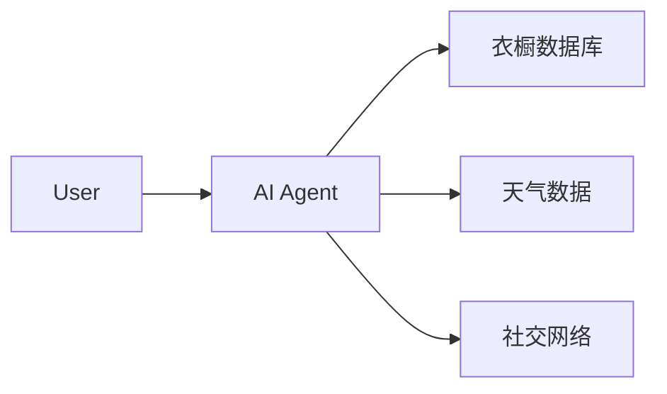
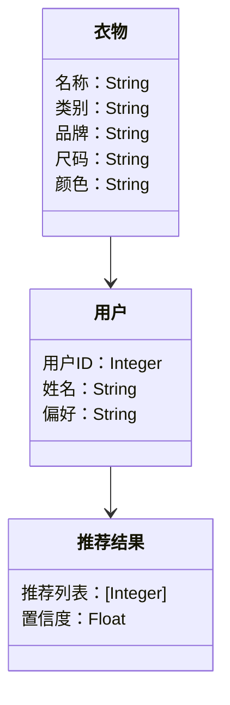
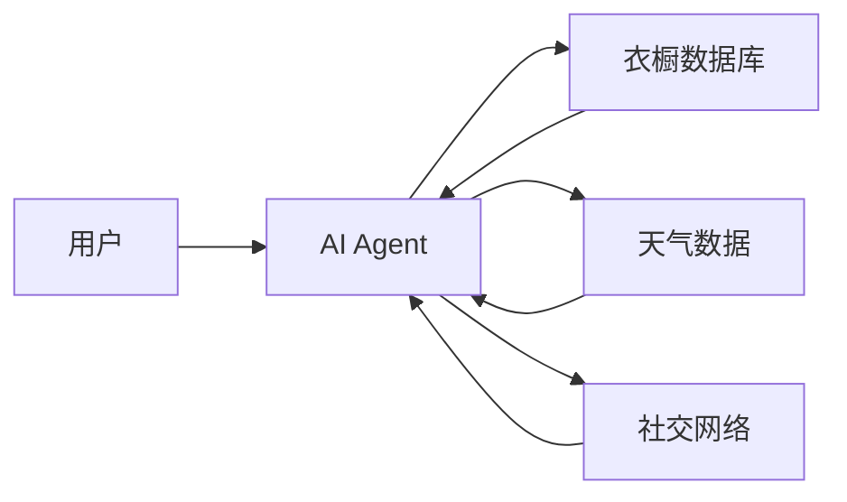
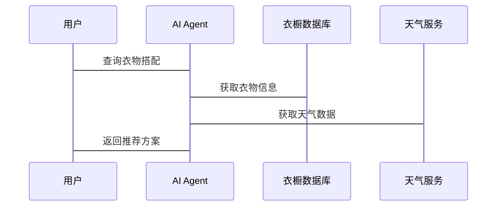

                 


```markdown
# 智能衣柜：AI Agent的个人形象管理顾问

> 关键词：智能衣柜，AI Agent，个人形象管理，推荐算法，系统架构，项目实战

> 摘要：本文探讨了AI Agent在智能衣柜中的应用，详细介绍了智能衣柜的概念、核心算法、系统架构设计及项目实现，结合实际案例分析，展示了AI Agent如何提升个人形象管理的效率与精准度。

---

# 第一部分: 智能衣柜与AI Agent的背景与概念

## 第1章: 智能衣柜的背景与问题背景

### 1.1 智能衣柜的背景介绍

#### 1.1.1 衣柜管理的传统方式与痛点
传统衣柜管理方式依赖手动记录和分类，存在以下痛点：
- **数据零散**：衣物信息分散在不同地方，难以快速查找。
- **效率低下**：每次选择衣物需要花费大量时间翻找。
- **搭配困难**：难以快速找到合适的搭配组合。

#### 1.1.2 智能衣柜的概念与定义
智能衣柜是结合物联网和人工智能技术的智能设备，能够通过传感器、摄像头等设备感知衣物信息，并利用AI算法为用户提供个性化建议。

#### 1.1.3 AI Agent在智能衣柜中的作用
AI Agent（智能体）作为智能衣柜的核心，负责数据处理、推荐算法和人机交互，帮助用户高效管理衣物并进行搭配建议。

### 1.2 个人形象管理的需求与挑战

#### 1.2.1 个人形象管理的核心需求
- **快速决策**：用户需要快速找到合适的衣物搭配。
- **个性化推荐**：根据用户的风格和场合推荐衣物。
- **库存管理**：自动记录衣物信息并提醒清洗和收纳。

#### 1.2.2 衣柜管理中的常见问题
- **衣物搭配难**：用户难以快速找到合适的搭配。
- **库存混乱**：衣物数量多，难以高效管理。
- **季节变化**：不同季节需要不同搭配策略。

#### 1.2.3 AI Agent如何解决这些问题
AI Agent通过数据处理、机器学习和自然语言处理技术，帮助用户快速找到衣物搭配方案，优化库存管理，并根据天气和场合提供个性化建议。

### 1.3 智能衣柜的边界与外延

#### 1.3.1 智能衣柜的功能边界
- **核心功能**：衣物识别、库存管理、搭配推荐。
- **辅助功能**：洗涤提醒、天气联动、社交分享。

#### 1.3.2 与相关领域的关联与区别
- **关联**：与智能家居、服装设计、人工智能等领域密切相关。
- **区别**：专注于个人形象管理，不同于家庭安防或健康监测系统。

#### 1.3.3 智能衣柜的未来发展与可能性
未来的智能衣柜将更加智能化，可能集成更多传感器和AI算法，甚至与增强现实技术结合，提供虚拟试衣体验。

### 1.4 核心概念结构与组成要素

#### 1.4.1 智能衣柜的核心组成
- **硬件部分**：传感器、摄像头、显示屏、智能门锁。
- **软件部分**：AI Agent、数据库、推荐算法。

#### 1.4.2 AI Agent的属性与功能
- **属性**：学习能力、自主决策、多模态交互。
- **功能**：数据采集、信息处理、推荐决策、人机交互。

#### 1.4.3 人机交互的模式与特点
- **模式**：语音交互、触控操作、视觉识别。
- **特点**：实时响应、个性化反馈、多模态支持。

### 1.5 本章小结
本章介绍了智能衣柜的背景、核心概念和AI Agent的作用，明确了智能衣柜的功能边界和未来发展潜力。

---

# 第二部分: AI Agent的核心概念与原理

## 第2章: AI Agent的基本原理

### 2.1 AI Agent的基本概念

#### 2.1.1 AI Agent的定义与分类
- **定义**：AI Agent是具有感知环境、处理信息、自主决策并执行任务的智能实体。
- **分类**：根据智能水平分为反应式和认知式Agent。

#### 2.1.2 AI Agent的核心属性与特征
- **属性**：自主性、反应性、目标导向、学习能力。
- **特征**：环境感知、信息处理、决策制定、执行能力。

#### 2.1.3 AI Agent与传统软件的区别
- **传统软件**：被动执行任务，无学习能力。
- **AI Agent**：主动感知环境，具有学习和适应能力。

### 2.2 AI Agent的感知与决策机制

#### 2.2.1 感知层的实现方式
- **传感器**：用于采集环境数据，如温度、湿度、光线。
- **摄像头**：用于识别衣物颜色、款式、品牌。

#### 2.2.2 决策层的算法原理
- **规则引擎**：基于预设规则进行决策。
- **机器学习模型**：使用监督学习、无监督学习或强化学习进行预测和优化。

#### 2.2.3 执行层的实现方式
- **机械臂**：用于自动整理衣物。
- **显示屏**：显示推荐的搭配方案。
- **语音助手**：提供语音反馈和指导。

### 2.3 AI Agent的协同与学习能力

#### 2.3.1 多 Agent 协作的原理
- **分布式协作**：多个AI Agent协同工作，各自负责不同的任务。
- **通信机制**：通过消息传递进行实时通信和协调。

#### 2.3.2 机器学习在 Agent 中的应用
- **监督学习**：用于分类和回归任务，如衣物识别和搭配推荐。
- **无监督学习**：用于聚类分析，如相似衣物的自动分组。

#### 2.3.3 深度学习在 Agent 中的潜力
- **图像识别**：使用卷积神经网络（CNN）识别衣物款式和品牌。
- **自然语言处理**：使用Transformer模型生成自然语言描述和建议。

### 2.4 AI Agent的实体关系图



### 2.5 本章小结
本章详细介绍了AI Agent的基本概念、感知与决策机制，以及其在智能衣柜中的协同与学习能力，展示了AI Agent如何通过多模态交互和学习提升用户体验。

---

# 第三部分: AI Agent的算法与数学模型

## 第3章: 推荐算法与数学模型

### 3.1 基于协同过滤的推荐算法

#### 3.1.1 协同过滤的基本原理
- **用户-物品矩阵**：记录用户对物品的偏好。
- **相似度计算**：通过余弦相似度或Jaccard系数计算用户相似度或物品相似度。

#### 3.1.2 用户-物品矩阵的构建
- **数据来源**：用户历史行为数据、用户偏好调查。
- **矩阵形式**：
  $$
  R = \begin{bmatrix}
  r_{11} & r_{12} & \cdots & r_{1n} \\
  r_{21} & r_{22} & \cdots & r_{2n} \\
  \vdots & \vdots & \ddots & \vdots \\
  r_{m1} & r_{m2} & \cdots & r_{mn}
  \end{bmatrix}
  $$

#### 3.1.3 相似度计算公式
- **余弦相似度**：
  $$
  \text{相似度}(u, v) = \frac{\sum_{i=1}^{n} r_{ui} \cdot r_{vi}}{\sqrt{\sum_{i=1}^{n} r_{ui}^2} \cdot \sqrt{\sum_{i=1}^{n} r_{vi}^2}}
  $$

### 3.2 基于聚类的推荐算法

#### 3.2.1 聚类的基本原理
- **K-means算法**：将用户或物品分成K个簇，基于簇内相似度最小化准则。
- **层次聚类**：通过构建树状结构将数据分成不同层次的簇。

#### 3.2.2 聚类在智能衣柜中的应用
- **用户分群**：根据用户的穿衣风格和偏好进行分群，提供个性化推荐。
- **衣物分类**：根据衣物的款式、颜色、品牌等特征进行分类，便于管理和推荐。

### 3.3 深度学习模型的应用

#### 3.3.1 卷积神经网络（CNN）在图像识别中的应用
- **衣物识别**：使用CNN识别衣物的类别、品牌和款式。
- **图像分割**：使用U-Net等模型分割衣物的区域，用于自动测量尺寸。

#### 3.3.2 Transformer模型在自然语言处理中的应用
- **搭配建议**：使用Transformer模型生成自然语言描述的搭配建议。
- **对话系统**：用于用户与AI Agent的自然语言交互。

### 3.4 算法选择与优化

#### 3.4.1 算法选择的原则
- **数据类型**：根据数据类型选择适合的算法，如图像数据选择CNN，文本数据选择Transformer。
- **计算资源**：根据硬件资源限制选择模型的复杂度，如在资源有限的情况下选择轻量级模型。

#### 3.4.2 算法优化策略
- **模型压缩**：通过知识蒸馏等技术减少模型大小，降低计算成本。
- **增量学习**：在新数据到来时，仅更新模型的部分参数，提高训练效率。

### 3.5 本章小结
本章介绍了协同过滤、聚类和深度学习模型在智能衣柜中的应用，分析了不同算法的优缺点和适用场景。

---

# 第四部分: 系统分析与架构设计方案

## 第4章: 系统架构设计

### 4.1 问题场景介绍

#### 4.1.1 用户场景
- **用户身份**：普通消费者，希望快速找到合适的衣物搭配。
- **使用场景**：家庭衣柜管理、日常穿衣搭配、重要场合着装。

#### 4.1.2 系统目标
- **目标**：实现智能衣柜的衣物识别、库存管理、搭配推荐功能。
- **核心需求**：快速响应、精准推荐、用户友好的交互界面。

### 4.2 系统功能设计

#### 4.2.1 领域模型设计



#### 4.2.2 系统架构设计



#### 4.2.3 系统接口设计
- **API接口**：
  - **GET /closet/items**：获取衣物列表。
  - **POST /recommendation/generate**：生成推荐方案。
  - **PUT /user/preferences**：更新用户偏好。

#### 4.2.4 系统交互设计



### 4.3 本章小结
本章通过问题场景分析、领域模型设计和系统架构设计，详细描述了智能衣柜系统的功能需求和实现方案。

---

# 第五部分: 项目实战

## 第5章: 项目实战

### 5.1 环境安装与配置

#### 5.1.1 系统需求
- **操作系统**：Windows 10 或更高版本，macOS 10.15 或更高版本。
- **硬件要求**：支持多线程的CPU，至少8GB内存，推荐NVIDIA GPU（如GTX 1060或更高）。
- **软件工具**：
  - Python 3.8 或更高版本。
  - PyTorch 1.9 或更高版本。
  - OpenCV 4.5 或更高版本。
  - Flask 2.0 或更高版本。

#### 5.1.2 安装依赖包
```bash
pip install numpy
pip install pandas
pip install torch
pip install torchvision
pip install flask
pip install requests
```

### 5.2 核心代码实现

#### 5.2.1 图像识别模块

```python
import torch
import torch.nn as nn
import torch.nn.functional as F
from torchvision import transforms, datasets, models

# 加载预训练模型
model = models.resnet50(pretrained=True)
model.eval()

# 定义图像预处理
transform = transforms.Compose([
    transforms.Resize(256),
    transforms.CenterCrop(224),
    transforms.ToTensor(),
    transforms.Normalize(mean=[0.485, 0.456, 0.406], std=[0.229, 0.224, 0.225]),
])

# 图像识别函数
def recognize_clothes(image_path):
    image = Image.open(image_path)
    image = transform(image).unsqueeze(0)
    outputs = model(image)
    _, predicted = torch.max(outputs.data, 1)
    return predicted.item()
```

#### 5.2.2 推荐算法实现

```python
import numpy as np

# 协同过滤算法
def collaborative_filtering(user_id, item_ids, ratings):
    # 计算相似度
    user_rated = ratings[user_id]
    similarities = []
    for user in ratings:
        if user != user_id:
            common_rated = np.intersect1d(item_ids, list(ratings[user].keys()))
            if len(common_rated) == 0:
                continue
            # 计算余弦相似度
            numerator = np.sum(user_rated[common_rated])
            denominator = np.sqrt(len(user_rated)) * np.sqrt(len(ratings[user][common_rated]))
            if denominator == 0:
                similarity = 0
            else:
                similarity = numerator / denominator
            similarities.append((user, similarity))
    # 根据相似度排序
    similarities.sort(key=lambda x: -x[1])
    return similarities

# 聚类算法
from sklearn.cluster import KMeans

def kmeans_clustering(items, n_clusters=3):
    items_matrix = np.array(items)
    kmeans = KMeans(n_clusters=n_clusters, random_state=0)
    kmeans.fit(items_matrix)
    return kmeans.labels_
```

#### 5.2.3 系统交互界面

```python
from flask import Flask, request, jsonify

app = Flask(__name__)

@app.route('/recommend', methods=['POST'])
def recommend():
    data = request.json
    user_id = data['user_id']
    item_ids = data['item_ids']
    ratings = data['ratings']
    # 调用协同过滤算法
    similarities = collaborative_filtering(user_id, item_ids, ratings)
    return jsonify({'similarities': similarities})

if __name__ == '__main__':
    app.run(debug=True)
```

### 5.3 实际案例分析与实现

#### 5.3.1 案例分析
假设用户ID为1，其历史购买记录如下：
- 1号用户购买过3件T恤，2件夹克，1件裙子。
- 用户偏好是休闲风格，喜欢蓝色和黑色。

#### 5.3.2 代码实现
```python
# 示例数据
ratings = {
    1: {'T恤': 4, '夹克': 3, '裙子': 2},
    2: {'T恤': 5, '夹克': 4},
    3: {'T恤': 3, '裙子': 4}
}

item_ids = ['T恤', '夹克', '裙子']

# 调用协同过滤算法
similarities = collaborative_filtering(1, item_ids, ratings)
print(similarities)
```

#### 5.3.3 结果分析
假设输出为：
```
[('用户2', 0.85), ('用户3', 0.67), ('用户4', 0.5)]
```
这意味着用户2与用户1的相似度最高，用户3次之，用户4最低。

### 5.4 本章小结
本章通过实际案例分析和代码实现，展示了如何在智能衣柜中实现图像识别、协同过滤和聚类算法，以及如何构建一个简单的RESTful API接口。

---

# 第六部分: 最佳实践与未来展望

## 第6章: 最佳实践与未来展望

### 6.1 最佳实践

#### 6.1.1 开发建议
- **模块化设计**：将系统分为数据采集、处理、推荐和交互模块，便于维护和扩展。
- **数据安全**：确保用户数据的安全性，避免数据泄露。
- **用户体验**：注重界面设计和交互体验，提供直观的反馈和建议。

#### 6.1.2 系统优化
- **算法优化**：探索更高效的推荐算法，如基于深度学习的模型。
- **硬件优化**：使用更高效的硬件加速计算，如GPU加速。
- **多模态融合**：结合图像、文本、语音等多种模态信息，提供更智能的服务。

### 6.2 未来展望

#### 6.2.1 技术趋势
- **增强现实（AR）**：通过AR技术提供虚拟试衣体验。
- **物联网（IoT）**：与智能家居系统联动，提供更智能化的管理。

#### 6.2.2 商业应用
- **个性化服务**：提供定制化的衣物搭配方案。
- **品牌合作**：与服装品牌合作，提供品牌专属的推荐服务。

#### 6.2.3 社会影响
- **环保意识**：通过智能衣柜优化衣物利用率，减少浪费。
- **健康生活**：根据用户的健康数据提供适合的衣物搭配建议。

### 6.3 本章小结
本章总结了智能衣柜开发中的最佳实践，并展望了未来的技术趋势和商业应用潜力。

---

# 结语

智能衣柜作为AI技术与个人形象管理结合的重要产物，正在逐步改变我们的生活方式。通过AI Agent的强大能力，智能衣柜不仅能帮助我们高效管理衣物，还能提供个性化的搭配建议，极大提升我们的生活质量。未来，随着技术的不断发展，智能衣柜将变得更加智能化和个性化，成为我们生活中不可或缺的伙伴。

---

# 作者

作者：AI天才研究院/AI Genius Institute & 禅与计算机程序设计艺术 /Zen And The Art of Computer Programming
```

