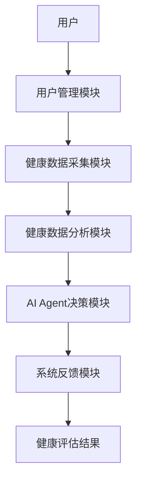

                 


# 构建AI Agent驱动的智能健康管理系统

## 关键词：
AI Agent、智能健康管理、健康数据分析、多智能体协作、机器学习

## 摘要：
本文详细探讨了构建AI Agent驱动的智能健康管理系统的各个方面，从基本概念到系统架构，从算法原理到项目实战，全面分析了如何利用AI Agent技术提升健康管理系统的能力。文章首先介绍了AI Agent和智能健康管理系统的背景与概念，接着深入分析了AI Agent的核心算法原理及其在健康管理系统中的应用，随后详细阐述了系统的架构设计与实现，最后通过实际案例展示了AI Agent驱动的智能健康管理系统的具体应用场景和实现方法。本文旨在为读者提供一个全面的技术视角，帮助他们理解并掌握如何构建高效的智能健康管理系统。

---

# 第1章: AI Agent与智能健康管理系统概述

## 1.1 AI Agent的基本概念

### 1.1.1 AI Agent的定义与特点
AI Agent（人工智能代理）是指能够感知环境、自主决策并采取行动以实现特定目标的智能实体。AI Agent的核心特点包括：
- **自主性**：能够在没有外部干预的情况下独立运作。
- **反应性**：能够实时感知环境并做出相应的反应。
- **目标导向性**：所有行为都围绕实现特定目标展开。
- **学习能力**：能够通过数据和经验不断优化自身的决策能力。

### 1.1.2 AI Agent的核心功能与分类
AI Agent的核心功能包括：
- **感知**：通过传感器或数据输入接口获取环境信息。
- **推理**：基于感知信息进行逻辑推理，生成决策方案。
- **决策**：根据推理结果做出最优选择。
- **执行**：将决策转化为具体行动。

AI Agent的分类主要基于其智能水平和应用场景：
- **反应式AI Agent**：基于当前感知信息做出反应，不依赖历史数据。
- **认知式AI Agent**：具备复杂推理和规划能力，能够处理长期任务。
- **协作式AI Agent**：能够在多智能体环境中与其他AI Agent协同工作。

### 1.1.3 AI Agent在健康管理系统中的应用前景
AI Agent在健康管理系统中的应用前景广阔，包括：
- **个性化健康管理**：根据用户的健康数据和生活习惯，提供个性化的健康建议。
- **健康风险预警**：通过分析用户的健康数据，提前发现潜在的健康问题。
- **健康行为引导**：通过智能推荐和实时反馈，引导用户做出健康的决策。

## 1.2 智能健康管理系统的基本概念

### 1.2.1 健康管理系统的定义与目标
健康管理系统是指通过收集、分析和处理用户的健康数据，提供健康评估、疾病预警和健康干预等服务的系统。其目标是帮助用户维护和提升健康水平，预防疾病的发生。

### 1.2.2 智能健康管理系统的特点
智能健康管理系统的特点包括：
- **智能化**：利用AI技术进行数据分析和决策。
- **个性化**：根据用户的具体情况提供定制化的健康管理方案。
- **实时性**：能够实时采集和处理用户的健康数据，提供及时的反馈。

### 1.2.3 AI Agent在智能健康管理系统中的作用
AI Agent在智能健康管理系统中的作用主要体现在以下几个方面：
- **数据处理**：对用户的健康数据进行清洗、分析和建模。
- **决策支持**：基于健康数据分析结果，提供健康建议和干预方案。
- **用户交互**：通过自然语言处理和语音识别技术，与用户进行实时互动。

## 1.3 本章小结
本章主要介绍了AI Agent的基本概念和智能健康管理系统的相关知识，重点分析了AI Agent在健康管理系统中的作用和应用前景，为后续章节的深入分析奠定了基础。

---

# 第2章: AI Agent与智能健康管理系统的核心概念

## 2.1 AI Agent的核心概念

### 2.1.1 AI Agent的结构与功能模块
AI Agent的结构通常包括以下几个功能模块：
- **感知模块**：负责获取环境信息。
- **推理模块**：对感知信息进行分析和推理。
- **决策模块**：根据推理结果做出决策。
- **执行模块**：将决策转化为具体行动。

### 2.1.2 AI Agent的决策机制
AI Agent的决策机制是其核心组成部分，主要包括以下几个步骤：
1. **感知环境**：通过传感器或其他数据源获取环境信息。
2. **信息处理**：对获取的信息进行预处理和特征提取。
3. **推理与决策**：基于处理后的信息进行推理和决策。
4. **行动执行**：根据决策结果执行相应的行动。

### 2.1.3 AI Agent的学习与自适应能力
AI Agent的学习能力是其智能性的体现，主要包括以下几种学习方式：
- **监督学习**：通过标注数据进行学习，适用于分类和回归任务。
- **无监督学习**：通过聚类等技术发现数据中的隐含模式。
- **强化学习**：通过与环境的互动获得奖励，优化决策策略。

## 2.2 智能健康管理系统的核心概念

### 2.2.1 用户健康数据的采集与处理
智能健康管理系统需要采集和处理大量的用户健康数据，包括：
- **生理数据**：如心率、血压、体温等。
- **行为数据**：如运动量、饮食习惯、睡眠质量等。
- **环境数据**：如空气质量、温度、湿度等。

### 2.2.2 健康数据的分析与个性化推荐
通过对用户健康数据的分析，智能健康管理系统可以为用户提供个性化的健康建议，包括：
- **健康评估**：根据用户的健康数据，评估其健康状况。
- **疾病预警**：通过数据分析，发现潜在的健康问题。
- **健康计划推荐**：根据用户的健康状况和生活习惯，推荐个性化的健康管理方案。

### 2.2.3 AI Agent在健康管理系统中的决策机制
AI Agent在健康管理系统中的决策机制主要包括以下几个步骤：
1. **数据采集**：通过传感器或数据库获取用户的健康数据。
2. **数据处理**：对采集的数据进行清洗、归一化和特征提取。
3. **健康评估**：基于处理后的数据，评估用户的健康状况。
4. **决策支持**：根据健康评估结果，生成个性化的健康管理方案。
5. **反馈优化**：根据用户的反馈不断优化决策策略。

## 2.3 AI Agent与智能健康管理系统的联系

### 2.3.1 AI Agent在健康数据处理中的作用
AI Agent在健康数据处理中的作用主要体现在以下几个方面：
- **数据清洗**：通过机器学习算法对数据进行去噪和归一化处理。
- **特征提取**：通过深度学习技术提取数据中的有用特征。
- **数据建模**：基于统计学习和深度学习方法，建立健康评估模型。

### 2.3.2 AI Agent在个性化健康推荐中的应用
AI Agent在个性化健康推荐中的应用主要体现在以下几个方面：
- **健康评估**：根据用户的健康数据，评估其健康状况。
- **疾病预警**：通过分析用户的健康数据，发现潜在的健康问题。
- **健康计划推荐**：根据用户的健康状况和生活习惯，推荐个性化的健康管理方案。

### 2.3.3 AI Agent在健康风险预警中的功能
AI Agent在健康风险预警中的功能主要体现在以下几个方面：
- **实时监控**：通过实时采集用户的健康数据，进行实时监控。
- **风险评估**：根据健康数据的变化，评估潜在的健康风险。
- **预警通知**：当发现潜在的健康风险时，及时通知用户或医护人员。

## 2.4 本章小结
本章详细介绍了AI Agent和智能健康管理系统的核心概念，重点分析了AI Agent在健康数据处理、个性化健康推荐和健康风险预警中的作用，为后续章节的深入分析奠定了理论基础。

---

# 第3章: AI Agent的算法原理

## 3.1 AI Agent的决策算法

### 3.1.1 基于规则的决策算法
基于规则的决策算法是一种简单的决策方法，通过预定义的规则对数据进行分类和决策。例如，可以根据用户的血压值制定以下规则：
$$ \text{如果血压值 < 90，说明血压正常} $$
$$ \text{如果血压值在 90 到 120 之间，说明血压偏高} $$
$$ \text{如果血压值 > 120，说明血压过高} $$

### 3.1.2 基于机器学习的决策算法
基于机器学习的决策算法是一种更复杂的决策方法，通常包括以下几个步骤：
1. **数据预处理**：对数据进行清洗、归一化和特征提取。
2. **模型训练**：使用训练数据训练分类器或回归器。
3. **模型评估**：通过测试数据评估模型的性能。
4. **模型部署**：将训练好的模型部署到实际系统中进行决策。

### 3.1.3 基于强化学习的决策算法
基于强化学习的决策算法是一种通过与环境互动来优化决策策略的方法。例如，可以通过强化学习训练一个AI Agent，使其能够在复杂的健康环境中做出最优决策。

### 3.2 AI Agent的协作算法

#### 3.2.1 多智能体协作的基本原理
多智能体协作是指多个AI Agent协同工作，共同完成一个复杂任务。例如，可以在一个智能健康管理系统中部署多个AI Agent，分别负责数据采集、数据分析和健康评估等任务。

#### 3.2.2 基于图神经网络的多智能体协作
基于图神经网络的多智能体协作是一种新兴的协作方法，通过图神经网络对多智能体之间的关系进行建模，从而实现高效的协作。

#### 3.2.3 基于联邦学习的多智能体协作
基于联邦学习的多智能体协作是一种分布式协作方法，通过在多个智能体之间共享模型参数，实现协作任务的优化。

### 3.3 AI Agent的学习算法

#### 3.3.1 监督学习与强化学习的对比
监督学习和强化学习是两种常见的学习方法，它们的主要区别如下：
| 对比项 | 监督学习 | 强化学习 |
|--------|----------|----------|
| 数据来源 | 标签数据 | 环境反馈 |
| 学习目标 | 预测目标值 | 优化决策策略 |
| 应用场景 | 分类、回归 | 游戏、机器人控制 |

#### 3.3.2 基于深度学习的AI Agent训练
基于深度学习的AI Agent训练通常包括以下几个步骤：
1. **数据预处理**：对数据进行清洗、归一化和特征提取。
2. **模型构建**：构建深度神经网络模型，如卷积神经网络或循环神经网络。
3. **模型训练**：使用训练数据训练模型参数。
4. **模型评估**：通过测试数据评估模型的性能。
5. **模型优化**：通过调整超参数和优化算法，进一步提升模型性能。

#### 3.3.3 基于迁移学习的AI Agent优化
基于迁移学习的AI Agent优化是一种通过迁移已有的知识和经验，快速提升新任务性能的方法。例如，可以将已经在其他健康任务中训练好的模型迁移到新的健康任务中，从而减少训练数据和时间。

## 3.4 本章小结
本章详细介绍了AI Agent的决策算法、协作算法和学习算法，重点分析了基于规则、机器学习和强化学习的决策方法，以及基于图神经网络和联邦学习的多智能体协作方法，为后续章节的系统架构设计奠定了算法基础。

---

# 第4章: AI Agent驱动的智能健康管理系统架构与设计

## 4.1 系统功能模块设计

### 4.1.1 用户管理模块
用户管理模块的主要功能包括：
- **用户注册与登录**：允许用户注册和登录系统。
- **用户信息管理**：管理用户的个人信息和健康数据。
- **权限管理**：根据用户角色分配相应的权限。

### 4.1.2 健康数据采集模块
健康数据采集模块的主要功能包括：
- **数据采集**：通过传感器或API接口采集用户的健康数据。
- **数据存储**：将采集到的数据存储到数据库中。
- **数据同步**：将数据同步到云端或其他设备。

### 4.1.3 健康数据分析模块
健康数据分析模块的主要功能包括：
- **数据清洗**：对采集到的数据进行去噪和归一化处理。
- **数据分析**：通过统计分析和机器学习算法对数据进行分析。
- **数据建模**：基于分析结果建立健康评估模型。

### 4.1.4 AI Agent决策模块
AI Agent决策模块的主要功能包括：
- **健康评估**：根据用户的健康数据，评估用户的健康状况。
- **疾病预警**：通过数据分析，发现潜在的健康问题。
- **健康计划推荐**：根据用户的健康状况和生活习惯，推荐个性化的健康管理方案。

### 4.1.5 系统反馈模块
系统反馈模块的主要功能包括：
- **结果反馈**：将健康评估结果反馈给用户。
- **用户交互**：通过自然语言处理和语音识别技术与用户进行实时互动。
- **系统优化**：根据用户的反馈不断优化系统性能。

## 4.2 系统架构图
以下是智能健康管理系统的架构图：



## 4.3 系统接口设计

### 4.3.1 用户端接口
用户端接口主要包括以下几种类型：
- **Web界面**：用户可以通过网页访问系统功能。
- **移动App**：用户可以通过移动应用访问系统功能。
- **API接口**：开发者可以通过API接口与系统进行交互。

### 4.3.2 数据接口
数据接口主要包括以下几种类型：
- **传感器接口**：与健康传感器设备进行数据交互。
- **数据库接口**：与后端数据库进行数据交互。
- **第三方API接口**：与第三方服务（如云服务、短信服务）进行数据交互。

### 4.3.3 系统交互
系统交互主要通过以下几种方式进行：
- **实时交互**：用户通过Web界面或移动App实时与系统进行交互。
- **批量交互**：通过批量处理任务与系统进行交互。
- **API交互**：开发者通过API接口与系统进行交互。

## 4.4 本章小结
本章详细介绍了AI Agent驱动的智能健康管理系统的架构与设计，重点分析了系统的功能模块、系统架构图和系统接口设计，为后续章节的项目实战奠定了基础。

---

# 第5章: AI Agent驱动的智能健康管理系统项目实战

## 5.1 环境安装与配置

### 5.1.1 系统环境要求
- **操作系统**：Linux/Windows/MacOS
- **Python版本**：3.6+
- **依赖库**：numpy、pandas、scikit-learn、tensorflow、keras

### 5.1.2 安装依赖库
```bash
pip install numpy pandas scikit-learn tensorflow keras
```

## 5.2 系统核心实现

### 5.2.1 AI Agent决策模块实现
以下是AI Agent决策模块的实现代码：

```python
import numpy as np
from sklearn.linear_model import LogisticRegression
from sklearn.metrics import accuracy_score

# 数据预处理
def preprocess_data(X):
    # 归一化处理
    X_normalized = (X - np.mean(X)) / np.std(X)
    return X_normalized

# 模型训练
def train_model(X_train, y_train):
    # 数据预处理
    X_train_processed = preprocess_data(X_train)
    # 模型训练
    model = LogisticRegression()
    model.fit(X_train_processed, y_train)
    return model

# 模型预测
def predict(model, X_test):
    X_test_processed = preprocess_data(X_test)
    y_pred = model.predict(X_test_processed)
    return y_pred

# 模型评估
def evaluate(model, X_test, y_test):
    y_pred = predict(model, X_test)
    accuracy = accuracy_score(y_test, y_pred)
    print(f"Accuracy: {accuracy}")
```

### 5.2.2 健康数据分析模块实现
以下是健康数据分析模块的实现代码：

```python
import pandas as pd
from sklearn.ensemble import RandomForestClassifier

# 数据加载
def load_data(file_path):
    data = pd.read_csv(file_path)
    return data

# 数据清洗
def clean_data(data):
    # 处理缺失值
    data = data.dropna()
    return data

# 数据建模
def build_model(data, target_col):
    features = data.drop(columns=[target_col])
    target = data[target_col]
    # 模型训练
    model = RandomForestClassifier()
    model.fit(features, target)
    return model

# 模型评估
def evaluate_model(model, features, target):
    y_pred = model.predict(features)
    accuracy = accuracy_score(target, y_pred)
    print(f"Accuracy: {accuracy}")
```

## 5.3 项目小结
本章通过实际案例展示了AI Agent驱动的智能健康管理系统的实现过程，详细讲解了系统的环境配置、核心模块的实现和项目总结，为读者提供了实践指导。

---

# 第6章: AI Agent驱动的智能健康管理系统最佳实践

## 6.1 小结
本章总结了AI Agent驱动的智能健康管理系统的实现过程，重点分析了系统的实现细节和项目中的经验教训。

## 6.2 注意事项
在实际应用中，需要注意以下几点：
- **数据隐私**：确保用户的健康数据得到妥善保护，避免数据泄露。
- **系统稳定性**：确保系统的稳定运行，避免因系统故障导致健康评估结果的错误。
- **用户体验**：注重用户体验设计，提供友好的用户界面和交互方式。

## 6.3 拓展阅读
对于感兴趣的研究者和开发者，可以进一步阅读以下内容：
- **多智能体协作**：研究多智能体协作的最新技术和发展趋势。
- **强化学习应用**：探索强化学习在健康管理系统中的更多应用场景。
- **联邦学习**：研究联邦学习在多智能体协作中的应用潜力。

## 6.4 本章小结
本章通过总结项目的实现过程，提出了实际应用中的注意事项，并为读者提供了进一步研究的方向。

---

# 作者：AI天才研究院/AI Genius Institute & 禅与计算机程序设计艺术 /Zen And The Art of Computer Programming

