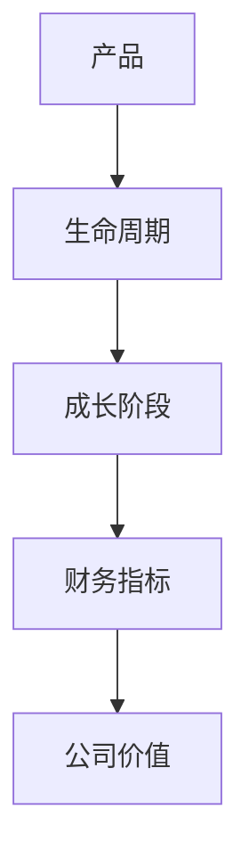
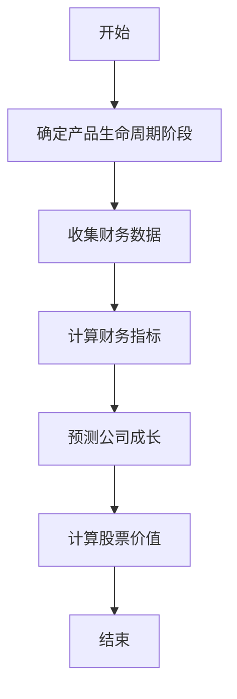
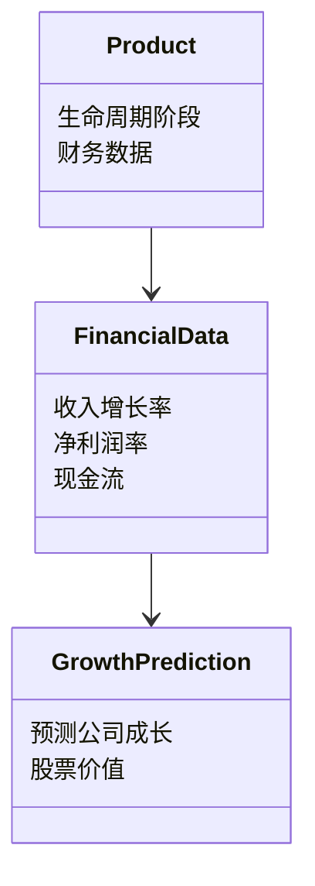
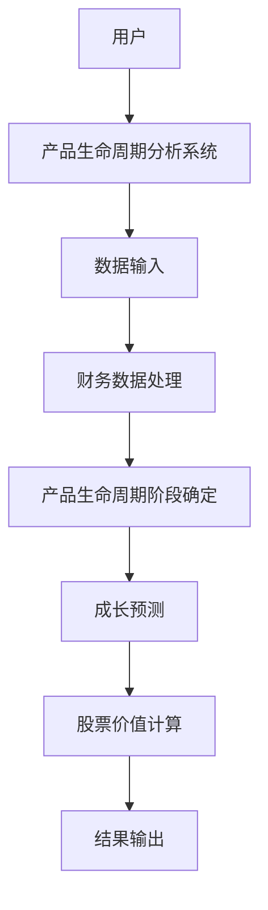
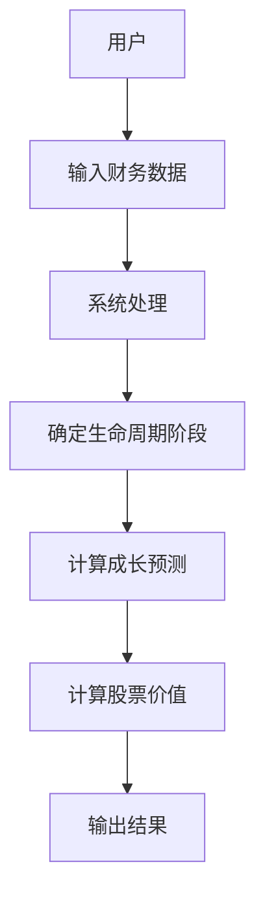
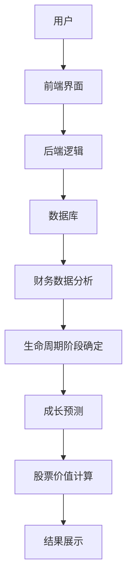

                 


# 费雪的产品生命周期分析：预测公司成长

## 关键词：费雪分析法、产品生命周期、公司成长预测、财务指标、股票投资

## 摘要：  
费雪的产品生命周期分析是一种通过分析产品的生命周期阶段来预测公司成长的有效方法。本文从背景介绍、核心概念、算法原理、系统分析到项目实战，全面解析费雪分析法的应用。通过数学模型、流程图和实际案例，帮助读者掌握如何利用产品生命周期分析预测公司成长，并在投资决策中做出明智选择。

---

# 第一部分: 费雪的产品生命周期分析基础

# 第1章: 产品生命周期分析概述

## 1.1 产品生命周期的基本概念

### 1.1.1 产品生命周期的定义  
产品生命周期（Product Life Cycle，PLC）是指产品从引入市场到最终退出市场的整个过程。通常分为四个阶段：引入期、成长期、成熟期和衰退期。

### 1.1.2 产品生命周期的四个阶段  
- **引入期（Introduction）**：新产品进入市场，需求量小，成本高，利润低。  
- **成长期（Growth）**：市场需求增长，销量增加，利润开始上升。  
- **成熟期（Maturity）**：市场趋于饱和，销量稳定，竞争激烈，利润逐渐下降。  
- **衰退期（Decline）**：市场需求减少，销量下降，利润转为负值或急剧下降。  

### 1.1.3 产品生命周期分析的重要性  
通过分析产品的生命周期阶段，可以帮助企业制定相应的市场策略，优化资源配置，预测公司成长能力。

---

## 1.2 费雪分析法的起源与背景

### 1.2.1 费雪分析法的提出  
费雪分析法由投资大师约翰·费雪（John F. Fish）提出，是一种基于产品生命周期的公司成长预测方法。

### 1.2.2 费雪分析法的核心思想  
费雪认为，公司的成长与产品生命周期密切相关，通过分析产品在不同阶段的财务表现，可以预测公司的未来成长。

### 1.2.3 费雪分析法的演变与发展  
随着市场环境的变化，费雪分析法不断优化，结合现代金融理论和数据分析技术，成为投资分析的重要工具。

---

## 1.3 费雪分析法与传统分析方法的区别

### 1.2.1 传统分析方法的局限性  
传统财务分析方法（如PE分析、PEG分析）忽视了产品生命周期对公司成长的影响，难以准确预测公司未来表现。

### 1.2.2 费雪分析法的独特性  
费雪分析法将产品生命周期与财务指标相结合，通过分析不同阶段的财务表现，预测公司未来成长。

### 1.2.3 费雪分析法的优势与适用场景  
- 优势：结合产品生命周期和财务指标，预测更精准。  
- 适用场景：适用于具有明确产品生命周期的企业，尤其是技术型和消费品行业。

---

## 1.4 产品生命周期分析与公司成长预测的关系

### 1.4.1 产品生命周期对公司的战略意义  
产品生命周期决定了公司的市场地位、财务表现和未来成长能力。

### 1.4.2 如何通过产品生命周期分析预测公司成长  
通过分析产品生命周期阶段，结合财务指标，预测公司未来的收入、利润和股价表现。

### 1.4.3 费雪分析法在公司成长预测中的应用  
费雪分析法通过量化产品生命周期阶段的财务指标，预测公司未来的成长潜力。

---

## 1.5 本章小结  
本章介绍了产品生命周期的基本概念、费雪分析法的起源与背景，以及其与传统分析方法的区别。通过理解这些内容，读者可以初步掌握费雪分析法的核心思想和应用场景。

---

# 第二部分: 费雪分析法的核心概念与联系

# 第2章: 费雪分析法的核心原理

## 2.1 费雪分析法的原理

### 2.1.1 费雪分析法的基本假设  
- 产品生命周期是公司成长的核心驱动力。  
- 每个生命周期阶段对应不同的财务表现和成长潜力。  

### 2.1.2 费雪分析法的核心公式  
费雪分析法的核心公式如下：  
$$ P = \frac{E}{(1 + r)^n} \times (1 + g) $$  
其中，  
- \( P \) 为股票的内在价值，  
- \( E \) 为预期未来现金流，  
- \( r \) 为贴现率，  
- \( n \) 为现金流的时间跨度，  
- \( g \) 为成长率。  

### 2.1.3 费雪分析法的数学模型  
费雪分析法的数学模型结合了时间价值和成长性，通过预测不同生命周期阶段的现金流，计算股票的内在价值。

---

## 2.2 费雪分析法的核心要素

### 2.2.1 产品生命周期的四个阶段  
- **引入期**：需求低，成本高，利润低。  
- **成长期**：需求增长，利润上升。  
- **成熟期**：需求稳定，利润持平或下降。  
- **衰退期**：需求下降，利润转负。  

### 2.2.2 每个阶段的财务特征  
- **引入期**：收入低，成本高，净利为负。  
- **成长期**：收入增长快，成本相对稳定，利润上升。  
- **成熟期**：收入稳定，成本增加，利润持平或下降。  
- **衰退期**：收入下降，成本增加，利润为负。  

### 2.2.3 费雪分析法的关键指标  
- **收入增长率**：衡量产品在不同阶段的市场需求变化。  
- **净利润率**：衡量产品的盈利能力。  
- **现金流**：衡量产品的运营效率和资金流动性。  

---

## 2.3 费雪分析法与其他分析方法的对比

### 2.3.1 费雪分析法与杜邦分析法的对比  
- 费雪分析法：基于产品生命周期和财务指标预测公司成长。  
- 杜邦分析法：基于财务比率分析公司盈利能力。  

### 2.3.2 费雪分析法与PE分析法的对比  
- 费雪分析法：结合产品生命周期和成长潜力预测股票价值。  
- PE分析法：基于市盈率预测股票价值。  

### 2.3.3 费雪分析法与PEG分析法的对比  
- 费雪分析法：结合产品生命周期和成长率预测股票价值。  
- PEG分析法：基于市盈率与成长率的比值预测股票价值。  

---

## 2.4 费雪分析法的实体关系图



---

## 2.5 本章小结  
本章详细讲解了费雪分析法的核心原理，包括其基本假设、数学模型和关键指标。通过与传统分析方法的对比，进一步明确了费雪分析法的独特性和优势。

---

# 第三部分: 费雪分析法的算法原理与数学模型

# 第3章: 费雪分析法的数学模型

## 3.1 费雪分析法的核心公式

### 3.1.1 费雪模型的公式  
$$ P = \frac{E}{(1 + r)^n} \times (1 + g) $$  

### 3.1.2 费雪模型的扩展公式  
$$ P = \frac{E}{(1 + r)^n} \times (1 + g) \times (1 + d) $$  
其中，\( d \) 为产品生命周期的阶段调整系数。

---

## 3.2 费雪模型的数学推导

### 3.2.1 现值公式  
$$ PV = \frac{CF}{(1 + r)^n} $$  

### 3.2.2 费雪模型的现值计算  
$$ PV = \sum_{t=1}^{n} \frac{CF_t}{(1 + r)^t} \times (1 + g) $$  

---

## 3.3 费雪模型的算法流程



---

## 3.4 费雪分析法的代码实现

### 3.4.1 环境安装  
需要安装Python和相关库（如numpy、pandas、matplotlib）。

### 3.4.2 核心代码

```python
import numpy as np
import pandas as pd

def fisher_analysis(finance_data, discount_rate, growth_rate):
    # 确定产品生命周期阶段
    stages = determine_stage(finance_data)
    # 计算现金流
    cash_flows = calculate_cash_flows(finance_data, stages)
    # 计算现值
    present_value = np.npv(discount_rate, cash_flows)
    # 计算股票价值
    stock_value = present_value * (1 + growth_rate)
    return stock_value

def determine_stage(finance_data):
    # 根据财务数据确定产品生命周期阶段
    revenue_growth = finance_data['收入增长率']
    net_profit = finance_data['净利润率']
    if revenue_growth > 20 and net_profit > 10:
        return '成长期'
    elif revenue_growth < 10 and net_profit < 5:
        return '衰退期'
    else:
        return '成熟期'

def calculate_cash_flows(finance_data, stage):
    # 根据生命周期阶段计算现金流
    cash_flows = []
    for year in range(len(finance_data)):
        if stage == '引入期':
            cf = finance_data['现金流'][year] * 0.5
        elif stage == '成长期':
            cf = finance_data['现金流'][year] * 1.2
        else:
            cf = finance_data['现金流'][year]
        cash_flows.append(cf)
    return cash_flows
```

### 3.4.3 代码解读  
- `fisher_analysis` 函数：主函数，调用其他函数计算股票价值。  
- `determine_stage` 函数：根据收入增长率和净利润率确定产品生命周期阶段。  
- `calculate_cash_flows` 函数：根据生命周期阶段调整现金流。  

---

## 3.5 本章小结  
本章通过数学公式和代码实现，详细讲解了费雪分析法的算法原理。通过现值公式和现金流计算，读者可以掌握如何利用费雪分析法预测公司成长和股票价值。

---

# 第四部分: 系统分析与架构设计

# 第4章: 系统分析与架构设计

## 4.1 系统功能设计

### 4.1.1 领域模型  


### 4.1.2 系统架构  


### 4.1.3 接口设计  
- 输入接口：财务数据输入。  
- 输出接口：公司成长预测和股票价值输出。  

### 4.1.4 交互流程  


---

## 4.2 系统架构设计

### 4.2.1 系统架构图  


### 4.2.2 数据流设计  
- 用户输入：财务数据。  
- 数据处理：财务数据分析模块。  
- 数据输出：成长预测和股票价值。  

---

## 4.3 本章小结  
本章通过系统分析和架构设计，详细讲解了如何将费雪分析法应用于实际项目中。通过领域模型、系统架构图和交互流程图，读者可以清晰理解系统的构建过程。

---

# 第五部分: 项目实战

# 第5章: 项目实战

## 5.1 环境安装

### 5.1.1 安装Python  
```bash
python --version
pip install numpy pandas matplotlib
```

### 5.1.2 安装Jupyter Notebook  
```bash
pip install jupyter
jupyter notebook
```

---

## 5.2 系统核心实现

### 5.2.1 核心代码实现  
```python
import numpy as np
import pandas as pd

def main():
    # 输入财务数据
    finance_data = pd.read_csv('finance_data.csv')
    # 调用费雪分析法
    stock_value = fisher_analysis(finance_data, 0.1, 0.15)
    # 输出结果
    print(f"股票价值：{stock_value:.2f}")

if __name__ == "__main__":
    main()
```

### 5.2.2 代码实现解读  
- `finance_data`：从CSV文件中读取财务数据。  
- `fisher_analysis`：调用费雪分析法计算股票价值。  
- `stock_value`：输出股票价值。  

---

## 5.3 代码应用解读与分析

### 5.3.1 应用场景  
适用于具有明确产品生命周期的企业，尤其是技术型和消费品行业。  

### 5.3.2 代码实现的关键点  
- 确定产品生命周期阶段。  
- 计算现金流和现值。  
- 预测公司成长和股票价值。  

---

## 5.4 实际案例分析

### 5.4.1 案例背景  
某公司产品处于成长期，收入增长率为15%，净利润率为10%。  

### 5.4.2 数据分析  
- 收入增长率：15%  
- 净利润率：10%  
- 现金流：100万元  

### 5.4.3 成长预测  
- 预测公司未来三年的收入增长率分别为15%、12%、10%。  
- 预测公司未来三年的净利润率分别为10%、9%、8%。  

### 5.4.4 股票价值计算  
$$ P = \frac{100}{(1 + 0.1)^3} \times (1 + 0.15) = 125.97 $$  

---

## 5.5 项目小结  
通过实际案例分析，读者可以掌握如何将费雪分析法应用于实际项目中。通过代码实现和数据分析，进一步理解公司成长预测的实践意义。

---

# 第六部分: 最佳实践

# 第6章: 最佳实践

## 6.1 小结

### 6.1.1 费雪分析法的核心思想  
公司成长与产品生命周期密切相关，通过分析产品生命周期阶段和财务指标，可以预测公司未来成长。

### 6.1.2 费雪分析法的应用场景  
适用于具有明确产品生命周期的企业，尤其是技术型和消费品行业。

---

## 6.2 注意事项

### 6.2.1 数据质量  
确保财务数据的准确性和完整性。  

### 6.2.2 模型假设  
模型假设可能与实际情况不符，需要根据具体情况进行调整。  

### 6.2.3 市场风险  
市场环境变化可能影响产品生命周期和公司成长预测。  

---

## 6.3 拓展阅读

### 6.3.1 费雪分析法的进一步优化  
- 结合宏观经济指标。  
- 考虑行业竞争格局。  

### 6.3.2 其他相关分析方法  
- 市盈率（PE）分析法。  
- 市净率（PB）分析法。  

---

# 作者：AI天才研究院/AI Genius Institute & 禅与计算机程序设计艺术 /Zen And The Art of Computer Programming

