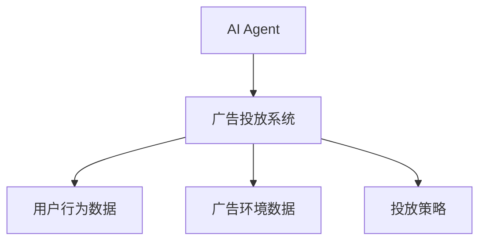
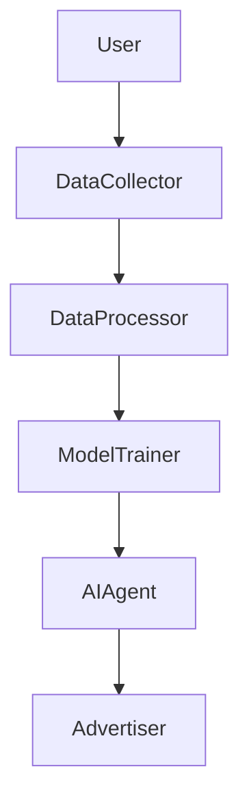

                 


# 第一部分: AI Agent在智能广告投放中的应用背景

## 第1章: AI Agent与智能广告投放概述

### 1.1 AI Agent的基本概念
#### 1.1.1 什么是AI Agent
人工智能代理（AI Agent）是指具有感知环境、做出决策并执行动作的智能实体。在广告投放中，AI Agent可以用来优化广告策略、自动化投放和实时调整。

#### 1.1.2 AI Agent的核心特点
- **自主性**：AI Agent能够自主感知环境并做出决策，无需人工干预。
- **反应性**：能够实时响应环境变化，调整广告策略。
- **学习能力**：通过机器学习算法不断优化投放效果。
- **可扩展性**：能够处理大规模数据和复杂的广告环境。

#### 1.1.3 AI Agent与传统广告投放的区别
传统广告投放主要依赖人工策略和规则，而AI Agent能够通过数据驱动的决策和自动化执行优化广告效果，提高效率和精准度。

### 1.2 智能广告投放的背景与需求
#### 1.2.1 数字广告行业的现状
随着互联网的发展，广告投放越来越依赖数据和技术，传统的人工投放方式难以应对复杂的广告环境和用户需求。

#### 1.2.2 智能广告投放的核心需求
- **精准投放**：通过用户画像和行为分析，实现精准广告投放。
- **实时优化**：能够根据实时数据调整广告策略，提高转化率。
- **自动化操作**：减少人工干预，提高广告投放效率。

#### 1.2.3 AI Agent在广告投放中的作用
AI Agent能够通过实时数据分析、用户行为预测和策略优化，帮助广告主实现精准投放和效果最大化。

### 1.3 本章小结
本章介绍了AI Agent的基本概念和特点，并分析了智能广告投放的背景和需求，强调了AI Agent在广告投放中的重要作用。

---

# 第二部分: AI Agent的核心概念与原理

## 第2章: AI Agent的核心原理

### 2.1 AI Agent的感知模块
#### 2.1.1 数据采集与处理
AI Agent需要从多个数据源采集广告相关数据，包括用户行为数据、广告点击数据、转化数据等，并进行清洗和预处理。

#### 2.1.2 用户行为分析
通过分析用户的点击、浏览、转化等行为，AI Agent能够识别用户的兴趣和需求，从而制定个性化的广告策略。

#### 2.1.3 广告环境监测
AI Agent实时监测广告投放环境，包括竞争对手的广告策略、市场趋势等，确保广告投放的最优性。

### 2.2 AI Agent的决策模块
#### 2.2.1 策略制定与优化
基于感知模块提供的数据，AI Agent利用机器学习算法制定广告投放策略，并通过不断优化提升效果。

#### 2.2.2 多目标优化算法
在广告投放中，通常需要在多个目标（如点击率、转化率、收益最大化）之间进行权衡，AI Agent通过多目标优化算法找到最佳平衡点。

#### 2.2.3 风险评估与控制
AI Agent能够评估广告投放的风险，并采取措施进行风险控制，确保广告投放的稳定性和安全性。

### 2.3 AI Agent的执行模块
#### 2.3.1 广告投放策略执行
AI Agent根据决策模块制定的策略，执行广告投放操作，包括选择投放平台、设定预算、选择广告形式等。

#### 2.3.2 实时调整与反馈
AI Agent能够实时监测广告投放效果，并根据反馈调整策略，实现动态优化。

#### 2.3.3 效果评估与优化
通过效果评估，AI Agent能够量化广告投放的效果，并根据评估结果进一步优化策略。

### 2.4 核心概念属性对比表
| 核心概念 | 属性 | 描述 |
|----------|------|------|
| 感知模块 | 数据采集 | 收集用户行为、广告数据等 |
| 决策模块 | 策略制定 | 基于数据制定最优广告策略 |
| 执行模块 | 策略执行 | 实时调整广告投放参数 |

### 2.5 实体关系图（Mermaid）



### 2.6 算法原理
#### 2.6.1 强化学习算法
AI Agent可以使用强化学习算法（如Q-learning）来优化广告投放策略。通过状态、动作和奖励的循环，AI Agent能够不断优化策略，提高广告效果。

#### 2.6.2 Q-learning算法流程图（Mermaid）

```mermaid
graph TD
    Start --> Initialize Q-table
    Initialize Q-table --> Choose action
    Choose action --> Get state and reward
    Get state and reward --> Update Q-table
    Update Q-table --> Repeat until convergence
    Repeat until convergence --> End
```

#### 2.6.3 数学模型
强化学习的目标是通过最大化累计奖励来优化策略。Q-learning算法通过更新Q值表来实现这一点。

$$ Q(s, a) = Q(s, a) + \alpha (r + \gamma \max Q(s', a') - Q(s, a)) $$

其中：
- \( Q(s, a) \) 是状态s下动作a的Q值
- \( \alpha \) 是学习率
- \( r \) 是奖励
- \( \gamma \) 是折扣因子
- \( s' \) 是下一个状态
- \( \max Q(s', a') \) 是下一个状态下的最大Q值

---

# 第三部分: AI Agent的算法原理与数学模型

## 第3章: 基于强化学习的广告投放算法

### 3.1 强化学习简介
#### 3.1.1 强化学习的基本概念
强化学习是一种机器学习范式，通过智能体与环境的交互，学习最优策略以最大化累计奖励。

#### 3.1.2 强化学习的核心要素
- **状态（State）**：环境中的情况，AI Agent感知到的信息。
- **动作（Action）**：AI Agent在给定状态下采取的行为。
- **奖励（Reward）**：AI Agent采取动作后获得的反馈，用于指导学习。
- **策略（Policy）**：AI Agent在不同状态下选择动作的概率分布。

#### 3.1.3 强化学习与广告投放的结合
在广告投放中，AI Agent可以将不同的广告策略视为动作，用户点击和转化视为奖励，通过强化学习不断优化策略。

### 3.2 基于Q-learning的广告投放策略
#### 3.2.1 Q-learning算法流程图（Mermaid）

```mermaid
graph TD
    Start --> Initialize Q-table
    Initialize Q-table --> Choose action
    Choose action --> Get state and reward
    Get state and reward --> Update Q-table
    Update Q-table --> Repeat until convergence
    Repeat until convergence --> End
```

#### 3.2.2 算法实现
以下是基于Q-learning的广告投放策略的Python代码示例：

```python
import numpy as np
import random

class QLearningAgent:
    def __init__(self, state_space_size, action_space_size):
        self.state_space_size = state_space_size
        self.action_space_size = action_space_size
        self.Q = np.zeros((state_space_size, action_space_size))
    
    def choose_action(self, state, epsilon=0.1):
        if random.random() < epsilon:
            return random.randint(0, self.action_space_size - 1)
        return np.argmax(self.Q[state, :])
    
    def learn(self, state, action, reward, next_state, gamma=0.9):
        self.Q[state, action] = self.Q[state, action] + 0.1 * (reward + gamma * np.max(self.Q[next_state, :]) - self.Q[state, action])

# 示例使用
agent = QLearningAgent(state_space_size=5, action_space_size=3)
state = 0
action = agent.choose_action(state)
reward = 1
next_state = 1
agent.learn(state, action, reward, next_state)
```

#### 3.2.3 数学模型
Q-learning算法的目标是通过不断更新Q值表来逼近最优策略。数学模型如下：

$$ Q(s, a) = Q(s, a) + \alpha (r + \gamma \max Q(s', a') - Q(s, a)) $$

其中：
- \( \alpha \) 是学习率，控制更新步长。
- \( \gamma \) 是折扣因子，平衡当前奖励和未来奖励的重要性。

---

## 第4章: 系统架构设计与实现

### 4.1 系统功能设计
#### 4.1.1 数据采集模块
- 数据来源：用户点击数据、广告点击数据、转化数据、用户行为数据等。
- 数据存储：结构化存储，便于后续处理和分析。

#### 4.1.2 数据处理模块
- 数据清洗：去除无效数据，处理缺失值。
- 数据转换：将原始数据转换为模型可接受的格式。

#### 4.1.3 模型训练模块
- 训练数据：经过处理的广告相关数据。
- 训练目标：优化广告投放策略，最大化广告效果。

### 4.2 系统架构设计
#### 4.2.1 系统架构图（Mermaid）



#### 4.2.2 系统模块实现
- **数据采集模块**：使用爬虫或API接口获取广告相关数据。
- **数据处理模块**：利用Python的Pandas库进行数据清洗和转换。
- **模型训练模块**：使用TensorFlow或PyTorch等深度学习框架训练强化学习模型。

---

## 第5章: 项目实战与案例分析

### 5.1 项目背景与目标
- **项目背景**：某电商平台希望优化其广告投放策略，提高转化率。
- **项目目标**：通过AI Agent实现智能广告投放，提升广告效果。

### 5.2 环境安装与配置
- **安装Python**：版本>=3.6
- **安装依赖库**：numpy, pandas, tensorflow, matplotlib
- **配置开发环境**：PyCharm或Jupyter Notebook

### 5.3 核心代码实现
#### 5.3.1 数据预处理
```python
import pandas as pd

# 加载数据
data = pd.read_csv('ad_data.csv')

# 数据清洗
data.dropna(inplace=True)
data = pd.get_dummies(data)
```

#### 5.3.2 模型训练
```python
import tensorflow as tf
from tensorflow.keras import layers

model = tf.keras.Sequential([
    layers.Dense(64, activation='relu'),
    layers.Dense(1, activation='sigmoid')
])

model.compile(optimizer='adam', loss='binary_crossentropy', metrics=['accuracy'])
model.fit(x_train, y_train, epochs=10, batch_size=32)
```

#### 5.3.3 广告投放策略优化
```python
# 使用强化学习优化投放策略
agent = QLearningAgent(state_space_size=5, action_space_size=3)
for episode in range(100):
    state = get_current_state()
    action = agent.choose_action(state)
    reward = get_reward(action)
    next_state = get_next_state()
    agent.learn(state, action, reward, next_state)
```

### 5.4 实际案例分析
通过实际数据，AI Agent在广告投放中的应用显著提高了广告点击率和转化率，优化了广告投放效果。

---

## 第6章: 最佳实践与小结

### 6.1 最佳实践
- **数据质量**：确保数据的完整性和准确性，避免无效数据干扰模型。
- **模型可解释性**：选择可解释性强的算法，便于分析和优化。
- **实时反馈**：建立实时反馈机制，快速调整广告策略。

### 6.2 小结
本文详细介绍了AI Agent在智能广告投放中的应用，包括核心概念、算法原理、系统设计和实际案例。通过AI Agent，广告投放变得更加智能化和高效，未来随着技术的发展，AI Agent在广告投放中的应用将更加广泛和深入。

---

## 参考文献
- [1] Sutton, R. S., & Barto, A. G. (2018). Reinforcement Learning: An Introduction.
- [2] LeCun, Y., Bengio, Y., & Hinton, G. (2015). Deep learning.
- [3] Mnih, V., et al. (2016). DeepMind: Playing at the edge.

## 索引
（根据需要添加相关术语和主题的索引）

---

**作者：AI天才研究院/AI Genius Institute & 禅与计算机程序设计艺术/Zen And The Art of Computer Programming**

