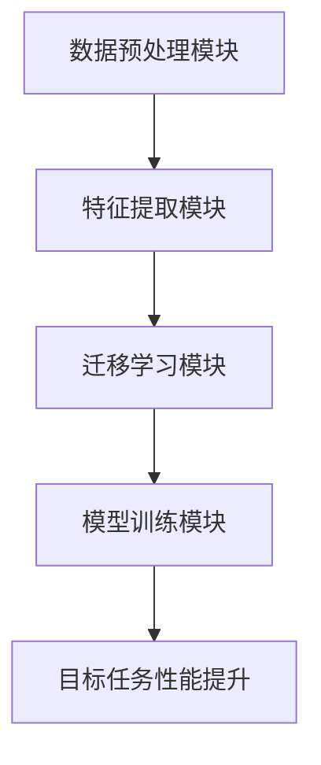

                 


# AI Agent的迁移学习在跨语言任务中的应用

> 关键词：AI Agent, 迁移学习, 跨语言任务, 多语言NLP, 机器学习, 迁移学习算法

> 摘要：  
AI Agent的迁移学习在跨语言任务中的应用是当前人工智能领域的重要研究方向。本文从AI Agent的基本概念出发，详细探讨了迁移学习的核心原理及其在跨语言任务中的具体应用。文章通过分析迁移学习的算法框架、系统架构设计以及实际项目案例，深入阐述了如何利用迁移学习技术提升AI Agent在多语言环境下的任务处理能力。通过本文的阅读，读者可以全面理解迁移学习在跨语言任务中的价值，并掌握相关技术的实现方法。

---

# 第一部分: AI Agent的迁移学习基础

## 第1章: AI Agent与迁移学习概述

### 1.1 AI Agent的基本概念

#### 1.1.1 AI Agent的定义与特点
AI Agent（人工智能代理）是指在计算机系统中，能够感知环境并采取行动以实现目标的智能实体。AI Agent的核心特点包括：

1. **自主性**：能够在没有外部干预的情况下自主决策。
2. **反应性**：能够根据环境输入实时调整行为。
3. **目标导向性**：所有行动均以实现特定目标为导向。
4. **社会性**：能够与其他AI Agent或人类交互协作。

AI Agent的应用场景广泛，包括自动驾驶、智能助手（如Siri、Alexa）、推荐系统等。

#### 1.1.2 AI Agent的核心功能与应用场景
AI Agent的核心功能包括感知、推理、规划和执行。其应用场景主要集中在以下几个方面：
- **自然语言处理**：如智能对话系统、机器翻译。
- **智能推荐系统**：如个性化推荐、广告投放。
- **自动驾驶**：如路径规划、障碍物识别。
- **智能监控**：如视频监控、异常行为 detection。

#### 1.1.3 迁移学习的定义与特点
迁移学习是一种机器学习技术，旨在将从源任务（source task）学到的知识迁移到目标任务（target task），以提高目标任务的性能。其特点包括：
- **领域适应性**：能够将知识从一个领域迁移到另一个相关领域。
- **任务多样性**：能够处理不同任务之间的迁移。
- **数据效率**：在目标任务数据有限的情况下，仍能有效提升性能。

### 1.2 迁移学习的背景与意义

#### 1.2.1 迁移学习的背景介绍
在传统的机器学习任务中，通常需要大量标注数据才能训练出高性能模型。然而，在实际应用中，获取目标任务的标注数据往往成本高昂且耗时。迁移学习通过利用已有的源任务数据，有效缓解了这一问题，成为机器学习领域的重要研究方向。

#### 1.2.2 迁移学习的核心思想与优势
迁移学习的核心思想是“知识迁移”，即利用源任务和目标任务之间的相似性，将已有的知识迁移到目标任务。其主要优势包括：
- **减少数据需求**：在目标任务数据有限的情况下，仍能提升模型性能。
- **提升泛化能力**：通过跨任务学习，模型具有更强的泛化能力。
- **降低训练成本**：减少对目标任务数据的依赖，降低数据采集和标注成本。

#### 1.2.3 迁移学习在AI Agent中的应用价值
在AI Agent中，迁移学习的应用价值主要体现在以下几个方面：
- **跨语言任务处理**：通过迁移学习，AI Agent能够快速适应不同语言的任务需求。
- **多任务学习**：AI Agent可以同时处理多个相关任务，提升整体性能。
- **动态环境适应**：在动态变化的环境中，AI Agent能够快速调整策略，适应新任务。

### 1.3 跨语言任务的挑战与机遇

#### 1.3.1 跨语言任务的基本概念
跨语言任务是指在不同语言之间进行信息处理的任务，如机器翻译、跨语言信息检索、跨语言情感分析等。这类任务的核心挑战在于不同语言之间的语义差异和语法结构差异。

#### 1.3.2 跨语言任务中的主要挑战
跨语言任务面临的主要挑战包括：
1. **语义鸿沟**：不同语言之间的语义差异可能导致信息丢失或误解。
2. **数据稀缺性**：目标语言的标注数据可能非常有限。
3. **计算复杂度**：跨语言任务通常需要处理大量数据和复杂的计算。

#### 1.3.3 迁移学习在跨语言任务中的应用前景
迁移学习为跨语言任务提供了新的解决方案。通过迁移学习，AI Agent可以从一种语言任务中学习到的知识迁移到另一种语言任务，从而在数据稀缺的情况下仍能保持较高的性能。例如，在机器翻译任务中，可以利用已有的双语数据进行迁移学习，提升目标语言的翻译质量。

---

## 第2章: 迁移学习的核心概念与原理

### 2.1 迁移学习的核心概念

#### 2.1.1 数据、模型与任务的关系
在迁移学习中，数据、模型和任务三者之间存在密切关系。模型通过源任务数据学习到的特征和规律，可以迁移到目标任务中。数据、模型和任务之间的关系可以用以下公式表示：

$$ \text{模型} = f(\text{源任务数据}, \text{源任务目标}) $$

$$ \text{目标任务性能} = f_{\text{target}}(\text{模型}, \text{目标任务数据}) $$

#### 2.1.2 迁移学习的核心原理概述
迁移学习的核心原理是通过共享特征或参数，将源任务和目标任务之间的相似性利用起来。其核心思想是：如果两个任务共享某些特征或规律，那么可以将这些特征或规律迁移到目标任务中。

#### 2.1.3 迁移学习的三要素分析
迁移学习的三要素包括：
1. **源任务（Source Task）**：用于迁移学习的源任务，其数据和任务与目标任务相关。
2. **目标任务（Target Task）**：需要通过迁移学习提升性能的任务。
3. **迁移策略（Transfer Strategy）**：如何将源任务的知识迁移到目标任务的方法。

### 2.2 迁移学习与传统机器学习的对比

#### 2.2.1 传统机器学习的特点与局限性
传统机器学习方法通常需要大量标注数据，并且假设训练数据和测试数据来自同一分布。其局限性在于：
- 数据需求量大。
- 无法有效处理跨任务或跨领域的数据。

#### 2.2.2 迁移学习的优势与创新点
迁移学习的优势在于：
- 可以利用源任务的数据和知识，减少目标任务的数据需求。
- 能够处理跨任务或跨领域的数据，提升模型的泛化能力。

#### 2.2.3 迁移学习与传统机器学习的联系与区别
迁移学习与传统机器学习的联系在于，两者都依赖于数据驱动的方法。区别在于，迁移学习强调跨任务或跨领域的知识迁移，而传统机器学习则专注于单任务学习。

### 2.3 迁移学习的分类与应用场景

#### 2.3.1 迁移学习的分类方法
迁移学习可以分为以下几类：
1. **基于特征的迁移学习**：通过提取特征并将其迁移到目标任务。
2. **基于参数的迁移学习**：通过共享模型参数来实现知识迁移。
3. **基于实例的迁移学习**：通过相似实例的迁移来提升目标任务性能。

#### 2.3.2 不同迁移学习方法的适用场景
- **基于特征的迁移学习**适用于特征空间相似的任务。
- **基于参数的迁移学习**适用于模型结构相似的任务。
- **基于实例的迁移学习**适用于数据分布相似的任务。

#### 2.3.3 迁移学习在AI Agent中的具体应用
在AI Agent中，迁移学习可以应用于以下场景：
- **跨语言对话系统**：通过迁移学习，提升AI Agent在不同语言对话中的表现。
- **多任务学习**：通过迁移学习，同时处理多个相关任务，提升整体性能。
- **动态环境适应**：通过迁移学习，快速适应环境变化，调整任务策略。

---

## 第3章: 迁移学习的算法原理

### 3.1 迁移学习的算法框架

#### 3.1.1 迁移学习的基本算法框架
迁移学习的算法框架通常包括以下步骤：
1. **数据预处理**：对源任务和目标任务的数据进行预处理，提取特征。
2. **模型训练**：在源任务数据上训练模型，提取特征或参数。
3. **知识迁移**：将源任务的特征或参数迁移到目标任务。
4. **目标任务训练**：在目标任务数据上微调模型，提升性能。

#### 3.1.2 基于特征的迁移学习方法
基于特征的迁移学习方法通过提取共享特征，将这些特征迁移到目标任务中。其流程如下：

1. **特征提取**：在源任务数据上训练特征提取器，提取特征。
2. **特征迁移**：将提取的特征迁移到目标任务。
3. **目标任务训练**：在目标任务数据上训练模型，使用迁移后的特征。

#### 3.1.3 基于参数的迁移学习方法
基于参数的迁移学习方法通过共享模型参数，将源任务的知识迁移到目标任务中。其流程如下：

1. **参数共享**：在源任务和目标任务之间共享模型参数。
2. **目标任务微调**：在目标任务数据上微调模型，优化参数。

### 3.2 迁移学习的数学模型与公式

#### 3.2.1 基于特征的迁移学习公式
假设源任务和目标任务的特征空间分别为$X_s$和$X_t$，类别标签分别为$Y_s$和$Y_t$。基于特征的迁移学习的目标是最小化目标任务的分类误差：

$$ \min_{\theta} \sum_{i=1}^{n_t} \mathbb{I}(f_t(x_{t_i}; \theta) \neq y_{t_i}) $$

其中，$f_t$是目标任务的分类函数，$\theta$是共享参数。

#### 3.2.2 基于参数的迁移学习公式
基于参数的迁移学习通过共享参数$\theta$，在源任务和目标任务之间建立联系。其目标函数可以表示为：

$$ \min_{\theta} \sum_{i=1}^{n_s} \mathbb{I}(f_s(x_{s_i}; \theta) \neq y_{s_i}) + \sum_{i=1}^{n_t} \mathbb{I}(f_t(x_{t_i}; \theta) \neq y_{t_i}) $$

其中，$f_s$和$f_t$分别是源任务和目标任务的分类函数。

#### 3.2.3 迁移学习的相似度计算公式
在基于实例的迁移学习中，通常需要计算源任务和目标任务之间的相似度。相似度计算公式可以表示为：

$$ \text{similarity}(x_s, x_t) = \frac{x_s^T x_t}{\|x_s\| \|x_t\|} $$

其中，$x_s$和$x_t$分别是源任务和目标任务的特征向量。

---

## 第4章: 系统架构设计与实现

### 4.1 系统架构设计

#### 4.1.1 系统功能设计
跨语言迁移学习系统的功能模块包括：
1. **数据预处理模块**：对源任务和目标任务的数据进行清洗和标注。
2. **特征提取模块**：提取源任务和目标任务的特征。
3. **迁移学习模块**：实现知识迁移，提升目标任务性能。
4. **模型训练模块**：在目标任务数据上训练模型，优化性能。

#### 4.1.2 系统架构图
以下是跨语言迁移学习系统的架构图：



#### 4.1.3 系统接口设计
系统接口包括：
1. **数据输入接口**：接收源任务和目标任务的数据。
2. **模型训练接口**：训练模型，输出目标任务的性能指标。
3. **结果输出接口**：输出目标任务的预测结果。

#### 4.1.4 系统交互流程
跨语言迁移学习系统的交互流程如下：

1. **数据输入**：用户输入源任务和目标任务的数据。
2. **数据预处理**：系统对数据进行清洗和标注。
3. **特征提取**：提取源任务和目标任务的特征。
4. **知识迁移**：将源任务的知识迁移到目标任务。
5. **模型训练**：在目标任务数据上训练模型，优化性能。
6. **结果输出**：输出目标任务的预测结果和性能指标。

### 4.2 项目实战

#### 4.2.1 环境安装
需要安装以下环境和库：
- Python 3.6+
- TensorFlow或PyTorch
- NLTK或spaCy（用于自然语言处理）
- Scikit-learn（用于机器学习）

#### 4.2.2 核心代码实现
以下是基于迁移学习的跨语言任务实现代码示例：

```python
import tensorflow as tf
from tensorflow.keras import layers

# 定义迁移学习模型
def build_model(input_shape):
    inputs = layers.Input(shape=input_shape)
    x = layers.Dense(128, activation='relu')(inputs)
    x = layers.Dense(64, activation='relu')(x)
    outputs = layers.Dense(10, activation='softmax')(x)
    return tf.keras.Model(inputs=inputs, outputs=outputs)

# 迁移学习实现
source_model = build_model((input_dim,))
source_model.compile(optimizer='adam', loss='sparse_categorical_crossentropy', metrics=['accuracy'])
source_model.fit(source_data, source_labels, epochs=10, batch_size=32)

# 知识迁移
for layer in source_model.layers[:-1]:
    layer.trainable = False

target_model = build_model((input_dim,))
target_model.compile(optimizer='adam', loss='sparse_categorical_crossentropy', metrics=['accuracy'])
target_model.fit(target_data, target_labels, epochs=10, batch_size=32)
```

#### 4.2.3 代码解读与分析
上述代码实现了基于迁移学习的跨语言任务处理。首先，定义了一个迁移学习模型，并在源任务数据上进行训练。然后，将源任务模型的前几层设置为不可训练，仅在目标任务数据上进行微调，从而实现知识迁移。

#### 4.2.4 实际案例分析
以机器翻译任务为例，假设我们已经在源语言（英语）上训练了一个神经机器翻译模型。现在，我们需要将这个模型迁移到目标语言（中文）。具体步骤如下：
1. **数据预处理**：将源语言和目标语言的数据进行清洗和标注。
2. **特征提取**：提取源语言和目标语言的特征。
3. **知识迁移**：将源语言模型的特征迁移到目标语言任务。
4. **模型训练**：在目标语言数据上微调模型，优化性能。
5. **结果输出**：输出目标语言的翻译结果和性能指标。

---

## 第5章: 总结与展望

### 5.1 总结
本文从AI Agent的基本概念出发，详细探讨了迁移学习的核心原理及其在跨语言任务中的具体应用。通过分析迁移学习的算法框架、系统架构设计以及实际项目案例，深入阐述了如何利用迁移学习技术提升AI Agent在多语言环境下的任务处理能力。

### 5.2 未来展望
未来的研究方向包括：
1. **多模态迁移学习**：结合文本、图像等多种模态信息，提升迁移学习的性能。
2. **自适应迁移学习**：研究如何动态调整迁移策略，以适应不断变化的环境。
3. **迁移学习的可解释性**：研究如何提升迁移学习的可解释性，使其更易于理解和应用。

### 5.3 最佳实践 tips

#### 5.3.1 迁移学习的注意事项
- **数据质量**：确保源任务和目标任务的数据质量，避免噪声干扰。
- **任务相似性**：确保源任务和目标任务之间的相似性，以提高迁移效果。
- **模型选择**：选择适合迁移学习的模型和算法，避免过度拟合。

#### 5.3.2 迁移学习的优化建议
- **数据增强**：通过数据增强技术，增加数据多样性，提升模型的泛化能力。
- **模型微调**：在目标任务数据上进行微调，优化模型性能。
- **特征选择**：选择适合迁移学习的特征，提升迁移效果。

#### 5.3.3 进阶学习建议
- **深入理解迁移学习的原理**：掌握迁移学习的核心思想和算法框架。
- **实践项目经验**：通过实际项目，积累迁移学习的实践经验。
- **关注最新研究**：关注迁移学习领域的最新研究，保持技术更新。

---

# 作者：AI天才研究院/AI Genius Institute & 禅与计算机程序设计艺术 /Zen And The Art of Computer Programming

