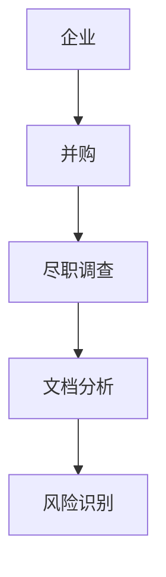
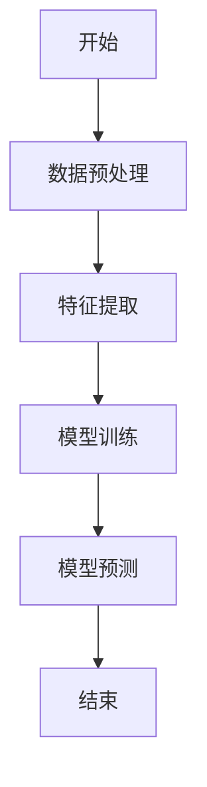
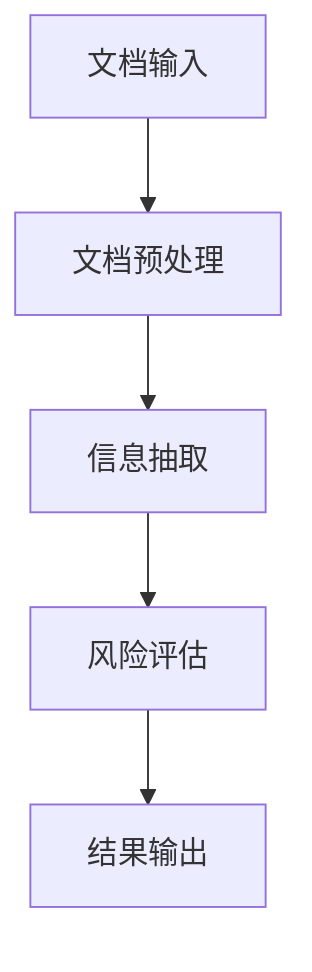
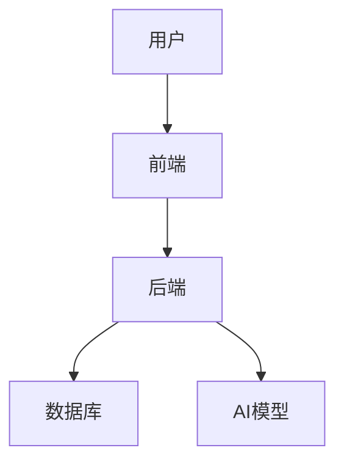
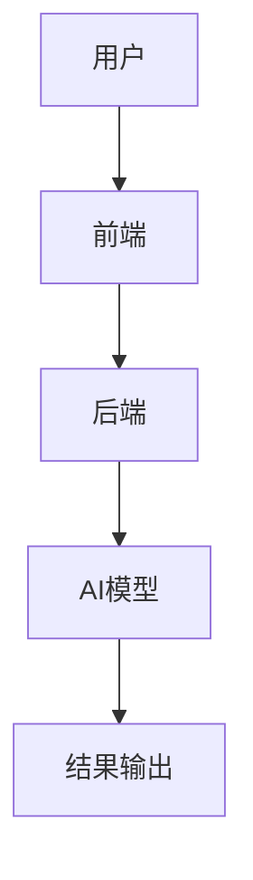

                 


# AI辅助企业并购尽职调查：自动化文档分析与风险识别

**关键词**：AI，企业并购，尽职调查，文档分析，风险识别，NLP，机器学习，知识图谱

**摘要**：本文详细探讨了AI技术在企业并购尽职调查中的应用，重点分析了自然语言处理（NLP）、机器学习和数据挖掘在文档分析与风险识别中的作用。通过系统化的分析和实际案例，本文揭示了AI如何提高尽职调查的效率和准确性，为企业并购决策提供有力支持。文章还详细介绍了AI辅助尽职调查的核心算法原理、系统架构设计以及项目实战，为读者提供了从理论到实践的全面指导。

---

# 第一部分: AI辅助企业并购尽职调查的背景与核心概念

## 第1章: 企业并购与尽职调查的背景

### 1.1 企业并购的定义与重要性

#### 1.1.1 企业并购的基本概念
企业并购（Mergers and Acquisitions, M&A）是指一家企业与其他企业合并或收购其资产、股权等行为。并购是企业扩大规模、优化资源、提升竞争力的重要手段。在并购过程中，尽职调查是确保交易安全、降低风险的核心环节。

#### 1.1.2 并购在企业发展中的作用
- **资源优化**：通过并购整合资源，降低重复投资。
- **市场扩展**：快速进入新市场，扩大业务范围。
- **技术获取**：通过并购获取关键技术或专利。
- **成本降低**：通过规模效应和协同效应降低成本。

#### 1.1.3 并购过程中的关键环节
- **尽职调查**：评估目标企业的财务、法律、运营等方面的风险。
- **估值分析**：确定目标企业的价值。
- **交易结构设计**：设计合理的并购方案。

### 1.2 尽职调查的核心地位

#### 1.2.1 尽职调查的定义与范围
尽职调查是指在企业并购过程中，对目标企业进行全面、深入的调查，以评估其经营状况、财务健康性、法律风险等。尽职调查通常包括以下几个方面：
- **财务尽职调查**：审查财务报表、资产状况、负债情况。
- **法律尽职调查**：审查公司章程、合同、知识产权、诉讼等。
- **运营尽职调查**：审查生产流程、供应链、员工状况等。

#### 1.2.2 尽职调查在企业并购中的作用
- **风险识别**：发现潜在的法律、财务或运营风险。
- **价值评估**：为估值提供依据。
- **谈判支持**：为并购谈判提供支持。

#### 1.2.3 尽职调查的主要内容
- 财务状况：收入、利润、资产负债表等。
- 法律问题：诉讼、合同纠纷、知识产权等。
- 运营问题：供应链、生产流程、员工关系等。
- 市场风险：行业竞争、市场需求等。

### 1.3 AI技术在企业并购中的应用前景

#### 1.3.1 AI技术对企业并购的潜在价值
AI技术可以通过自动化处理大量文档，快速提取关键信息，显著提高尽职调查的效率和准确性。此外，AI还可以帮助识别潜在风险，提供决策支持。

#### 1.3.2 AI在尽职调查中的应用优势
- **高效性**：AI可以快速处理大量文档，减少人工工作量。
- **准确性**：AI可以通过机器学习模型提高信息提取的准确性。
- **智能化**：AI可以识别潜在风险，提供预警。

#### 1.3.3 AI技术在企业并购中的未来趋势
- **智能化**：AI将更加智能化，能够自动识别和分析潜在风险。
- **数据驱动**：AI将基于大数据分析，提供更加精准的决策支持。
- **实时监控**：AI将实时监控企业运营状况，提供动态风险评估。

---

## 第2章: AI辅助尽职调查的核心概念

### 2.1 自然语言处理（NLP）在文档分析中的应用

#### 2.1.1 NLP的基本概念与技术
自然语言处理（NLP）是人工智能的核心技术之一，主要用于处理人类语言。NLP技术包括文本分词、实体识别、情感分析、文本分类等。

#### 2.1.2 NLP在文档分析中的具体应用
- **文本分词**：将文档中的文本分割成单词或短语。
- **实体识别**：识别文档中的关键实体，如人名、地名、组织名等。
- **文本分类**：根据内容对文档进行分类，如财务报表、合同等。

#### 2.1.3 NLP技术的优缺点
- **优点**：能够快速处理大量文本，提高效率。
- **缺点**：需要大量标注数据，且对语言的理解有限。

### 2.2 机器学习与风险识别

#### 2.2.1 机器学习的基本原理
机器学习是一种人工智能技术，通过数据训练模型，使其能够自动识别模式。常用的机器学习算法包括支持向量机（SVM）、随机森林、神经网络等。

#### 2.2.2 机器学习在风险识别中的应用
- **风险分类**：通过机器学习模型对风险进行分类，如财务风险、法律风险等。
- **风险预测**：通过历史数据训练模型，预测未来风险。

#### 2.2.3 常见的机器学习算法及其特点
- **支持向量机（SVM）**：适合小数据集，分类能力强。
- **随机森林**：适合大数据集，抗过拟合能力强。
- **神经网络**：适合复杂任务，如图像识别、自然语言处理。

### 2.3 数据挖掘与知识图谱构建

#### 2.3.1 数据挖掘的基本概念与技术
数据挖掘是从大量数据中提取有价值信息的过程。常用的数据挖掘技术包括聚类、分类、关联规则挖掘等。

#### 2.3.2 数据挖掘在尽职调查中的应用
- **关联规则挖掘**：发现文档中的关联信息，如合同和财务数据之间的关联。
- **聚类分析**：将相似的文档进行分组，便于分析。

#### 2.3.3 知识图谱的构建与应用
知识图谱是一种结构化的数据表示方法，能够将分散的信息整合成一个网络。知识图谱在尽职调查中的应用包括：
- **信息整合**：将多个文档中的信息整合成一个知识网络。
- **关系挖掘**：发现文档中的潜在关系，如供应商与客户的关联。

### 2.4 核心概念与联系

#### 2.4.1 核心概念的原理与属性对比
下表对比了NLP、机器学习和数据挖掘的核心概念与技术：

| **技术** | **核心概念** | **技术特点** |
|----------|--------------|--------------|
| NLP      | 文本处理     | 基于语言学规则，处理自然语言文本 |
| 机器学习 | 模型训练     | 基于数据训练，识别模式和规律 |
| 数据挖掘 | 数据分析     | 从数据中提取有价值的信息和模式 |

#### 2.4.2 ER实体关系图架构的Mermaid流程图


---

## 第3章: AI辅助尽职调查的算法原理

### 3.1 文本分类算法

#### 3.1.1 文本分类的基本原理
文本分类是根据文本内容将其归类到预定类别的过程。常用的文本分类算法包括朴素贝叶斯、支持向量机（SVM）、随机森林等。

#### 3.1.2 常见文本分类算法的优缺点
- **朴素贝叶斯**：简单高效，适合小数据集。
- **SVM**：适合小数据集，分类能力强。
- **随机森林**：适合大数据集，抗过拟合能力强。

#### 3.1.3 基于机器学习的文本分类流程


### 3.2 实体识别与信息抽取

#### 3.2.1 实体识别的定义与技术
实体识别是指从文本中识别出关键实体，如人名、地名、组织名等。常用技术包括基于规则的实体识别和基于深度学习的实体识别。

#### 3.2.2 信息抽取的流程与方法
- **数据预处理**：清洗数据，去除噪声。
- **特征提取**：提取文本中的关键词和短语。
- **模型训练**：训练实体识别模型。
- **结果输出**：输出识别出的实体。

#### 3.2.3 基于深度学习的实体识别模型
- **模型结构**：常用循环神经网络（RNN）或变压器（Transformer）架构。
- **训练数据**：需要大量标注数据。

### 3.3 风险评估与预测算法

#### 3.3.1 风险评估的基本原理
风险评估是通过分析历史数据和当前数据，预测未来可能出现的风险。常用的风险评估算法包括逻辑回归、支持向量机（SVM）、随机森林等。

#### 3.3.2 基于机器学习的风险预测模型
- **数据预处理**：清洗数据，处理缺失值。
- **特征提取**：提取影响风险的关键特征。
- **模型训练**：训练风险预测模型。
- **模型评估**：评估模型的准确性和效果。

#### 3.3.3 常见的风险评估算法及其应用
- **逻辑回归**：适合二分类问题，如风险高低分类。
- **SVM**：适合小数据集，分类能力强。
- **随机森林**：适合大数据集，抗过拟合能力强。

### 3.4 算法流程图


---

## 第4章: AI辅助尽职调查的系统分析与架构设计

### 4.1 系统功能设计

#### 4.1.1 功能模块
- **文档预处理模块**：对文档进行清洗和格式化。
- **信息抽取模块**：提取文档中的关键信息。
- **风险评估模块**：对提取的信息进行风险评估。
- **结果输出模块**：输出评估结果。

#### 4.1.2 功能流程


### 4.2 系统架构设计

#### 4.2.1 架构图


#### 4.2.2 接口设计
- **前端接口**：用户输入文档，获取评估结果。
- **后端接口**：处理文档，调用AI模型进行评估。

#### 4.2.3 交互流程


---

## 第5章: 项目实战

### 5.1 环境安装

#### 5.1.1 安装Python
```bash
python --version
```

#### 5.1.2 安装相关库
```bash
pip install numpy
pip install pandas
pip install scikit-learn
pip install spacy
```

### 5.2 核心代码实现

#### 5.2.1 文本分类代码
```python
from sklearn.feature_extraction.text import TfidfVectorizer
from sklearn.svm import SVC
from sklearn.metrics import accuracy_score

# 数据预处理
corpus = [...]  # 文档列表
labels = [...]  # 标签列表

# 特征提取
vectorizer = TfidfVectorizer()
X = vectorizer.fit_transform(corpus)

# 模型训练
model = SVC()
model.fit(X, labels)

# 模型预测
test_corpus = [...]  # 测试文档
test_X = vectorizer.transform(test_corpus)
predicted_labels = model.predict(test_X)

# 结果评估
print(accuracy_score(labels, predicted_labels))
```

#### 5.2.2 实体识别代码
```python
import spacy

# 加载模型
nlp = spacy.load("en_core_web_sm")

# 文本处理
doc = nlp("This is a sample text.")

# 实体识别
for ent in doc.ents:
    print(ent.text, ent.label_)
```

---

## 第6章: 最佳实践与小结

### 6.1 最佳实践

#### 6.1.1 数据质量
- 确保数据的完整性和准确性。
- 处理噪声数据，提高模型效果。

#### 6.1.2 模型选择
- 根据数据量和任务选择合适的算法。
- 多模型对比，选择最优模型。

#### 6.1.3 模型调优
- 调整超参数，优化模型性能。
- 使用交叉验证，避免过拟合。

### 6.2 小结

本文详细探讨了AI技术在企业并购尽职调查中的应用，重点分析了自然语言处理（NLP）、机器学习和数据挖掘在文档分析与风险识别中的作用。通过系统化的分析和实际案例，本文揭示了AI如何提高尽职调查的效率和准确性，为企业并购决策提供有力支持。文章还详细介绍了AI辅助尽职调查的核心算法原理、系统架构设计以及项目实战，为读者提供了从理论到实践的全面指导。

### 6.3 注意事项

- **数据隐私**：处理企业数据时，需注意数据隐私和合规性。
- **模型解释性**：复杂的模型可能难以解释，需注意模型的可解释性。
- **持续优化**：定期更新模型，适应新的数据和业务需求。

### 6.4 拓展阅读

- **NLP经典论文**：阅读NLP领域的经典论文，深入理解技术原理。
- **机器学习书籍**：阅读机器学习的经典书籍，如《机器学习实战》。
- **知识图谱研究**：研究知识图谱的构建与应用，探索其在尽职调查中的潜在价值。

---

**作者：AI天才研究院/AI Genius Institute & 禅与计算机程序设计艺术/Zen And The Art of Computer Programming**

