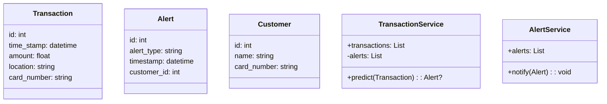
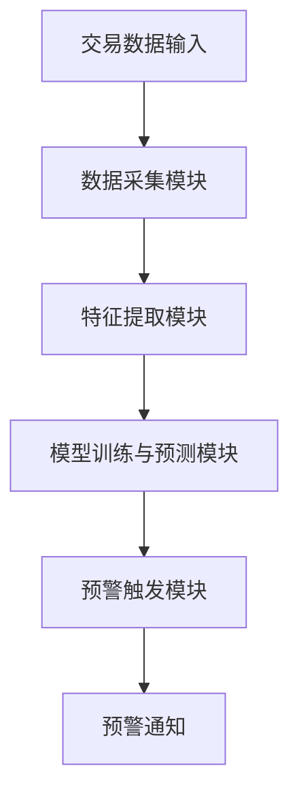
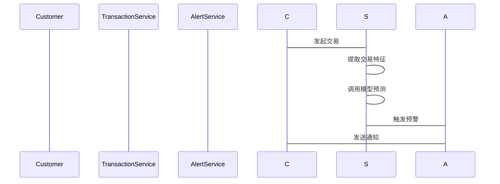

                 


# AI驱动的信用卡异常交易实时预警

> 关键词：AI技术，信用卡交易，异常交易检测，实时预警系统，机器学习，时间序列分析，深度学习

> 摘要：本文详细介绍了如何利用AI技术实现信用卡异常交易的实时预警。通过分析异常交易的特征和分类，探讨了传统交易监控的局限性以及AI技术在实时预警中的优势。文章从背景、核心概念、算法原理、系统架构到项目实战，全面阐述了AI驱动的异常交易检测系统的构建过程，并通过具体案例分析展示了系统的实际应用效果。本文旨在为金融机构提供一种高效、可靠的解决方案，以降低信用卡欺诈风险。

---

# 第一部分: 背景与问题分析

## 第1章: 信用卡异常交易实时预警的背景与问题

### 1.1 异常交易的定义与特征

#### 1.1.1 信用卡交易的基本流程

- **定义**: 信用卡交易是指用户通过信用卡进行消费、转账或其他金融操作的过程。
- **流程**: 交易请求 -> 发卡行验证 -> 商户确认 -> 交易完成。

#### 1.1.2 异常交易的分类

- **正常交易**: 符合用户消费习惯的交易。
- **异常交易**:
  - **欺诈交易**: 非法获取他人信用卡信息进行的交易。
  - **误刷交易**: 用户因操作失误导致的异常交易。
  - **高风险交易**: 交易金额、地点或时间异常，可能存在风险。

#### 1.1.3 异常交易的危害与影响

- **用户损失**: 用户可能因欺诈交易遭受资金损失。
- **银行风险**: 银行需承担欺诈交易的损失，并面临声誉风险。
- **系统负担**: 大量异常交易可能对交易系统造成压力。

### 1.2 实时预警系统的重要性

#### 1.2.1 传统交易监控的局限性

- **延迟性**: 传统监控系统通常无法实时处理交易数据。
- **误报率高**: 基于规则的系统容易误报正常交易为异常交易。
- **维护成本高**: 需要手动调整规则，维护成本较高。

#### 1.2.2 AI技术在实时预警中的优势

- **实时性**: AI算法可以实时处理交易数据，快速识别异常交易。
- **准确性**: 基于机器学习的模型能够学习交易模式，提高检测准确性。
- **自适应性**: AI系统能够自动调整模型参数，适应新的欺诈手段。

#### 1.2.3 信用卡行业对实时预警的需求

- **合规要求**: 金融机构需要符合反洗钱法规和支付清算协会的要求。
- **用户体验**: 提供及时的预警服务，保护用户资金安全。
- **成本控制**: 通过减少欺诈交易，降低银行的损失。

### 1.3 问题背景与目标

#### 1.3.1 问题背景分析

- **背景**: 随着信用卡普及，欺诈手段日益复杂，传统的交易监控系统已难以应对。
- **现状**: 银行需要一种高效、智能的解决方案来实时监控交易。

#### 1.3.2 问题描述与解决目标

- **问题描述**: 如何利用AI技术实时检测信用卡交易中的异常行为。
- **解决目标**: 构建一个基于AI的实时预警系统，能够快速、准确地识别异常交易。

#### 1.3.3 边界与外延

- **边界**: 仅关注信用卡交易，不涉及借记卡或其他支付方式。
- **外延**: 系统仅处理交易数据，不涉及用户信用评估或其他业务。

### 1.4 核心概念与系统架构

#### 1.4.1 核心概念的定义与属性

| 核心概念 | 定义 | 属性 |
|----------|------|------|
| 交易数据 | 信用卡交易的详细记录 | 时间戳、交易金额、地点、用户行为 |
| 异常交易 | 可能存在欺诈或误刷的交易 | 高风险、低概率、时间集中 |
| 预警系统 | 实时监控并通知异常交易的系统 | 实时性、准确性、可扩展性 |

#### 1.4.2 实体关系图（ER图）

```mermaid
erd
    Customer
    --------
    id
    name
    card_number

    Transaction
    -----------
    id
    time_stamp
    amount
    location
    card_number

    Alert
    -----
    id
    alert_type
    timestamp
    customer_id
```

---

## 第2章: AI驱动的异常交易检测核心概念

### 2.1 异常交易检测的核心要素

#### 2.1.1 交易数据的特征提取

- **交易金额**: 金额是否符合用户消费习惯。
- **交易时间**: 是否在用户常用地点或时间段之外。
- **交易频率**: 是否出现短时间内多次交易。
- **用户行为**: 是否符合用户的消费模式。

#### 2.1.2 异常检测的数学模型

- **异常检测模型**: 基于统计学或机器学习的模型，用于识别异常交易。
- **实时预测**: 模型需要在交易发生时实时预测是否为异常交易。

#### 2.1.3 实时预警的触发机制

- **阈值触发**: 当交易特征超过预设阈值时触发预警。
- **概率触发**: 当交易被模型判定为高概率异常时触发预警。

### 2.2 核心概念的对比分析

#### 2.2.1 交易数据与异常交易的对比表格

| 特征 | 交易数据 | 异常交易 |
|------|----------|----------|
| 时间 | 随机分布 | 时间集中 |
| 金额 | 符合消费习惯 | 金额异常 |
| 地点 | 符合用户习惯 | 地点异常 |

#### 2.2.2 检测算法的优劣势对比

| 算法 | 优势 | 劣势 |
|------|-------|-------|
| 时间序列分析 | 易于实现 | 对异常点敏感 |
| 机器学习 | 高准确性 | 需要大量数据 |
| 深度学习 | 强大学习能力 | 计算资源需求高 |

### 2.3 系统架构的模块化设计

#### 2.3.1 数据采集模块

- **功能**: 采集信用卡交易数据，包括时间戳、交易金额、地点等。
- **输入**: 交易日志文件或数据库。
- **输出**: 结构化交易数据。

#### 2.3.2 特征提取模块

- **功能**: 从交易数据中提取特征，如交易金额、时间间隔、地理位置等。
- **输入**: 结构化交易数据。
- **输出**: 特征向量。

#### 2.3.3 模型训练与预测模块

- **功能**: 使用特征向量训练异常检测模型，并对新交易进行预测。
- **输入**: 特征向量。
- **输出**: 预测结果（正常/异常）。

#### 2.3.4 预警触发模块

- **功能**: 根据模型预测结果触发预警。
- **输入**: 模型预测结果。
- **输出**: 预警通知。

---

## 第3章: 异常交易检测的算法原理

### 3.1 时间序列分析算法

#### 3.1.1 ARIMA模型的原理与公式

- **原理**: ARIMA模型通过自回归和滑动平均来预测时间序列数据。
- **公式**: $$ ARIMA(p, d, q) = 0 $$

#### 3.1.2 时间序列分析的应用

- **案例**: 使用ARIMA模型分析信用卡交易的时间分布，识别异常交易的时间特征。

### 3.2 基于机器学习的异常检测

#### 3.2.1 随机森林算法的原理与公式

- **原理**: 随机森林通过构建多棵决策树并进行投票来预测结果。
- **公式**: $$ \text{概率预测} = \sum_{i=1}^{n} \text{投票权重} \times \text{特征重要性} $$

#### 3.2.2 机器学习模型的应用

- **案例**: 使用随机森林模型训练信用卡交易数据，识别异常交易的概率。

### 3.3 深度学习模型的应用

#### 3.3.1 LSTM网络的原理与公式

- **原理**: LSTM通过遗忘门和输入门来记忆和更新状态。
- **公式**: $$ \text{LSTM}(t) = \text{遗忘门} \times \text{状态} + \text{输入门} \times \text{输入} $$

#### 3.3.2 深度学习模型的应用

- **案例**: 使用LSTM网络分析信用卡交易的时间序列数据，预测异常交易。

---

## 第4章: 系统分析与架构设计

### 4.1 问题场景介绍

- **场景描述**: 银行需要实时监控信用卡交易，快速识别并预警异常交易。
- **目标用户**: 信用卡用户、银行风险管理团队。

### 4.2 项目介绍

- **项目名称**: AI驱动的信用卡异常交易实时预警系统。
- **项目目标**: 构建一个高效、智能的实时预警系统，降低信用卡欺诈风险。

### 4.3 系统功能设计

#### 4.3.1 领域模型（Mermaid类图）



### 4.4 系统架构设计

#### 4.4.1 系统架构图（Mermaid架构图）



#### 4.4.2 系统接口设计

- **输入接口**: 交易数据接口、用户信息接口。
- **输出接口**: 预警通知接口、分析报告接口。

#### 4.4.3 系统交互流程图（Mermaid序列图）



---

## 第5章: 项目实战

### 5.1 环境安装与配置

#### 5.1.1 安装Python与相关库

- **Python版本**: 3.8+
- **依赖库**: numpy、pandas、scikit-learn、keras、tensorflow.

#### 5.1.2 数据集准备

- **数据来源**: 信用卡交易日志。
- **数据格式**: CSV格式，包含时间戳、交易金额、地点、用户ID等。

### 5.2 核心代码实现

#### 5.2.1 数据预处理代码

```python
import pandas as pd
from sklearn.preprocessing import StandardScaler

# 读取数据
df = pd.read_csv('transaction.csv')

# 特征提取
features = df[['amount', 'time_interval', 'location']]
scaler = StandardScaler()
scaled_features = scaler.fit_transform(features)
```

#### 5.2.2 模型训练与预测代码

```python
from sklearn.ensemble import RandomForestClassifier
from sklearn.metrics import accuracy_score

# 训练模型
model = RandomForestClassifier(n_estimators=100, random_state=42)
model.fit(scaled_features, df['is_fraud'])

# 预测
new_transaction = scaler.transform(new_features)
prediction = model.predict(new_transaction)
```

#### 5.2.3 预警触发代码

```python
def trigger_alert(customer_id, prediction_result):
    if prediction_result == 1:
        print(f"触发预警：用户{customer_id}的交易存在异常！")
    else:
        print(f"交易正常，无需预警。")
```

### 5.3 案例分析与解读

#### 5.3.1 实际案例分析

- **案例描述**: 用户在短时间内多次进行大额交易，系统检测到异常并触发预警。
- **分析结果**: 预警系统成功识别欺诈交易，避免用户损失。

#### 5.3.2 代码应用解读

- **数据预处理**: 对交易数据进行标准化处理，提取关键特征。
- **模型训练**: 使用随机森林算法训练模型，评估其准确性。
- **预测与预警**: 对新交易进行预测，触发相应的预警通知。

---

## 第6章: 总结与展望

### 6.1 最佳实践 Tips

- **数据质量**: 确保交易数据的完整性和准确性。
- **模型优化**: 定期更新模型，适应新的欺诈手段。
- **系统维护**: 定期监控系统性能，确保实时预警的可靠性。

### 6.2 小结

- **系统优势**: AI驱动的实时预警系统能够快速、准确地识别异常交易，降低欺诈风险。
- **用户价值**: 保护用户资金安全，提升用户体验。
- **银行价值**: 减少欺诈损失，提升风险管理能力。

### 6.3 注意事项

- **数据隐私**: 注意保护用户数据隐私，符合相关法律法规。
- **系统稳定性**: 确保系统在高并发情况下的稳定性。
- **模型解释性**: 提供模型的解释性，方便用户理解预警结果。

### 6.4 拓展阅读

- **推荐书籍**: 《Python机器学习实战》、《深度学习实战》。
- **推荐博客**: [AI与金融技术博客](https://example.com).

---

# 作者

**作者：AI天才研究院/AI Genius Institute & 禅与计算机程序设计艺术/Zen And The Art of Computer Programming**

