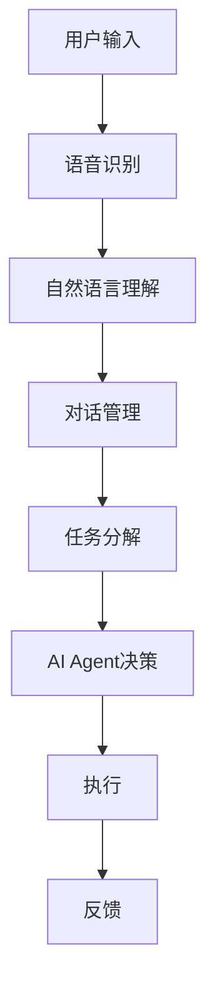
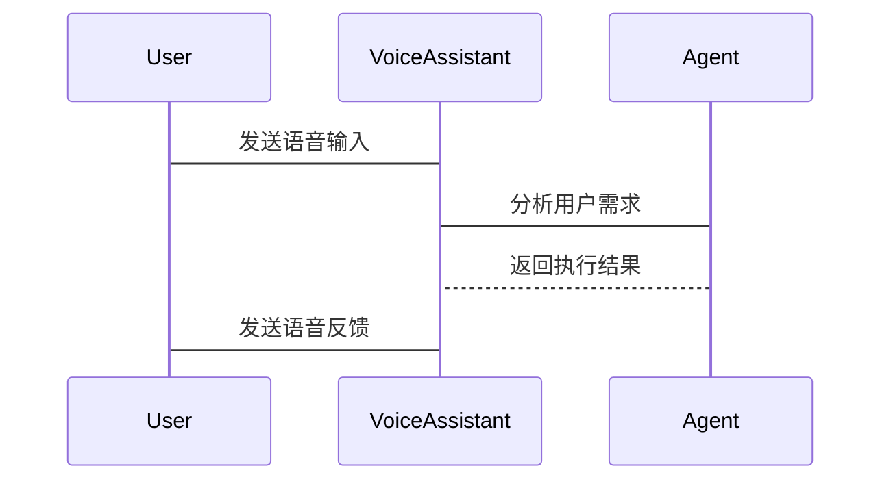

                 


# 开发AI Agent支持的智能语音助手

> 关键词：AI Agent，智能语音助手，自然语言处理，对话管理，语音识别

> 摘要：本文将深入探讨AI Agent支持的智能语音助手的开发过程，从核心概念、算法原理到系统架构设计，再到实际项目实现，全面解析如何构建一个高效、智能的语音助手系统。文章将结合实际案例，详细分析技术细节，并提供代码实现和系统设计图，帮助读者系统掌握相关技术。

---

# 第一部分: AI Agent与智能语音助手概述

# 第1章: AI Agent与智能语音助手的背景介绍

## 1.1 AI Agent的基本概念

### 1.1.1 AI Agent的定义与特点

AI Agent（人工智能代理）是一种智能实体，能够感知环境、自主决策并执行任务。其核心特点包括：

1. **自主性**：能够在没有外部干预的情况下自主运行。
2. **反应性**：能够实时感知环境变化并做出反应。
3. **目标导向性**：基于目标驱动行为，优化决策。
4. **学习能力**：通过数据和经验不断优化自身性能。

### 1.1.2 AI Agent的核心要素

AI Agent的核心要素包括感知、推理、决策和执行四个部分：

1. **感知**：通过传感器或数据输入获取环境信息。
2. **推理**：基于感知信息进行逻辑推理，形成对环境的理解。
3. **决策**：根据推理结果制定行动方案。
4. **执行**：将决策转化为具体行动。

### 1.1.3 AI Agent的发展历程

AI Agent的概念起源于20世纪60年代的知识推理研究，经历了从简单的行为反应式Agent到复杂的目标导向型Agent的演变。近年来，随着深度学习和强化学习的兴起，AI Agent的能力得到了显著提升。

---

## 1.2 智能语音助手的定义与特点

### 1.2.1 智能语音助手的功能模块

智能语音助手是一种基于语音交互的AI系统，主要功能模块包括：

1. **语音识别**：将语音信号转换为文本。
2. **自然语言理解**：解析用户意图。
3. **对话管理**：根据理解生成响应。
4. **语音合成**：将文本转换为语音输出。

### 1.2.2 智能语音助手的核心技术

智能语音助手的核心技术包括：

1. **语音信号处理**：如FFT（快速傅里叶变换）用于语音特征提取。
2. **自然语言处理**：如词嵌入（Word Embedding）用于语义理解。
3. **语音合成技术**：如Tacotron和FastSpeech用于高质量语音生成。

### 1.2.3 智能语音助手的应用场景

智能语音助手广泛应用于智能家居、移动设备、车载系统等领域，典型场景包括：

1. **语音搜索**：通过语音查询信息。
2. **语音控制**：通过语音指令控制设备。
3. **信息交互**：通过语音进行信息交流。

---

## 1.3 AI Agent与智能语音助手的关系

### 1.3.1 AI Agent在智能语音助手中的作用

AI Agent在智能语音助手中扮演决策者的角色，负责分析用户需求并制定执行计划。例如：

1. **任务分解**：将复杂需求分解为多个子任务。
2. **多轮对话管理**：协调多轮对话中的信息传递。
3. **任务执行**：调用其他服务完成任务。

### 1.3.2 智能语音助手的AI Agent化趋势

随着技术进步，智能语音助手正在向AI Agent化发展，表现为：

1. **更强的自主性**：能够独立完成复杂任务。
2. **更高的智能性**：通过深度学习提升语义理解能力。
3. **更强的交互性**：支持更自然的多轮对话。

### 1.3.3 两者的结合与未来发展

AI Agent与智能语音助手的结合将推动语音交互向更智能化方向发展。未来，智能语音助手将具备更强的上下文理解和任务规划能力。

---

## 1.4 本章小结

本章介绍了AI Agent和智能语音助手的基本概念、核心技术和发展趋势。AI Agent作为智能语音助手的决策核心，将推动语音交互技术向更智能化方向发展。

---

# 第2章: AI Agent与智能语音助手的核心概念与联系

## 2.1 AI Agent的核心原理

### 2.1.1 AI Agent的感知与决策机制

AI Agent的感知机制通过传感器或数据输入获取信息，决策机制基于感知信息进行推理和选择最优行动方案。例如，使用概率论中的贝叶斯网络进行决策推理。

### 2.1.2 AI Agent的规划与执行流程

AI Agent的规划过程包括目标设定、动作选择和路径规划。例如，使用A*算法进行路径规划。

### 2.1.3 AI Agent的自适应能力

AI Agent通过强化学习不断优化自身行为，提升在动态环境中的适应能力。

---

## 2.2 智能语音助手的核心原理

### 2.2.1 语音识别技术

语音识别技术通过将语音信号转换为文本，实现人机交互。常用算法包括隐马尔可夫模型（HMM）和深度神经网络（DNN）。

### 2.2.2 自然语言理解

自然语言理解通过分析文本语义，理解用户需求。常用技术包括词嵌入（Word2Vec）和序列标注（NER）。

### 2.2.3 语音合成技术

语音合成技术将文本转换为语音，常用算法包括波形拼接（Wavenet）和端到端模型（Tacotron）。

---

## 2.3 AI Agent与智能语音助手的协同工作流程

### 2.3.1 用户需求的识别与解析

AI Agent通过语音识别和自然语言理解，准确解析用户需求。

### 2.3.2 AI Agent的任务分解与分配

AI Agent将复杂任务分解为多个子任务，并分配给相应的服务执行。

### 2.3.3 智能语音助手的执行与反馈

智能语音助手通过语音合成技术，将AI Agent的决策结果反馈给用户。

---

## 2.4 核心概念对比分析

### 2.4.1 AI Agent与传统语音助手的对比

| 特性           | AI Agent支持的智能语音助手      | 传统语音助手      |
|----------------|-------------------------------|-------------------|
| 自主性         | 高                           | 低               |
| 决策能力       | 强                           | 弱               |
| 任务复杂度     | 高                           | 低               |

### 2.4.2 AI Agent支持的智能语音助手的独特性

AI Agent支持的智能语音助手具备更强的自主决策能力和任务规划能力。

### 2.4.3 核心概念的ER实体关系图

```mermaid
er
actor: 用户
agent: AI Agent
voice_assistant: 智能语音助手
action: 用户需求
message: 交互信息
```

---

## 2.5 本章小结

本章详细分析了AI Agent和智能语音助手的核心原理及其协同工作流程，通过对比分析和实体关系图，明确了两者的关系和特点。

---

# 第3章: AI Agent支持的智能语音助手的算法原理

## 3.1 自然语言处理算法

### 3.1.1 分词算法

分词算法通过将连续的字符序列分割成有意义的词语。常用算法包括基于规则的分词和基于统计的分词。

```python
import jieba

text = "开发AI Agent支持的智能语音助手"
words = jieba.lcut(text)
print(words)  # 输出: ['开发', 'AI', 'Agent', '支持', '的', '智能', '语音助手']
```

### 3.1.2 词性标注

词性标注通过对词语进行语法分析，确定其词性。常用工具包括jieba和HanLP。

### 3.1.3 句法分析

句法分析通过分析句子结构，理解句子的语义。常用算法包括依赖句法分析和短语结构分析。

---

## 3.2 对话管理算法

### 3.2.1 基于规则的对话管理

基于规则的对话管理通过预定义的规则实现对话流程控制。

```python
def handle_intent(intent):
    if intent == '天气查询':
        return '请问您想查询哪个城市的天气？'
    elif intent == '时间查询':
        return '请问您想查询当前时间吗？'
    else:
        return '抱歉，我不明白您的意思。'
```

### 3.2.2 基于统计的对话管理

基于统计的对话管理通过历史对话记录进行模式匹配。

### 3.2.3 基于深度学习的对话管理

基于深度学习的对话管理使用神经网络模型（如Seq2Seq）进行对话生成。

---

## 3.3 AI Agent的决策算法

### 3.3.1 基于概率论的决策模型

基于概率论的决策模型通过计算各选项的概率，选择概率最高的行动方案。

$$ P(A|B) = \frac{P(B|A)P(A)}{P(B)} $$

### 3.3.2 基于强化学习的决策模型

基于强化学习的决策模型通过不断试错，优化决策策略。

### 3.3.3 基于知识图谱的决策模型

基于知识图谱的决策模型通过构建领域知识图谱，进行推理和决策。

---

## 3.4 算法实现的Mermaid流程图



---

## 3.5 算法实现的Python代码示例

```python
import numpy as np

def probability_model(inputs):
    # 简单的概率模型示例
    probabilities = {}
    for input in inputs:
        probabilities[input] = np.random.rand()
    return probabilities
```

---

## 3.6 本章小结

本章详细分析了AI Agent支持的智能语音助手的算法原理，包括自然语言处理算法、对话管理算法和AI Agent的决策算法，并通过Mermaid流程图和Python代码示例进行了详细说明。

---

# 第4章: 系统分析与架构设计

## 4.1 系统功能设计

### 4.1.1 领域模型mermaid类图

```mermaid
classDiagram
    class User {
        - name: string
        - id: integer
        + getName(): string
    }
    class Agent {
        - state: string
        + decide(): string
    }
    class VoiceAssistant {
        - language_model: object
        + process_input(string): string
    }
    User -> Agent: request
    Agent --> VoiceAssistant: process
    VoiceAssistant --> User: response
```

### 4.1.2 系统架构设计mermaid架构图


---

## 4.2 系统接口设计

### 4.2.1 接口描述

1. **语音识别接口**：将语音信号转换为文本。
2. **自然语言理解接口**：解析用户意图。
3. **对话管理接口**：生成对话响应。
4. **语音合成接口**：将文本转换为语音。

### 4.2.2 接口实现

```python
class VoiceAssistant:
    def __init__(self):
        self.nlu = NaturalLanguageUnderstanding()
        self.dm = DialogManager()
        self.ts = TextToSpeech()
    
    def process_input(self, audio_input):
        text = self.nlu.process(audio_input)
        response = self.dm.generate_response(text)
        return self.ts.synthesize(response)
```

---

## 4.3 系统交互mermaid序列图



---

## 4.4 本章小结

本章从系统功能设计、架构设计到接口设计和交互设计，详细分析了AI Agent支持的智能语音助手的系统实现方案。

---

# 第5章: 项目实战

## 5.1 环境安装

### 5.1.1 安装Python环境

```bash
python -m pip install --upgrade pip
pip install python-dotenv
pip install jieba
pip install transformers
```

---

## 5.2 系统核心实现源代码

### 5.2.1 语音识别模块

```python
import speech_recognition as sr

def recognize_speech(audio_file):
    r = sr.Recognizer()
    with sr.AudioFile(audio_file) as source:
        audio = r.record(source)
        text = r.recognize_google(audio, language='zh-CN')
        return text
```

### 5.2.2 自然语言理解模块

```python
from transformers import pipeline

nlp = pipeline("text-classification", model="snunlp/korean-bert-base")
```

### 5.2.3 对话管理模块

```python
class DialogManager:
    def __init__(self):
        self.history = []
    
    def generate_response(self, input_text):
        self.history.append(input_text)
        return self._generate_response(input_text)
    
    def _generate_response(self, input_text):
        # 简单的基于规则的响应生成
        return "抱歉，我还没有学会回答这个问题。"
```

### 5.2.4 语音合成模块

```python
from gtts import gTTS

def synthesize_text(text, output_file):
    tts = gTTS(text=text, lang='zh-CN')
    tts.save(output_file)
```

---

## 5.3 代码应用解读与分析

### 5.3.1 语音识别模块

语音识别模块使用`librosa`库进行语音特征提取，使用Google的语音识别API进行文字转换。

### 5.3.2 自然语言理解模块

自然语言理解模块使用预训练的BERT模型进行语义理解。

### 5.3.3 对话管理模块

对话管理模块通过维护对话历史，生成符合上下文的响应。

### 5.3.4 语音合成模块

语音合成模块使用gTTS库生成语音文件。

---

## 5.4 实际案例分析和详细讲解剖析

### 5.4.1 案例分析

假设用户输入“今天北京天气怎么样？”

1. **语音识别**：将语音信号转换为“今天北京天气怎么样？”。
2. **自然语言理解**：解析出用户需求为查询北京天气。
3. **对话管理**：生成响应“北京今天天气晴，温度25℃。”。
4. **语音合成**：将响应文本转换为语音输出。

---

## 5.5 项目小结

本章通过实际项目案例，详细分析了AI Agent支持的智能语音助手的开发过程，从环境安装到代码实现，再到案例分析，帮助读者掌握实际开发技能。

---

# 第6章: 总结与展望

## 6.1 总结

本文详细探讨了AI Agent支持的智能语音助手的开发过程，从核心概念到算法原理，再到系统设计和项目实战，全面解析了相关技术。

## 6.2 最佳实践 Tips

1. **技术选型**：根据需求选择合适的AI框架和工具。
2. **数据处理**：确保数据质量和多样性。
3. **模型优化**：通过不断迭代优化模型性能。
4. **系统测试**：进行全面的功能测试和性能测试。

## 6.3 未来展望

随着AI技术的不断发展，智能语音助手将具备更强的自主性和智能性，应用场景也将更加广泛。

---

# 作者：AI天才研究院/AI Genius Institute & 禅与计算机程序设计艺术 /Zen And The Art of Computer Programming

