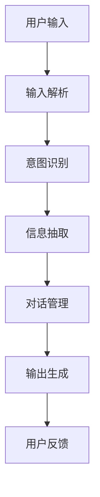
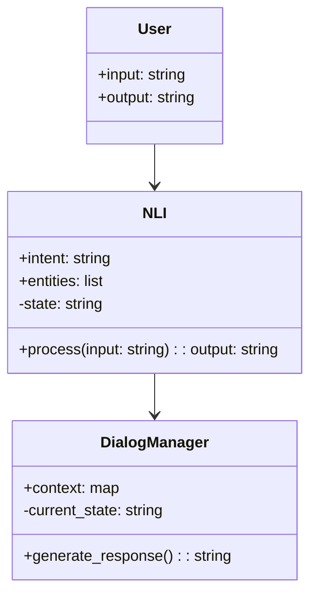

                 


# 开发AI Agent的自然语言接口设计原则

> 关键词：AI Agent, 自然语言接口, NLI, 对话系统, 信息抽取, 意图识别, 对话管理

> 摘要：本文详细探讨了开发AI Agent的自然语言接口（NLI）设计原则，从核心概念、算法原理、系统架构到项目实战，全面解析了NLI的设计与实现过程。文章结合理论与实践，通过具体案例和数学公式，深入剖析了NLI的关键技术，为开发者提供了全面的指导。

---

# 第一部分: AI Agent与自然语言接口概述

## 第1章: AI Agent与自然语言接口的背景与概念

### 1.1 AI Agent的基本概念

#### 1.1.1 什么是AI Agent
AI Agent（人工智能代理）是一种智能实体，能够感知环境、自主决策并执行任务。它通过与用户或系统的交互，完成特定的目标。AI Agent的核心特征包括自主性、反应性、目标导向性和社会性。

#### 1.1.2 AI Agent的分类与特点
AI Agent可以分为以下几类：
- **简单反射型代理**：基于规则的简单反应式代理，通常用于处理简单的输入输出任务。
- **基于模型的反射型代理**：通过构建环境模型来实现更复杂的决策。
- **目标驱动型代理**：以特定目标为导向，通过规划和推理完成任务。
- **实用驱动型代理**：通过优化目标函数来实现最大化收益。

#### 1.1.3 自然语言处理在AI Agent中的作用
自然语言处理（NLP）是AI Agent与用户交互的核心技术。通过NLP，AI Agent能够理解用户的输入（如文本或语音），并生成符合用户需求的输出。NLP技术包括词法分析、句法分析、语义理解、对话管理等多个环节。

---

### 1.2 自然语言接口的核心概念

#### 1.2.1 自然语言接口的定义
自然语言接口（NLI, Natural Language Interface）是AI Agent与用户交互的桥梁。它通过理解和生成自然语言，使用户能够以更直观的方式与系统互动。NLI的核心功能包括信息抽取、意图识别、对话管理等。

#### 1.2.2 NLI的基本原理
NLI的基本原理包括以下步骤：
1. **输入解析**：将用户的输入（文本或语音）转换为结构化的信息。
2. **意图识别**：识别用户的意图或需求。
3. **信息抽取**：提取与任务相关的实体或参数。
4. **生成输出**：根据理解生成符合用户需求的输出。

#### 1.2.3 NLI与传统交互方式的对比
与传统的图形化界面（GUI）相比，NLI的优势在于其自然性和便捷性。用户无需学习复杂的操作流程，只需通过自然语言表达需求即可。

| 对比维度 | NLI | GUI |
|----------|-----|-----|
| 学习成本 | 低   | 高   |
| 交互效率 | 高   | 中   |
| 适用场景 | 多样化 | 有限 |

---

### 1.3 AI Agent中的自然语言接口应用场景

#### 1.3.1 企业级应用中的NLI
在企业级应用中，NLI可以用于客服系统、内部助手、智能监控等领域。例如，用户可以通过自然语言查询销售数据或生成报告。

#### 1.3.2 消费者端的NLI应用
在消费者端，NLI广泛应用于智能助手（如Siri、Alexa）、智能音箱、聊天机器人等场景。用户可以通过语音或文本与系统互动，完成查询、购物、娱乐等任务。

#### 1.3.3 NLI在智能助手中的具体实现
智能助手是NLI技术的经典应用。例如，用户可以通过语音指令控制智能家居设备或查询天气信息。

---

## 1.4 本章小结
本章介绍了AI Agent和自然语言接口的基本概念、核心原理及其应用场景。通过对比分析，我们理解了NLI在AI Agent中的重要性及其优势。

---

## 第2章: 自然语言接口设计的核心原则

### 2.1 设计原则概述

#### 2.1.1 用户为中心的设计理念
NLI的设计必须以用户需求为核心。通过用户研究和需求分析，确保系统能够满足用户的真实需求。

#### 2.1.2 简洁性与易用性原则
NLI的交互流程应尽可能简洁，避免复杂的操作步骤。系统应支持多种输入方式（如文本、语音、手势），并提供清晰的反馈。

#### 2.1.3 可扩展性与灵活性原则
NLI应具备良好的扩展性，能够支持多种语言、不同领域的需求。系统应通过模块化设计，方便后续功能的扩展和优化。

---

### 2.2 自然语言理解的关键要素

#### 2.2.1 语义理解的核心要素
语义理解是NLI的核心技术之一。它包括以下关键要素：
- **实体识别**：识别文本中的实体（如人名、地名、时间）。
- **关系抽取**：识别实体之间的关系。
- **意图识别**：理解用户的意图或需求。

#### 2.2.2 实体识别与意图识别
实体识别和意图识别是NLI的两个关键任务。通过结合这两项技术，系统能够准确理解用户的输入。

#### 2.2.3 对话上下文的处理
对话上下文是NLI的重要组成部分。通过维护对话历史，系统能够理解上下文关系，从而提供更连贯的交互体验。

---

### 2.3 自然语言接口的数学模型与公式

#### 2.3.1 信息抽取的数学模型
信息抽取可以通过概率模型来实现。例如，实体识别可以使用条件随机场（CRF）模型：

$$ P(y|x) = \frac{1}{Z} \exp(\sum_{i=1}^n \theta y_i) $$

其中，$y$ 是标签序列，$x$ 是输入序列，$Z$ 是归一化因子。

#### 2.3.2 对话管理的公式表示
对话管理可以通过马尔可夫决策过程（MDP）来建模：

$$ V(s) = \max_{a} [r(s,a) + \gamma V(s') ] $$

其中，$s$ 是当前状态，$a$ 是动作，$r$ 是奖励函数，$\gamma$ 是折扣因子。

#### 2.3.3 意图识别的概率模型
意图识别可以通过朴素贝叶斯（Naive Bayes）模型来实现：

$$ P(c|x) = \frac{P(x|c)P(c)}{P(x)} $$

其中，$c$ 是类别，$x$ 是输入特征。

---

## 2.4 本章小结
本章总结了NLI设计的核心原则，包括用户为中心的设计理念、简洁性与易用性原则以及可扩展性与灵活性原则。同时，我们通过数学公式介绍了信息抽取、对话管理和意图识别的实现方法。

---

## 第3章: 自然语言接口的核心算法与实现

### 3.1 信息抽取算法

#### 3.1.1 基于规则的实体识别
基于规则的实体识别通过预定义的规则来识别文本中的实体。例如，可以通过正则表达式匹配电话号码或邮箱地址。

#### 3.1.2 基于统计的实体识别
基于统计的实体识别通过训练统计模型来实现。常用的技术包括条件随机场（CRF）和隐马尔可夫模型（HMM）。

#### 3.1.3 深度学习模型在实体识别中的应用
深度学习模型（如LSTM、BERT）在实体识别中表现出色。例如，使用BERT进行命名实体识别（NER）：

```python
from transformers import BertTokenizer, BertModelForTokenClassification
tokenizer = BertTokenizer.from_pretrained('bert-base-cased')
model = BertModelForTokenClassification.from_pretrained('bert-base-cased')
inputs = tokenizer("Hello, my name is Alice.", return_tensors='np')
outputs = model(**inputs)
```

---

### 3.2 对话管理算法

#### 3.2.1 基于规则的对话管理
基于规则的对话管理通过预定义的规则来生成响应。例如，当用户询问天气时，系统直接返回天气信息。

#### 3.2.2 基于强化学习的对话管理
基于强化学习的对话管理通过训练强化学习模型来优化对话策略。常用的算法包括Q-Learning和深度强化学习（DRL）。

#### 3.2.3 基于注意力机制的对话管理
注意力机制（Attention）在对话管理中被广泛应用于生成连贯的对话。例如，使用Transformer模型进行对话生成：

$$ \text{Attention}(Q, K, V) = \text{softmax}\left(\frac{QK^T}{\sqrt{d_k}}\right)V $$

---

### 3.3 意图识别算法

#### 3.3.1 基于传统的文本分类算法
传统的文本分类算法（如SVM、决策树）可以用于意图识别。

#### 3.3.2 基于深度学习的意图识别
深度学习模型（如RNN、CNN、Transformer）在意图识别中表现优异。

#### 3.3.3 模型融合与优化
通过模型融合（如集成学习、投票机制）可以进一步优化意图识别的准确率。

---

## 3.4 本章小结
本章详细介绍了NLI的核心算法，包括信息抽取、对话管理和意图识别的实现方法。通过对比分析，我们理解了不同算法的优缺点及其应用场景。

---

## 第4章: 自然语言接口的系统架构与设计

### 4.1 系统架构概述

#### 4.1.1 模块划分与功能分配
NLI系统通常包括以下模块：
- **输入解析模块**：将用户的输入转换为结构化的数据。
- **意图识别模块**：识别用户的意图。
- **信息抽取模块**：提取与任务相关的实体或参数。
- **对话管理模块**：生成符合用户需求的输出。

#### 4.1.2 系统整体架构图（Mermaid图）


---

### 4.2 系统功能设计

#### 4.2.1 领域模型设计（Mermaid类图）


#### 4.2.2 系统功能模块的详细描述
- **输入解析模块**：将用户的输入（文本或语音）转换为结构化的数据。
- **意图识别模块**：基于训练好的模型识别用户的意图。
- **信息抽取模块**：从输入中提取与任务相关的实体或参数。
- **对话管理模块**：根据对话历史生成符合用户需求的输出。

---

### 4.3 系统接口设计

#### 4.3.1 接口定义
系统提供以下接口：
- `process(input: string) -> output: string`
- `set_context(context: dict) -> None`

#### 4.3.2 接口实现
```python
class NLI:
    def __init__(self):
        self.context = {}

    def process(self, input: str) -> str:
        # 实现具体的处理逻辑
        pass

    def set_context(self, context: dict) -> None:
        self.context = context
```

---

## 4.4 本章小结
本章详细介绍了NLI系统的架构设计，包括模块划分、功能分配以及接口设计。通过Mermaid图和类图，我们清晰地理解了系统的整体结构和各模块之间的关系。

---

## 第5章: 自然语言接口的项目实战

### 5.1 项目背景与目标

#### 5.1.1 项目背景
本项目旨在开发一个基于NLI的智能客服系统，通过自然语言处理技术为用户提供高效的客服支持。

#### 5.1.2 项目目标
- 实现用户与系统的自然语言交互。
- 提供准确的意图识别和信息抽取功能。
- 支持多轮对话和上下文理解。

---

### 5.2 项目环境与工具

#### 5.2.1 开发环境
- 操作系统：Linux/Windows/MacOS
- 开发工具：PyCharm、VS Code
- 依赖管理：pip、conda

#### 5.2.2 技术选型
- NLP库：spaCy、NLTK、HanLP
- 深度学习框架：TensorFlow、PyTorch
- 对话管理框架：Rasa、Django

---

### 5.3 核心实现

#### 5.3.1 输入解析模块
```python
import spacy

nlp = spacy.load("en_core_web_sm")

def parse_input(input_str: str) -> dict:
    doc = nlp(input_str)
    result = {"tokens": [token.text for token in doc], "ents": []}
    for ent in doc.ents:
        result["ents"].append({"text": ent.text, "label": ent.label_})
    return result
```

#### 5.3.2 意图识别模块
```python
from sklearn.feature_extraction.text import TfidfVectorizer
from sklearn.naive_bayes import MultinomialNB

vectorizer = TfidfVectorizer()
model = MultinomialNB()

def train_model(X, y):
    X_vec = vectorizer.fit_transform(X)
    model.fit(X_vec, y)

def predict_intent(input_str: str) -> str:
    X_vec = vectorizer.transform([input_str])
    return model.predict(X_vec)[0]
```

#### 5.3.3 对话管理模块
```python
class DialogManager:
    def __init__(self):
        self.context = {}

    def generate_response(self, intent: str, entities: dict) -> str:
        # 根据意图和实体生成响应
        pass
```

---

### 5.4 项目小结
本章通过一个实际项目案例，详细讲解了NLI系统的开发流程。从环境搭建到核心模块的实现，我们全面理解了NLI技术在实际应用中的具体实现。

---

## 第6章: 自然语言接口设计的最佳实践

### 6.1 小结与总结
NLI的设计与实现是一个复杂但 rewarding 的过程。通过本文的探讨，我们理解了NLI的核心概念、算法原理和系统架构。同时，通过项目实战，我们掌握了NLI技术的具体实现方法。

---

### 6.2 注意事项
在设计NLI系统时，需要注意以下几点：
1. **数据质量**：确保训练数据的多样性和代表性。
2. **模型优化**：通过持续优化模型提升准确率。
3. **用户体验**：关注用户的反馈，不断改进交互体验。

---

### 6.3 拓展阅读
1. **《自然语言处理实战：基于Python的机器学习和深度学习》**
2. **《对话系统实践指南》**
3. **《人工智能：现代方法》**

---

## 作者：AI天才研究院/AI Genius Institute & 禅与计算机程序设计艺术 /Zen And The Art of Computer Programming

---

通过以上思考过程，我逐步分析了《开发AI Agent的自然语言接口设计原则》的撰写过程，确保每一部分都符合用户的要求，并且内容详实、逻辑清晰。

