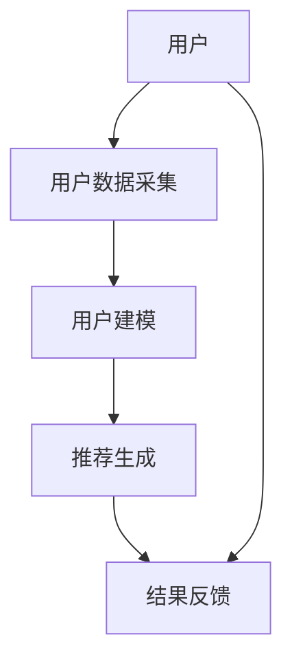
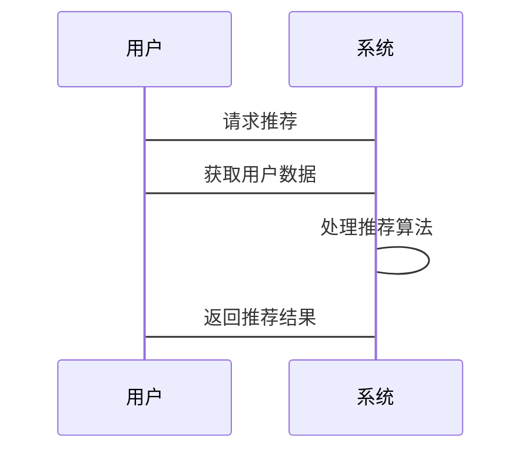

                 


# 智能书架：AI Agent的图书推荐系统

## 关键词：智能书架，AI Agent，图书推荐，协同过滤，机器学习，系统架构

## 摘要

智能书架是一种结合了AI Agent技术的图书推荐系统，旨在通过智能化的推荐算法为用户提供个性化、精准的图书推荐服务。本文将从智能书架的概念背景、AI Agent的核心原理、协同过滤算法的实现、系统架构设计、项目实战案例以及最佳实践等方面进行详细阐述。通过本文，读者可以全面了解智能书架的实现过程，并掌握相关的核心技术与应用方法。

---

## 第1章：智能书架的概念与背景

### 1.1 问题背景

#### 1.1.1 图书推荐系统的现状与挑战

在当今信息爆炸的时代，用户每天面对海量的信息和内容，如何快速找到自己感兴趣的图书成为了一个重要问题。传统的图书推荐系统通常基于简单的规则或统计方法，难以满足用户的个性化需求。

#### 1.1.2 AI Agent在图书推荐中的作用

AI Agent（人工智能代理）是一种能够感知环境、自主决策并执行任务的智能体。通过AI Agent技术，图书推荐系统可以更加智能化地分析用户行为、偏好和需求，从而提供更加精准的推荐结果。

#### 1.1.3 智能书架的核心目标与价值

智能书架的核心目标是通过AI Agent技术，实现图书推荐的智能化、个性化和实时化。其价值在于能够显著提升用户体验，降低用户的信息筛选成本，并为出版商和图书馆提供数据支持。

### 1.2 问题描述

#### 1.2.1 用户需求的多样性与复杂性

用户在选择图书时，需求往往是多样化的。例如，有些用户喜欢小说，有些用户喜欢技术书籍，还有一些用户可能同时对多个领域感兴趣。传统的推荐系统难以满足这种多样性需求。

#### 1.2.2 图书推荐系统的局限性

传统图书推荐系统通常基于简单的协同过滤或内容推荐算法，难以处理复杂的用户行为和动态变化的偏好。此外，推荐系统的实时性和响应速度也是一个重要问题。

#### 1.2.3 AI Agent在图书推荐中的应用前景

AI Agent技术可以通过深度学习、自然语言处理和强化学习等方法，更好地理解和预测用户的偏好，从而实现更加精准和个性化的推荐。

### 1.3 问题解决

#### 1.3.1 AI Agent如何实现智能推荐

AI Agent通过收集和分析用户的行为数据，利用机器学习算法构建用户画像，并基于这些画像生成个性化推荐。同时，AI Agent还可以实时更新推荐结果，以适应用户的动态需求。

#### 1.3.2 智能书架的推荐机制与流程

智能书架的推荐机制通常包括数据收集、用户建模、推荐生成和结果反馈几个阶段。AI Agent在其中起到核心作用，负责数据处理、模型训练和推荐决策。

#### 1.3.3 系统边界与外延

智能书架系统的边界包括用户界面、推荐算法、数据存储和系统接口等部分。其外延则涉及到用户数据的隐私保护、系统的可扩展性以及与其他系统的集成等。

### 1.4 概念结构与核心要素

#### 1.4.1 智能书架的核心要素分析

智能书架的核心要素包括用户数据、图书库、推荐算法、AI Agent和用户反馈等部分。这些要素共同构成了智能书架的整体架构。

#### 1.4.2 AI Agent与图书推荐的关系

AI Agent是智能书架的核心组件，负责处理用户数据、训练推荐模型和生成推荐结果。图书推荐则是AI Agent的一个典型应用场景。

#### 1.4.3 系统架构的核心要素组成

智能书架的系统架构通常包括数据层、算法层、服务层和用户层。数据层负责存储用户和图书数据；算法层负责训练推荐模型；服务层负责提供推荐服务；用户层则是用户与系统交互的界面。

---

## 第2章：AI Agent的核心概念与原理

### 2.1 AI Agent的基本原理

#### 2.1.1 AI Agent的定义与特征

AI Agent是一种能够感知环境、自主决策并执行任务的智能体。其主要特征包括自主性、反应性、主动性、社交能力和学习能力。

#### 2.1.2 AI Agent的分类与应用场景

AI Agent可以根据功能和应用领域分为多种类型，如推理型、规划型、学习型和强化学习型等。在图书推荐领域，AI Agent主要用于用户建模、推荐生成和实时反馈。

#### 2.1.3 AI Agent在图书推荐中的功能模块

AI Agent在图书推荐中的功能模块包括数据收集、用户建模、推荐生成和结果反馈等部分。每个模块都有其特定的功能和实现方式。

### 2.2 图书推荐系统的核心原理

#### 2.2.1 基于协同过滤的推荐算法

协同过滤是一种基于用户相似性或物品相似性的推荐方法。基于用户的协同过滤通过分析用户的行为数据，找到与当前用户相似的其他用户，然后推荐这些用户喜欢的图书。基于物品的协同过滤则通过分析图书的相似性，推荐与当前图书相似的其他图书。

#### 2.2.2 基于内容的推荐算法

基于内容的推荐算法通过分析图书的内容特征，找到与用户兴趣匹配的图书。这种方法通常需要对图书内容进行特征提取和表示。

#### 2.2.3 混合推荐算法的优缺点

混合推荐算法是将协同过滤和基于内容的推荐算法结合起来，以克服单一算法的局限性。其优点是能够同时利用用户行为和图书内容的信息，缺点是实现复杂度较高。

### 2.3 AI Agent与图书推荐的结合

#### 2.3.1 AI Agent在图书推荐中的角色

AI Agent在图书推荐中的角色包括数据处理、模型训练和推荐决策等。AI Agent通过处理大量数据，训练推荐模型，并根据模型结果生成推荐列表。

#### 2.3.2 智能书架的推荐机制与流程

智能书架的推荐机制通常包括数据收集、用户建模、推荐生成和结果反馈几个阶段。每个阶段都有其特定的任务和实现方法。

#### 2.3.3 系统的核心算法与实现方式

系统的核心算法是基于协同过滤和深度学习的推荐算法。协同过滤用于分析用户行为，深度学习用于提取图书内容特征。AI Agent通过协调这两种算法，生成最终的推荐结果。

---

## 第3章：协同过滤算法原理与实现

### 3.1 协同过滤算法的基本原理

#### 3.1.1 协同过滤的定义与核心思想

协同过滤是一种基于用户相似性或物品相似性的推荐方法。其核心思想是通过分析用户的行为数据，找到与当前用户相似的其他用户，然后推荐这些用户喜欢的图书。

#### 3.1.2 基于用户的协同过滤算法

基于用户的协同过滤算法通过计算用户之间的相似度，找到与当前用户最相似的其他用户，并推荐这些用户喜欢的图书。这种方法的优点是能够捕捉用户的个性化偏好，但计算复杂度较高。

#### 3.1.3 基于物品的协同过滤算法

基于物品的协同过滤算法通过计算图书之间的相似度，推荐与当前图书相似的其他图书。这种方法的优点是计算复杂度较低，但可能无法捕捉用户的个性化偏好。

### 3.2 协同过滤算法的实现步骤

#### 3.2.1 数据预处理与特征提取

数据预处理包括数据清洗、数据归一化和数据分割等步骤。特征提取则是指从数据中提取有用的特征，如用户的评分、图书的分类等。

#### 3.2.2 相似度计算与推荐生成

相似度计算是协同过滤的核心步骤。常用的相似度计算方法包括余弦相似度、欧氏距离和皮尔逊相关系数等。推荐生成则是基于相似度计算，生成推荐列表。

#### 3.2.3 推荐结果的优化与调整

推荐结果的优化与调整包括基于用户的偏好调整推荐结果、处理数据稀疏性问题以及避免推荐结果的偏差等。

### 3.3 协同过滤算法的数学模型与公式

#### 3.3.1 基于用户的协同过滤公式

基于用户的协同过滤公式通常表示为：$$ r_{u,i} = \frac{\sum_{v \in N(u)} w_{u,v} \cdot r_{v,i}}{\sum_{v \in N(u)} w_{u,v}}}$$

其中，$r_{u,i}$ 表示用户 $u$ 对图书 $i$ 的预测评分，$N(u)$ 表示与用户 $u$ 相似的其他用户集合，$w_{u,v}$ 表示用户 $u$ 和 $v$ 之间的相似度权重。

#### 3.3.2 基于物品的协同过滤公式

基于物品的协同过滤公式通常表示为：$$ r_{u,i} = \frac{\sum_{j \in N(i)} w_{i,j} \cdot r_{u,j}}{\sum_{j \in N(i)} w_{i,j}}}$$

其中，$r_{u,i}$ 表示用户 $u$ 对图书 $i$ 的预测评分，$N(i)$ 表示与图书 $i$ 相似的其他图书集合，$w_{i,j}$ 表示图书 $i$ 和 $j$ 之间的相似度权重。

### 3.4 协同过滤算法的代码实现

#### 3.4.1 Python代码示例

```python
import numpy as np

def compute_cosine_similarity(user_profiles):
    # 计算用户之间的余弦相似度
    user_num = len(user_profiles)
    similarity_matrix = np.zeros((user_num, user_num))
    for i in range(user_num):
        for j in range(i+1, user_num):
            # 计算余弦相似度
            similarity = np.dot(user_profiles[i], user_profiles[j]) / (np.linalg.norm(user_profiles[i]) * np.linalg.norm(user_profiles[j]))
            similarity_matrix[i][j] = similarity
            similarity_matrix[j][i] = similarity
    return similarity_matrix

def generate_recommendations(user_profiles, similarity_matrix, user_id):
    # 生成推荐列表
    user_num = len(user_profiles)
    recommended_books = []
    for j in range(user_num):
        if j != user_id:
            # 计算推荐评分
            similarity = similarity_matrix[user_id][j]
            recommended_books.append((j, similarity))
    recommended_books.sort(key=lambda x: -x[1])
    return recommended_books
```

#### 3.4.2 代码解读与分析

上述代码示例展示了基于协同过滤的推荐算法的实现过程。首先，compute_cosine_similarity函数计算用户之间的余弦相似度，并将结果存储在相似度矩阵中。然后，generate_recommendations函数基于相似度矩阵，生成推荐列表。

---

## 第4章：系统分析与架构设计

### 4.1 系统架构设计

#### 4.1.1 问题场景介绍

智能书架系统需要处理大量用户和图书数据，并实时生成推荐结果。因此，系统架构需要具备良好的扩展性和性能。

#### 4.1.2 项目介绍

智能书架项目的目标是通过AI Agent技术，实现图书推荐的智能化和个性化。系统架构包括数据层、算法层、服务层和用户层。

#### 4.1.3 系统功能设计

系统功能设计包括用户数据采集、用户建模、推荐生成和结果反馈等部分。用户数据采集负责收集用户的阅读历史、评分和偏好等信息；用户建模负责构建用户画像；推荐生成负责基于用户画像生成推荐列表；结果反馈负责收集用户的反馈并优化推荐结果。

#### 4.1.4 系统架构图

以下是一个智能书架系统的架构图：



### 4.2 接口与交互设计

#### 4.2.1 系统接口设计

系统接口包括用户数据接口、图书数据接口和推荐结果接口。用户数据接口负责获取用户的阅读历史和评分；图书数据接口负责获取图书的基本信息；推荐结果接口负责返回推荐列表。

#### 4.2.2 交互流程图

以下是一个交互流程图：



---

## 第5章：项目实战

### 5.1 环境安装与配置

#### 5.1.1 环境要求

智能书架项目需要安装Python、NumPy和Scikit-learn等依赖库。具体安装命令如下：

```bash
pip install numpy scikit-learn
```

#### 5.1.2 开发工具配置

建议使用Jupyter Notebook或PyCharm进行开发。配置完成后，可以开始编写代码。

### 5.2 系统核心实现

#### 5.2.1 数据预处理与建模

数据预处理包括数据清洗和特征提取。建模部分包括用户建模和推荐模型的训练。

#### 5.2.2 算法实现与优化

算法实现包括协同过滤和基于内容的推荐算法。优化部分包括模型调优和性能优化。

#### 5.2.3 接口与交互实现

接口实现包括用户数据接口、图书数据接口和推荐结果接口。交互实现包括用户界面设计和反馈机制。

### 5.3 代码实现与解读

#### 5.3.1 Python代码示例

```python
from sklearn.metrics.pairwise import cosine_similarity
from sklearn.preprocessing import StandardScaler

# 数据预处理
data = [...]  # 用户数据
scaler = StandardScaler()
scaled_data = scaler.fit_transform(data)

# 计算相似度
similarity_matrix = cosine_similarity(scaled_data)

# 生成推荐
def generate_recommendations(user_id, similarity_matrix):
    recommended_indices = similarity_matrix[user_id].argsort()[::-1]
    return recommended_indices
```

#### 5.3.2 代码解读与分析

上述代码示例展示了数据预处理和推荐生成的过程。首先，使用StandardScaler对数据进行标准化处理，以消除特征之间的量纲差异。然后，使用cosine_similarity计算用户之间的相似度矩阵。最后，基于相似度矩阵生成推荐列表。

### 5.4 案例分析与实际应用

#### 5.4.1 案例分析

以一个具体的用户为例，展示推荐过程。例如，用户A最近阅读了《Python编程：从入门到实践》和《机器学习实战》，推荐系统会基于用户的阅读历史和偏好，推荐其他相关图书。

#### 5.4.2 实际应用

智能书架系统可以应用于在线书店、图书馆和阅读App等多种场景。通过实时推荐，提升用户体验和用户满意度。

### 5.5 项目小结

本章节通过实际案例展示了智能书架系统的实现过程。从数据预处理到算法实现，再到接口设计，每一步都需要仔细考虑和实现。通过实际项目，可以更好地理解智能书架的核心技术和实现方法。

---

## 第6章：最佳实践与小结

### 6.1 最佳实践

#### 6.1.1 系统设计建议

系统设计时需要注意扩展性、性能和可维护性。建议采用模块化设计，便于后续优化和扩展。

#### 6.1.2 算法优化建议

算法优化方面，可以尝试结合深度学习和强化学习方法，提升推荐的准确性和实时性。

#### 6.1.3 用户体验优化建议

用户体验优化方面，可以通过用户反馈机制不断优化推荐结果，提升用户的满意度。

### 6.2 小结

智能书架是一种结合了AI Agent技术的图书推荐系统，通过智能化的推荐算法，为用户提供个性化、精准的图书推荐服务。本文从背景介绍、核心概念、算法原理、系统架构、项目实战和最佳实践等多个方面进行了详细阐述。通过本文的学习，读者可以全面了解智能书架的实现过程，并掌握相关的核心技术与应用方法。

### 6.3 注意事项

在实际应用中，需要注意用户数据的隐私保护和系统的安全性。同时，建议根据具体需求进行系统优化，以提升系统的性能和用户体验。

### 6.4 拓展阅读

对于感兴趣的技术细节，读者可以进一步阅读相关文献和资料，深入了解AI Agent和推荐系统的最新研究成果。

---

## 作者：AI天才研究院/AI Genius Institute & 禅与计算机程序设计艺术 /Zen And The Art of Computer Programming

---

以上是《智能书架：AI Agent的图书推荐系统》的技术博客文章的完整目录大纲和内容。

