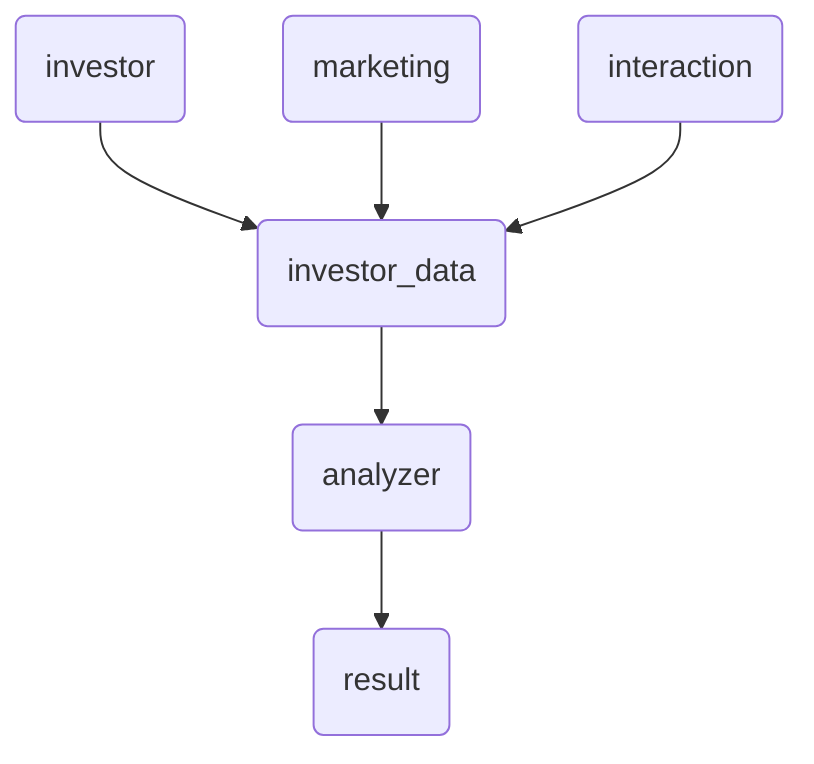
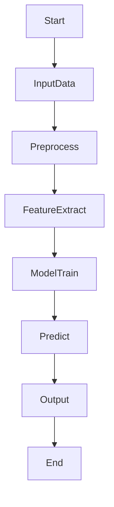
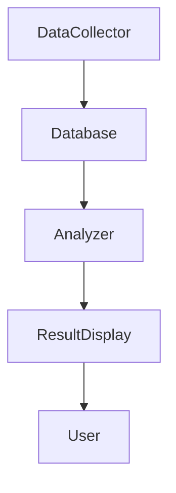
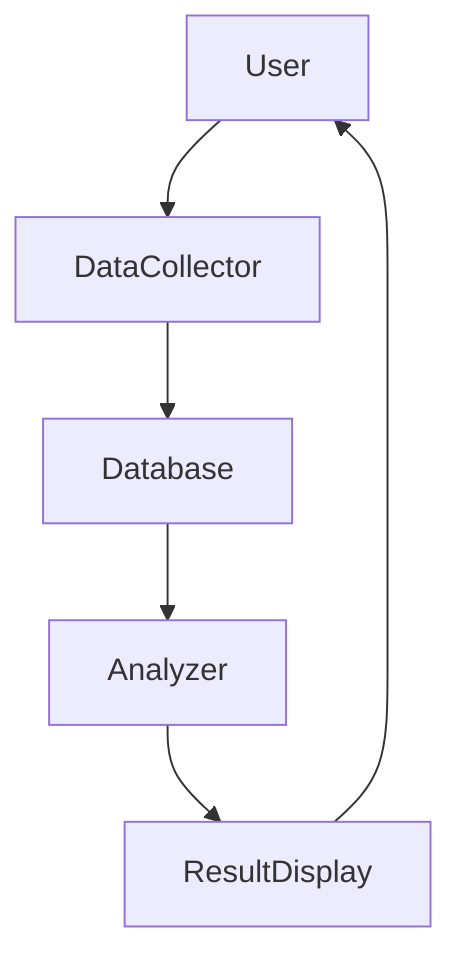

                 


# 智能投资者关系管理系统

> 关键词：投资者关系管理，人工智能，自然语言处理，数据挖掘，系统架构

> 摘要：智能投资者关系管理系统是一种结合人工智能、大数据和自然语言处理技术的智能化管理解决方案，旨在优化企业与投资者之间的信息传递和互动效率。本文将从系统概述、核心概念、算法原理、系统架构到项目实现进行全面解析，深入探讨该系统的构建过程、关键技术和实际应用。

---

# 第一部分: 智能投资者关系管理系统概述

## 第1章: 智能投资者关系管理系统的背景与概念

### 1.1 投资者关系管理的背景

#### 1.1.1 传统投资者关系管理的局限性
传统的投资者关系管理主要依赖人工操作，存在效率低下、信息滞后、数据分析能力有限等问题。企业与投资者之间的沟通渠道单一，难以满足投资者个性化需求。

#### 1.1.2 数字化转型的驱动作用
随着企业数字化转型的推进，智能化技术的应用为企业提供了新的管理工具。投资者关系管理通过引入人工智能、大数据等技术，能够实现自动化、智能化的管理。

#### 1.1.3 智能化管理的需求与趋势
投资者关系管理的智能化需求主要源于以下几点：
1. **信息爆炸**：投资者每天面对海量信息，需要快速筛选和分析。
2. **个性化需求**：不同投资者关注点不同，需要定制化服务。
3. **实时性要求**：投资者需要实时获取公司动态和市场信息。
4. **精准决策**：通过数据分析，帮助投资者做出更精准的投资决策。

### 1.2 智能投资者关系管理系统的定义

#### 1.2.1 核心概念与关键特征
智能投资者关系管理系统（Intelligent Investor Relations Management System，IIRMS）是一种基于人工智能和大数据技术的智能化管理平台，能够实现投资者信息的自动收集、分析、分类和反馈。

关键特征包括：
1. **自动化数据处理**：自动抓取和分析投资者相关数据。
2. **智能推荐**：基于数据分析为投资者提供个性化推荐。
3. **实时监控**：实时跟踪市场动态和投资者情绪。
4. **预测与预警**：通过模型预测潜在风险并发出预警。

#### 1.2.2 系统的目标与功能模块
系统目标：
- 提高投资者关系管理效率。
- 提供精准的投资者服务。
- 实现企业与投资者之间的高效互动。

功能模块：
1. **信息采集模块**：收集投资者相关数据。
2. **数据分析模块**：对数据进行清洗、建模和分析。
3. **智能推荐模块**：为投资者提供个性化服务。
4. **实时监控模块**：实时跟踪市场动态。
5. **预测与预警模块**：预测潜在风险并发出预警。

#### 1.2.3 系统的边界与外延
系统边界：
- 输入：投资者数据、市场数据。
- 输出：投资者分析结果、个性化推荐。

系统外延：
- 集成第三方数据源（如新闻、社交媒体）。
- 支持多语言、多市场环境。

### 1.3 智能投资者关系管理系统的现状与挑战

#### 1.3.1 当前市场的主要问题
1. 数据碎片化：投资者数据来源广泛，难以整合。
2. 数据分析能力不足：传统方法难以深度挖掘数据价值。
3. 个性化服务缺失：投资者需求多样化，但服务单一。

#### 1.3.2 智能化解决方案的优势
1. 提高数据处理效率。
2. 实现个性化服务。
3. 降低人工成本。

#### 1.3.3 实施中的主要挑战
1. 数据隐私与安全问题。
2. 系统集成复杂性。
3. 技术门槛高。

### 1.4 本章小结
本章介绍了智能投资者关系管理系统的背景、定义和现状，强调了系统智能化的必要性和实现路径。

---

## 第2章: 智能投资者关系管理系统的核心概念与联系

### 2.1 核心概念原理

#### 2.1.1 投资者关系管理的核心要素
1. **投资者数据**：包括投资者基本信息、投资偏好、交易记录等。
2. **市场数据**：包括市场行情、行业动态、政策法规等。
3. **互动数据**：包括投资者与企业的沟通记录、反馈意见等。

#### 2.1.2 智能化管理的关键技术
1. **自然语言处理（NLP）**：用于分析文本数据，提取关键信息。
2. **机器学习（ML）**：用于构建预测模型，实现智能推荐。
3. **大数据技术**：用于处理海量数据，提高分析效率。

#### 2.1.3 系统架构的整体逻辑
系统整体逻辑分为数据采集、数据处理、数据分析和结果输出四个阶段。

### 2.2 核心概念属性特征对比表

| 特性 | 传统投资者关系管理 | 智能投资者关系管理 |
|------|-------------------|-------------------|
| 数据来源 | 单一、有限 | 多源、实时 |
| 数据分析 | 简单统计 | 深度挖掘、预测 |
| 互动方式 | 单向沟通 | 双向互动、个性化 |
| 处理效率 | 低效 | 高效、自动化 |

### 2.3 ER实体关系图



### 2.4 本章小结
本章通过对比分析，明确了智能投资者关系管理系统的核心要素和技术特点。

---

## 第3章: 智能投资者关系管理系统的算法原理

### 3.1 算法概述

#### 3.1.1 问题场景介绍
系统需要从大量文本数据中提取投资者情绪、识别关键词，并根据历史数据预测市场趋势。

#### 3.1.2 算法选择与优化
采用基于机器学习的情感分析算法，结合自定义特征工程进行优化。

#### 3.1.3 算法的数学模型
情感分析模型采用支持向量机（SVM）进行训练，特征提取使用TF-IDF。

### 3.2 算法流程图



### 3.3 算法实现代码

```python
from sklearn.svm import SVC
from sklearn.feature_extraction.text import TfidfVectorizer
from sklearn.pipeline import Pipeline

# 数据预处理
def preprocess(text):
    return text.lower()

# 模型训练
model = Pipeline([
    ('tfidf', TfidfVectorizer()),
    ('svm', SVC())
])
model.fit(X_train, y_train)

# 预测
y_pred = model.predict(X_test)
```

### 3.4 数学模型与公式

#### 3.4.1 模型公式
$$ P(y|X) = \frac{P(X|y)P(y)}{P(X)} $$

其中：
- $P(y)$ 是先验概率。
- $P(X|y)$ 是在类别 $y$ 下，特征 $X$ 的条件概率。

#### 3.4.2 示例说明
假设输入文本为“公司业绩 excellent”，模型预测其情感为正面的概率为 $P(positive | excellent) = 0.85$。

### 3.5 本章小结
本章详细介绍了系统中使用的机器学习算法及其实现，强调了特征工程和模型优化的重要性。

---

## 第4章: 智能投资者关系管理系统的核心技术与系统架构

### 4.1 系统架构设计

#### 4.1.1 系统模块划分
1. **数据采集模块**：负责从多种数据源采集投资者相关数据。
2. **数据处理模块**：对数据进行清洗、转换和存储。
3. **数据分析模块**：对数据进行建模分析，生成分析结果。
4. **结果输出模块**：将分析结果以用户友好的形式展示。

#### 4.1.2 系统架构图



### 4.2 数据库设计

#### 4.2.1 数据表设计
1. **投资者信息表**（investor_info）：
   - investor_id: 主键
   - name: 投资者名称
   - contact: 联系方式
   - preference: 投资偏好

2. **市场数据表**（market_data）：
   - data_id: 主键
   - timestamp: 时间戳
   - content: 数据内容
   - source: 数据来源

### 4.3 接口设计

#### 4.3.1 API接口定义
1. **数据采集接口**：
   - GET /api/data-source
   - POST /api/data-collect

2. **数据分析接口**：
   - POST /api/data-analyze
   - GET /api/analysis-result

#### 4.3.2 API接口实现
```python
from flask import Flask, request, jsonify

app = Flask(__name__)

@app.route('/api/data-collect', methods=['POST'])
def collect_data():
    data = request.json
    # 处理数据并存储
    return jsonify({'status': 'success'})

@app.route('/api/data-analyze', methods=['POST'])
def analyze_data():
    data = request.json
    # 数据分析逻辑
    return jsonify({'status': 'success', 'result': result})
```

### 4.4 系统交互流程图



### 4.5 本章小结
本章详细描述了系统的架构设计、数据库设计和接口设计，为后续的系统实现奠定了基础。

---

## 第5章: 智能投资者关系管理系统的项目实现

### 5.1 项目环境配置

#### 5.1.1 技术栈选择
1. **后端**：Python（Django/Flask）
2. **前端**：React/Vue.js
3. **数据库**：MySQL/PostgreSQL
4. **机器学习框架**：Scikit-learn/TensorFlow

#### 5.1.2 安装依赖
```bash
pip install flask sklearn numpy pandas
```

### 5.2 核心功能实现

#### 5.2.1 数据采集模块
```python
import requests

def collect_data():
    response = requests.get('https://example.com/api/data')
    return response.json()
```

#### 5.2.2 数据分析模块
```python
from sklearn.ensemble import RandomForestClassifier

def train_model(X, y):
    model = RandomForestClassifier()
    model.fit(X, y)
    return model
```

#### 5.2.3 结果展示模块
```python
def display_result(result):
    print(f"Prediction: {result}")
```

### 5.3 项目实战案例

#### 5.3.1 数据来源
假设我们从社交媒体和新闻网站获取投资者相关数据。

#### 5.3.2 数据分析
使用自然语言处理技术分析文本数据，提取关键词和情感倾向。

#### 5.3.3 实际应用
将分析结果应用于投资者服务，例如推荐投资组合和风险预警。

### 5.4 项目小结
本章通过实际案例展示了系统的实现过程，强调了各模块的协同工作和实际应用价值。

---

## 第6章: 智能投资者关系管理系统的最佳实践与优化

### 6.1 最佳实践

#### 6.1.1 数据质量管理
- 数据清洗：去除重复和错误数据。
- 数据增强：引入更多维度的数据。

#### 6.1.2 系统性能优化
- 使用分布式架构提高处理效率。
- 优化算法模型降低计算成本。

### 6.2 注意事项

#### 6.2.1 数据隐私保护
- 遵守数据隐私法规（如GDPR）。
- 加强数据加密措施。

#### 6.2.2 系统可扩展性
- 设计模块化架构，便于后续扩展。
- 支持多平台部署。

### 6.3 拓展阅读
- 《机器学习实战》
- 《数据挖掘导论》
- 《系统架构设计的艺术》

### 6.4 本章小结
本章总结了系统实施中的最佳实践和注意事项，为后续优化提供了指导。

---

## 第7章: 总结与展望

### 7.1 总结
智能投资者关系管理系统通过结合人工智能和大数据技术，显著提升了投资者关系管理的效率和精准度。系统的核心优势在于自动化数据处理、个性化服务和实时监控能力。

### 7.2 展望
未来，随着技术的不断发展，智能投资者关系管理系统将更加智能化和个性化。可能出现的趋势包括：
1. **AI助手**：提供更加智能化的交互体验。
2. **区块链技术**：提升数据安全和信任度。
3. **多模态分析**：结合图像、视频等多种数据源进行分析。

### 7.3 本章小结
本文对智能投资者关系管理系统的构建过程进行了全面总结，并展望了未来的发展方向。

---

## 附录

### 附录A: 参考文献
1. 刘军. (2023). 《机器学习实战》. 北京: 清华大学出版社.
2. 张涛. (2022). 《数据挖掘导论》. 北京: 人民邮电出版社.
3. 章鱼. (2021). 《系统架构设计的艺术》. 上海: 上海科技出版社.

### 附录B: 工具与库
1. Python
2. Flask/Django
3. Scikit-learn/TensorFlow
4. Mermaid
5. Git

---

## 作者

作者：AI天才研究院/AI Genius Institute & 禅与计算机程序设计艺术/Zen And The Art of Computer Programming

