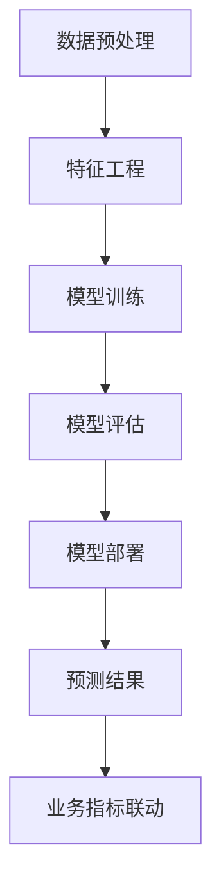
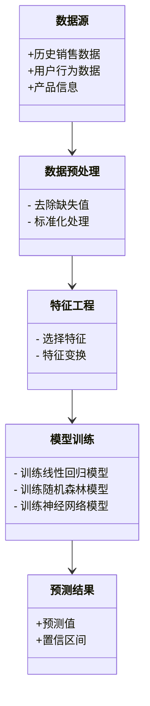
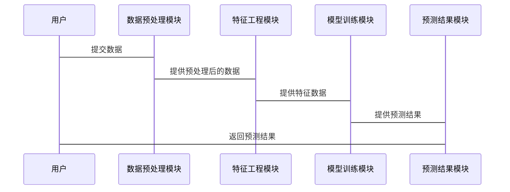

                 


# 构建企业级预测性分析平台：跨部门业务指标预测与联动

## 关键词：预测性分析，企业级平台，跨部门，业务指标，机器学习，数据驱动，联动预测

## 摘要：  
企业级预测性分析平台是通过机器学习和大数据技术，对企业内外部数据进行深度分析和预测，从而优化决策、提升效率的重要工具。本文将从预测性分析平台的背景与价值、核心概念与联系、算法原理、系统分析与架构设计、项目实战、最佳实践等方面展开详细论述。通过本文，读者可以全面了解如何构建一个高效、可靠的预测性分析平台，并掌握跨部门业务指标预测与联动的核心方法。

---

## 第一部分: 企业级预测性分析平台概述

## 第1章: 预测性分析平台的背景与价值

### 1.1 预测性分析平台的定义与特点

#### 1.1.1 预测性分析的定义  
预测性分析（Predictive Analytics）是利用历史数据和当前数据，通过统计分析、机器学习等技术，预测未来可能发生的情况或趋势。它不仅仅是对数据的简单分析，而是通过对数据的建模和推导，为企业提供前瞻性的洞察。

#### 1.1.2 预测性分析的核心特点  
- **数据驱动**：基于大量数据进行分析，而非单纯的业务经验或直觉。  
- **实时性**：能够实时或近实时地处理数据并生成预测结果。  
- **准确性**：通过模型优化和调参，提高预测的准确性。  
- **可解释性**：模型不仅要准确，还需要能够解释预测结果背后的原因。  

#### 1.1.3 企业级预测性分析平台的价值  
- **优化决策**：通过预测未来趋势，帮助企业做出更科学的决策。  
- **提升效率**：自动化分析和预测流程，减少人工干预，提高效率。  
- **风险控制**：提前识别潜在风险，降低损失。  
- **数据资产化**：将数据转化为企业资产，提升数据的利用价值。  

### 1.2 企业级预测性分析的背景

#### 1.2.1 数据驱动决策的兴起  
随着大数据技术的普及，企业逐渐意识到数据的价值。通过数据驱动的决策，企业能够更精准地洞察市场趋势、客户行为和内部运营情况。

#### 1.2.2 传统预测方法的局限性  
传统的预测方法（如简单的线性回归）在面对复杂业务场景时显得力不从心。例如，传统方法难以处理高维数据、非线性关系和复杂的时间序列问题。

#### 1.2.3 预测性分析在现代企业中的需求  
现代企业需要面对越来越复杂的业务环境。通过预测性分析，企业可以更好地应对市场波动、客户需求变化和内部运营优化。

### 1.3 预测性分析平台的技术基础

#### 1.3.1 数据分析与挖掘技术  
数据分析与挖掘技术包括数据清洗、特征提取、数据建模等。这些技术帮助企业从海量数据中提取有价值的信息。

#### 1.3.2 机器学习与深度学习  
机器学习（如随机森林、支持向量机）和深度学习（如神经网络）技术为预测性分析提供了强大的工具。这些技术能够处理复杂的数据关系，提高预测的准确性。

#### 1.3.3 大数据处理与存储技术  
大数据技术（如Hadoop、Spark）帮助企业处理海量数据，存储和管理数据，为预测性分析提供基础。

### 1.4 预测性分析的应用场景

#### 1.4.1 销售预测  
通过分析历史销售数据、市场趋势和客户行为，预测未来的销售情况，帮助企业制定销售计划。

#### 1.4.2 客户行为预测  
通过分析客户的购买记录、浏览行为等，预测客户未来的购买行为，帮助企业进行精准营销。

#### 1.4.3 风险评估与控制  
通过分析企业的财务数据、市场环境等，预测可能的风险，并制定相应的控制措施。

### 1.5 本章小结  
本章介绍了预测性分析平台的定义、特点、价值、背景和技术基础，并列举了其在企业中的主要应用场景。

---

## 第2章: 预测性分析的核心概念与联系

### 2.1 预测性分析的核心概念

#### 2.1.1 数据特征  
数据特征包括数据的维度、分布、相关性等。例如，特征工程中常见的操作包括特征选择、特征提取和特征变换。

#### 2.1.2 模型特征  
模型特征包括模型的类型、复杂度、参数设置等。例如，线性回归模型的特征包括回归系数和截距。

#### 2.1.3 业务指标特征  
业务指标特征包括目标预测的业务指标（如销售额、客户满意度）和影响该指标的其他业务指标（如广告投放、产品价格）。

### 2.2 预测性分析的核心要素

#### 2.2.1 数据来源  
数据来源包括结构化数据（如数据库）和非结构化数据（如文本、图像）。  

#### 2.2.2 模型选择  
模型选择需要根据业务需求和数据特点进行。例如，对于时间序列数据，可能需要使用ARIMA模型。

#### 2.2.3 业务指标联动  
业务指标联动是指不同业务指标之间的相互影响。例如，销售额可能受到广告投放和产品价格的共同影响。

### 2.3 预测性分析的实体关系图


### 2.4 预测性分析的流程图



### 2.5 本章小结  
本章通过概念图和流程图的形式，详细阐述了预测性分析的核心概念和各要素之间的关系。

---

## 第3章: 预测性分析的算法原理

### 3.1 线性回归算法

#### 3.1.1 线性回归的定义  
线性回归是一种统计分析方法，用于建立自变量与因变量之间的线性关系。其数学模型可以表示为：  
$$ y = a + bx + e $$  
其中，$y$ 是因变量，$x$ 是自变量，$a$ 是截距，$b$ 是回归系数，$e$ 是误差项。

#### 3.1.2 线性回归的实现步骤  
1. 数据准备：收集和整理数据。  
2. 特征工程：选择和处理特征。  
3. 模型训练：使用最小二乘法求解回归系数。  
4. 模型评估：计算R²值和残差分析。  

#### 3.1.3 线性回归的优缺点  
- 优点：简单易懂，计算效率高。  
- 缺点：仅适用于线性关系，对非线性关系的拟合能力较差。

### 3.2 随机森林算法

#### 3.2.1 随机森林的定义  
随机森林是一种基于决策树的集成学习算法。它通过构建多棵决策树，并对结果进行投票或平均，提高模型的准确性和稳定性。

#### 3.2.2 随机森林的实现步骤  
1. 数据准备：收集和整理数据。  
2. 特征工程：选择和处理特征。  
3. 模型训练：随机采样数据，构建多棵决策树。  
4. 模型评估：计算准确率和F1分数。  

#### 3.2.3 随机森林的优缺点  
- 优点：对噪声数据具有较强的鲁棒性，易于处理高维数据。  
- 缺点：计算复杂度较高，对数据量较大的场景可能不够高效。

### 3.3 神经网络算法

#### 3.3.1 神经网络的定义  
神经网络是一种模仿人脑结构和功能的深度学习算法。它通过多层神经元之间的连接，实现对复杂数据关系的建模。

#### 3.3.2 神经网络的实现步骤  
1. 数据准备：收集和整理数据。  
2. 特征工程：选择和处理特征。  
3. 模型训练：通过反向传播算法调整神经元之间的权重。  
4. 模型评估：计算准确率和混淆矩阵。  

#### 3.3.3 神经网络的优缺点  
- 优点：能够处理非线性关系，适合复杂数据场景。  
- 缺点：计算复杂度高，对数据量要求较大，且模型可解释性较差。

### 3.4 本章小结  
本章详细讲解了三种常用的预测性分析算法：线性回归、随机森林和神经网络，并对比了它们的优缺点和适用场景。

---

## 第4章: 系统分析与架构设计

### 4.1 系统分析

#### 4.1.1 问题场景介绍  
假设我们正在为一家电商平台构建预测性分析平台，目标是预测未来的销售额。

#### 4.1.2 项目介绍  
项目目标：预测未来7天的销售额。  
数据来源：历史销售数据、用户行为数据、产品信息等。  
预期输出：预测结果及业务建议。

### 4.2 系统功能设计

#### 4.2.1 领域模型（类图）  



#### 4.2.2 系统架构设计  


### 4.3 系统接口设计

#### 4.3.1 接口设计  
- 数据接口：数据预处理模块与数据源对接。  
- 模型接口：模型训练模块与特征工程模块对接。  
- 预测接口：预测结果模块与业务指标联动模块对接。

### 4.4 系统交互设计  



### 4.5 本章小结  
本章通过系统分析和架构设计，明确了预测性分析平台的各个模块之间的关系和交互流程。

---

## 第5章: 项目实战

### 5.1 环境配置

#### 5.1.1 安装Python环境  
使用Anaconda或Miniconda安装Python 3.8及以上版本。

#### 5.1.2 安装依赖库  
安装Pandas、Scikit-learn、XGBoost、Keras等机器学习库。

### 5.2 系统核心实现

#### 5.2.1 数据预处理  

```python
import pandas as pd
# 读取数据
data = pd.read_csv('sales.csv')
# 删除缺失值
data = data.dropna()
# 标准化处理
from sklearn.preprocessing import StandardScaler
scaler = StandardScaler()
data_scaled = scaler.fit_transform(data)
```

#### 5.2.2 特征工程  

```python
# 选择特征
selected_features = ['price', 'advertising', 'customer_traffic']
X = data[selected_features]
# 特征变换
from sklearn.decomposition import PCA
pca = PCA(n_components=2)
X_pca = pca.fit_transform(X)
```

#### 5.2.3 模型训练  

```python
# 训练线性回归模型
from sklearn.linear_model import LinearRegression
model_lr = LinearRegression()
model_lr.fit(X_pca, y)
# 训练随机森林模型
from sklearn.ensemble import RandomForestRegressor
model_rf = RandomForestRegressor(n_estimators=100)
model_rf.fit(X_pca, y)
# 训练神经网络模型
from keras.models import Sequential
from keras.layers import Dense
model_nn = Sequential()
model_nn.add(Dense(64, activation='relu', input_dim=X_pca.shape[1]))
model_nn.add(Dense(1))
model_nn.compile(optimizer='adam', loss='mse')
model_nn.fit(X_pca, y, epochs=100, batch_size=32)
```

#### 5.2.4 模型评估  

```python
# 线性回归评估
y_pred_lr = model_lr.predict(X_pca)
# 随机森林评估
y_pred_rf = model_rf.predict(X_pca)
# 神经网络评估
y_pred_nn = model_nn.predict(X_pca)
```

#### 5.2.5 预测结果  

```python
print("线性回归预测值：", y_pred_lr)
print("随机森林预测值：", y_pred_rf)
print("神经网络预测值：", y_pred_nn)
```

### 5.3 代码应用解读与分析

#### 5.3.1 数据预处理模块  
数据预处理模块负责清洗和标准化数据，确保数据质量。  
- `dropna()`：删除缺失值。  
- `StandardScaler()`：对数据进行标准化处理。

#### 5.3.2 特征工程模块  
特征工程模块负责从原始数据中提取有用特征。  
- `selected_features`：选择与销售额相关的特征。  
- `PCA`：使用主成分分析进行降维。

#### 5.3.3 模型训练模块  
模型训练模块包括线性回归、随机森林和神经网络三种算法。  
- 线性回归：简单易懂，适合线性关系。  
- 随机森林：适合高维数据，鲁棒性强。  
- 神经网络：适合复杂非线性关系，但计算复杂度较高。

### 5.4 实际案例分析

#### 5.4.1 数据来源  
数据来自电商平台的历史销售记录，包括价格、广告投放和客户流量等特征。

#### 5.4.2 预测结果  
通过模型训练和评估，得出未来7天的销售额预测结果。  

### 5.5 本章小结  
本章通过实际案例，详细展示了预测性分析平台的构建过程，包括环境配置、数据预处理、特征工程、模型训练和评估。

---

## 第6章: 最佳实践与小结

### 6.1 最佳实践

#### 6.1.1 数据质量管理  
- 确保数据的完整性、准确性和一致性。  
- 对数据进行清洗和标准化处理。

#### 6.1.2 模型选择与优化  
- 根据业务需求和数据特点选择合适的模型。  
- 通过交叉验证和网格搜索优化模型参数。

#### 6.1.3 系统架构设计  
- 合理设计模块之间的接口和交互流程。  
- 使用分布式架构处理大数据场景。

### 6.2 小结  
本文详细介绍了构建企业级预测性分析平台的核心方法和实施步骤。通过理论与实践的结合，帮助读者掌握了跨部门业务指标预测与联动的关键技术。

### 6.3 注意事项  
- 数据隐私和安全问题需要高度重视。  
- 模型的可解释性和透明度需要在实际应用中加以考虑。  

### 6.4 拓展阅读  
- 推荐阅读《Hands-On Machine Learning with Scikit-Learn, Keras, and TensorFlow》。  
- 关注大数据和机器学习领域的最新技术动态。

---

## 作者：AI天才研究院/AI Genius Institute & 禅与计算机程序设计艺术 /Zen And The Art of Computer Programming

