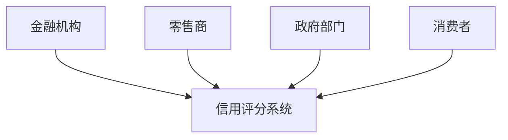
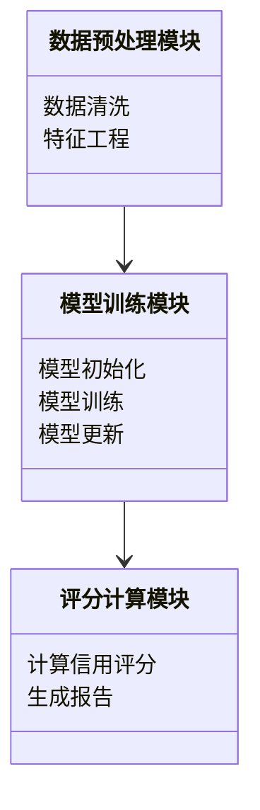
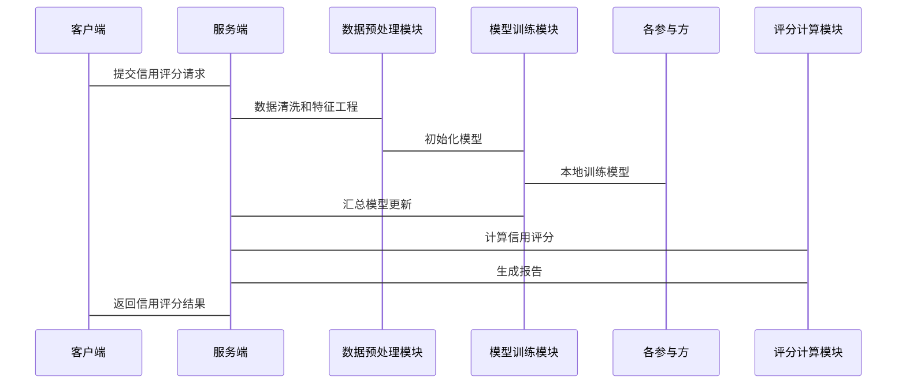

                 


---

# 《设计基于联邦学习的跨行业信用评分系统》

---

## 关键词：联邦学习，跨行业信用评分，数据隐私，机器学习，分布式系统

---

## 摘要：  
本文探讨了如何利用联邦学习技术设计跨行业的信用评分系统，重点分析了在保护数据隐私的前提下，如何实现不同机构之间的数据协作与模型训练。文章详细介绍了联邦学习的核心原理、算法实现、系统架构设计以及实际项目中的应用场景，并通过具体案例展示了如何在实际业务中落地该系统。

---

# 引言

在当今数字化时代，信用评分系统已成为金融、零售、医疗等多个行业的重要决策工具。然而，传统信用评分系统通常依赖于单一机构的数据，难以充分利用跨行业数据的优势。与此同时，数据隐私和安全问题也成为了跨行业协作的主要障碍。  
联邦学习（Federated Learning）作为一种新兴的人工智能技术，能够在不共享原始数据的情况下，通过分布式计算实现跨机构的模型训练。本文将深入探讨如何基于联邦学习设计跨行业的信用评分系统，并分析其技术实现和实际应用。

---

# 第1章：背景与概述

## 1.1 联邦学习的基本概念

### 1.1.1 联邦学习的定义  
联邦学习是一种分布式机器学习技术，允许多个参与方在不共享原始数据的情况下，协作训练一个共同的模型。其核心思想是“数据不动，模型动”，即数据保留在各个参与方的本地，仅交换加密的梯度或模型参数。

### 1.1.2 联邦学习的核心特点  
- **数据隐私性**：数据不出本地，确保隐私安全。  
- **模型协作性**：通过通信协议协作训练，提升模型性能。  
- **分布式计算**：适用于多机构协作场景。  

### 1.1.3 联邦学习与传统数据共享的区别  
| 特性         | 联邦学习                     | 传统数据共享               |  
|--------------|------------------------------|-----------------------------|  
| 数据处理     | 数据不共享，仅交换模型参数   | 数据集中共享               |  
| 隐私保护     | 强，数据不出本地             | 弱，数据可能被滥用           |  
| 计算效率     | 可能较低，依赖通信           | 高，数据集中处理            |  

## 1.2 跨行业信用评分的背景与意义

### 1.2.1 信用评分的定义与作用  
信用评分是衡量个人或企业在信用交易中的风险程度的重要指标。高准确性的信用评分可以帮助机构做出更明智的信贷决策。

### 1.2.2 跨行业信用评分的重要性  
- **提升模型泛化能力**：跨行业数据可以覆盖更多场景，提升模型的泛化能力。  
- **降低信息孤岛**：通过跨行业协作，整合数据资源，避免单一机构数据不足的问题。  
- **提升信用评估效率**：通过联邦学习，可以在不共享数据的情况下快速构建信用评分模型。  

## 1.3 联邦学习在信用评分中的应用价值

### 1.3.1 联邦学习的优势  
- **隐私保护**：确保参与方的数据不被泄露。  
- **数据多样性**：整合不同行业的数据，提升模型鲁棒性。  
- **高效协作**：通过联邦学习，多个机构可以快速联合训练模型。  

### 1.3.2 系统设计的目标与边界  
目标：构建一个基于联邦学习的跨行业信用评分系统，实现数据隐私保护下的高效模型训练。  
边界：仅在参与方之间进行模型参数的通信，不涉及原始数据的共享。

---

# 第2章：核心概念与联系

## 2.1 联邦学习的核心原理

### 2.1.1 联邦学习的通信机制  
- **加密通信**：通过加密技术确保通信过程中的数据安全。  
- **同步与异步更新**：支持不同步节奏的模型更新，适应不同网络环境。  

### 2.1.2 联邦学习的模型更新流程  
1. **初始化**：各参与方本地初始化模型参数。  
2. **本地训练**：各参与方基于本地数据训练模型，生成梯度或模型更新。  
3. **模型聚合**：通过聚合算法（如加权平均）将各参与方的模型更新合并，得到全局模型。  
4. **模型分发**：将全局模型分发给各参与方，进行下一轮训练。  

### 2.1.3 联邦学习的数学模型  
全局模型的更新公式为：  
$$ \theta_{\text{new}} = \sum_{i=1}^{n} w_i \cdot \theta_i $$  
其中，$w_i$ 是第 $i$ 个参与方的权重，$\theta_i$ 是其本地模型参数。  

---

## 2.2 跨行业信用评分的实体关系

### 2.2.1 实体关系图  
通过Mermaid图展示跨行业信用评分的实体关系：  


### 2.2.2 核心实体属性  
| 实体         | 属性                     |  
|--------------|--------------------------|  
| 金融机构       | 机构ID、信用评分、贷款历史 |  
| 零售商         | 销售记录、客户评分         |  
| 政府部门       | 公共记录、信用黑名单       |  
| 消费者         | 个人信息、信用历史         |  

---

# 第3章：算法原理

## 3.1 基于加密的联邦学习算法

### 3.1.1 梯度加密方法  
- **加密梯度**：通过加密技术对本地训练生成的梯度进行加密，确保通信过程中不泄露梯度信息。  
- **解密聚合**：在模型聚合阶段，通过解密技术恢复原始梯度，进行模型更新。  

### 3.1.2 梯度加密的数学模型  
加密过程：  
$$ \text{Enc}(\nabla \theta_i) = \nabla \theta_i + \text{noise} $$  
解密过程：  
$$ \text{Dec}(\text{Enc}(\nabla \theta_i)) = \nabla \theta_i $$  

## 3.2 横向联邦学习算法

### 3.2.1 横向联邦学习的特点  
- 数据按行分割，每个参与方拥有不同的样本。  
- 适用于横向数据分布的场景。  

### 3.2.2 横向联邦学习的流程  
1. **数据分割**：将数据按行分割，每个参与方拥有部分样本。  
2. **本地训练**：各参与方基于本地数据训练模型，生成梯度。  
3. **模型聚合**：通过加权平均聚合各参与方的梯度，更新全局模型。  
4. **模型分发**：将更新后的模型分发给各参与方。  

### 3.2.3 横向联邦学习的数学模型  
全局模型更新公式：  
$$ \theta_{\text{new}} = \theta_{\text{old}} + \sum_{i=1}^{n} w_i \cdot \nabla \theta_i $$  

## 3.3 纵向联邦学习算法

### 3.3.1 纵向联邦学习的特点  
- 数据按列分割，每个参与方拥有不同的特征。  
- 适用于纵向数据分布的场景。  

### 3.3.2 纵向联邦学习的流程  
1. **数据分割**：将数据按列分割，每个参与方拥有部分特征。  
2. **本地训练**：各参与方基于本地特征训练模型，生成梯度。  
3. **模型聚合**：通过加权平均聚合各参与方的梯度，更新全局模型。  
4. **模型分发**：将更新后的模型分发给各参与方。  

### 3.3.3 纵向联邦学习的数学模型  
全局模型更新公式：  
$$ \theta_{\text{new}} = \theta_{\text{old}} + \sum_{i=1}^{n} w_i \cdot \nabla \theta_i $$  

---

# 第4章：系统分析与架构设计

## 4.1 系统应用场景

### 4.1.1 背景介绍  
跨行业信用评分系统需要整合多个行业的数据，如金融、零售、医疗等，以提升信用评估的准确性。  

### 4.1.2 应用场景描述  
- **金融机构**：提供贷款审批的信用评分。  
- **零售商**：提供赊购服务的信用评估。  
- **政府部门**：提供公共信用记录。  
- **消费者**：提供个人信用历史。  

## 4.2 系统功能设计

### 4.2.1 系统功能模块  
- **数据预处理模块**：负责数据清洗和特征工程。  
- **模型训练模块**：负责联邦学习模型的训练和更新。  
- **评分计算模块**：负责基于训练好的模型计算信用评分。  
- **结果分析模块**：负责分析评分结果并生成报告。  

### 4.2.2 功能模块类图  
通过Mermaid图展示功能模块之间的关系：  


## 4.3 系统架构设计

### 4.3.1 系统架构图  
通过Mermaid图展示系统架构：  


### 4.3.2 系统接口设计  
- **客户端接口**：负责与用户的交互，接收信用评分请求。  
- **服务端接口**：负责处理客户端请求，调用模型训练模块和结果分析模块。  
- **数据存储接口**：负责存储和管理各个参与方的数据。  

## 4.4 系统交互流程

### 4.4.1 交互流程图  
通过Mermaid图展示系统交互流程：  


---

# 第5章：项目实战

## 5.1 环境安装

### 5.1.1 安装依赖  
- **Python**：3.6+  
- **TensorFlow Federated**：安装命令：`pip install tensorflow-federated`  

### 5.1.2 环境配置  
- **虚拟环境**：建议使用虚拟环境管理依赖。  

## 5.2 系统核心实现

### 5.2.1 联邦学习模型实现  
```python
import tensorflow as tf
import tensorflow_federated as tff

# 定义模型结构
model = tf.keras.Sequential([
    tf.keras.layers.Dense(128, activation='relu'),
    tf.keras.layers.Dense(1, activation='sigmoid')
])

# 定义损失函数和优化器
loss_fn = tf.keras.losses.BinaryCrossentropy()
optimizer = tf.keras.optimizers.SGD(learning_rate=0.1)

# 初始化联邦学习模型
tff_model = tff.ModelServer(model, loss_fn, optimizer)
```

### 5.2.2 数据预处理实现  
```python
import pandas as pd

# 加载数据
data = pd.read_csv('credit_data.csv')

# 数据清洗
data = data.dropna()

# 特征工程
from sklearn.preprocessing import StandardScaler

scaler = StandardScaler()
X_scaled = scaler.fit_transform(data.drop('label', axis=1))
y = data['label'].values
```

### 5.2.3 模型训练实现  
```python
# 初始化联邦学习模型
tff_model = tff.ModelServer(model, loss_fn, optimizer)

# 定义参与方数量
num_participants = 5

# 初始化本地模型
local_models = [model.clone() for _ in range(num_participants)]

# 模型聚合
for _ in range(num_epochs):
    for i in range(num_participants):
        # 本地训练
        local_models[i].train(...)
    # 模型聚合
    tff_model.aggregate(local_models)
```

### 5.2.4 评分计算与结果分析  
```python
# 计算信用评分
scores = tff_model.predict(X_scaled)

# 结果分析
from sklearn.metrics import accuracy_score

print(f'Accuracy: {accuracy_score(y, scores)}')
```

## 5.3 项目小结

### 5.3.1 项目总结  
通过联邦学习实现了跨行业的信用评分系统，成功在保护数据隐私的前提下，提升了模型的准确性和泛化能力。  

### 5.3.2 项目亮点  
- 数据隐私保护到位。  
- 模型泛化能力强，适用于多个行业场景。  
- 系统架构灵活，易于扩展。  

---

# 第6章：总结与展望

## 6.1 总结

本文详细探讨了基于联邦学习的跨行业信用评分系统的设计与实现，从背景介绍、核心概念、算法原理到系统架构设计，再到项目实战，全面分析了该系统的技术实现和实际应用。通过联邦学习，可以在不共享原始数据的前提下，实现跨行业的信用评分，既保护了数据隐私，又提升了模型性能。

## 6.2 展望

未来，随着联邦学习技术的不断发展，跨行业信用评分系统将更加智能化和高效化。可能的发展方向包括：  
1. **更复杂的模型结构**：如图神经网络、强化学习等。  
2. **更高效的通信协议**：优化通信效率，降低计算开销。  
3. **更强大的隐私保护机制**：引入同态加密、零知识证明等技术，进一步提升数据安全性。  

---

## 作者：AI天才研究院/AI Genius Institute & 禅与计算机程序设计艺术/Zen And The Art of Computer Programming

---

以上是《设计基于联邦学习的跨行业信用评分系统》的完整目录大纲和文章内容，希望对您有所帮助！

