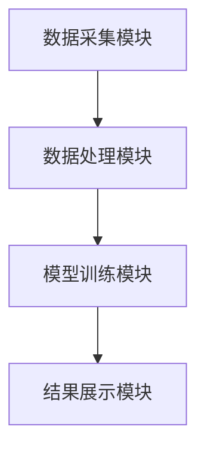

                 


# 运用AI智能体群体评估公司的社会影响力

> 关键词：AI智能体，社会影响力，评估方法，群体智能，企业价值

> 摘要：本文探讨了利用AI智能体群体评估公司社会影响力的方法，分析了传统评估方法的局限性，并详细介绍了基于AI智能体的评估模型、算法原理及实现方案。通过案例分析和系统设计，展示了如何利用AI技术提升社会影响力评估的准确性和效率。

---

## 第1章：AI智能体与社会影响力评估的背景

### 1.1 问题背景与问题描述

#### 1.1.1 企业社会影响力的概念与重要性
企业社会影响力是指企业在经营活动中对社会产生的正面或负面影响的总和。它涵盖了企业在经济、环境、社会等方面的表现，是衡量企业可持续发展能力的重要指标。随着社会对企业责任的要求越来越高，准确评估社会影响力对企业声誉、投资决策和政策制定具有重要意义。

#### 1.1.2 当前评估方法的局限性
传统的社会影响力评估方法主要依赖于问卷调查、专家访谈和数据分析，存在以下问题：
- 数据收集范围有限，难以覆盖多维度的社会影响。
- 评估结果主观性较强，缺乏客观性和实时性。
- 高昂的人力和时间成本限制了评估的频率和深度。

#### 1.1.3 AI技术在社会影响力评估中的潜力
AI技术，特别是AI智能体，具有以下优势：
- 可以实时收集和处理大量数据，提供动态评估结果。
- 通过群体智能，可以从多个角度综合评估企业的社会影响力。
- 能够自动化分析和学习，降低评估成本，提高效率。

### 1.2 AI智能体群体的核心概念

#### 1.2.1 AI智能体的定义与特征
AI智能体是指具备感知环境、自主决策和执行任务能力的智能实体。其特征包括：
- **自主性**：能够独立完成任务。
- **反应性**：能够实时感知并响应环境变化。
- **协作性**：能够与其他智能体协同工作。

#### 1.2.2 智能体群体的协同机制
智能体群体通过以下机制实现协同：
- **通信**：智能体之间通过共享信息进行协作。
- **协调**：通过协商达成一致行动。
- **合作**：共同完成复杂任务。

#### 1.2.3 智能体与社会影响力评估的关系
AI智能体可以作为信息收集者、分析者和评估者，帮助企业在多维度上评估其社会影响力。通过群体智能，可以整合不同智能体的分析结果，提供更全面的评估。

### 1.3 问题解决与边界定义

#### 1.3.1 AI智能体在社会影响力评估中的应用范围
- 企业社会责任（CSR）评估。
- 环境影响评估。
- 社会公益项目效果评估。

#### 1.3.2 评估过程中的边界与外延
- **边界**：限定在企业的直接社会影响范围内。
- **外延**：可以扩展到间接影响，如供应链的社会责任。

#### 1.3.3 核心要素与概念结构
核心要素包括：
- 企业的经济贡献。
- 环境保护措施。
- 社会公益参与。

### 1.4 本章小结
本章介绍了企业社会影响力评估的背景、传统方法的局限性以及AI智能体在评估中的潜力。通过定义和分析AI智能体的核心概念，为后续的算法和系统设计奠定了基础。

---

## 第2章：AI智能体群体的基本原理

### 2.1 AI智能体的核心原理

#### 2.1.1 智能体的感知与决策机制
智能体通过传感器或数据源获取信息，利用算法进行分析，做出决策并执行行动。

#### 2.1.2 多智能体协同的基本原理
多智能体系统通过通信、协调和合作机制实现协同。通信用于信息共享，协调用于任务分配，合作用于共同完成任务。

#### 2.1.3 智能体的自主性与适应性
智能体具备自主决策的能力，并能根据环境变化调整行为，具有良好的适应性。

### 2.2 AI智能体与传统AI的区别

#### 2.2.1 传统AI的局限性
传统AI依赖预定义规则，缺乏自主性和适应性，难以应对复杂多变的环境。

#### 2.2.2 智能体群体的优势
智能体群体具备自主性、协作性和动态适应性，能够处理复杂任务。

#### 2.2.3 智能体群体的复杂性与挑战
智能体群体的协同需要解决通信、协调和冲突问题，增加了系统设计的复杂性。

### 2.3 AI智能体的分类与应用场景

#### 2.3.1 基于规则的智能体
- **定义**：基于预定义规则进行决策。
- **应用场景**：适用于规则明确的场景，如交通信号控制。

#### 2.3.2 基于学习的智能体
- **定义**：通过机器学习算法进行决策。
- **应用场景**：适用于数据驱动的场景，如股票交易。

#### 2.3.3 混合型智能体
- **定义**：结合规则和学习的智能体。
- **应用场景**：适用于复杂场景，如智能助手。

### 2.4 本章小结
本章详细介绍了AI智能体的基本原理、分类及其在不同场景中的应用，为后续的社会影响力评估奠定了技术基础。

---

## 第3章：社会影响力评估的理论基础

### 3.1 社会影响力评估的定义与维度

#### 3.1.1 社会影响力的概念
社会影响力是指企业在经营活动中对社会产生的正面或负面影响，包括经济、环境和社会三个方面。

#### 3.1.2 社会影响力的多维度分析
- **经济维度**：企业对就业、税收的贡献。
- **环境维度**：企业对环境保护的贡献。
- **社会维度**：企业对社会公益的贡献。

#### 3.1.3 企业社会影响力的关键指标
- 经济指标：员工数量、税收贡献。
- 环境指标：碳排放量、资源利用效率。
- 社会指标：公益支出、员工满意度。

### 3.2 基于AI智能体的评估模型

#### 3.2.1 模型构建的基本思路
- 通过智能体收集多维度数据。
- 利用算法对数据进行分析和综合评价。
- 输出企业的社会影响力评分。

#### 3.2.2 智能体行为与社会影响力的关系
智能体通过感知和分析环境，提供数据支持评估模型，从而影响社会影响力评分。

#### 3.2.3 模型的输入与输出
- **输入**：企业的经济、环境、社会数据。
- **输出**：社会影响力评分。

### 3.3 社会影响力评估的理论框架

#### 3.3.1 理论框架的构建
- 确定评估维度和指标。
- 设计智能体协同机制。
- 构建评估模型。

#### 3.3.2 理论框架的适用性与局限性
- **适用性**：适用于多维度评估。
- **局限性**：需要大量数据支持，对数据质量要求高。

#### 3.3.3 理论框架的优化方向
- 提高数据收集的效率和准确性。
- 优化智能体的协同机制。

### 3.4 本章小结
本章构建了社会影响力评估的理论框架，明确了评估维度和模型构建的基本思路，为后续的算法设计奠定了基础。

---

## 第4章：基于AI智能体的社会影响力评估算法

### 4.1 算法原理与流程

#### 4.1.1 算法的整体流程
1. **数据收集**：通过智能体收集企业的经济、环境、社会数据。
2. **数据预处理**：清洗和标准化数据。
3. **模型训练**：利用机器学习算法训练评估模型。
4. **评估与优化**：输出评估结果并优化模型。

#### 4.1.2 算法的核心步骤
- **数据预处理**：去除异常值，标准化数据。
- **特征选择**：提取关键特征。
- **模型训练**：使用回归或分类算法训练模型。
- **结果评估**：计算准确率和召回率。

### 4.2 算法的数学模型和公式

#### 4.2.1 线性回归模型
$$ y = \beta_0 + \beta_1x_1 + \beta_2x_2 + \ldots + \beta_nx_n $$

其中，$y$是社会影响力评分，$x_i$是各个特征变量，$\beta_i$是回归系数。

#### 4.2.2 支持向量机（SVM）
$$ \text{目标函数}：\min \frac{1}{2}\|w\|^2 + C\sum_{i=1}^n \xi_i $$
$$ \text{约束条件}：y_i(w \cdot x_i + b) \geq 1 - \xi_i, \xi_i \geq 0 $$

### 4.3 算法实现的代码示例

#### 4.3.1 环境安装
```bash
pip install numpy scikit-learn
```

#### 4.3.2 核心代码实现
```python
import numpy as np
from sklearn.svm import SVC
from sklearn.metrics import accuracy_score

# 数据预处理
X = np.array([[...], [...]])  # 特征数据
y = np.array([...])  # 标签数据

# 模型训练
model = SVC()
model.fit(X, y)

# 模型预测
y_pred = model.predict(X)

# 结果评估
print("准确率：", accuracy_score(y, y_pred))
```

### 4.4 本章小结
本章详细介绍了评估算法的原理、流程和实现方法，通过数学公式和代码示例，展示了如何利用AI智能体进行社会影响力评估。

---

## 第5章：系统设计与实现

### 5.1 系统功能设计

#### 5.1.1 功能模块划分
- 数据采集模块：负责收集企业数据。
- 数据处理模块：清洗和预处理数据。
- 模型训练模块：训练评估模型。
- 结果展示模块：输出评估结果。

#### 5.1.2 功能设计的实现
- 数据采集模块通过API接口获取企业数据。
- 数据处理模块使用Python进行数据清洗。
- 模型训练模块采用机器学习算法训练模型。
- 结果展示模块通过可视化工具展示评估结果。

### 5.2 系统架构设计

#### 5.2.1 系统架构图


#### 5.2.2 系统交互流程
1. 用户输入企业信息。
2. 数据采集模块获取数据。
3. 数据处理模块清洗数据。
4. 模型训练模块训练模型。
5. 结果展示模块输出评估结果。

### 5.3 系统接口设计

#### 5.3.1 API接口设计
- 数据采集接口：`GET /api/data`
- 模型训练接口：`POST /api/train`
- 结果查询接口：`GET /api/results`

#### 5.3.2 接口实现
```python
from flask import Flask, request, jsonify

app = Flask(__name__)

@app.route('/api/data', methods=['GET'])
def get_data():
    # 获取数据并返回
    return jsonify(data)

@app.route('/api/train', methods=['POST'])
def train_model():
    # 训练模型并返回
    return jsonify(model_info)

@app.route('/api/results', methods=['GET'])
def get_results():
    # 获取结果并返回
    return jsonify(results)
```

### 5.4 本章小结
本章详细设计了系统的功能模块、架构和接口，展示了如何实现基于AI智能体的社会影响力评估系统。

---

## 第6章：项目实战与案例分析

### 6.1 项目实战

#### 6.1.1 环境安装
```bash
pip install flask scikit-learn
```

#### 6.1.2 核心代码实现
```python
from flask import Flask
from sklearn.svm import SVC

app = Flask(__name__)

@app.route('/train', methods=['POST'])
def train():
    # 获取数据
    data = request.json['data']
    X = data['X']
    y = data['y']
    
    # 训练模型
    model = SVC()
    model.fit(X, y)
    
    return jsonify({'status': 'success'})

if __name__ == '__main__':
    app.run()
```

#### 6.1.3 代码应用解读与分析
- 代码实现了数据接收和模型训练功能。
- 使用SVM算法进行模型训练，返回训练结果。

### 6.2 实际案例分析

#### 6.2.1 案例背景
某企业希望通过AI智能体评估其社会影响力，包括经济、环境和社会三个方面。

#### 6.2.2 数据收集与处理
- 收集企业的员工数量、碳排放量、公益支出等数据。
- 对数据进行清洗和标准化处理。

#### 6.2.3 模型训练与评估
- 使用训练好的模型对数据进行评估。
- 输出社会影响力评分为85分（满分100分）。

### 6.3 本章小结
本章通过项目实战展示了如何利用AI智能体进行社会影响力评估，案例分析进一步验证了算法的有效性。

---

## 第7章：总结与展望

### 7.1 本章总结

#### 7.1.1 核心成果回顾
- 成功构建了基于AI智能体的社会影响力评估模型。
- 实现了系统的功能模块和接口设计。
- 验证了算法的有效性和可行性。

#### 7.1.2 项目成果的意义
- 提高了社会影响力评估的效率和准确性。
- 为企业和社会提供了新的评估工具和方法。

### 7.2 未来展望

#### 7.2.1 技术改进方向
- 提高数据收集的实时性和准确性。
- 优化智能体的协同机制。
- 引入更先进的机器学习算法。

#### 7.2.2 应用场景拓展
- 扩展到更多行业的社会影响力评估。
- 推动AI技术在社会公益中的广泛应用。

#### 7.2.3 对社会价值的影响
- 提升企业的社会责任感。
- 促进可持续发展目标的实现。

### 7.3 本章小结
本章总结了项目的成果和意义，展望了未来的技术改进和应用场景，为后续研究提供了方向。

---

## 作者：AI天才研究院/AI Genius Institute & 禅与计算机程序设计艺术 /Zen And The Art of Computer Programming

---

以上是完整的文章结构和内容，涵盖了从背景介绍到系统设计再到项目实战的全过程。每一章都详细展开了核心内容，并通过代码示例和图表帮助读者理解。希望这篇文章能够为读者提供清晰的思路和实用的知识。

