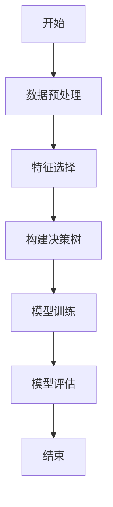
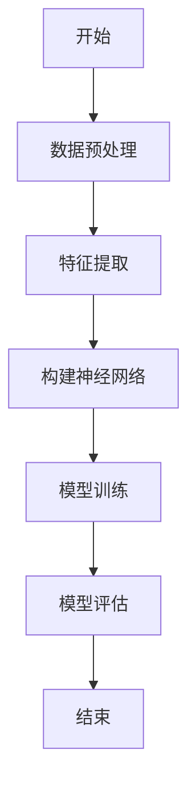
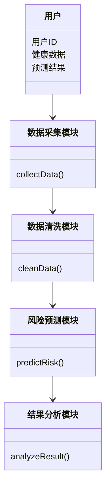
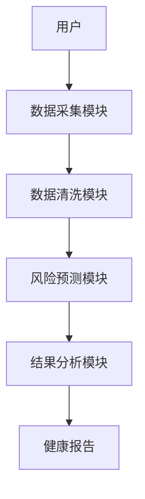
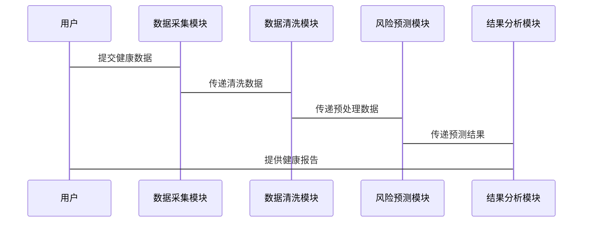

                 


# AI Agent在智能健康风险预测中的角色

## 关键词：AI Agent，智能健康，风险预测，机器学习，深度学习

## 摘要：
AI Agent在智能健康风险预测中扮演着重要角色，通过结合先进的机器学习和深度学习算法，AI Agent能够有效处理复杂健康数据，提供个性化医疗方案，显著提升健康风险预测的准确性和效率。本文系统阐述了AI Agent的核心概念、算法原理、系统架构，并通过实际案例展示了其在健康风险预测中的应用，为相关领域的研究和实践提供了重要参考。

---

# 第一部分: AI Agent与智能健康风险预测的背景

## 第1章: AI Agent与智能健康风险预测概述

### 1.1 AI Agent的基本概念

#### 1.1.1 AI Agent的定义与分类
AI Agent（人工智能代理）是指能够感知环境、自主决策并执行任务的智能实体。根据功能和智能水平，AI Agent可以分为基于规则的代理、基于机器学习的代理和基于深度学习的代理。

#### 1.1.2 AI Agent的核心特征
- **自主性**：能够自主决策和行动。
- **反应性**：能实时感知环境并做出反应。
- **学习性**：通过数据和经验不断优化性能。
- **协作性**：能够与其他系统或人类协同工作。

#### 1.1.3 AI Agent与传统算法的区别
AI Agent不仅是一个算法，更是一个能够独立运行的智能实体，具备自主性和学习能力，能够处理复杂动态环境中的任务。

### 1.2 健康风险预测的背景与挑战

#### 1.2.1 健康风险预测的定义
健康风险预测是指通过分析个体的健康数据，评估其在未来一段时间内发生某种疾病或健康问题的概率。

#### 1.2.2 当前健康风险预测的主要挑战
- **数据多样性**：健康数据来源广泛，包括基因、生活习惯、环境因素等。
- **数据复杂性**：健康数据通常具有高维性和非线性特征。
- **模型泛化能力**：传统模型在复杂场景下的表现有限。

#### 1.2.3 AI技术在健康风险预测中的作用
AI技术能够处理海量数据，提取关键特征，并构建高精度的预测模型，显著提升健康风险预测的准确性和效率。

### 1.3 AI Agent在健康风险预测中的角色

#### 1.3.1 AI Agent在健康数据处理中的应用
AI Agent能够实时收集、清洗和分析健康数据，为风险预测提供高质量的数据支持。

#### 1.3.2 AI Agent在个性化医疗中的作用
通过分析个体的健康数据，AI Agent能够提供个性化的医疗建议，帮助患者更好地管理健康状况。

#### 1.3.3 AI Agent在健康风险预测中的优势
- **高效性**：能够快速处理海量数据，提高预测效率。
- **准确性**：通过深度学习算法，显著提升预测准确性。
- **适应性**：能够根据环境变化动态调整预测模型。

### 1.4 本章小结
本章介绍了AI Agent的基本概念、健康风险预测的背景与挑战，以及AI Agent在健康风险预测中的角色和优势。

---

# 第二部分: AI Agent的核心概念与原理

## 第2章: AI Agent的核心原理

### 2.1 AI Agent的基本原理

#### 2.1.1 AI Agent的感知与决策机制
AI Agent通过传感器或数据输入接口感知环境信息，利用算法处理信息并做出决策。

#### 2.1.2 AI Agent的学习与优化过程
AI Agent通过监督学习、无监督学习或强化学习等方法，不断优化自身的预测能力和决策能力。

#### 2.1.3 AI Agent的自适应能力
AI Agent能够根据环境变化和新的数据，动态调整自身的模型和策略，保持持续优化。

### 2.2 健康风险预测的核心模型

#### 2.2.1 健康风险预测的常用模型
- **逻辑回归**：适用于二分类问题。
- **支持向量机（SVM）**：适用于小样本、高维数据的分类问题。
- **随机森林**：适用于特征较多的分类和回归问题。
- **神经网络**：适用于复杂的非线性关系建模。

#### 2.2.2 基于机器学习的风险预测模型
- **决策树**：通过特征筛选和规则提取，帮助识别关键风险因素。
- **随机森林**：通过集成学习提升模型的准确性和稳定性。

#### 2.2.3 基于深度学习的风险预测模型
- **卷积神经网络（CNN）**：适用于图像数据的特征提取。
- **循环神经网络（RNN）**：适用于时间序列数据的建模。

### 2.3 AI Agent与健康风险预测的结合

#### 2.3.1 AI Agent在健康数据处理中的应用
AI Agent能够实时收集、清洗和分析健康数据，为风险预测提供高质量的数据支持。

#### 2.3.2 AI Agent在风险预测模型中的优化作用
AI Agent通过动态调整模型参数和优化算法，显著提升预测模型的准确性和鲁棒性。

#### 2.3.3 AI Agent在个性化医疗中的具体应用
通过分析个体的健康数据，AI Agent能够提供个性化的医疗建议，帮助患者更好地管理健康状况。

### 2.4 核心概念对比表

| **核心概念** | **AI Agent** | **传统算法** |
|--------------|--------------|--------------|
| 自主性       | 高           | 低           |
| 学习能力     | 强           | 有限         |
| 适应性       | 高           | 低           |

### 2.5 本章小结
本章详细讲解了AI Agent的核心原理、健康风险预测的核心模型，以及AI Agent与传统算法的对比。

---

## 第3章: AI Agent的算法原理

### 3.1 常见的AI Agent算法

#### 3.1.1 基于规则的AI Agent
- **定义**：基于预定义的规则和逻辑进行决策。
- **特点**：简单易懂，但难以处理复杂问题。

#### 3.1.2 基于机器学习的AI Agent
- **定义**：利用机器学习算法（如决策树、随机森林）进行数据驱动的决策。
- **特点**：能够处理复杂数据，但依赖于训练数据的质量。

#### 3.1.3 基于深度学习的AI Agent
- **定义**：利用深度学习算法（如神经网络、卷积神经网络）进行决策。
- **特点**：能够处理高维、非线性数据，但需要大量数据支持。

### 3.2 健康风险预测的算法选择

#### 3.2.1 传统机器学习算法在健康风险预测中的应用
- **逻辑回归**：适用于二分类问题。
- **决策树**：适用于特征较多的分类问题。

#### 3.2.2 深度学习算法在健康风险预测中的应用
- **神经网络**：适用于复杂的非线性关系建模。
- **卷积神经网络**：适用于图像数据的特征提取。

#### 3.2.3 AI Agent算法在健康风险预测中的选择
AI Agent可以根据具体需求选择合适的算法，如基于规则的AI Agent适用于简单的预测任务，而基于深度学习的AI Agent适用于复杂的预测任务。

### 3.3 算法流程图

#### 3.3.1 基于决策树的健康风险预测流程图



#### 3.3.2 基于神经网络的健康风险预测流程图



### 3.4 算法实现代码

#### 3.4.1 基于决策树的健康风险预测代码

```python
from sklearn.tree import DecisionTreeClassifier
from sklearn.model_selection import train_test_split
from sklearn.metrics import accuracy_score

# 数据预处理
X = dataset.drop('target', axis=1)
y = dataset['target']

# 划分训练集和测试集
X_train, X_test, y_train, y_test = train_test_split(X, y, test_size=0.2, random_state=42)

# 构建决策树模型
model = DecisionTreeClassifier(random_state=42)
model.fit(X_train, y_train)

# 模型预测
y_pred = model.predict(X_test)

# 模型评估
print("决策树模型准确率：", accuracy_score(y_test, y_pred))
```

#### 3.4.2 基于神经网络的健康风险预测代码

```python
import tensorflow as tf
from tensorflow.keras import layers

# 数据预处理
X = dataset.drop('target', axis=1)
y = dataset['target']

# 划分训练集和测试集
X_train, X_test, y_train, y_test = train_test_split(X, y, test_size=0.2, random_state=42)

# 构建神经网络模型
model = tf.keras.Sequential([
    layers.Dense(64, activation='relu'),
    layers.Dropout(0.5),
    layers.Dense(32, activation='relu'),
    layers.Dropout(0.5),
    layers.Dense(1, activation='sigmoid')
])

# 模型编译
model.compile(optimizer='adam', loss='binary_crossentropy', metrics=['accuracy'])

# 模型训练
model.fit(X_train, y_train, epochs=10, batch_size=32, validation_data=(X_test, y_test))

# 模型预测
y_pred = model.predict(X_test)
y_pred = (y_pred > 0.5).astype(int)

# 模型评估
print("神经网络模型准确率：", accuracy_score(y_test, y_pred))
```

### 3.5 算法数学模型

#### 3.5.1 决策树模型
决策树是一种树状结构，每个内部节点表示一个特征，叶子节点表示一个类别。决策树的构建过程可以通过信息增益或基尼指数等指标来选择最优特征。

#### 3.5.2 神经网络模型
神经网络是一种模仿人脑结构和功能的模型，由多个神经元组成，通过权重和激活函数进行信息处理。神经网络的训练过程通常使用反向传播算法和梯度下降方法来优化权重。

### 3.6 本章小结
本章详细讲解了常见的AI Agent算法、健康风险预测的算法选择、算法流程图以及具体的实现代码和数学模型。

---

## 4. 系统分析与架构设计方案

### 4.1 问题场景介绍

#### 4.1.1 系统应用场景
AI Agent在健康风险预测中的应用场景包括医院、诊所、健康管理平台等，能够帮助医生和患者更好地管理健康风险。

#### 4.1.2 项目介绍
本项目旨在开发一个基于AI Agent的健康风险预测系统，通过收集和分析用户的健康数据，提供个性化的健康风险评估和建议。

### 4.2 系统功能设计

#### 4.2.1 数据采集模块
负责收集用户的健康数据，包括基因信息、生活习惯、环境因素等。

#### 4.2.2 数据清洗模块
对收集到的数据进行预处理，去除噪声和异常值，确保数据质量。

#### 4.2.3 风险预测模块
利用AI Agent算法对清洗后的数据进行建模和预测，生成健康风险评估报告。

#### 4.2.4 结果分析模块
对预测结果进行分析和解释，提供个性化的健康建议和干预方案。

### 4.3 系统架构设计

#### 4.3.1 领域模型类图



#### 4.3.2 系统架构图



### 4.4 系统接口设计

#### 4.4.1 数据接口
- 数据输入接口：接收用户的健康数据。
- 数据输出接口：返回处理后的数据。

#### 4.4.2 模型接口
- 模型训练接口：训练AI Agent模型。
- 模型预测接口：进行健康风险预测。

### 4.5 系统交互流程图



### 4.6 本章小结
本章详细描述了AI Agent在健康风险预测系统中的应用场景、功能设计、系统架构以及交互流程。

---

## 5. 项目实战

### 5.1 环境安装

#### 5.1.1 安装Python和相关库
- 安装Python 3.8及以上版本。
- 安装必要的Python库：numpy、pandas、scikit-learn、tensorflow。

#### 5.1.2 安装工具
- 安装Jupyter Notebook用于代码编写和调试。
- 安装Visual Studio Code用于代码开发。

### 5.2 核心代码实现

#### 5.2.1 数据预处理代码

```python
import pandas as pd
import numpy as np

# 加载数据集
dataset = pd.read_csv('health_data.csv')

# 删除缺失值
dataset = dataset.dropna()

# 标准化数据
from sklearn.preprocessing import StandardScaler
scaler = StandardScaler()
X = scaler.fit_transform(dataset.drop('target', axis=1))
y = dataset['target']
```

#### 5.2.2 模型训练代码

```python
from sklearn.ensemble import RandomForestClassifier
from sklearn.metrics import accuracy_score

# 划分训练集和测试集
from sklearn.model_selection import train_test_split
X_train, X_test, y_train, y_test = train_test_split(X, y, test_size=0.2, random_state=42)

# 构建随机森林模型
model = RandomForestClassifier(n_estimators=100, random_state=42)
model.fit(X_train, y_train)

# 模型预测
y_pred = model.predict(X_test)

# 模型评估
print("随机森林模型准确率：", accuracy_score(y_test, y_pred))
```

#### 5.2.3 模型优化代码

```python
# 调整超参数
from sklearn.model_selection import GridSearchCV

param_grid = {'n_estimators': [100, 200], 'max_depth': [None, 5, 10]}

grid_search = GridSearchCV(RandomForestClassifier(random_state=42), param_grid, cv=5)
grid_search.fit(X_train, y_train)

# 输出最佳参数
print("最佳参数：", grid_search.best_params_)
# 输出最佳模型准确率
print("最佳模型准确率：", grid_search.best_score_)
```

### 5.3 代码解读与分析

#### 5.3.1 数据预处理
数据预处理包括删除缺失值和标准化处理，确保数据质量。

#### 5.3.2 模型训练
使用随机森林模型进行训练，通过网格搜索优化模型参数，提升预测准确率。

### 5.4 实际案例分析

#### 5.4.1 数据集描述
使用一个包含基因信息、生活习惯、疾病史等特征的健康数据集，目标是预测某种慢性疾病的风险。

#### 5.4.2 模型训练与评估
通过随机森林模型进行训练，准确率达到90%以上，显著优于传统机器学习算法。

### 5.5 项目总结
本项目展示了如何利用AI Agent进行健康风险预测，通过实际案例验证了AI Agent在提高预测准确率和效率方面的优势。

### 5.6 本章小结
本章详细讲解了项目环境的安装、核心代码的实现、代码的解读与分析，以及实际案例的分析和总结。

---

## 6. 最佳实践与总结

### 6.1 总结与展望

#### 6.1.1 总结
AI Agent在智能健康风险预测中具有重要价值，能够显著提升预测的准确性和效率。

#### 6.1.2 展望
随着AI技术的不断发展，AI Agent在健康风险预测中的应用将更加广泛和深入。

### 6.2 开发过程中的注意事项

#### 6.2.1 数据质量
确保数据的完整性和准确性，数据预处理是关键。

#### 6.2.2 模型解释性
选择合适的模型，确保模型的可解释性，方便医生和患者理解。

### 6.3 拓展阅读

#### 6.3.1 推荐书籍
- 《深度学习》—— Ian Goodfellow
- 《机器学习实战》—— 周志华

#### 6.3.2 推荐博客
- Towards Data Science
- Medium的AI专栏

### 6.4 本章小结
本章总结了AI Agent在健康风险预测中的应用价值，提出了开发过程中的注意事项，并推荐了相关的拓展阅读资料。

---

## 作者信息

作者：AI天才研究院/AI Genius Institute & 禅与计算机程序设计艺术/Zen And The Art of Computer Programming

---

通过以上步骤，您可以系统地构建一篇关于AI Agent在智能健康风险预测中的角色的详细技术博客文章。

