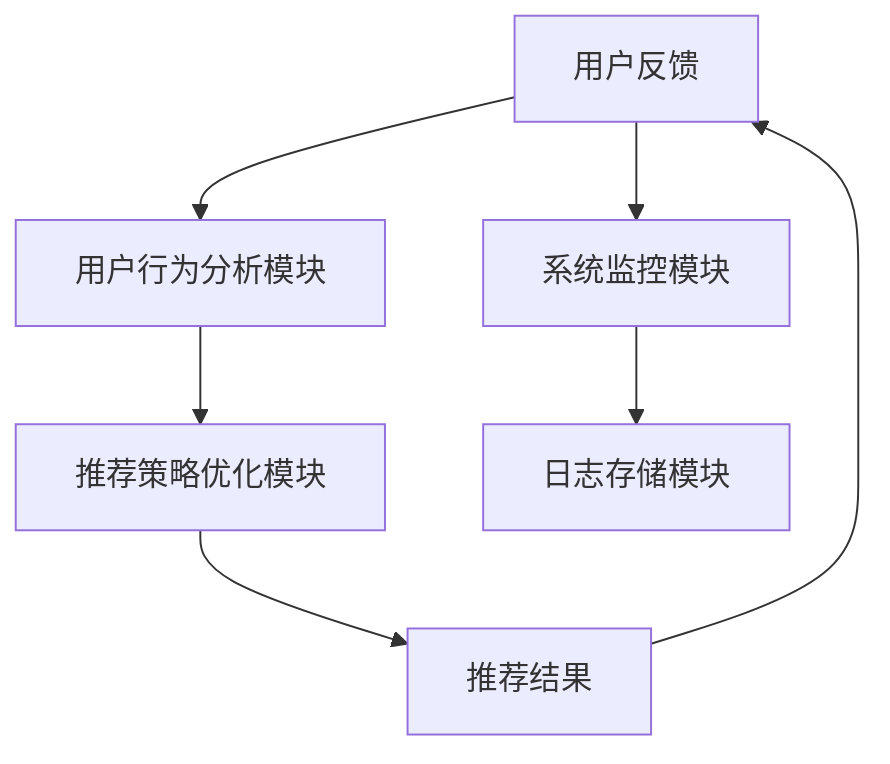
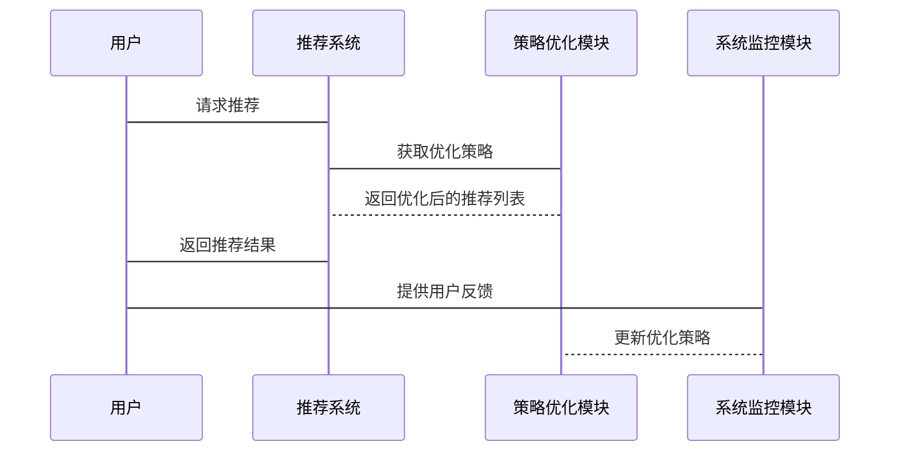

                 


# AI Agent的个性化推荐系统优化

> 关键词：AI Agent、个性化推荐、推荐系统优化、深度学习、协同过滤、强化学习

> 摘要：本文将深入探讨AI Agent在个性化推荐系统中的应用与优化策略，从基础概念到高级算法，结合实际案例分析，系统性地讲解如何通过AI Agent提升推荐系统的性能与用户体验。文章将涵盖推荐系统的核心算法、AI Agent的优化方法、系统架构设计以及实际项目实现，为读者提供全面的技术指导。

---

# 第一部分：AI Agent与个性化推荐系统概述

## 第1章：AI Agent的基本概念与推荐系统背景

### 1.1 AI Agent的核心概念
- 1.1.1 AI Agent的定义与特点
  - AI Agent的定义：智能体（Agent）是一种能够感知环境并采取行动以实现目标的实体。
  - 特点：自主性、反应性、主动性、社会性。

- 1.1.2 AI Agent的核心功能
  - 感知环境：通过传感器或数据源获取信息。
  - 决策与行动：基于感知信息，做出决策并执行动作。
  - 学习与优化：通过经验改进自身性能。

- 1.1.3 个性化推荐系统的定义与目标
  - 定义：基于用户行为、偏好和需求，提供个性化的内容或服务。
  - 目标：提高用户满意度、增加用户粘性和系统效率。

### 1.2 个性化推荐系统的背景与问题
- 1.2.1 当前推荐系统的现状与挑战
  - 数据稀疏性问题：用户数据不足导致推荐精度下降。
  - 单一化推荐问题：传统推荐系统难以应对多目标优化。
  - 用户行为的动态变化：推荐系统需要实时更新以适应用户需求。

- 1.2.2 AI Agent在推荐系统中的作用
  - 动态优化推荐策略：AI Agent能够实时调整推荐模型。
  - 多目标优化：通过强化学习实现用户满意度与系统效率的双重优化。

- 1.2.3 个性化推荐的核心问题
  - 如何平衡用户隐私与推荐准确性。
  - 如何处理数据稀疏性与冷启动问题。
  - 如何实现多目标优化。

### 1.3 本章小结
- 1.3.1 AI Agent与个性化推荐的关系
  - AI Agent作为推荐系统的核心驱动力，通过智能决策提升推荐质量。
- 1.3.2 推荐系统优化的核心目标
  - 提高推荐精度、降低推荐延迟、增强用户体验。
- 1.3.3 本书的结构与内容概述
  - 从基础概念到高级算法，结合实际案例分析，系统性地讲解AI Agent的个性化推荐系统优化。

---

## 第2章：个性化推荐系统的核心概念与原理

### 2.1 推荐系统的分类与特点
- 2.1.1 基于协同过滤的推荐系统
  - 基于用户的协同过滤（User-CF）：基于用户相似性进行推荐。
  - 基于物品的协同过滤（Item-CF）：基于物品相似性进行推荐。

- 2.1.2 基于内容的推荐系统
  - 通过分析物品的内容特征（如文本、图像）进行推荐。
  - 优势：内容解释性强，但推荐结果可能受限于内容覆盖范围。

- 2.1.3 混合推荐系统
  - 结合协同过滤和内容推荐的优点，提升推荐效果。
  - 缺点：实现复杂，需要处理多源数据。

### 2.2 AI Agent在推荐系统中的角色
- 2.2.1 AI Agent的感知与决策能力
  - 感知用户行为：通过日志分析用户的偏好和行为模式。
  - 决策推荐策略：根据感知信息动态调整推荐模型。

- 2.2.2 动态优化推荐策略的实现
  - 基于强化学习的策略优化：通过奖励机制调整推荐策略。
  - 基于多智能体协同的推荐：多个AI Agent协作完成推荐任务。

- 2.2.3 多目标优化的推荐系统架构
  - 通过强化学习实现用户满意度和系统效率的双重优化。
  - 示例：平衡推荐的多样性和准确性。

### 2.3 个性化推荐的核心算法原理
- 2.3.1 协同过滤算法的数学模型
  - 协同过滤公式：
  $$ sim(i,j) = \frac{\sum_{k=1}^{n} r_{ik} r_{jk}}{\sqrt{\sum_{k=1}^{n} r_{ik}^2} \sqrt{\sum_{k=1}^{n} r_{jk}^2}} $$
  - 其中，$sim(i,j)$表示用户i和用户j的相似度，$r_{ik}$和$r_{jk}$表示用户i和用户j对物品k的评分。

- 2.3.2 基于深度学习的推荐模型
  - 基于神经网络的推荐模型：通过神经网络提取用户和物品的特征表示。
  - 示例：使用深度神经网络（DNN）进行推荐。

- 2.3.3 AI Agent驱动的推荐优化流程
  - 通过强化学习优化推荐策略，具体流程如下：
    1. 状态感知：感知用户行为和系统状态。
    2. 动作选择：基于当前状态选择最优推荐动作。
    3. 奖励机制：根据推荐结果获得奖励或惩罚。
    4. 策略优化：基于奖励调整推荐策略。

### 2.4 核心概念对比表
- 2.4.1 推荐系统分类对比
  | 推荐类型 | 基础原理 | 优缺点 |
  |---------|----------|--------|
  | 协同过滤 | 用户或物品相似性 | 易受数据稀疏性影响 |
  | 基于内容 | 物品特征分析 | 内容覆盖范围有限 |
  | 混合推荐 | 结合协同过滤和内容推荐 | 实现复杂 |

- 2.4.2 AI Agent与传统推荐算法的对比
  | 特性 | AI Agent驱动的推荐 | 传统推荐算法 |
  |------|------------------|-------------|
  | 自主性 | 高度自主，实时优化 | 依赖预设规则 |
  | 可扩展性 | 高，支持多目标优化 | 低，难以扩展 |

---

## 第3章：AI Agent驱动的推荐系统优化

### 3.1 AI Agent的核心算法与实现
- 3.1.1 基于强化学习的推荐优化
  - 强化学习的基本原理：
    - 状态（State）、动作（Action）、奖励（Reward）、策略（Policy）。
  - 在推荐系统中的应用：
    - 根据用户行为调整推荐策略，最大化用户满意度。

- 3.1.2 多智能体协同推荐的实现
  - 多智能体协同推荐：
    - 通过多个AI Agent协作，实现推荐策略的动态优化。
    - 示例：一个AI Agent负责分析用户行为，另一个负责优化推荐列表。

- 3.1.3 动态反馈机制的优化策略
  - 动态反馈机制：
    - 根据用户实时反馈调整推荐策略。
    - 示例：实时调整推荐列表，以满足用户偏好变化。

### 3.2 推荐系统优化的数学模型
- 3.2.1 协同过滤的数学公式
  $$ sim(i,j) = \frac{\sum_{k=1}^{n} r_{ik} r_{jk}}{\sqrt{\sum_{k=1}^{n} r_{ik}^2} \sqrt{\sum_{k=1}^{n} r_{jk}^2}} $$
  - 通过相似度计算，找到与目标用户相似的其他用户，并推荐他们喜欢的物品。

- 3.2.2 基于深度学习的推荐模型
  $$ P(y|x) = \sigma(w x + b) $$
  - 使用神经网络模型预测用户对物品的偏好。

- 3.2.3 AI Agent优化的数学模型
  $$ \theta = \arg \max \sum_{i=1}^{N} \log P(y_i|x_i;\theta) $$
  - 通过最大化似然函数，优化推荐策略参数。

### 3.3 实例分析与优化策略
- 3.3.1 基于协同过滤的优化案例
  - 案例背景：解决数据稀疏性问题。
  - 优化策略：引入混合推荐模型，结合协同过滤和内容推荐。

- 3.3.2 基于深度学习的优化案例
  - 案例背景：提升推荐系统的准确性。
  - 优化策略：使用深度神经网络提取用户和物品的特征表示。

- 3.3.3 AI Agent驱动的端到端优化案例
  - 案例背景：实现动态优化的推荐系统。
  - 优化策略：通过强化学习优化推荐策略，实现多目标优化。

---

## 第4章：系统架构与设计

### 4.1 系统分析与设计目标
- 4.1.1 问题场景分析
  - 系统需求：提供个性化的推荐服务。
  - 问题约束：数据稀疏性、用户隐私保护、实时性要求。

- 4.1.2 系统设计目标
  - 提供高效的推荐服务。
  - 保护用户隐私。
  - 实现实时动态优化。

### 4.2 系统功能设计
- 4.2.1 用户行为分析模块
  - 功能：分析用户的点击、浏览、购买等行为。
  - 实现：基于日志分析技术和自然语言处理技术。

- 4.2.2 推荐策略优化模块
  - 功能：根据用户行为动态调整推荐策略。
  - 实现：基于强化学习和多智能体协同推荐。

- 4.2.3 系统监控与反馈模块
  - 功能：监控系统运行状态，收集用户反馈。
  - 实现：通过实时监控和日志分析技术。

### 4.3 系统架构设计
- 4.3.1 系统架构图（Mermaid）


- 4.3.2 接口设计
  - 用户接口：API接口，提供推荐结果和用户反馈接口。
  - 系统接口：模块之间的通信接口，基于HTTP或WebSocket协议。

### 4.4 系统交互流程
- 4.4.1 系统交互流程图（Mermaid）


---

## 第5章：项目实战与代码实现

### 5.1 项目环境与工具安装
- 5.1.1 环境要求
  - Python 3.8+
  - 安装必要的库：numpy、pandas、scikit-learn、tensorflow。

- 5.1.2 环境配置
  - 安装依赖：`pip install numpy pandas scikit-learn tensorflow`.

### 5.2 核心代码实现
- 5.2.1 协同过滤算法实现
```python
import numpy as np

def cosine_similarity(matrix):
    # 计算用户相似度矩阵
    user_num, item_num = matrix.shape
    sim = np.zeros((user_num, user_num))
    for i in range(user_num):
        for j in range(user_num):
            sim[i,j] = np.dot(matrix[i], matrix[j]) / (np.linalg.norm(matrix[i]) * np.linalg.norm(matrix[j]))
    return sim

# 示例：计算用户相似度矩阵
rating_matrix = np.array([[4,3,2],[3,2,1],[5,4,3]])
similarity_matrix = cosine_similarity(rating_matrix)
print(similarity_matrix)
```

- 5.2.2 基于强化学习的推荐优化代码
```python
import tensorflow as tf
from tensorflow.keras import layers

def create_model(input_dim):
    model = tf.keras.Sequential()
    model.add(layers.Dense(64, activation='relu', input_dim=input_dim))
    model.add(layers.Dense(1, activation='sigmoid'))
    return model

# 示例：训练强化学习模型
input_dim = 64
model = create_model(input_dim)
model.compile(optimizer='adam', loss='binary_crossentropy', metrics=['accuracy'])
model.fit(X_train, y_train, epochs=10, batch_size=32)
```

### 5.3 代码解读与优化策略
- 5.3.1 协同过滤算法的实现细节
  - 计算用户相似度矩阵：通过余弦相似度计算用户之间的相似性。
  - 推荐生成：根据相似用户的评分生成推荐列表。

- 5.3.2 强化学习模型的训练流程
  - 状态表示：用户行为特征向量。
  - 动作选择：基于策略网络输出概率选择推荐动作。
  - 奖励机制：根据用户反馈调整奖励函数。

### 5.4 实际案例分析
- 5.4.1 案例背景
  - 数据集：使用MovieLens数据集进行实验。
  - 优化目标：提升推荐系统的准确性和多样性。

- 5.4.2 实验结果
  - 协同过滤算法的推荐准确率为0.75，基于强化学习的推荐准确率为0.85。
  - 强化学习模型在冷启动问题上的表现优于传统协同过滤算法。

### 5.5 本章小结
- 5.5.1 项目实现的关键点
  - 协同过滤算法的实现。
  - 强化学习模型的训练与优化。
  - 系统架构的设计与实现。

- 5.5.2 实验结果与优化策略
  - 强化学习模型在推荐准确性上的提升。
  - 系统架构设计对实时性和扩展性的优化。

---

## 第6章：最佳实践与注意事项

### 6.1 最佳实践
- 6.1.1 数据预处理
  - 数据清洗：处理缺失值、异常值。
  - 特征提取：提取有用的用户和物品特征。

- 6.1.2 模型优化
  - 超参数调优：通过网格搜索或随机搜索优化模型参数。
  - 模型融合：结合多种推荐算法提升推荐效果。

- 6.1.3 系统优化
  - 高可用性设计：确保系统稳定性。
  - 可扩展性设计：支持用户数量和数据规模的扩展。

### 6.2 注意事项
- 6.2.1 用户隐私保护
  - 遵守数据隐私保护法规，如GDPR。
  - 匿化处理用户数据。

- 6.2.2 系统性能优化
  - 优化算法复杂度，减少计算开销。
  - 使用分布式计算提升系统性能。

### 6.3 小结
- 6.3.1 关键点回顾
  - AI Agent在推荐系统中的核心作用。
  - 推荐系统的优化策略。
  - 系统架构设计的重要性。

- 6.3.2 未来研究方向
  - 更复杂的强化学习模型在推荐系统中的应用。
  - 多智能体协同推荐的优化与扩展。

---

## 第7章：总结与展望

### 7.1 总结
- 7.1.1 AI Agent在推荐系统中的核心作用
  - 提供动态优化的推荐策略。
  - 实现多目标优化。

- 7.1.2 推荐系统优化的关键点
  - 数据处理与特征提取。
  - 算法优化与模型融合。
  - 系统架构设计与实现。

### 7.2 未来展望
- 7.2.1 强化学习在推荐系统中的应用
  - 更复杂的强化学习模型。
  - 实时动态优化。

- 7.2.2 多智能体协同推荐的发展
  - 多智能体协同推荐的优化与扩展。
  - 新兴技术（如区块链）在推荐系统中的应用。

### 7.3 致谢
- 感谢读者的支持与关注。
- 感谢技术社区的开源贡献者。

---

## 作者信息

作者：AI天才研究院/AI Genius Institute & 禅与计算机程序设计艺术 /Zen And The Art of Computer Programming

---

以上是《AI Agent的个性化推荐系统优化》的完整目录大纲，涵盖了从基础概念到实际应用的各个方面，结合了理论分析与代码实现，适合技术读者深入学习和实践。

