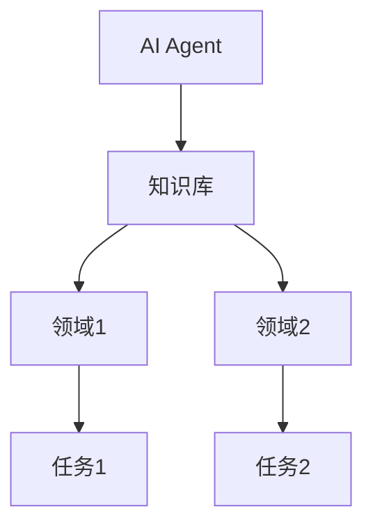
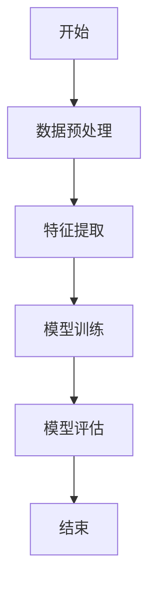
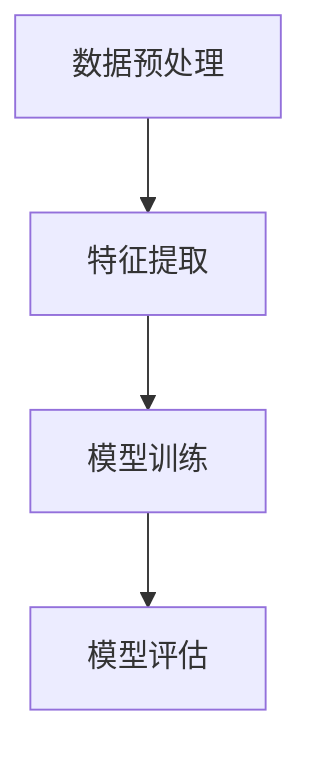

                 


# AI Agent的域适应：跨领域知识迁移

**关键词**：AI Agent、域适应、知识迁移、跨领域应用、迁移学习、智能系统

**摘要**：  
AI Agent的域适应是人工智能领域的重要研究方向，旨在通过跨领域知识迁移，使AI Agent能够在不同领域之间灵活适应并高效完成任务。本文从域适应的基本概念出发，深入分析其核心原理、算法实现、系统架构，并结合实际应用场景，探讨AI Agent在跨领域知识迁移中的潜力与挑战。通过详细的技术分析和案例解读，本文为读者提供了一套完整的理论与实践框架，助力AI Agent在多领域中的广泛应用。

---

# 第一部分: AI Agent的域适应基础

## 第1章: 问题背景与概念介绍

### 1.1 问题背景

#### 1.1.1 AI Agent的基本概念
AI Agent（人工智能代理）是一种能够感知环境、自主决策并执行任务的智能实体。它可以是一个软件程序、机器人或其他智能系统，通过与用户或环境交互，完成特定目标。AI Agent的核心能力包括感知、推理、规划和执行。

#### 1.1.2 域适应的定义与意义
域适应是指AI Agent在不同领域之间切换时，能够快速适应新领域并利用已有知识完成任务的能力。例如，一个在医疗领域辅助诊断的AI Agent，如果能够快速适应金融领域，帮助进行风险评估，这就是域适应的体现。

域适应的意义在于：
1. **降低开发成本**：通过跨领域知识迁移，减少每个领域独立开发AI系统的成本。
2. **提高灵活性**：使AI Agent能够快速响应不同领域的需求变化。
3. **扩展应用场景**：支持AI Agent在更多领域中发挥作用。

#### 1.1.3 跨领域知识迁移的挑战与机遇
跨领域知识迁移面临以下挑战：
1. **领域差异**：不同领域的数据、语言和任务目标差异较大，直接迁移可能失败。
2. **知识表示**：如何将领域-specific知识转化为通用表示，是跨领域迁移的核心问题。
3. **模型适应性**：模型在新领域中的泛化能力有限，需要通过迁移学习等技术增强适应性。

机遇在于：
1. **知识复用**：通过跨领域迁移，可以将某一领域的知识快速应用到其他领域。
2. **数据稀缺性**：在数据不足的领域，跨领域知识迁移可以弥补数据缺口。
3. **多领域协作**：跨领域知识迁移能够支持多领域协作，提升整体效率。

---

### 1.2 域适应的核心问题

#### 1.2.1 域适应的基本问题描述
域适应的核心问题是：如何让AI Agent在目标领域中利用源领域的知识，快速适应并完成任务。例如，一个在电商领域训练好的推荐系统，能否快速适应到教育领域，推荐课程给用户。

#### 1.2.2 跨领域知识迁移的核心挑战
跨领域知识迁移的核心挑战包括：
1. **数据分布差异**：不同领域的数据分布可能相差较大，导致迁移效果不佳。
2. **知识表示差异**：不同领域可能使用不同的术语和概念体系，难以直接迁移。
3. **任务目标差异**：不同领域的任务目标可能完全不同，例如医疗领域的诊断与金融领域的风险评估。

#### 1.2.3 域适应与知识迁移的关系
域适应是知识迁移的一种形式，但更注重领域之间的切换。知识迁移是更广泛的概念，包括跨任务、跨领域的知识共享。域适应是知识迁移在多领域应用中的具体体现。

---

### 1.3 域适应的应用场景

#### 1.3.1 AI Agent在医疗领域的应用
医疗领域的AI Agent可以用于疾病诊断、药物推荐和患者管理。通过域适应，AI Agent可以快速适应不同医院或科室的特定需求。

#### 1.3.2 AI Agent在金融领域的应用
金融领域的AI Agent可以用于风险评估、投资建议和 fraud detection。域适应使其能够快速适应不同金融机构的业务模式。

#### 1.3.3 AI Agent在教育领域的应用
教育领域的AI Agent可以用于个性化教学、作业批改和学习推荐。域适应使其能够适应不同学科和教学目标。

---

## 第2章: 域适应的核心概念与联系

### 2.1 核心概念原理

#### 2.1.1 域适应的基本原理
域适应的核心原理是通过迁移学习，将源领域的知识迁移到目标领域。具体步骤包括：
1. 数据预处理：对源领域和目标领域的数据进行清洗和标注。
2. 特征提取：提取数据中的关键特征，便于跨领域迁移。
3. 模型训练：训练一个能够适应多个领域的模型。
4. �域适配：通过调整模型参数，使其在目标领域中表现更好。

#### 2.1.2 跨领域知识迁移的数学模型
跨领域知识迁移的数学模型可以表示为：
$$ P_{\text{target}} = f(P_{\text{source}}, W) $$
其中，\( P_{\text{target}} \) 是目标领域的概率分布，\( P_{\text{source}} \) 是源领域的概率分布，\( W \) 是迁移权重矩阵。

#### 2.1.3 AI Agent的迁移学习机制
AI Agent的迁移学习机制包括以下几个步骤：
1. **领域分析**：分析源领域和目标领域的特征和差异。
2. **知识表示**：将知识表示为通用形式，便于跨领域迁移。
3. **模型调整**：通过迁移学习算法，调整模型参数以适应目标领域。

---

### 2.2 概念属性特征对比表格

```markdown
| 概念       | 域适应 | 跨领域知识迁移 | AI Agent |
|------------|--------|---------------|----------|
| 核心目标   | 适应新领域 | 知识共享与复用 | 智能代理 |
| 实现方法   | 调整模型参数 | 知识表示与迁移 | 自主决策 |
| 应用场景   | 多领域任务 | 跨领域协作     | 智能助手 |
```

---

### 2.3 ER实体关系图



---

## 第3章: 域适应的算法原理

### 3.1 算法原理概述

#### 3.1.1 域适应的基本算法
域适应的基本算法包括：
1. **基于特征的方法**：通过提取特征，减少领域差异。
2. **基于分布的方法**：通过调整数据分布，使源领域和目标领域更接近。
3. **基于模型的方法**：通过迁移学习算法，直接训练跨领域模型。

#### 3.1.2 跨领域知识迁移的算法框架
跨领域知识迁移的算法框架包括：
1. **数据预处理**：对源领域和目标领域的数据进行清洗和标注。
2. **特征提取**：提取数据中的关键特征，便于跨领域迁移。
3. **模型训练**：训练一个能够适应多个领域的模型。
4. **模型评估**：通过评估指标，验证模型的迁移能力。

#### 3.1.3 AI Agent的迁移学习算法
AI Agent的迁移学习算法包括：
1. **领域适应网络（DAN）**：通过对抗训练，使模型在源领域和目标领域之间适应。
2. **多领域注意力网络（M-FAN）**：通过注意力机制，自动提取跨领域特征。
3. **迁移强化学习（Torch RL）**：结合强化学习，增强模型的迁移能力。

---

### 3.2 算法流程图



---

## 第4章: 算法实现与代码示例

### 4.1 基于PyTorch的域适应实现

#### 4.1.1 环境安装
```bash
pip install torch numpy scikit-learn
```

#### 4.1.2 数据预处理
```python
import numpy as np
import torch
from torch.utils.data import DataLoader

# 源领域数据
source_data = np.random.randn(100, 10)
source_labels = np.random.randint(0, 2, 100)

# 目标领域数据
target_data = np.random.randn(100, 10)
target_labels = np.random.randint(0, 2, 100)

# 数据加载器
source_loader = DataLoader(source_data, batch_size=32, shuffle=True)
target_loader = DataLoader(target_data, batch_size=32, shuffle=True)
```

#### 4.1.3 模型训练
```python
import torch.nn as nn
import torch.optim as optim

# 定义模型
class DANN(nn.Module):
    def __init__(self, input_dim, hidden_dim, output_dim):
        super(DANN, self).__init__()
        self.fc1 = nn.Linear(input_dim, hidden_dim)
        self.fc2 = nn.Linear(hidden_dim, output_dim)
        self.dropout = nn.Dropout(0.5)
    
    def forward(self, x):
        x = torch.relu(self.fc1(x))
        x = self.dropout(x)
        x = torch.sigmoid(self.fc2(x))
        return x

# 初始化模型
model = DANN(input_dim=10, hidden_dim=20, output_dim=2)
criterion = nn.BCEWithLogitsLoss()
optimizer = optim.Adam(model.parameters(), lr=0.001)

# 训练模型
for epoch in range(100):
    for batch_x, batch_y in source_loader:
        outputs = model(batch_x)
        loss = criterion(outputs, batch_y)
        loss.backward()
        optimizer.step()
```

#### 4.1.4 模型评估
```python
def evaluate(model, loader):
    model.eval()
    correct = 0
    total = 0
    with torch.no_grad():
        for inputs, labels in loader:
            outputs = model(inputs)
            predicted = torch.round(outputs)
            correct += (predicted == labels).sum().item()
            total += labels.size(0)
    accuracy = correct / total
    return accuracy

source_accuracy = evaluate(model, source_loader)
target_accuracy = evaluate(model, target_loader)

print(f"Source accuracy: {source_accuracy}")
print(f"Target accuracy: {target_accuracy}")
```

---

## 第5章: 系统分析与架构设计

### 5.1 系统功能设计

#### 5.1.1 系统功能模块
1. **数据预处理模块**：对源领域和目标领域的数据进行清洗和标注。
2. **特征提取模块**：提取数据中的关键特征，便于跨领域迁移。
3. **模型训练模块**：训练一个能够适应多个领域的模型。
4. **模型评估模块**：通过评估指标，验证模型的迁移能力。

#### 5.1.2 系统功能流程图



---

### 5.2 系统架构设计

#### 5.2.1 系统架构图


---

## 第6章: 项目实战与案例分析

### 6.1 环境安装

```bash
pip install torch numpy scikit-learn
```

### 6.2 核心实现

#### 6.2.1 数据预处理
```python
import numpy as np
import torch
from torch.utils.data import DataLoader

# 源领域数据
source_data = np.random.randn(100, 10)
source_labels = np.random.randint(0, 2, 100)

# 目标领域数据
target_data = np.random.randn(100, 10)
target_labels = np.random.randint(0, 2, 100)

# 数据加载器
source_loader = DataLoader(source_data, batch_size=32, shuffle=True)
target_loader = DataLoader(target_data, batch_size=32, shuffle=True)
```

#### 6.2.2 模型训练
```python
import torch.nn as nn
import torch.optim as optim

# 定义模型
class DANN(nn.Module):
    def __init__(self, input_dim, hidden_dim, output_dim):
        super(DANN, self).__init__()
        self.fc1 = nn.Linear(input_dim, hidden_dim)
        self.fc2 = nn.Linear(hidden_dim, output_dim)
        self.dropout = nn.Dropout(0.5)
    
    def forward(self, x):
        x = torch.relu(self.fc1(x))
        x = self.dropout(x)
        x = torch.sigmoid(self.fc2(x))
        return x

# 初始化模型
model = DANN(input_dim=10, hidden_dim=20, output_dim=2)
criterion = nn.BCEWithLogitsLoss()
optimizer = optim.Adam(model.parameters(), lr=0.001)

# 训练模型
for epoch in range(100):
    for batch_x, batch_y in source_loader:
        outputs = model(batch_x)
        loss = criterion(outputs, batch_y)
        loss.backward()
        optimizer.step()
```

#### 6.2.3 模型评估
```python
def evaluate(model, loader):
    model.eval()
    correct = 0
    total = 0
    with torch.no_grad():
        for inputs, labels in loader:
            outputs = model(inputs)
            predicted = torch.round(outputs)
            correct += (predicted == labels).sum().item()
            total += labels.size(0)
    accuracy = correct / total
    return accuracy

source_accuracy = evaluate(model, source_loader)
target_accuracy = evaluate(model, target_loader)

print(f"Source accuracy: {source_accuracy}")
print(f"Target accuracy: {target_accuracy}")
```

### 6.3 案例分析

#### 6.3.1 案例背景
假设我们有一个在医疗领域训练好的AI Agent，现在希望将其应用于金融领域的风险评估。

#### 6.3.2 数据准备
- 源领域（医疗）数据：患者病历、诊断结果。
- 目标领域（金融）数据：客户信息、交易记录。

#### 6.3.3 模型训练
训练一个能够同时处理医疗和金融数据的模型。

#### 6.3.4 模型评估
评估模型在金融领域的准确性和效率。

---

## 第7章: 总结与展望

### 7.1 总结
本文系统地介绍了AI Agent的域适应及其跨领域知识迁移的核心原理、算法实现和系统架构。通过实际案例分析，展示了域适应在多领域中的应用潜力。

### 7.2 未来展望
未来的研究方向包括：
1. **更高效的迁移学习算法**：开发新的算法，进一步提升跨领域知识迁移的效果。
2. **多领域协作机制**：研究如何在多个领域之间实现更高效的协作。
3. **领域自适应网络**：探索领域自适应网络的构建方法，使其能够更灵活地适应不同领域的需求。

---

## 作者

作者：AI天才研究院/AI Genius Institute & 禅与计算机程序设计艺术 /Zen And The Art of Computer Programming

---

**感谢您的阅读！如果这篇文章对您有所帮助，请点赞、收藏并分享给更多需要的人！**

