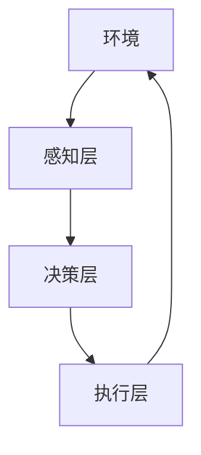
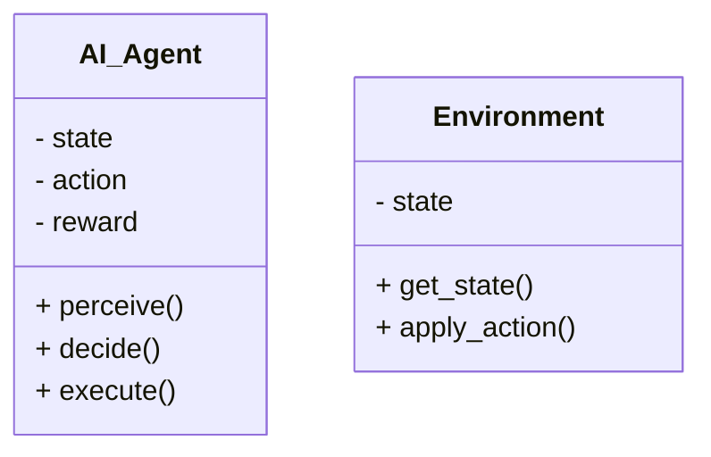
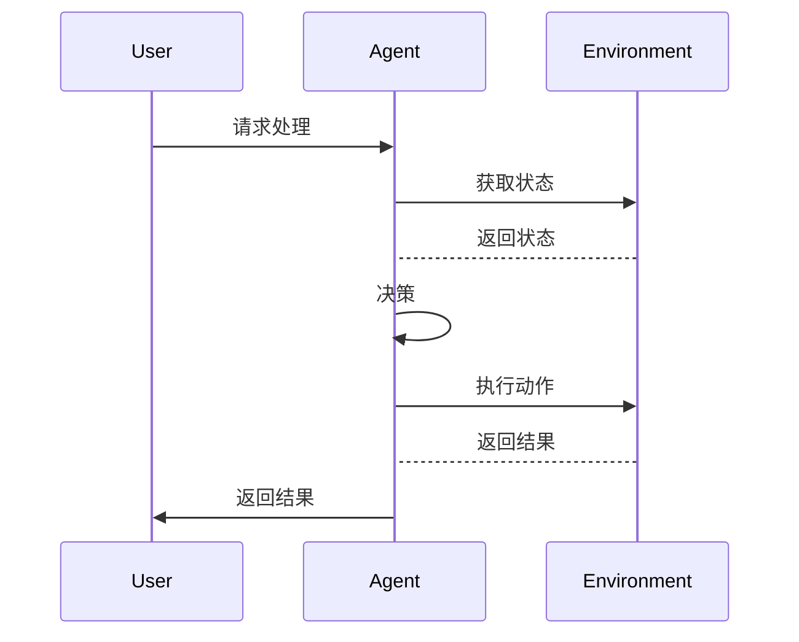

                 


# AI Agent的定义与特性：智能助手的核心要素

## 关键词：AI Agent, 智能助手, 人工智能, 自主性, 智能系统

## 摘要：  
本文将详细探讨AI Agent的定义、核心特性及其在智能助手中的应用。通过分析AI Agent的感知、决策和执行能力，揭示其在智能系统中的重要性。本文还将介绍几种典型的AI Agent算法，并通过实际案例分析，帮助读者理解AI Agent的设计与实现过程。

---

# 第1章: AI Agent的基本概念

## 1.1 AI Agent的定义

### 1.1.1 什么是AI Agent  
AI Agent（人工智能代理）是一种能够感知环境、自主决策并执行任务的智能系统。它通过与环境交互，实现特定目标，例如信息检索、任务管理和智能对话。

### 1.1.2 AI Agent的核心特征  
AI Agent的核心特征包括：  
- **自主性**：无需外部干预，自主完成任务。  
- **反应性**：能够实时感知环境并做出反应。  
- **智能性**：通过学习和推理解决问题。  
- **适应性**：能够适应环境变化，优化行为。  

### 1.1.3 AI Agent与传统AI的区别  
AI Agent与传统AI的区别在于，AI Agent具有更强的自主性和适应性，能够与环境动态交互，而传统AI更多是静态的知识处理。

---

## 1.2 AI Agent的分类

### 1.2.1 按功能分类  
- **任务管理型**：用于任务调度和管理。  
- **信息检索型**：用于信息查询和整理。  
- **自然语言处理型**：用于对话交互和文本理解。  

### 1.2.2 按智能水平分类  
- **基于规则的AI Agent**：通过预定义规则进行决策。  
- **基于学习的AI Agent**：通过机器学习模型进行决策。  
- **基于推理的AI Agent**：通过逻辑推理进行决策。  

### 1.2.3 按应用场景分类  
- **企业级AI Agent**：用于企业内部管理和服务。  
- **消费者级AI Agent**：用于个人助手和生活服务。  
- **行业定制型AI Agent**：用于特定行业的智能化服务。  

---

# 第2章: AI Agent的核心要素

## 2.1 感知能力

### 2.1.1 数据输入与处理  
AI Agent通过传感器、API或用户输入等方式获取环境数据，并进行预处理和特征提取。

### 2.1.2 知识表示  
知识表示是AI Agent理解环境的关键。常用的表示方法包括：  
- **符号表示**：使用符号逻辑表示知识。  
- **语义网络**：通过节点和边表示概念及其关系。  
- **知识图谱**：通过图结构表示知识。  

### 2.1.3 感知模型  
感知模型用于将输入数据转换为有意义的信息。例如，自然语言处理模型将文本转换为语义表示。

---

## 2.2 决策能力

### 2.2.1 决策算法  
AI Agent的决策算法包括：  
- **基于规则的决策**：通过预定义规则进行决策。  
- **基于Q-learning的决策**：通过强化学习优化决策策略。  
- **基于深度学习的决策**：通过神经网络进行决策。  

### 2.2.2 行为规划  
行为规划是AI Agent根据当前状态和目标，制定行动计划。常用的规划方法包括：  
- **贪心算法**：选择当前最优的行为。  
- **A*算法**：用于路径规划和全局最优行为选择。  

### 2.2.3 状态评估  
状态评估是AI Agent对当前环境状态进行评估，以决定下一步行动。常用的评估方法包括：  
- **基于效用的评估**：通过效用函数评估状态的价值。  
- **基于风险的评估**：考虑风险因素进行状态评估。  

---

## 2.3 执行能力

### 2.3.1 行为输出  
AI Agent通过执行动作与环境交互，例如发送请求、调整参数或输出结果。

### 2.3.2 执行监控  
AI Agent需要实时监控执行过程，确保任务按计划进行。常用的监控方法包括：  
- **状态跟踪**：跟踪任务执行的状态。  
- **异常检测**：检测执行过程中的异常情况。  

### 2.3.3 效果评估  
效果评估是AI Agent对执行结果进行评估，以优化后续行为。常用的评估方法包括：  
- **基于反馈的评估**：通过用户反馈优化行为。  
- **基于结果的评估**：通过任务完成情况评估效果。  

---

# 第3章: AI Agent的数学模型与算法

## 3.1 基于规则的AI Agent

### 3.1.1 规则表示  
基于规则的AI Agent通过预定义规则进行决策。例如，规则可以表示为：  
- 如果条件满足，则执行相应操作。  

### 3.1.2 规则推理  
规则推理是通过逻辑推理应用规则。例如，使用符号逻辑推理系统进行规则推理。

### 3.1.3 规则优化  
规则优化是通过学习和优化规则库，提高决策效率和准确性。

---

## 3.2 基于Q-learning的AI Agent

### 3.2.1 Q-learning算法原理  
Q-learning是一种强化学习算法，通过学习状态-动作值函数优化决策策略。

### 3.2.2 Q-learning数学模型  
Q-learning的数学模型如下：  
$$ Q(s, a) = r + \gamma \max Q(s', a') $$  
其中，$s$是当前状态，$a$是动作，$r$是奖励，$\gamma$是折扣因子，$s'$是下一个状态。

### 3.2.3 算法实现  
以下是Q-learning算法的Python实现示例：

```python
import numpy as np

class QAgent:
    def __init__(self, state_space, action_space, gamma=0.99):
        self.state_space = state_space
        self.action_space = action_space
        self.gamma = gamma
        self.q_table = np.zeros((state_space, action_space))

    def choose_action(self, state, epsilon=0.1):
        if np.random.random() < epsilon:
            return np.random.randint(self.action_space)
        return np.argmax(self.q_table[state])

    def learn(self, state, action, reward, next_state):
        self.q_table[state, action] = reward + self.gamma * np.max(self.q_table[next_state])
```

---

## 3.3 基于深度强化学习的AI Agent

### 3.3.1 DQN算法概述  
DQN（Deep Q-Network）是一种基于深度学习的强化学习算法，通过神经网络近似Q值函数。

### 3.3.2 DQN网络结构  
DQN网络结构包括输入层、隐藏层和输出层，用于近似Q值函数。

### 3.3.3 算法流程图（Mermaid）



---

# 第4章: AI Agent的系统架构设计

## 4.1 问题场景介绍

### 4.1.1 任务管理AI Agent  
任务管理AI Agent用于帮助用户管理和执行任务，例如提醒、进度跟踪和优先级排序。

### 4.1.2 信息检索AI Agent  
信息检索AI Agent用于帮助用户快速找到所需信息，例如搜索引擎、知识库查询。

### 4.1.3 自然语言处理AI Agent  
自然语言处理AI Agent用于理解和生成自然语言，例如智能对话系统。

---

## 4.2 系统功能设计

### 4.2.1 领域模型（Mermaid类图）



### 4.2.2 系统架构设计（Mermaid架构图）

```mermaid
archi
    title AI Agent System Architecture
    actor User
    component Agent
    component Environment
    component Database
    User --> Agent: Input
    Agent --> Environment: Action
    Environment --> Agent: Feedback
    Agent --> Database: Store
```

---

## 4.3 系统接口设计

### 4.3.1 接口定义  
AI Agent与环境交互的接口包括：  
- `perceive()`：感知环境状态。  
- `decide()`：决策并返回动作。  
- `execute()`：执行动作并返回结果。  

### 4.3.2 交互序列图（Mermaid）



---

# 第5章: AI Agent的项目实战

## 5.1 环境安装

### 5.1.1 安装Python和相关库  
安装Python和以下库：  
- `numpy`：用于数值计算。  
- `matplotlib`：用于可视化。  
- `tensorflow`：用于深度学习。  

### 5.1.2 安装工具链  
安装Jupyter Notebook或VS Code用于开发和调试。

---

## 5.2 系统核心实现

### 5.2.1 核心代码实现  
以下是基于DQN算法的AI Agent实现示例：

```python
import numpy as np
import tensorflow as tf

class DQNAgent:
    def __init__(self, state_size, action_size):
        self.state_size = state_size
        self.action_size = action_size
        self.model = self.build_model()
    
    def build_model(self):
        model = tf.keras.Sequential([
            tf.keras.layers.Dense(32, activation='relu', input_dim=self.state_size),
            tf.keras.layers.Dense(32, activation='relu'),
            tf.keras.layers.Dense(self.action_size, activation='linear')
        ])
        return model
    
    def act(self, state):
        state = np.reshape(state, [-1, self.state_size])
        prediction = self.model.predict(state)
        return np.argmax(prediction[0])
    
    def train(self, state, action, reward, next_state):
        target = reward + 0.95 * np.max(self.model.predict(np.reshape(next_state, [-1, self.state_size])))
        target = np.reshape(target, [-1, self.action_size])
        self.model.fit(np.reshape(state, [-1, self.state_size]), target, epochs=1, verbose=0)
```

### 5.2.2 代码解读与分析  
- `build_model()`：构建神经网络模型。  
- `act()`：根据当前状态选择动作。  
- `train()`：通过经验回放优化模型。  

### 5.2.3 实际案例分析  
以任务管理AI Agent为例，展示如何通过AI Agent优化任务执行流程。

### 5.2.4 项目小结  
总结项目实现的关键点和经验教训，为后续优化提供参考。

---

# 第6章: AI Agent的最佳实践

## 6.1 小贴士

### 6.1.1 数据质量  
确保训练数据的多样性和代表性，避免模型过拟合。

### 6.1.2 模型可解释性  
尽量选择可解释的模型，便于调试和优化。

### 6.1.3 安全性和隐私性  
确保AI Agent的安全性和用户隐私，避免数据泄露和滥用。

---

## 6.2 注意事项

### 6.2.1 算法选择  
根据具体任务选择合适的算法，避免盲目使用复杂模型。

### 6.2.2 系统设计  
注重系统架构设计，确保系统的可扩展性和可维护性。

### 6.2.3 代码规范  
遵循代码规范，便于团队协作和后续优化。

---

## 6.3 拓展阅读

### 6.3.1 推荐书籍  
- 《强化学习（深入浅出）》  
- 《机器学习实战》  

### 6.3.2 推荐博客和网站  
- Medium上的AI相关博客  
- Towards Data Science  
- AI发展论坛  

---

# 附录

## 附录A: 术语表

- **AI Agent**：人工智能代理，能够感知环境、自主决策并执行任务的智能系统。  
- **强化学习**：一种通过试错优化决策策略的机器学习方法。  
- **知识图谱**：用于表示知识的图结构，节点表示实体，边表示关系。  

## 附录B: 参考文献

1. Russell, S., & Norvig, P. (2010). Artificial Intelligence: A Modern Approach.  
2. Sutton, R. S., & Barto, A. G. (2018). Reinforcement Learning: An Introduction.  
3. LeCun, Y., Bengio, Y., & Hinton, G. (2015). Deep Learning.  

---

# 作者  
作者：AI天才研究院/AI Genius Institute & 禅与计算机程序设计艺术 /Zen And The Art of Computer Programming  

--- 

通过本文的详细讲解，读者可以全面理解AI Agent的定义、特性及其在智能助手中的核心作用。希望本文能为AI Agent的研究和应用提供有价值的参考和指导。

