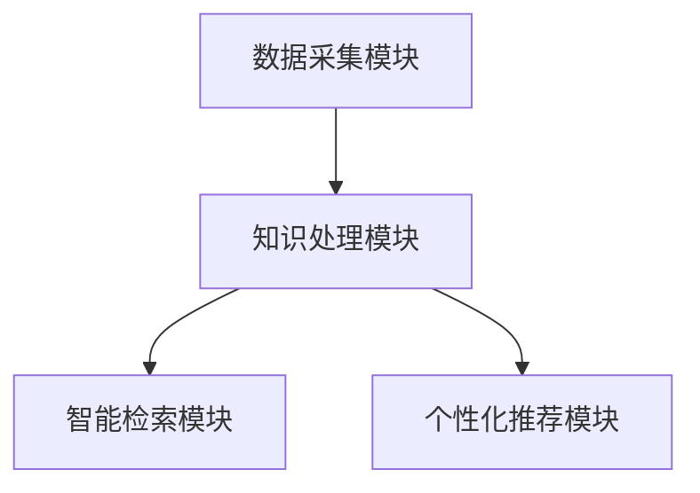
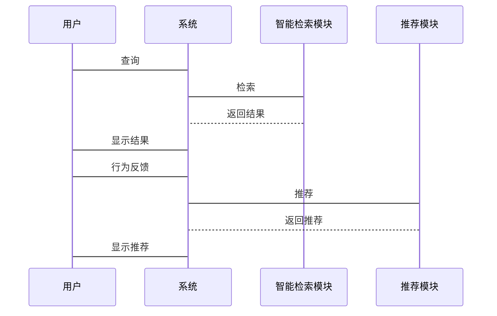

                 


# AI驱动的企业知识管理：智能检索与推荐系统

> 关键词：AI驱动、知识管理、智能检索、推荐系统、企业应用

> 摘要：本文深入探讨了AI驱动的企业知识管理，特别是智能检索与推荐系统的核心原理、应用场景和实现方法。通过详细分析知识图谱的构建、智能检索算法的实现，以及推荐算法的应用，本文为读者提供了从理论到实践的全面指导，帮助企业在信息化时代高效管理知识资源。

---

## 第1章: 背景介绍

### 1.1 问题背景

企业知识管理（KM）是将企业内外部的知识、信息和数据进行有效管理和应用的过程。传统知识管理依赖于文件管理系统或数据库，但在数据爆炸的时代，这种方法效率低下，难以满足企业对高效知识检索和个性化推荐的需求。

#### 1.1.1 传统知识管理的局限性
- 数据分散，难以统一管理。
- 信息检索依赖关键词匹配，语义理解不足。
- 缺乏个性化推荐，用户体验差。

#### 1.1.2 AI驱动知识管理的必要性
- 大数据时代，企业需要高效处理海量信息。
- AI技术（如NLP和机器学习）能够提升知识管理的智能化水平。
- 通过智能检索和推荐，提高员工工作效率和创新能力。

#### 1.1.3 企业知识管理的核心目标
- 提高知识的可访问性和利用率。
- 优化知识的组织和存储方式。
- 实现个性化知识推荐，提升用户体验。

### 1.2 核心概念

#### 1.2.1 问题描述
- 企业知识管理面临数据分散、检索效率低、推荐精准度不足的问题。
- 员工难以快速找到所需信息，影响工作效率。

#### 1.2.2 问题解决
- 引入AI技术，构建智能检索和推荐系统。
- 利用知识图谱、NLP和推荐算法提升知识管理的智能化水平。

#### 1.2.3 边界与外延
- 边界：专注于企业内部知识的管理与应用。
- 外延：涉及数据处理、信息检索、机器学习等多个技术领域。

#### 1.2.4 核心要素组成
- 数据源：企业内部文档、知识库、员工信息等。
- 知识表示：知识图谱、向量表示。
- AI算法：检索算法、推荐算法。
- 系统架构：企业知识管理系统架构。

### 1.3 核心概念对比

| 对比维度       | 传统知识管理       | AI驱动知识管理       |
|----------------|--------------------|----------------------|
| 技术基础       | 文件系统、数据库   | NLP、机器学习、知识图谱 |
| 检索方式       | 关键词匹配         | 语义理解、向量检索   |
| 推荐能力       | 无或简单推荐       | 智能推荐             |
| 效率           | 低效               | 高效                 |

### 1.4 本章小结
本章介绍了AI驱动的企业知识管理的背景、核心概念及其与传统知识管理的对比，为后续章节奠定了基础。

---

## 第2章: 智能检索与推荐系统的核心概念

### 2.1 知识表示

#### 2.1.1 知识图谱
知识图谱是一种将实体及其关系以图结构表示的知识表示方法，广泛应用于智能检索和推荐系统中。

#### 2.1.2 向量表示
向量表示通过将知识转换为高维向量，便于计算机理解和处理。

#### 2.1.3 符号表示
符号表示通过符号逻辑表达知识，适用于规则推理。

### 2.2 智能检索算法

#### 2.2.1 基于向量的检索
基于向量的检索通过计算查询向量与知识向量的相似度，找到最相关的知识。

#### 2.2.2 基于知识图谱的检索
基于知识图谱的检索利用图结构信息，进行语义检索。

#### 2.2.3 混合检索方法
混合检索方法结合向量检索和知识图谱检索，提升检索准确性和效率。

### 2.3 推荐算法

#### 2.3.1 基于协同过滤的推荐
协同过滤通过用户行为相似性进行推荐。

#### 2.3.2 基于内容的推荐
基于内容的推荐通过分析内容特征进行推荐。

#### 2.3.3 基于深度学习的推荐
深度学习推荐模型（如DSSM）通过深度神经网络进行推荐。

### 2.4 核心概念对比

#### 2.4.1 检索与推荐的对比
检索基于查询返回结果，推荐基于用户行为推荐内容。

#### 2.4.2 不同检索算法的对比
- 向量检索：高效但依赖特征表示。
- 知识图谱检索：语义强但计算复杂。

#### 2.4.3 不同推荐算法的对比
- 协同过滤：简单但冷启动问题。
- 基于内容的推荐：准确但忽视用户行为。
- 深度学习推荐：准确但复杂。

### 2.5 本章小结
本章详细介绍了知识表示、智能检索和推荐算法的核心概念及其对比，为后续章节的系统设计和实现提供了理论基础。

---

## 第3章: 知识图谱的构建与应用

### 3.1 知识图谱的构建流程

#### 3.1.1 数据收集
从企业内外部收集结构化和非结构化数据。

#### 3.1.2 实体识别
通过NLP技术识别数据中的实体。

#### 3.1.3 关系抽取
抽取实体之间的关系。

#### 3.1.4 知识融合
整合多源数据，消除冲突，构建知识图谱。

### 3.2 知识图谱的应用场景

#### 3.2.1 智能检索
通过知识图谱实现语义检索。

#### 3.2.2 推荐系统
基于知识图谱进行个性化推荐。

#### 3.2.3 知识问答
通过知识图谱实现智能问答系统。

### 3.3 知识图谱的管理与维护

#### 3.3.1 数据更新
定期更新知识图谱以反映最新信息。

#### 3.3.2 知识修复
修复知识图谱中的错误和不一致。

#### 3.3.3 知识扩展
扩展知识图谱的覆盖范围。

### 3.4 本章小结
本章详细介绍了知识图谱的构建流程、应用场景及管理方法，展示了其在企业知识管理中的重要作用。

---

## 第4章: 智能检索算法的原理与实现

### 4.1 向量空间模型

#### 4.1.1 基本原理
向量空间模型将文本表示为向量，通过计算向量相似度进行检索。

#### 4.1.2 BM25算法
BM25是一种基于概率的检索算法，常用于搜索引擎。

#### 4.1.3 DSSM模型
DSSM通过深度学习生成语义向量，提升检索准确度。

#### 4.1.4 检索流程
1. 将查询转换为向量。
2. 计算与文档向量的相似度。
3. 根据相似度排序，返回结果。

### 4.2 实现代码

```python
import numpy as np

def bm25_score(query, document):
    # 计算BM25分数
    pass

def dssm_score(query, document):
    # 计算DSSM分数
    pass

def vector_search(query, documents):
    # 向量检索
    pass
```

### 4.3 数学公式

#### 向量空间模型
$$ \text{similarity} = \frac{\sum_{i=1}^{n} w_i \times q_i}{\sqrt{\sum_{i=1}^{n} w_i^2} \times \sqrt{\sum_{i=1}^{n} q_i^2}} $$

#### BM25公式
$$ \text{score} = \log(\frac{N}{n_i}) + \log(\frac{r}{R}) $$

#### DSSM模型
$$ \text{score} = \cos(\theta) $$

### 4.4 本章小结
本章详细讲解了智能检索算法的原理与实现，包括向量空间模型、BM25算法和DSSM模型，并通过代码示例和数学公式进一步阐述了其实现过程。

---

## 第5章: 推荐算法的原理与实现

### 5.1 协同过滤

#### 5.1.1 基本原理
基于用户行为相似性进行推荐。

#### 5.1.2 实现流程
1. 计算用户相似度。
2. 找出相似用户的偏好。
3. 推荐相似用户的高评分内容。

### 5.2 基于内容的推荐

#### 5.2.1 基本原理
分析内容特征，推荐相似内容。

#### 5.2.2 实现流程
1. 提取内容特征。
2. 计算内容相似度。
3. 推荐相似内容。

### 5.3 深度学习推荐模型

#### 5.3.1 基本原理
通过深度学习模型（如神经网络）进行推荐。

#### 5.3.2 实现流程
1. 构建神经网络模型。
2. 训练模型，优化参数。
3. 使用模型进行推荐。

### 5.4 实现代码

```python
import numpy as np

def collaborative_filtering(user_matrix):
    # 协同过滤实现
    pass

def content_based_recommendation(item_features):
    # 基于内容的推荐实现
    pass

def deep_learning_model(train_data):
    # 深度学习推荐模型实现
    pass
```

### 5.5 数学公式

#### 协同过滤
$$ \text{score}(i,j) = \sum_{k=1}^{n} w_{jk} \times r_{ik} $$

#### 基于内容的推荐
$$ \text{similarity} = \frac{\sum_{i=1}^{n} f_i \times w_i}{\sqrt{\sum_{i=1}^{n} f_i^2} \times \sqrt{\sum_{i=1}^{n} w_i^2}} $$

#### 深度学习模型
$$ \text{score} = \text{DNN}(x) $$

### 5.6 本章小结
本章详细讲解了推荐算法的原理与实现，包括协同过滤、基于内容的推荐和深度学习推荐模型，并通过代码示例和数学公式进一步阐述了其实现过程。

---

## 第6章: 系统架构与设计

### 6.1 问题场景

#### 6.1.1 问题描述
企业知识管理系统需要高效处理海量数据，支持智能检索和推荐。

#### 6.1.2 系统目标
设计一个高效的、可扩展的智能知识管理系统架构。

### 6.2 系统功能设计

#### 6.2.1 领域模型
构建知识管理系统的领域模型，包括数据采集、存储、检索、推荐等功能。

#### 6.2.2 功能模块
- 数据采集模块：收集企业内外部数据。
- 知识处理模块：构建知识图谱。
- 智能检索模块：支持语义检索。
- 个性化推荐模块：基于用户行为推荐内容。

### 6.3 系统架构设计

#### 6.3.1 分层架构
将系统分为数据层、服务层和应用层。

#### 6.3.2 模块划分
- 数据采集模块。
- 知识处理模块。
- 智能检索模块。
- 个性化推荐模块。

#### 6.3.3 系统架构图



### 6.4 系统接口设计

#### 6.4.1 数据接口
- 数据采集接口：从数据库或API获取数据。
- 知识处理接口：将数据转换为知识图谱。

#### 6.4.2 用户接口
- 智能检索接口：用户输入查询，返回结果。
- 个性化推荐接口：基于用户行为，返回推荐内容。

### 6.5 系统交互设计

#### 6.5.1 交互流程
1. 用户输入查询。
2. 系统调用智能检索模块。
3. 返回检索结果。
4. 系统根据用户行为调用推荐模块。
5. 返回推荐内容。

#### 6.5.2 交互序列图



### 6.6 本章小结
本章详细讲解了企业知识管理系统的架构设计，包括分层架构、模块划分、系统接口和交互流程，为后续的系统实现提供了设计依据。

---

## 第7章: 项目实战

### 7.1 环境搭建

#### 7.1.1 系统环境
- 操作系统：Linux或Windows。
- 开发工具：Python、Jupyter Notebook。
- 数据库：MySQL或MongoDB。

#### 7.1.2 安装依赖
- Python库：numpy、pandas、networkx、spacy。
- 其他工具：Jieba分词、Gensim。

### 7.2 核心代码实现

#### 7.2.1 数据采集
```python
import requests

def fetch_data(url):
    response = requests.get(url)
    return response.text
```

#### 7.2.2 知识图谱构建
```python
from networkx import Graph

def build_kg():
    g = Graph()
    g.add_edge("A", "B")
    g.add_edge("B", "C")
    return g
```

#### 7.2.3 智能检索
```python
def vector_search(query, index):
    # 实现向量检索
    pass
```

#### 7.2.4 个性化推荐
```python
def collaborative_filtering(user_id):
    # 实现协同过滤推荐
    pass
```

### 7.3 案例分析

#### 7.3.1 案例背景
某企业希望构建智能知识管理系统，提升员工工作效率。

#### 7.3.2 实施步骤
1. 数据采集：收集企业文档和员工信息。
2. 知识处理：构建知识图谱。
3. 系统实现：开发智能检索和推荐模块。
4. 测试优化：根据反馈优化系统。

#### 7.3.3 分析与总结
通过项目实施，企业实现了知识的高效管理和应用，员工工作效率显著提升。

### 7.4 本章小结
本章通过实际项目案例，详细讲解了AI驱动的企业知识管理系统的实施过程，包括环境搭建、核心代码实现和案例分析，为读者提供了实践指导。

---

## 第8章: 最佳实践、小结与展望

### 8.1 最佳实践

#### 8.1.1 知识图谱构建
- 确保数据质量，选择合适的构建工具。
- 定期更新知识图谱，保持数据新鲜。

#### 8.1.2 系统优化
- 优化检索算法，提升检索效率。
- 选择合适的推荐算法，提升推荐准确度。

#### 8.1.3 系统安全
- 确保数据安全，防止数据泄露。
- 实施访问控制，保护敏感知识。

### 8.2 本章小结
本文详细探讨了AI驱动的企业知识管理，重点介绍了智能检索与推荐系统的原理、实现和应用，为读者提供了全面的理论和实践指导。

### 8.3 未来展望

#### 8.3.1 技术融合
- 结合区块链技术，确保知识的安全性和可追溯性。
- 与物联网结合，实现知识的实时更新和共享。

#### 8.3.2 应用场景扩展
- 进一步拓展知识图谱的应用场景，如智能问答、自动化决策。
- 推动AI技术在企业知识管理中的深度应用。

---

## 作者：AI天才研究院 & 禅与计算机程序设计艺术

---

# 结束语

本文系统地探讨了AI驱动的企业知识管理，特别是智能检索与推荐系统的核心原理和实现方法。通过理论分析和实践案例，本文为读者提供了从基础概念到实际应用的全面指导。未来，随着AI技术的不断发展，企业知识管理将更加智能化和高效化，为企业的持续创新和竞争力提升提供强大支持。

