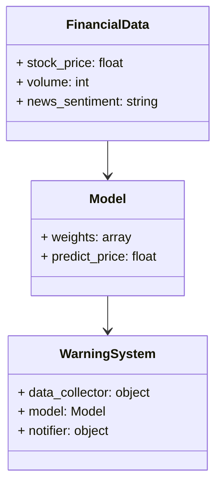
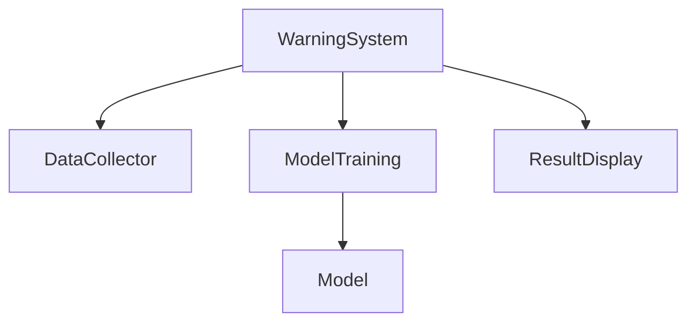
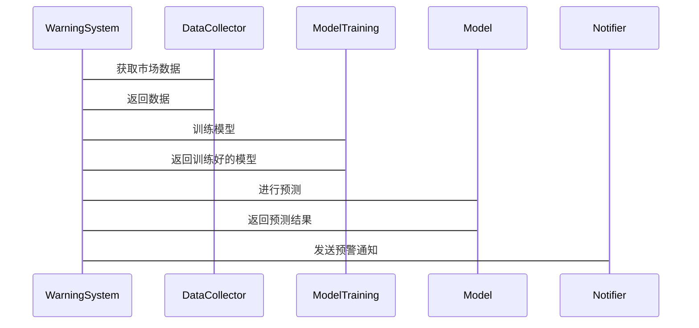

                 


# AI驱动的金融市场黑天鹅事件预警系统

**关键词**：AI技术、金融市场、黑天鹅事件、时间序列分析、异常检测、深度学习、预警系统

**摘要**：本文探讨了如何利用AI技术构建金融市场黑天鹅事件预警系统。首先，分析了黑天鹅事件的特点及传统预警机制的局限性。接着，详细介绍了AI在金融分析中的应用，重点讲解了时间序列分析、异常检测和深度学习模型。然后，设计了一个基于LSTM的预警系统架构，包括数据采集、特征提取、模型训练和结果展示。最后，通过实际案例展示了系统的实现过程，并展望了未来的发展方向。

---

## 第一部分：金融市场黑天鹅事件的背景与挑战

### 第1章：金融市场黑天鹅事件的背景与挑战

#### 1.1 什么是黑天鹅事件

##### 1.1.1 黑天鹅事件的定义

黑天鹅事件是指金融市场中发生的小概率、高影响的极端事件，通常难以预测且具有显著的负面影响。例如，2008年全球金融危机和2020年新冠疫情引发的市场崩盘。

##### 1.1.2 黑天鹅事件的特点

- **低概率性**：这些事件发生的概率极低，通常在统计模型中被视为不可能事件。
- **高影响性**：一旦发生，会对市场造成巨大冲击，影响广泛。
- **难以预测性**：传统统计方法难以捕捉这些事件的前兆。

##### 1.1.3 黑天鹅事件对金融市场的冲击

黑天鹅事件可能导致市场流动性枯竭、资产价格剧烈波动，甚至引发系统性金融危机。因此，建立有效的预警机制至关重要。

#### 1.2 传统金融市场预警机制的局限性

##### 1.2.1 传统预警方法的不足

- **数据范围有限**：传统方法通常基于有限的历史数据，难以捕捉复杂市场动态。
- **模型假设过于简化**：传统统计模型假设市场行为符合正态分布，忽视了极端事件的可能性。
- **主观性**：依赖专家判断，容易受到主观因素影响，缺乏客观性。

##### 1.2.2 数据分析的局限性

- **数据噪声**：金融市场数据通常包含大量噪声，传统方法难以有效提取有用信息。
- **非线性关系**：市场波动往往呈现非线性特征，传统线性模型难以捕捉。

##### 1.2.3 人类决策的主观性

- **情绪影响**：人类决策容易受到市场情绪影响，难以保持客观判断。
- **信息处理能力有限**：面对海量数据时，人类难以快速做出准确判断。

#### 1.3 AI技术在金融预警中的应用前景

##### 1.3.1 AI技术的核心优势

- **数据处理能力强**：AI能够处理海量数据，提取复杂模式。
- **非线性建模能力**：AI算法擅长捕捉复杂非线性关系，适合金融市场分析。
- **实时性**：AI系统能够实时分析数据，提供即时预警。

##### 1.3.2 AI在金融数据分析中的潜力

- **异常检测**：AI能够识别数据中的异常模式，提前发现潜在风险。
- **时间序列预测**：AI擅长分析时间序列数据，预测未来市场走势。
- **情绪分析**：通过自然语言处理技术，分析新闻和社交媒体情绪，辅助市场判断。

##### 1.3.3 AI驱动预警系统的未来展望

随着AI技术的进步，金融市场预警系统将更加智能化和自动化。未来，结合多模态数据（如文本、图像）和边缘计算，预警系统将更加精准和高效。

---

## 第二部分：AI驱动的金融市场分析基础

### 第2章：AI驱动的金融市场分析基础

#### 2.1 金融数据的特征与分类

##### 2.1.1 时间序列数据的特点

- **有序性**：数据按时间顺序排列，具有时间依赖性。
- **连续性**：金融市场数据通常是连续的，包含开盘价、收盘价、最高价、最低价和成交量等。
- **波动性**：市场波动频繁，数据分布可能呈现非正态性。

##### 2.1.2 金融市场的波动性

- **短期波动**：受市场情绪、突发事件影响，价格短期剧烈波动。
- **长期趋势**：受经济基本面因素影响，价格呈现长期趋势。

##### 2.1.3 数据的多维度分析

- **多因素分析**：考虑宏观经济指标、公司基本面、市场情绪等多方面因素。
- **跨市场分析**：分析不同市场之间的关联性，识别系统性风险。

#### 2.2 机器学习在金融分析中的应用

##### 2.2.1 监督学习与非监督学习

- **监督学习**：用于分类任务，如判断市场是否会出现崩盘。
- **非监督学习**：用于聚类分析，识别市场中的异常群体。

##### 2.2.2 深度学习在金融中的应用

- **时间序列预测**：使用LSTM和Transformer模型捕捉市场趋势。
- **图像识别**：分析K线图中的模式，识别潜在交易机会。
- **自然语言处理**：分析新闻和社交媒体，预测市场情绪。

##### 2.2.3 强化学习的潜在价值

- **策略优化**：通过强化学习优化投资策略，实现风险控制。
- **动态决策**：在动态市场环境中，实时调整交易策略。

#### 2.3 自然语言处理在金融新闻分析中的作用

##### 2.3.1 NLP的基本原理

- **文本预处理**：包括分词、去除停用词、词向量化等。
- **情感分析**：分析文本情感，判断市场情绪。
- **实体识别**：识别文本中的公司名称、日期等实体。

##### 2.3.2 金融新闻的情感分析

- **情感分类**：将新闻分为积极、消极、中性三类，预测市场反应。
- **情绪传播**：分析情绪如何在市场中传播，影响资产价格。

##### 2.3.3 基于NLP的市场情绪预测

- **实时监控**：实时分析新闻和社交媒体，预测市场情绪变化。
- **情绪指标**：构建情绪指标，辅助投资决策。

#### 2.4 本章小结

本章介绍了金融数据的特征与分类，探讨了机器学习和深度学习在金融分析中的应用，特别是自然语言处理在金融新闻分析中的作用。这些技术为构建AI驱动的预警系统奠定了基础。

---

## 第三部分：黑天鹅事件的AI预警模型构建

### 第3章：黑天鹅事件的AI预警模型构建

#### 3.1 数据采集与预处理

##### 3.1.1 数据源的选择

- **金融数据源**：如Yahoo Finance、Quandl等，获取股票价格、交易量等数据。
- **新闻数据源**：如Reuters、Twitter，获取市场相关信息。
- **经济指标数据源**：如GDP、失业率等宏观经济指标。

##### 3.1.2 数据清洗与标准化

- **数据清洗**：处理缺失值、异常值，确保数据质量。
- **标准化**：将数据标准化到统一范围，方便模型训练。
- **时间序列处理**：将数据按时间排序，提取时间依赖特征。

##### 3.1.3 特征工程

- **特征选择**：选择对预测有重要影响的特征，如开盘价、收盘价、成交量等。
- **特征变换**：如归一化、对数变换，改善模型性能。
- **特征组合**：将多个特征组合成新的特征，提高模型表现。

#### 3.2 基于LSTM的异常检测

##### 3.2.1 LSTM模型的基本原理

- **细胞状态**：记忆单元，保存长期信息。
- **门控机制**：包括输入门、遗忘门和输出门，控制信息流动。

##### 3.2.2 LSTM在时间序列预测中的应用

- **模型结构**：输入层、LSTM层、全连接层、输出层。
- **训练过程**：使用反向传播训练模型，优化权重。
- **预测机制**：基于当前和历史数据，预测未来市场走势。

##### 3.2.3 异常检测的实现方法

- **阈值法**：设置阈值，判断预测值与实际值是否超出范围。
- **统计方法**：使用均值、标准差等统计指标判断异常。
- **深度学习方法**：使用AE（自编码器）或VAE（变分自编码器）识别异常模式。

#### 3.3 基于深度学习的黑天鹅事件预测

##### 3.3.1 深度学习模型的选择

- **LSTM**：适合时间序列数据，捕捉长期依赖关系。
- **Transformer**：适合并行处理，捕捉全局依赖关系。
- **混合模型**：结合LSTM和Transformer，优势互补。

##### 3.3.2 模型训练与优化

- **训练数据**：使用历史数据训练模型，验证集调整超参数。
- **损失函数**：使用均方误差或交叉熵损失。
- **优化算法**：如Adam、SGD，优化模型参数。
- **模型评估**：使用准确率、召回率、F1分数评估模型性能。

##### 3.3.3 模型部署与实时预警

- **API接口**：将模型封装成API，方便调用。
- **实时监控**：实时获取市场数据，触发预警机制。
- **预警策略**：根据模型预测结果，制定相应的预警策略。

#### 3.4 本章小结

本章详细介绍了数据采集与预处理、基于LSTM的异常检测和深度学习模型的构建过程。通过这些步骤，我们可以建立一个初步的黑天鹅事件预警系统。

---

## 第四部分：系统架构与实现

### 第4章：系统架构与实现

#### 4.1 系统功能设计

##### 4.1.1 领域模型设计



##### 4.1.2 系统架构设计



##### 4.1.3 系统接口设计

- **数据接口**：提供API接口，接收金融市场数据。
- **模型接口**：提供预测接口，返回预测结果。
- **预警接口**：提供预警触发条件，通知相关人员。

##### 4.1.4 系统交互流程



#### 4.2 系统实现细节

##### 4.2.1 数据采集模块

- **数据源**：从Yahoo Finance获取股票价格数据。
- **数据预处理**：清洗数据，填充缺失值，标准化处理。
- **数据存储**：将数据存储在数据库中，方便后续处理。

##### 4.2.2 模型训练模块

- **模型选择**：选择LSTM模型进行训练。
- **训练数据**：使用过去100天的股票价格数据。
- **超参数调整**：调整学习率、批次大小等参数，优化模型性能。

##### 4.2.3 预警模块

- **阈值设置**：根据历史数据设置预警阈值。
- **异常检测**：实时监控市场数据，判断是否触发预警。
- **预警通知**：通过邮件、短信等方式通知相关人员。

#### 4.3 本章小结

本章详细设计了系统的架构，包括功能设计、系统交互流程和具体实现细节。通过这些设计，我们可以构建一个完整的黑天鹅事件预警系统。

---

## 第五部分：项目实战与案例分析

### 第5章：项目实战与案例分析

#### 5.1 项目环境安装

##### 5.1.1 安装必要的库

- **TensorFlow**：用于深度学习模型训练。
- **Keras**：用于构建神经网络模型。
- **Pandas**：用于数据处理。
- **Matplotlib**：用于数据可视化。
- **Twitter API**：用于获取社交媒体数据。
- **News API**：用于获取新闻数据。

##### 5.1.2 安装步骤

```bash
pip install tensorflow pandas numpy matplotlib tweepy newsapi-python
```

#### 5.2 系统核心实现

##### 5.2.1 数据采集模块

```python
import tweepy
import requests

# Twitter API配置
consumer_key = 'your_consumer_key'
consumer_secret = 'your_consumer_secret'
access_token = 'your_access_token'
access_secret = 'your_access_secret'

auth = tweepy.OAuth1UserHandler(consumer_key, consumer_secret, access_token, access_secret)
api = tweepy.API(auth)

# 获取推特数据
tweets = api.search('financial market', count=100)
```

##### 5.2.2 模型实现

```python
from tensorflow.keras.models import Sequential
from tensorflow.keras.layers import LSTM, Dense, Dropout

# 定义LSTM模型
model = Sequential()
model.add(LSTM(64, input_shape=(None, 5)))
model.add(Dropout(0.5))
model.add(Dense(1, activation='sigmoid'))

# 编译模型
model.compile(optimizer='adam', loss='binary_crossentropy', metrics=['accuracy'])

# 训练模型
model.fit(train_features, labels, epochs=10, batch_size=32)
```

##### 5.2.3 预警模块

```python
# 设置阈值
threshold = 0.9

# 实时监控
while True:
    current_price = get_current_price()  # 获取当前价格
    predicted_price = model.predict(current_price)
    if predicted_price > threshold:
        send_warning()
    time.sleep(60)  # 每分钟检查一次
```

#### 5.3 项目实战小结

本章通过实际案例展示了系统的实现过程，包括数据采集、模型训练和预警模块的实现。通过这些实战，读者可以更好地理解AI驱动的预警系统如何在实际中应用。

---

## 第六部分：总结与展望

### 第6章：总结与展望

#### 6.1 本章总结

本文详细探讨了AI驱动的金融市场黑天鹅事件预警系统的构建过程，包括背景分析、算法原理、系统设计和项目实战。通过这些内容，我们展示了如何利用AI技术提升金融市场的风险管理能力。

#### 6.2 未来展望

未来，随着AI技术的不断进步，金融市场预警系统将更加智能化和自动化。可能的发展方向包括：

##### 6.2.1 多模态数据的应用

- **结合文本、图像和语音数据**：利用多模态数据，提高预警系统的准确性和全面性。
- **跨市场分析**：分析不同市场之间的关联性，识别系统性风险。

##### 6.2.2 边缘计算的应用

- **本地部署**：在边缘设备上部署模型，实现实时监控和预警。
- **隐私保护**：通过边缘计算，保护数据隐私，确保数据安全。

##### 6.2.3 智能化升级

- **自适应学习**：模型能够自动调整参数，适应市场变化。
- **动态预警**：根据市场实时情况，动态调整预警策略。

#### 6.3 致谢

感谢读者的耐心阅读，希望本文对您理解AI在金融市场中的应用有所帮助。

---

**作者：AI天才研究院 & 禅与计算机程序设计艺术**

