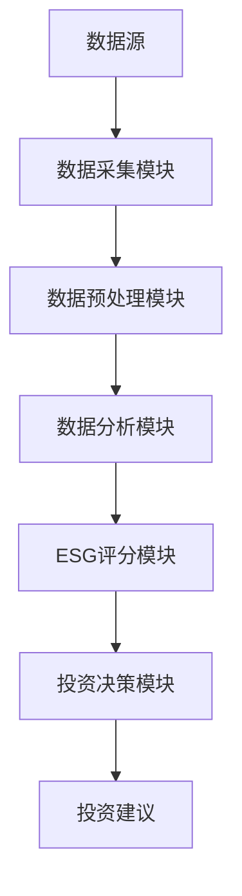

                 


# 价值投资中的环境、社会和治理（ESG）因素考量

## 关键词：价值投资, ESG, 环境, 社会, 治理

## 摘要：
本文探讨了在价值投资中，环境（Environmental）、社会（Social）和治理（Governance）因素（ESG）的重要性。通过分析ESG的核心概念、评价指标、数学模型和系统架构，本文展示了如何将ESG因素整合到投资决策中，以实现可持续投资和长期收益。文章还通过实际案例展示了如何构建基于ESG的股票筛选系统，并总结了最佳实践和未来趋势。

---

## 第一部分: ESG的基本概念与背景

### 第1章: ESG的基本概念与背景

#### 1.1 ESG的定义与内涵
- **环境（Environmental）**：企业对环境保护的承诺，包括减少碳排放、节约能源和资源、应对气候变化等。
- **社会（Social）**：企业在社会中的责任，包括员工权益、社区参与、社会责任、避免童工、公平对待所有利益相关者等。
- **治理（Governance）**：企业的治理结构和政策，包括公司治理、高管薪酬、企业透明度、股东权利、反腐败、内部审计、审计委员会等。

#### 1.2 ESG的历史发展与现状
- ESG的起源与发展：从早期的企业社会责任（CSR）到现代的ESG投资，经历了从理论到实践的演变。
- 全球ESG投资的现状：ESG投资在全球范围内快速增长，成为机构投资者的重要策略。
- 中国ESG投资的现状与挑战：中国ESG市场正在快速发展，但仍面临数据不透明、标准不统一等挑战。

#### 1.3 ESG在价值投资中的重要性
- ESG与企业价值的关系：企业对环境、社会和治理的重视直接影响其长期盈利能力。
- ESG对投资风险的评估作用：ESG因素可以帮助识别潜在的法律、声誉和财务风险。
- ESG对投资收益的影响：研究表明，ESG表现良好的企业往往具有更高的长期收益。

#### 1.4 ESG与传统投资理念的结合
- 传统投资理念的局限性：传统投资过于关注财务指标，忽视了非财务因素对企业价值的影响。
- ESG如何弥补传统投资的不足：通过考虑环境、社会和治理因素，ESG投资提供了更全面的企业评估方法。
- ESG投资的未来发展趋势：随着全球对可持续发展的关注增加，ESG投资将更加重要。

#### 1.5 本章小结
本章介绍了ESG的基本概念、历史发展、重要性以及与传统投资理念的结合。通过这些内容，读者可以理解ESG在价值投资中的核心地位。

---

## 第二部分: 环境（Environmental）因素在投资中的考量

### 第2章: 环境因素的核心概念

#### 2.1 环境因素的定义与分类
- 环境因素的定义：企业在生产和运营过程中对环境的影响，包括碳排放、能源消耗、资源利用、污染治理等。
- 环境因素的分类：包括温室气体排放、能源效率、水资源管理、废弃物管理、生态保护等。

#### 2.2 环境因素对企业价值的影响
- 环境因素对企业盈利的影响：高环境成本可能导致企业利润下降。
- 环境因素对企业估值的影响：良好的环境表现可以提高企业的市场估值。

#### 2.3 环境因素的量化方法
- 碳排放的量化：通过计算企业的碳足迹，评估其对气候变化的影响。
- 能源效率的量化：通过能源使用效率指标（如单位产品能耗）进行评估。

### 第2.2 环境因素的评价指标
- 碳排放与能源使用效率：碳排放强度、单位GDP能耗等。
- 环境合规性与污染治理：环境违法记录、污染治理投入等。
- 可持续发展项目的投入：绿色能源投资、环保项目投入等。

### 第2.3 环境因素对投资决策的影响
- 环境风险的识别与评估：通过分析企业的环境表现，识别潜在的环境风险。
- 环境因素对企业盈利能力和估值的影响：良好的环境表现可以提升企业的盈利能力和市场估值。
- 环境因素在行业选择中的应用：在高环境风险行业（如化石能源）中，选择环境表现良好的企业。

### 第2.4 本章小结
本章详细探讨了环境因素在投资中的考量，包括环境因素的定义、分类、评价指标以及对投资决策的影响。

---

## 第三部分: 社会（Social）因素在投资中的考量

### 第3章: 社会因素的核心概念

#### 3.1 社会因素的定义与分类
- 社会因素的定义：企业在社会中的责任，包括员工权益、社会责任、社区参与等。
- 社会因素的分类：包括员工权益、社会责任、公平对待利益相关者等。

#### 3.2 社会因素对企业价值的影响
- 社会因素对企业声誉的影响：良好的社会责任表现可以提升企业的品牌形象。
- 社会因素对员工稳定性的影响：公平的员工待遇可以降低员工流失率。

#### 3.3 社会因素的量化方法
- 员工权益的量化：员工满意度调查、员工福利投入等。
- 社会责任的量化：公益活动投入、社会责任报告等。

### 第3.2 社会因素的评价指标
- 劳工权益与员工关系：员工满意度、员工培训投入等。
- 社会责任与公益活动：公益捐赠、社会责任报告等。
- 公平对待利益相关者：股东权益保护、消费者权益保护等。

### 第3.3 社会因素对投资决策的影响
- 社会风险的识别与评估：通过分析企业的社会责任表现，识别潜在的社会风险。
- 社会因素对企业盈利能力和估值的影响：良好的社会责任表现可以提升企业的盈利能力和市场估值。
- 社会因素在行业选择中的应用：在高社会风险行业（如烟草、赌博）中，选择社会表现良好的企业。

### 第3.4 本章小结
本章详细探讨了社会因素在投资中的考量，包括社会因素的定义、分类、评价指标以及对投资决策的影响。

---

## 第四部分: 治理（Governance）因素在投资中的考量

### 第4章: 治理因素的核心概念

#### 4.1 治理因素的定义与分类
- 治理因素的定义：企业的治理结构和政策，包括公司治理、高管薪酬、企业透明度等。
- 治理因素的分类：包括公司治理、高管薪酬、企业透明度、股东权利等。

#### 4.2 治理因素对企业价值的影响
- 治理因素对企业治理效率的影响：高效的治理结构可以提升企业的管理效率。
- 治理因素对企业风险的影响：良好的治理结构可以降低企业的经营风险。

#### 4.3 治理因素的量化方法
- 公司治理的量化：治理结构的透明度、董事会独立性等。
- 高管薪酬的量化：高管薪酬与绩效的关联性。

### 第4.2 治理因素的评价指标
- 公司治理：董事会结构、独立董事比例、审计委员会独立性等。
- 高管薪酬：高管薪酬与绩效的关系、高管薪酬的透明度。
- 企业透明度：信息披露的及时性、完整性、准确性。

### 第4.3 治理因素对投资决策的影响
- 治理风险的识别与评估：通过分析企业的治理表现，识别潜在的治理风险。
- 治理因素对企业盈利能力和估值的影响：良好的治理表现可以提升企业的盈利能力和市场估值。
- 治理因素在行业选择中的应用：在高治理风险行业（如金融、能源）中，选择治理表现良好的企业。

### 第4.4 本章小结
本章详细探讨了治理因素在投资中的考量，包括治理因素的定义、分类、评价指标以及对投资决策的影响。

---

## 第五部分: ESG投资的数学模型与算法

### 第5章: ESG评分模型

#### 5.1 ESG评分模型的定义与原理
- ESG评分模型的定义：通过量化环境、社会和治理因素，对企业的ESG表现进行评分。
- ESG评分模型的原理：基于多维度的指标，使用加权评分的方法，计算企业的ESG得分。

#### 5.2 ESG评分模型的实现步骤
1. 数据收集：收集企业的ESG相关数据，包括环境、社会和治理指标。
2. 数据预处理：对数据进行清洗、标准化和归一化处理。
3. 指标权重分配：根据行业特点和投资目标，为各指标分配权重。
4. 计算ESG得分：通过加权求和的方法，计算企业的ESG得分。
5. 案例分析：通过具体案例，展示ESG评分模型的应用。

#### 5.3 ESG评分模型的数学公式
- 指标权重分配公式：
  $$ w_i = \frac{\sum_{j=1}^{n} s_{ij}}{n} $$
  其中，\( w_i \) 是第 \( i \) 个指标的权重，\( s_{ij} \) 是第 \( j \) 个样本的第 \( i \) 个指标的得分，\( n \) 是样本数量。
- 加权求和公式：
  $$ ESG\_score = \sum_{i=1}^{m} w_i \times score_i $$
  其中，\( ESG\_score \) 是企业的ESG得分，\( w_i \) 是第 \( i \) 个指标的权重，\( score_i \) 是第 \( i \) 个指标的得分，\( m \) 是指标数量。

#### 5.4 案例分析：某企业的ESG评分
- 数据来源：假设某企业的环境、社会和治理指标如下：
  - 环境指标：碳排放强度降低10%，能源效率提升5%。
  - 社会指标：员工满意度达到90%，社会责任投入占营收的2%。
  - 治理指标：董事会独立性达到80%，高管薪酬与绩效挂钩。
- 评分计算：假设环境、社会和治理指标的权重分别为40%、30%和30%，计算企业的ESG得分为：
  $$ ESG\_score = 0.4 \times 95 + 0.3 \times 85 + 0.3 \times 90 = 89.5 $$

#### 5.5 本章小结
本章介绍了ESG评分模型的定义、原理和实现步骤，并通过具体案例展示了模型的应用。

---

## 第六部分: ESG投资的系统架构与项目实战

### 第6章: ESG投资的系统架构设计

#### 6.1 系统架构的定义与目标
- 系统架构的定义：设计一个用于ESG投资的系统，实现数据采集、分析、评分和投资决策支持。
- 系统架构的目标：提供一个高效、准确的ESG投资决策支持工具。

#### 6.2 系统功能设计
- 数据采集模块：从多个数据源采集企业的环境、社会和治理数据。
- 数据分析模块：对数据进行清洗、预处理和分析，计算企业的ESG得分。
- 投资决策模块：基于ESG评分和财务指标，生成投资建议。
- 系统接口设计：与第三方数据源、投资管理系统等进行接口对接。

#### 6.3 系统架构图


#### 6.4 本章小结
本章设计了一个ESG投资的系统架构，包括数据采集、分析、评分和投资决策支持模块，并通过mermaid图展示了系统的架构设计。

---

### 第7章: ESG投资的项目实战

#### 7.1 项目背景与目标
- 项目背景：随着全球对可持续发展的关注增加，ESG投资越来越重要。
- 项目目标：构建一个基于ESG的股票筛选系统，帮助投资者选择具有良好ESG表现的企业。

#### 7.2 项目实现步骤
1. 数据收集：从多个数据源收集企业的环境、社会和治理数据。
2. 数据预处理：对数据进行清洗、标准化和归一化处理。
3. 指标权重分配：根据行业特点和投资目标，为各指标分配权重。
4. 计算ESG得分：通过加权求和的方法，计算企业的ESG得分。
5. 股票筛选：基于ESG得分和财务指标，筛选出具有良好ESG表现的企业。

#### 7.3 项目核心代码实现
```python
import pandas as pd
import numpy as np

# 数据预处理
def preprocess_data(data):
    # 删除缺失值
    data.dropna(inplace=True)
    # 标准化处理
    from sklearn.preprocessing import StandardScaler
    scaler = StandardScaler()
    data_scaled = scaler.fit_transform(data)
    return data_scaled

# ESG评分模型
def calculate_esg_score(data, weights):
    # 计算ESG得分
    esg_score = np.dot(data, weights)
    return esg_score

# 股票筛选
def screen_stocks(esg_score, financial_metrics, threshold=0.7):
    # 筛选ESG得分高于阈值的股票
    selected_stocks = esg_score[esg_score > threshold]
    return selected_stocks
```

#### 7.4 案例分析与结果解读
- 数据来源：假设从某个ESG评级机构获取了100家企业的ESG数据和财务数据。
- 数据预处理：对数据进行清洗和标准化处理。
- 指标权重分配：假设环境、社会和治理指标的权重分别为40%、30%和30%。
- 计算ESG得分：通过加权求和的方法，计算每家企业的ESG得分。
- 股票筛选：筛选出ESG得分高于0.7的企业，作为投资标的。

#### 7.5 项目小结
本章通过具体案例展示了如何构建一个基于ESG的股票筛选系统，并通过Python代码实现了数据预处理、ESG评分和股票筛选的过程。

---

## 第七部分: ESG投资的最佳实践与未来展望

### 第8章: ESG投资的最佳实践

#### 8.1 ESG投资的策略选择
- 基于ESG评分的投资策略：选择ESG得分高的企业进行投资。
- 行业选择策略：在高环境、社会或治理风险的行业中，选择表现良好的企业。
- 风险管理策略：通过分散投资和动态调整投资组合，降低ESG投资的风险。

#### 8.2 ESG投资中的风险管理
- ESG投资的风险来源：环境风险、社会风险和治理风险。
- 风险管理方法：通过情景分析、压力测试和风险对冲等方法，降低ESG投资的风险。

#### 8.3 ESG投资的未来趋势
- 全球ESG投资的未来发展趋势：随着全球对可持续发展的关注增加，ESG投资将更加重要。
- 中国ESG投资的未来趋势：随着中国对可持续发展的重视，ESG投资将快速发展。

### 第8.4 本章小结
本章总结了ESG投资的最佳实践，包括投资策略、风险管理方法和未来发展趋势。

---

## 结语

本文通过详细探讨环境、社会和治理（ESG）因素在价值投资中的考量，展示了如何将ESG因素整合到投资决策中。通过数学模型、系统架构和项目实战的分析，本文为投资者提供了科学的ESG投资方法。未来，随着全球对可持续发展的关注增加，ESG投资将更加重要。

---

## 作者：AI天才研究院/AI Genius Institute & 禅与计算机程序设计艺术 /Zen And The Art of Computer Programming

