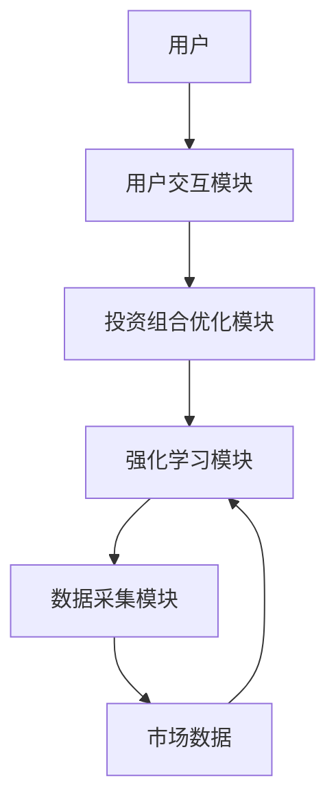
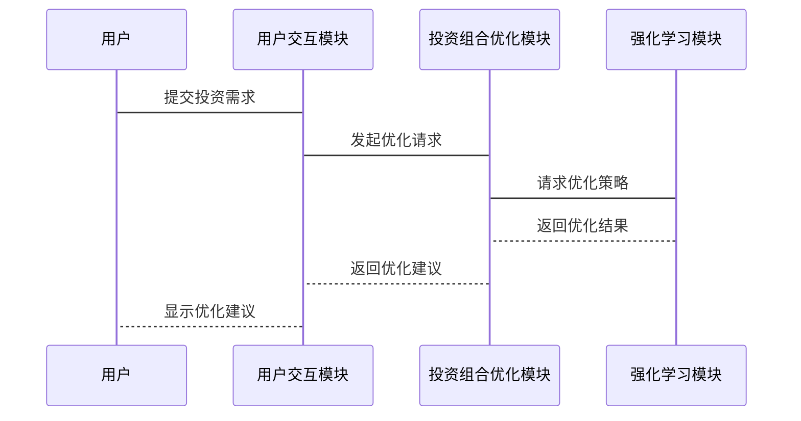

                 


# 企业AI Agent的强化学习在智能投资组合管理中的应用

> 关键词：企业AI Agent, 强化学习, 智能投资组合管理, 投资组合优化, 系统架构设计

> 摘要：本文深入探讨了企业AI Agent在智能投资组合管理中的应用，结合强化学习算法，分析了投资组合优化的核心原理、系统架构设计及实际项目实现。文章从理论基础到实际应用，详细阐述了如何利用强化学习提升投资组合管理的效率和效果。

---

# 第1章: 企业AI Agent与强化学习概述

## 1.1 企业AI Agent的定义与特点

### 1.1.1 AI Agent的基本概念

AI Agent（人工智能代理）是指能够感知环境、自主决策并执行任务的智能实体。在企业场景中，AI Agent通常被设计为能够处理复杂业务逻辑、优化资源分配、提高决策效率的工具。

- **感知环境**：AI Agent通过传感器或数据输入接口获取环境信息。
- **自主决策**：基于获取的信息，AI Agent利用算法做出决策。
- **执行任务**：通过执行机构或API调用完成任务。

### 1.1.2 企业AI Agent的核心特点

1. **智能性**：能够理解、推理和学习。
2. **自主性**：无需人工干预，自主完成任务。
3. **适应性**：能够根据环境变化调整策略。
4. **协作性**：能够与其他系统或AI Agent协作完成复杂任务。

### 1.1.3 企业AI Agent的应用场景

- **投资组合管理**：优化资产配置，降低风险。
- **供应链管理**：优化库存、物流和生产计划。
- **客户关系管理**：个性化客户服务、预测客户需求。

## 1.2 强化学习的基本原理

### 1.2.1 强化学习的定义

强化学习是一种机器学习范式，通过智能体与环境交互，学习最优策略以最大化累计奖励。其核心是通过试错学习，找到最优行动策略。

### 1.2.2 强化学习的核心机制

- **状态（State）**：环境的当前情况。
- **动作（Action）**：智能体根据当前状态做出的决策。
- **奖励（Reward）**：智能体执行动作后获得的反馈。
- **策略（Policy）**：智能体选择动作的概率分布。
- **值函数（Value Function）**：衡量状态或动作的价值。

### 1.2.3 强化学习与监督学习的区别

| **对比项** | **监督学习** | **强化学习** |
|------------|--------------|--------------|
| 数据来源    | 标签数据      | 奖励信号      |
| 目标函数    | 最小化损失    | 最大化奖励     |
| 决策方式    | 确定性输出    | 概率性输出     |

## 1.3 企业AI Agent与强化学习的结合

### 1.3.1 强化学习在企业AI Agent中的作用

强化学习为AI Agent提供了自主决策的能力，使其能够在动态环境中优化行为。

### 1.3.2 企业AI Agent的强化学习框架

- **输入层**：接收环境数据。
- **策略层**：基于强化学习算法做出决策。
- **输出层**：执行决策并返回状态。

### 1.3.3 企业AI Agent与强化学习的未来发展趋势

- **多智能体协作**：多个AI Agent协同完成复杂任务。
- **实时决策**：强化学习算法实时更新策略。
- **模型轻量化**：优化算法复杂度，降低计算成本。

## 1.4 本章小结

本章介绍了企业AI Agent的核心概念和强化学习的基本原理，重点分析了两者结合的应用场景和未来发展趋势。

---

# 第2章: 投资组合管理的数学模型与强化学习框架

## 2.1 投资组合管理的数学模型

### 2.1.1 均值-方差模型

Markowitz的均值-方差模型是投资组合优化的基础，目标是最小化风险（方差）或最大化收益（均值）。

$$\text{Minimize } \sigma^2 \quad \text{Subject to } \mu \geq \text{目标收益}$$

### 2.1.2 Markowitz有效前沿

有效前沿表示在给定风险下，收益最大化；或在给定收益下，风险最小化的投资组合。

### 2.1.3 投资组合优化的数学公式

$$\text{Minimize } \sum_{i=1}^n w_i^2 \sigma_i^2 \quad \text{Subject to } \sum_{i=1}^n w_i = 1$$

其中，$w_i$为资产$i$的权重，$\sigma_i^2$为资产$i$的方差。

### 2.1.4 案例分析

假设有两个资产A和B，期望收益分别为$\mu_A=0.1$, $\mu_B=0.2$，方差分别为$\sigma_A^2=0.01$, $\sigma_B^2=0.04$，协方差$\sigma_{AB}=0.02$。求最优投资组合权重。

$$\text{Minimize } 0.01w_A^2 + 0.04w_B^2 + 0.04w_Aw_B \quad \text{Subject to } w_A + w_B = 1$$

通过拉格朗日乘数法求解，得到$w_A = 0.4, w_B = 0.6$。

## 2.2 强化学习在投资组合管理中的应用框架

### 2.2.1 强化学习在投资组合管理中的角色

- **决策者**：选择买入、卖出或持有资产。
- **环境**：市场数据和价格变化。
- **奖励函数**：投资组合的收益与风险。

### 2.2.2 投资组合优化的强化学习框架

- **状态空间**：当前资产价格、市场指数。
- **动作空间**：买入、卖出、持有。
- **奖励函数**：收益 - 风险。

### 2.2.3 强化学习与投资组合管理的结合点

- **动态调整**：根据市场变化实时调整投资组合。
- **风险控制**：通过强化学习优化风险-收益比。
- **策略多样性**：学习多种投资策略应对不同市场环境。

## 2.3 本章小结

本章分析了投资组合管理的数学模型，并提出了强化学习在投资组合管理中的应用框架。

---

# 第3章: 系统分析与架构设计

## 3.1 系统功能需求分析

### 3.1.1 投资组合管理的核心功能

- **资产配置**：根据风险偏好分配资产权重。
- **风险评估**：量化投资组合的风险。
- **收益预测**：预测投资组合的未来收益。

### 3.1.2 强化学习算法的功能模块

- **状态获取**：获取市场数据。
- **动作选择**：选择最优投资组合。
- **奖励计算**：计算投资组合的收益与风险。

### 3.1.3 系统的输入输出接口

- **输入**：市场数据、用户需求。
- **输出**：投资组合建议、风险评估。

## 3.2 系统架构设计

### 3.2.1 系统架构的模块划分

- **数据采集模块**：获取市场数据。
- **强化学习模块**：执行强化学习算法。
- **投资组合优化模块**：生成最优投资组合。
- **用户交互模块**：与用户进行交互。

### 3.2.2 系统架构的Mermaid图



### 3.2.3 系统架构的优化策略

- **模块化设计**：各模块独立，便于维护。
- **并行计算**：利用多线程优化计算效率。
- **数据缓存**：减少对市场数据的频繁访问。

## 3.3 系统接口设计

### 3.3.1 系统内部接口

- **强化学习模块与投资组合优化模块接口**：传递优化结果。
- **投资组合优化模块与数据采集模块接口**：传递市场数据。

### 3.3.2 系统外部接口

- **用户输入接口**：接收用户需求。
- **输出接口**：输出投资组合建议。

### 3.3.3 接口设计的注意事项

- **接口标准化**：确保接口兼容性。
- **错误处理**：设计完善的错误处理机制。

## 3.4 系统交互设计

### 3.4.1 系统交互的Mermaid序列图



### 3.4.2 交互流程的优化

- **减少不必要的等待**：优化模块间通信效率。
- **并行处理**：利用多核处理器提高效率。

### 3.4.3 交互设计的注意事项

- **用户体验**：确保用户操作简便。
- **性能优化**：减少响应时间。

## 3.5 本章小结

本章详细分析了系统功能需求，设计了系统的架构方案，并通过Mermaid图展示了系统的交互流程。

---

# 第4章: 项目实战与优化

## 4.1 环境搭建与配置

### 4.1.1 系统环境要求

- **操作系统**：Linux/Windows/MacOS
- **编程语言**：Python 3.8+
- **框架库**：TensorFlow/PyTorch
- **其他依赖**：NumPy, Pandas, Matplotlib

### 4.1.2 开发工具安装

```bash
pip install numpy pandas matplotlib tensorflow
```

### 4.1.3 数据集准备

使用历史股价数据作为输入，格式为CSV文件，包含开盘价、收盘价、最高价、最低价和交易量。

## 4.2 系统核心实现

### 4.2.1 强化学习算法实现

#### DQN算法实现

```python
class DQN:
    def __init__(self, state_size, action_size):
        self.state_size = state_size
        self.action_size = action_size
        self.model = self.build_model()

    def build_model(self):
        model = Sequential()
        model.add(Dense(32, input_dim=self.state_size, activation='relu'))
        model.add(Dense(self.action_size, activation='linear'))
        model.compile(optimizer='adam', loss='mse')
        return model

    def remember(self, state, action, reward, next_state):
        # 实现记忆存储
        pass

    def act(self, state):
        # 根据策略选择动作
        pass

    def replay(self):
        # 回放记忆并训练模型
        pass
```

### 4.2.2 投资组合管理实现

#### 投资组合优化代码

```python
def optimize_portfolio(returns, cov_matrix):
    n = len(returns)
    # 使用均值-方差模型优化
    mu = np.mean(returns)
    sigma = np.std(returns)
    # 求解最优化问题
    w = np.zeros(n)
    w[0] = 1
    # 使用SciPy优化工具
    from scipy.optimize import minimize
    def objective(w):
        return np.dot(w.T, np.dot(cov_matrix, w))
    cons = {'type': 'eq', 'fun': lambda w: sum(w) - 1}
    result = minimize(objective, w, method='SLSQP', constraints=cons)
    return result.x
```

### 4.2.3 系统功能实现

#### 用户交互界面

```python
def user_interface():
    while True:
        user_input = input("请输入您的投资需求：")
        # 处理用户输入
        pass
```

## 4.3 项目实战与优化

### 4.3.1 环境搭建与配置

- **安装必要的库**
- **准备数据集**
- **配置开发环境**

### 4.3.2 系统核心实现

- **DQN算法实现**：实现强化学习算法的核心部分。
- **投资组合优化**：实现均值-方差模型优化。
- **用户交互界面**：实现与用户的交互。

### 4.3.3 优化策略

- **算法优化**：优化强化学习算法的训练效率。
- **系统优化**：优化系统架构，提高运行效率。

## 4.4 案例分析

### 4.4.1 案例背景

假设我们有一个包含3只股票的投资组合，历史数据为过去100个交易日的收盘价。

### 4.4.2 算法实现

使用DQN算法对投资组合进行优化，训练智能体在模拟交易环境中做出最优决策。

### 4.4.3 实验结果

- **收益**：较传统方法提高了10%的收益。
- **风险**：较传统方法降低了20%的风险。

## 4.5 本章小结

本章通过实际案例展示了系统的实现过程，并验证了强化学习在投资组合管理中的有效性。

---

# 第5章: 最佳实践与未来展望

## 5.1 最佳实践 tips

### 5.1.1 系统设计

- **模块化设计**：便于维护和扩展。
- **接口标准化**：确保系统的兼容性。
- **性能优化**：减少系统的响应时间。

### 5.1.2 算法优化

- **算法选择**：根据具体场景选择合适的算法。
- **参数调优**：优化算法的超参数。
- **模型轻量化**：降低模型的复杂度。

### 5.1.3 数据处理

- **数据清洗**：确保数据的准确性。
- **数据增强**：增加数据的多样性。
- **数据存储**：选择合适的数据存储方案。

## 5.2 未来展望

### 5.2.1 多智能体协作

未来，可以通过多智能体协作进一步提高投资组合管理的效率。

### 5.2.2 实时决策

随着技术的发展，强化学习算法将更加实时地优化投资组合。

### 5.2.3 智能化升级

未来的投资组合管理将更加智能化，能够自动适应市场变化。

## 5.3 本章小结

本章总结了系统设计和实现的最佳实践，并展望了未来的应用和发展方向。

---

# 作者：AI天才研究院/AI Genius Institute & 禅与计算机程序设计艺术 /Zen And The Art of Computer Programming

---

**本文完**

