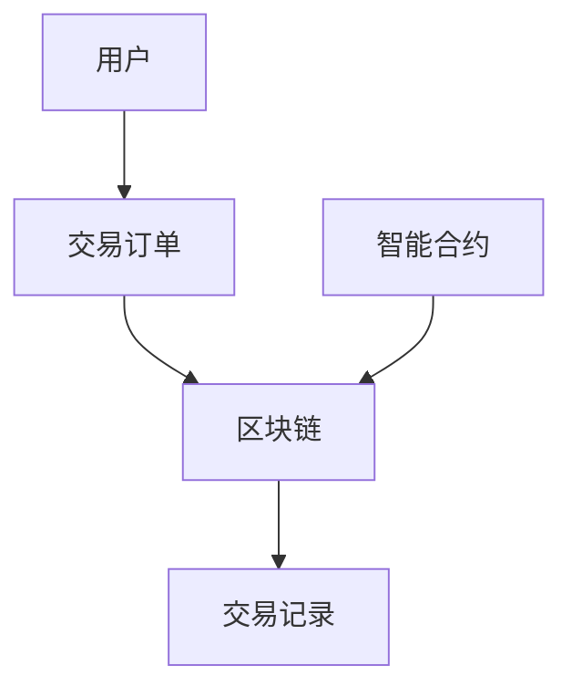
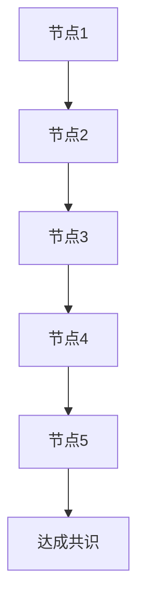
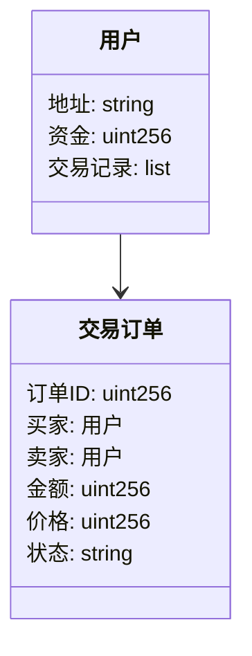
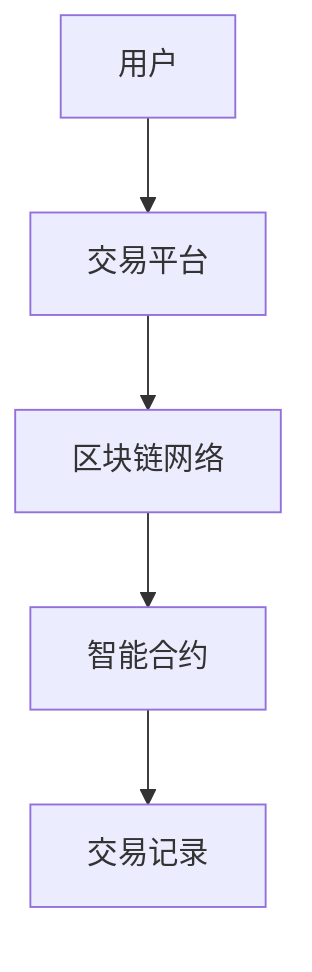
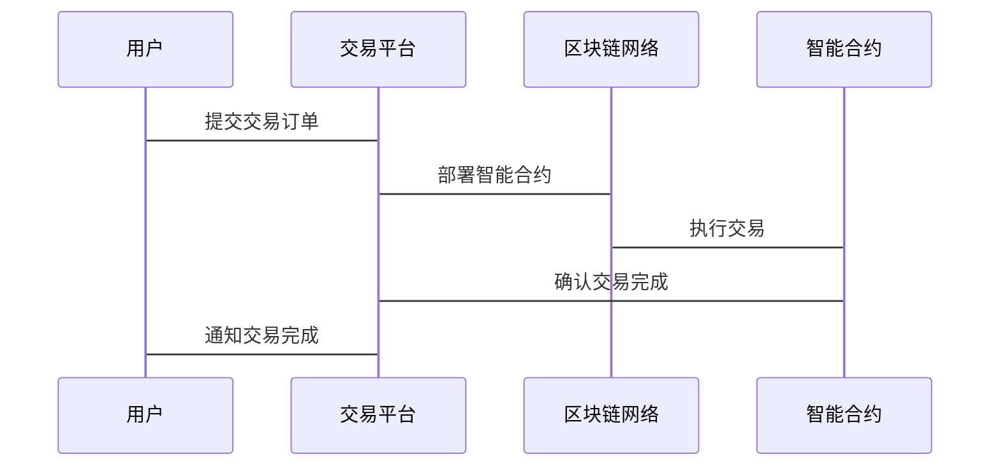

                 


# 如何评估企业的区块链能源交易平台

## 关键词：
- 区块链
- 能源交易
- 平台评估
- 技术分析
- 分布式系统

## 摘要：
评估企业的区块链能源交易平台是一个复杂而关键的任务，需要考虑技术架构、安全性、扩展性、性能等多个方面。本文将从区块链技术的核心原理出发，分析能源交易平台的独特需求，提供一套系统的评估框架，涵盖技术实现、系统设计、安全性评估以及实际案例分析。通过本文，读者将能够全面理解如何构建和评估一个高效的区块链能源交易平台，确保其在实际应用中的稳定性和可靠性。

---

# 第一章: 区块链能源交易平台概述

## 1.1 区块链与能源交易的结合

### 1.1.1 区块链技术的基本概念
区块链是一种分布式账本技术，通过去中心化的方式记录数据，确保数据的不可篡改性和可追溯性。区块链的核心特点包括：
- **去中心化**: 数据不依赖于单一中心，而是分布在网络的各个节点上。
- **不可篡改**: 每个区块都包含前一区块的哈希值，确保数据的完整性和一致性。
- **可追溯**: 每个交易都可以追溯到源头，确保透明性。

### 1.1.2 能源交易的现状与挑战
传统的能源交易系统存在以下问题：
- **信息不对称**: 参与者之间的信息不透明，导致信任缺失。
- **效率低下**: 中间环节多，交易时间长，成本高。
- **安全性不足**: 数据容易被篡改，存在欺诈风险。

区块链技术可以解决这些问题，通过去中心化和不可篡改的特性，提高交易透明度和效率。

### 1.1.3 区块链在能源交易中的应用潜力
区块链技术的应用潜力主要体现在以下几个方面：
- **支持去中心化能源交易**: 消除中间人，降低交易成本。
- **促进可再生能源发展**: 通过智能合约自动分配和结算可再生能源的交易。
- **提高能源分配效率**: 优化能源资源的分配，减少浪费。

## 1.2 区块链能源交易平台的核心价值

### 提高交易透明度
通过区块链技术，每笔交易都会被记录在区块链上，并且可以被所有参与者查看，确保交易的透明性。

### 降低交易成本
区块链能源交易平台可以去除中间环节，减少佣金和管理费用，从而降低交易成本。

### 提升交易效率
智能合约可以自动执行交易，减少人为干预，提高交易效率。

## 1.3 区块链能源交易平台的边界与外延

### 界定平台的边界
区块链能源交易平台的功能范围包括：
- 用户注册与身份验证
- 交易订单的生成与确认
- 智能合约的执行与支付
- 交易记录的查询与追溯

### 外延功能
- 数据分析与市场预测
- 用户行为分析
- 支付方式的多样性

### 平台与外部系统的接口
- 与能源供应商的接口：用于数据同步和订单处理。
- 与监管机构的接口：用于合规性检查和数据汇报。

## 1.4 区块链能源交易平台的核心要素组成

### 参与者角色
- 能源生产者：提供能源资源。
- 能源消费者：购买能源产品。
- 交易平台：提供交易服务和智能合约执行环境。
- 监管机构：负责监管交易活动，确保合规性。

### 交易流程
1. **下单**: 消费者在平台上提交购买订单。
2. **确认**: 生产者确认订单并生成交易记录。
3. **支付**: 使用智能合约自动完成支付。
4. **交割**: 能源资源从生产者转移到消费者。

### 数据结构
- 区块链：存储所有交易记录。
- 交易记录：包括交易时间、金额、参与方等信息。
- 用户信息：包括用户身份、信用记录等。

---

# 第二章: 区块链能源交易平台的核心概念与联系

## 2.1 区块链技术的核心原理

### 分布式账本
分布式账本是区块链的核心数据结构，所有交易记录都存储在多个节点上，确保数据的可靠性和一致性。

### 共识机制
共识机制是区块链中确保所有节点达成一致的算法，常见的共识机制包括：
- **工作量证明（PoW）**: 通过计算哈希值来证明工作量。
- **权益证明（PoS）**: 通过持有代币的数量来决定记账权。
- **RAFT**: 适用于联盟链的高效共识算法。

### 智能合约
智能合约是区块链上的自动执行程序，可以根据预设条件自动触发操作，如支付、转移资产等。

## 2.2 能源交易的核心特征

### 交易的实时性
能源的生产和消费具有实时性，交易平台需要快速响应用户的交易请求。

### 交易的可追溯性
每笔交易都可以被追溯到源头，确保交易的合法性和透明性。

### 交易的透明性
所有交易记录公开透明，参与者可以随时查看交易详情，减少信任问题。

## 2.3 区块链与能源交易的结合模型

### 模型的结构化描述
区块链能源交易平台的结构包括：
- **用户界面**: 提供交易订单提交、查询等功能。
- **智能合约**: 自动执行交易和支付。
- **区块链网络**: 存储所有交易记录，确保数据不可篡改。

### 模型的属性特征对比
| 属性         | 区块链系统 | 传统能源交易系统 |
|--------------|------------|------------------|
| 中心化程度   | 去中心化   | 高度中心化       |
| 安全性       | 高         | 中               |
| 效率         | 高         | 低               |

### ER实体关系图



---

# 第三章: 区块链能源交易平台的算法原理

## 3.1 区块链共识机制的算法原理

### 共识机制的定义
共识机制是区块链中确保所有节点达成一致的算法，确保数据的一致性和可靠性。

### 常见的共识算法
- **工作量证明（PoW）**: 通过计算哈希值来证明工作量。
- **权益证明（PoS）**: 通过持有代币的数量来决定记账权。
- **RAFT**: 适用于联盟链的高效共识算法。

### 共识机制的实现流程
1. **提议阶段**: 一个节点提议一个新的区块。
2. **验证阶段**: 其他节点验证提议的区块是否合法。
3. **确认阶段**: 节点达成一致，确认区块有效。
4. **存储阶段**: 区块被添加到区块链中，所有节点同步数据。



## 3.2 智能合约的原理

### 智能合约的定义
智能合约是区块链上的自动执行程序，可以根据预设条件自动触发操作。

### 智能合约的实现步骤
1. **部署**: 将智能合约部署到区块链上。
2. **调用**: 用户或系统调用智能合约。
3. **执行**: 智能合约根据预设条件自动执行操作。

### 智能合约的安全性
智能合约的安全性依赖于代码的正确性和系统的安全性。常见的安全问题包括：
- **代码漏洞**: 智能合约代码存在逻辑漏洞，可能导致资金损失。
- **系统攻击**: 恶意攻击可能导致智能合约被篡改或攻击。

## 3.3 区块链能源交易平台的算法实现

### 智能合约的实现代码
```solidity
// SPDX-License-Identifier: MIT
pragma solidity ^0.8.0;

contract EnergyTrade {
    struct Order {
        address buyer;
        address seller;
        uint256 amount;
        uint256 price;
        bool isFulfilled;
    }

    Order[] public orders;

    function createOrder(address seller, uint256 amount, uint256 price) external {
        Order memory order = Order({
            buyer: address(0),
            seller: seller,
            amount: amount,
            price: price,
            isFulfilled: false
        });
        orders.push(order);
    }

    function fulfillOrder(uint256 orderIndex) external payable {
        Order storage order = orders[orderIndex];
        require(!order.isFulfilled, "Order already fulfilled");
        require(msg.sender != order.seller, "Seller cannot fulfill own order");

        uint256 amount = order.amount;
        uint256 price = order.price;
        uint256 total = amount * price;

        order.buyer = msg.sender;
        order.isFulfilled = true;
        payable(order.seller).transfer(total);
    }
}
```

### 区块链共识机制的实现代码
```python
def proof_of_work(last_hash):
    # 寻找满足条件的前缀
    prefix = 0
    while True:
        prefix += 1
        current_hash = hashlib.sha256(str(prefix).encode()).hexdigest()
        if current_hash.startswith('0000'):
            return current_hash
```

### 数学模型和公式
区块链共识机制的计算复杂度可以用以下公式表示：
$$
\text{计算复杂度} = O(n) \quad \text{其中} \quad n = \text{哈希计算次数}
$$

---

# 第四章: 区块链能源交易平台的系统架构设计

## 4.1 问题场景介绍
能源交易的痛点包括：
- 信息不对称
- 交易效率低
- 成本高昂

## 4.2 项目介绍
本项目旨在构建一个高效、安全的区块链能源交易平台，支持用户注册、订单管理、支付结算等功能。

## 4.3 系统功能设计
### 领域模型设计


### 系统架构设计


## 4.4 系统接口设计
### API接口定义
- `POST /api/order/create`: 创建交易订单
- `POST /api/order/fulfill`: 完成交易订单
- `GET /api/order/history`: 查询交易历史

## 4.5 系统交互设计


---

# 第五章: 区块链能源交易平台的项目实战

## 5.1 环境安装
### 安装必要的工具和库
- 安装Python和Solidity编译器
- 安装区块链框架（如Ethereum、FISCO）

## 5.2 系统核心实现源代码

### 智能合约的实现代码
```solidity
// SPDX-License-Identifier: MIT
pragma solidity ^0.8.0;

contract EnergyTrade {
    struct Order {
        address buyer;
        address seller;
        uint256 amount;
        uint256 price;
        bool isFulfilled;
    }

    Order[] public orders;

    function createOrder(address seller, uint256 amount, uint256 price) external {
        Order memory order = Order({
            buyer: address(0),
            seller: seller,
            amount: amount,
            price: price,
            isFulfilled: false
        });
        orders.push(order);
    }

    function fulfillOrder(uint256 orderIndex) external payable {
        Order storage order = orders[orderIndex];
        require(!order.isFulfilled, "Order already fulfilled");
        require(msg.sender != order.seller, "Seller cannot fulfill own order");

        uint256 amount = order.amount;
        uint256 price = order.price;
        uint256 total = amount * price;

        order.buyer = msg.sender;
        order.isFulfilled = true;
        payable(order.seller).transfer(total);
    }
}
```

### 区块链节点的实现代码
```python
import hashlib

def proof_of_work(last_hash):
    prefix = 0
    while True:
        prefix += 1
        current_hash = hashlib.sha256(str(prefix).encode()).hexdigest()
        if current_hash.startswith('0000'):
            return current_hash
```

## 5.3 代码应用解读与分析
### 智能合约解读
智能合约定义了交易订单的创建和执行逻辑，确保交易的透明性和自动性。

### 区块链节点解读
区块链节点通过共识机制确保数据的一致性和可靠性，防止数据篡改和攻击。

## 5.4 实际案例分析
以一个实际的能源交易案例为例，展示平台如何处理交易：
1. 用户提交订单
2. 智能合约执行交易
3. 交易记录被存储在区块链上

---

# 第六章: 最佳实践与总结

## 6.1 最佳实践
### 关键点总结
- 选择合适的区块链框架
- 确保智能合约的安全性
- 优化系统性能

### 经验分享
- 在部署智能合约前，必须进行严格的代码审计和漏洞检测。
- 确保系统的高可用性和可扩展性。

## 6.2 小结
区块链能源交易平台的评估需要从技术、系统、安全等多个方面进行综合分析，确保其在实际应用中的稳定性和可靠性。

## 6.3 注意事项
- 确保系统的安全性，防止数据泄露和攻击。
- 定期更新系统和智能合约，应对新的安全威胁。

## 6.4 拓展阅读
- 推荐阅读《区块链：从数字货币到信用社会》
- 参考Solidity智能合约开发指南

---

# 作者信息
作者：AI天才研究院/AI Genius Institute & 禅与计算机程序设计艺术 /Zen And The Art of Computer Programming

