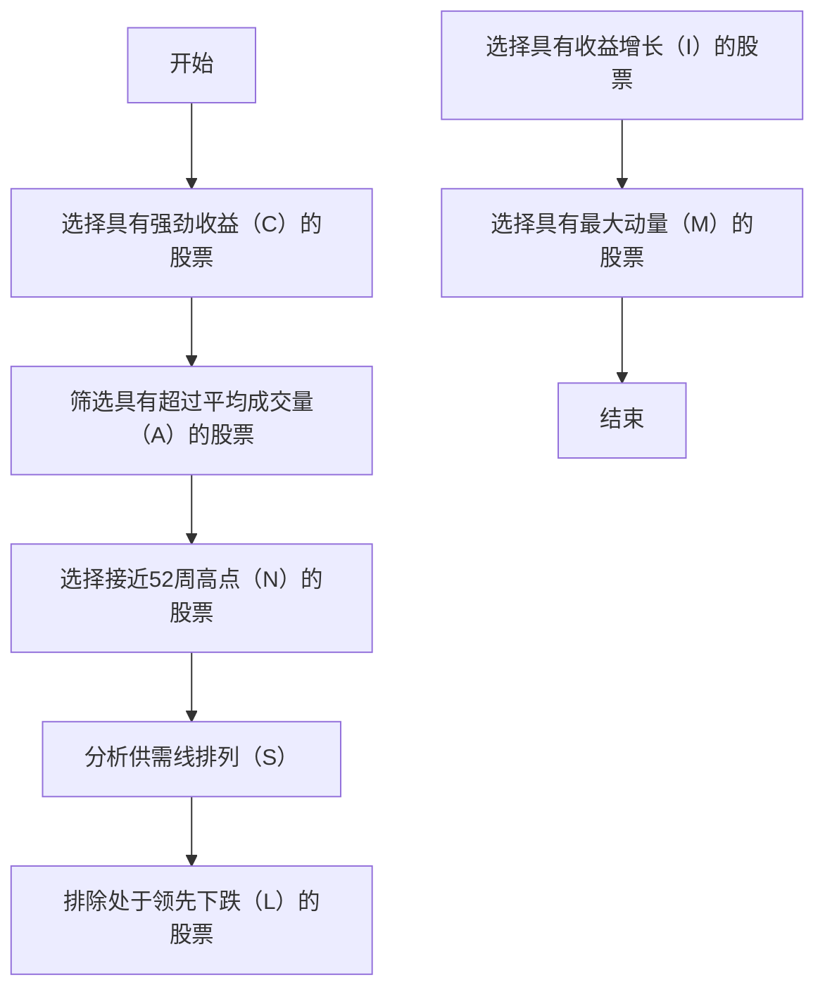
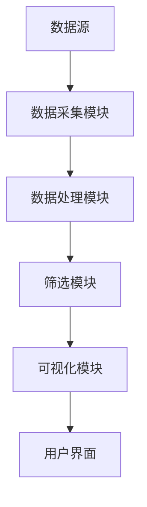

                 


# 《威廉·欧奈尔的CANSLIM选股系统》

---

## 关键词

- 威廉·欧奈尔
- CANSLIM选股系统
- 股票投资
- 技术分析
- 投资策略

---

## 摘要

本文系统地介绍并分析威廉·欧奈尔的CANSLIM选股系统，探讨其核心概念、算法原理、系统架构以及实际应用。通过详细解析CANSLIM的七个要素（C、A、N、S、L、I、M），并结合实际案例，为投资者提供一套科学、系统的选股方法。同时，本文还将从技术角度出发，分析CANSLIM的实现过程，包括数据采集、筛选标准、可视化界面设计等，为读者提供全面的技术指导。

---

# 第一部分: 威廉·欧奈尔CANSLIM选股系统的背景与基础

## 第1章: 威廉·欧奈尔与CANSLIM选股系统的概述

### 1.1 威廉·欧奈尔的背景与投资理念

#### 1.1.1 威廉·欧奈尔的生平简介

威廉·欧奈尔（William O'Neil）是20世纪美国著名的投资者、交易员和作家。他以独特的投资理念和创新的选股方法闻名，著有《如何在股市中赚钱》（How to Make Money in Stocks）一书，书中详细阐述了CANSLIM选股系统。

#### 1.1.2 欧奈尔的投资哲学与方法论

欧奈尔的投资哲学以技术分析为核心，强调通过研究股价走势和成交量来判断股票的强弱。他认为，股票市场是一个动态变化的系统，投资者需要通过科学的方法来捕捉市场机会。

#### 1.1.3 欧奈尔对现代投资理论的贡献

欧奈尔的CANSLIM选股系统结合了技术分析和基本面分析，为现代投资理论提供了新的视角。他的方法强调了市场参与者的心理因素和市场趋势的重要性。

---

### 1.2 CANSLIM选股系统的起源与核心思想

#### 1.2.1 CANSLIM选股法的提出背景

CANSLIM选股法诞生于20世纪70年代，是欧奈尔在总结多年投资经验的基础上提出的。该方法旨在通过筛选具有强劲基本面和技术优势的股票，帮助投资者在市场中获得超额收益。

#### 1.2.2 CANSLIM选股法的核心理念

CANSLIM的核心理念是通过筛选具有以下特征的股票：
1. 强劲的收益增长（C）
2. 超过平均的成交量（A）
3. 接近52周高点（N）
4. 领先的动量（S）
5. 稳定的供需关系（L）
6. 增长的收益（I）
7. 最大的动量（M）

#### 1.2.3 CANSLIM与传统选股方法的区别

与传统选股方法相比，CANSLIM更加注重技术分析和市场参与者的心理因素，强调通过股价走势和成交量的变化来判断股票的强弱。

---

## 第2章: CANSLIM选股系统的七个关键要素

### 2.1 C - Current Strong Earnings（当前强劲的收益）

#### 2.1.1 强劲收益的定义与衡量标准

强劲收益是指公司在最近几个季度内持续增长的净利润。通常，欧奈尔建议选择收益同比增长率超过行业平均水平的股票。

#### 2.1.2 如何判断收益是否强劲

通过分析公司的财务报表，特别是利润表，可以判断公司的收益是否强劲。同时，还需要关注收益的质量，例如是否依赖于一次性收入。

#### 2.1.3 收益增长的持续性分析

收益增长的持续性是判断股票强弱的重要指标。欧奈尔建议选择收益增长持续超过行业平均水平的股票。

---

### 2.2 A - Above Average Volume（超过平均成交量）

#### 2.2.1 成交量在选股中的重要性

成交量是衡量市场参与度的重要指标。高成交量表明市场对这只股票的关注度较高，可能是由于强劲的买盘或卖盘驱动。

#### 2.2.2 如何计算与比较成交量

成交量的计算通常基于交易量（Volume）指标，可以通过比较股票的成交量与其历史平均成交量来判断是否超过平均水平。

#### 2.2.3 成交量与股价走势的关系

高成交量通常伴随着股价的上涨，而低成交量可能预示着股价的下跌。因此，在选股时，欧奈尔建议选择成交量超过行业平均水平的股票。

---

### 2.3 N - Near 52-Week High（接近52周高点）

#### 2.3.1 52周高点的定义与意义

52周高点是指在过去52周内，股票的最高价格。接近52周高点的股票通常意味着该股票在近期表现强劲。

#### 2.3.2 如何判断股价是否接近52周高点

通过比较当前股价与过去52周的最高价格，可以判断股价是否接近52周高点。

#### 2.3.3 接近高点时的投资机会

接近52周高点的股票通常具有较高的上涨潜力，但同时也可能面临较大的回调风险。

---

### 2.4 S - Supply Line Up（供需线排列）

#### 2.4.1 供需线的定义与作用

供需线是指在股票价格走势图中，价格在某一区间内形成的支持线和阻力线。供需线排列通常表明股票价格在该区间内达到了供需平衡。

#### 2.4.2 如何识别供需线排列

通过绘制股票价格走势图，可以识别供需线的排列情况。通常，供需线排列出现在股票价格达到阻力位或支持位时。

#### 2.4.3 供需线排列对股价的影响

供需线排列通常预示着股票价格的反转或突破。例如，价格突破阻力线可能预示着股价的进一步上涨。

---

### 2.5 L - Leading Decline（领先下跌）

#### 2.5.1 领先下跌的定义与特征

领先下跌是指在市场下跌期间，某些股票的价格跌幅超过市场整体跌幅。这些股票通常被视为市场中的弱势股。

#### 2.5.2 如何判断股票是否处于领先下跌状态

通过比较股票价格跌幅与市场指数的跌幅，可以判断股票是否处于领先下跌状态。

#### 2.5.3 领先下跌对投资决策的意义

领先下跌的股票通常被视为风险较高的投资标的，投资者应谨慎选择。

---

### 2.6 I - Increasing Earnings（收益增长）

#### 2.6.1 收益增长的定义与衡量

收益增长是指公司在一定时期内净利润的持续增长。通常，欧奈尔建议选择收益增长超过行业平均水平的股票。

#### 2.6.2 如何分析收益增长的趋势

通过分析公司财务报表，特别是利润表，可以判断收益增长的趋势。同时，还需要关注收益增长的质量和可持续性。

#### 2.6.3 收益增长对股价的影响

收益增长通常是股价上涨的推动力。强劲的收益增长预示着公司具有较高的投资价值。

---

### 2.7 M - Maximum Momentum（最大动量）

#### 2.7.1 动量在选股中的作用

动量是指股票价格走势的强度和持续性。最大动量通常意味着股票价格在短期内表现出强劲的上涨趋势。

#### 2.7.2 如何计算与比较动量

动量可以通过计算股票价格的相对强度（RSI）来衡量。通常，RSI指标在70以上表示股票处于超买状态，RSI指标在30以下表示股票处于超卖状态。

#### 2.7.3 动量与股价走势的关系

动量通常与股价走势密切相关。强劲的动量预示着股票价格的进一步上涨，而弱动量可能预示着股价的下跌。

---

## 第3章: CANSLIM选股系统的逻辑与优势

### 3.1 CANSLIM选股法的核心逻辑

#### 3.1.1 强势股票的特征分析

CANSLIM选股法通过分析股票的七个关键要素，筛选出具有强劲基本面和技术优势的股票。

#### 3.1.2 供需关系对股价的影响

供需关系是影响股价走势的重要因素。供需线排列通常预示着股票价格的反转或突破。

#### 3.1.3 动量效应在市场中的作用

动量效应是指股票价格走势的强度和持续性对股价的影响。最大动量通常意味着股票价格在短期内表现出强劲的上涨趋势。

---

### 3.2 CANSLIM选股系统的独特优势

#### 3.2.1 结合技术分析与基本面分析

CANSLIM选股法将技术分析和基本面分析有机结合，为投资者提供了一种全面的选股方法。

#### 3.2.2 量化指标的科学性

CANSLIM选股法通过量化指标来衡量股票的强弱，使选股过程更加科学化和系统化。

#### 3.2.3 系统性和可操作性

CANSLIM选股法提供了一套系统的选股标准，使投资者能够轻松地筛选出符合投资条件的股票。

---

## 第4章: CANSLIM选股系统的算法原理

### 4.1 CANSLIM选股法的流程图



---

### 4.2 数学模型与公式

#### 4.2.1 相对强度指数（RSI）公式

$$
RSI = \frac{100}{1 + \frac{\text{平均上涨幅度}}{\text{平均下跌幅度}}}
$$

其中，RSI指标用于衡量股票的超买或超卖状态。通常，RSI指标在70以上表示股票处于超买状态，RSI指标在30以下表示股票处于超卖状态。

---

### 4.3 算法实现与代码

#### 4.3.1 数据采集

```python
import pandas as pd
import yfinance as yf

# 下载股票数据
data = yf.download(tickers='AAPL', period='5y', interval='1d')
```

#### 4.3.2 筛选标准

```python
# 计算相对强度指数（RSI）
def calculate_rsi(data, period=14):
    delta = data['Close'].diff().dropna()
    up = delta.where(delta > 0, 0)
    down = delta.where(delta < 0, 0)
    rs = up.rolling(period).sum() / down.rolling(period).sum()
    rsi = 100 - (100 / (1 + rs))
    return rsi

# 计算收益增长
data['收益增长'] = data['Close'].pct_change().cumsum()

# 筛选符合CANSLIM标准的股票
def is_canslim(data):
    rsi = calculate_rsi(data)
    if rsi.iloc[-1] > 70:
        return False
    if data['成交量'].iloc[-1] < data['成交量'].mean():
        return False
    if data['Close'][-1] < data['Close'].max() * 0.9:
        return False
    return True
```

---

## 第5章: CANSLIM选股系统的系统分析与架构设计

### 5.1 系统功能设计

#### 5.1.1 数据采集模块

数据采集模块负责从股票市场数据源（如Yahoo Finance）获取实时股票数据。

#### 5.1.2 数据处理模块

数据处理模块负责对获取的数据进行清洗和预处理，计算相关指标（如RSI、成交量等）。

#### 5.1.3 筛选模块

筛选模块根据CANSLIM选股标准，筛选出符合条件的股票。

#### 5.1.4 可视化模块

可视化模块负责将筛选结果以图形化的方式展示出来，帮助投资者更好地理解和决策。

---

### 5.2 系统架构设计



---

## 第6章: 项目实战

### 6.1 环境安装

#### 6.1.1 安装必要的Python库

```bash
pip install pandas matplotlib yfinance
```

---

### 6.2 系统核心实现源代码

#### 6.2.1 数据采集与处理

```python
import pandas as pd
import yfinance as yf
import matplotlib.pyplot as plt

# 下载股票数据
data = yf.download(tickers='AAPL', period='5y', interval='1d')

# 计算相对强度指数（RSI）
def calculate_rsi(data, period=14):
    delta = data['Close'].diff().dropna()
    up = delta.where(delta > 0, 0)
    down = delta.where(delta < 0, 0)
    rs = up.rolling(period).sum() / down.rolling(period).sum()
    rsi = 100 - (100 / (1 + rs))
    return rsi

# 计算收益增长
data['收益增长'] = data['Close'].pct_change().cumsum()

# 可视化股价走势图
plt.figure(figsize=(10, 6))
plt.plot(data.index, data['Close'], label='股价走势')
plt.title('股票股价走势图')
plt.xlabel('时间')
plt.ylabel('股价')
plt.legend()
plt.show()
```

---

### 6.3 代码应用解读与分析

#### 6.3.1 数据采集模块

```python
data = yf.download(tickers='AAPL', period='5y', interval='1d')
```

通过`yfinance`库下载AAPL股票过去5年的日线数据。

#### 6.3.2 RSI指标计算

```python
def calculate_rsi(data, period=14):
    delta = data['Close'].diff().dropna()
    up = delta.where(delta > 0, 0)
    down = delta.where(delta < 0, 0)
    rs = up.rolling(period).sum() / down.rolling(period).sum()
    rsi = 100 - (100 / (1 + rs))
    return rsi
```

通过计算相对强度指数（RSI）来判断股票的超买或超卖状态。

#### 6.3.3 可视化股价走势图

```python
plt.figure(figsize=(10, 6))
plt.plot(data.index, data['Close'], label='股价走势')
plt.title('股票股价走势图')
plt.xlabel('时间')
plt.ylabel('股价')
plt.legend()
plt.show()
```

通过绘制股价走势图，帮助投资者直观地观察股票价格走势。

---

## 第7章: 总结与最佳实践

### 7.1 总结

CANSLIM选股系统是一种结合技术分析和基本面分析的选股方法，通过筛选具有强劲收益、高成交量、接近52周高点、供需线排列、收益增长和最大动量的股票，帮助投资者在市场中获得超额收益。

---

### 7.2 最佳实践Tips

1. **持续学习与实践**：投资者需要不断学习市场知识，并通过实践提升自己的选股能力。
2. **风险控制**：在投资过程中，投资者需要注重风险控制，合理配置资产。
3. **结合市场环境**：投资者需要根据市场环境调整自己的选股策略。

---

### 7.3 注意事项

1. **数据的准确性**：投资者需要确保所使用的数据准确无误。
2. **市场变化**：市场环境随时都在变化，投资者需要及时调整自己的策略。
3. **长期投资**：投资需要耐心和毅力，长期投资才能获得稳定的收益。

---

### 7.4 拓展阅读

1. 《如何在股市中赚钱》——威廉·欧奈尔
2. 《股票作手回忆录》——埃德温·勒斐夫
3. 《投资学基础》——查尔斯·埃勒里·霍华德

---

## 作者

作者：AI天才研究院/AI Genius Institute & 禅与计算机程序设计艺术 /Zen And The Art of Computer Programming

---

希望这个目录大纲能够为读者提供一个全面的视角，帮助他们更好地理解和应用威廉·欧奈尔的CANSLIM选股系统。

