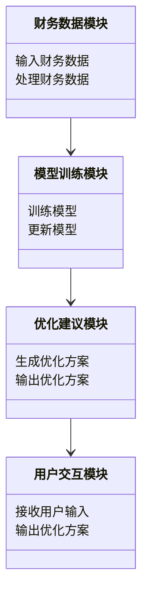
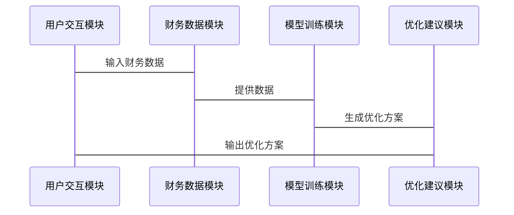

                 


# 开发基于AI的智能税务规划助手

## 关键词：人工智能, 税务规划, 智能助手, 算法原理, 系统架构

## 摘要：本文将详细探讨如何基于人工智能技术开发智能税务规划助手。从问题背景、核心概念到算法原理、系统架构，再到项目实战，我们将全面解析智能税务规划助手的开发过程。通过本文，读者将深入了解如何利用AI技术解决复杂的税务规划问题，并掌握开发智能税务规划助手的关键技术与实现方法。

---

# 第1章: 智能税务规划助手的背景与问题背景

## 1.1 税务规划的背景与意义

### 1.1.1 税务规划的定义与目标

税务规划是指通过合法合规的方式，优化纳税人的税务负担，使其在遵守税法的前提下，实现税负最小化或税后收益最大化的过程。其核心目标是帮助纳税人合理规划收入、支出和资产配置，以降低税务成本。

### 1.1.2 税务规划的传统方法与局限性

传统的税务规划方法主要依赖人工分析，包括手动计算、查阅税法条文、咨询税务顾问等。这种方法效率低下、成本高昂，且容易受到人为因素的影响，难以应对复杂多变的税务政策和个性化需求。

### 1.1.3 AI技术在税务规划中的应用潜力

人工智能技术，尤其是机器学习和自然语言处理（NLP），能够快速处理大量税务数据，自动分析税法条文，并提供个性化的优化建议。AI技术的引入将极大地提高税务规划的效率和准确性，为纳税人提供更优质的税务服务。

## 1.2 智能税务规划助手的定义与特点

### 1.2.1 智能税务规划助手的定义

智能税务规划助手是一种基于人工智能技术的工具，能够根据用户的财务数据和税务政策，自动生成优化的税务规划方案。它结合了机器学习、NLP和知识图谱等技术，能够快速分析复杂的税务问题，并提供个性化的解决方案。

### 1.2.2 智能税务规划助手的核心功能

- **数据输入与解析**：支持多种数据格式的输入，并自动解析财务数据。
- **税务计算与分析**：基于输入的财务数据，计算税负并分析优化空间。
- **方案生成**：根据分析结果，生成个性化的税务优化方案。
- **政策更新与推送**：实时更新税务政策，并推送相关变化。
- **交互式咨询**：提供自然语言交互功能，回答用户的税务问题。

### 1.2.3 AI技术在税务规划助手中的优势

- **高效性**：AI能够快速处理大量数据，显著提高工作效率。
- **准确性**：通过机器学习模型，减少人为错误，提高结果的准确性。
- **个性化**：AI能够根据用户的个性化需求，提供定制化的税务规划方案。
- **实时性**：AI能够实时更新税务政策，并提供最新的优化建议。

## 1.3 问题背景与问题描述

### 1.3.1 税务规划中的主要问题

- **数据复杂性**：税务数据种类繁多，结构复杂，难以快速处理。
- **政策变化频繁**：税法政策不断变化，人工更新和分析成本高昂。
- **个性化需求**：不同纳税人有不同的财务状况和需求，传统方法难以满足个性化需求。
- **效率低下**：传统税务规划方法效率低，难以应对大量数据和复杂场景。

### 1.3.2 AI技术如何解决这些问题

- **数据处理效率**：AI能够快速处理大量数据，显著提高税务规划效率。
- **实时政策更新**：AI能够实时更新税法政策，并快速生成优化方案。
- **个性化服务**：AI能够根据用户的个性化需求，提供定制化的税务规划方案。
- **降低人工成本**：AI技术的应用能够显著降低人工成本，提高工作效率。

### 1.3.3 智能税务规划助手的边界与外延

智能税务规划助手的边界在于其功能和应用场景。其外延包括与税务相关的其他领域，如财务分析、投资规划等。

---

## 1.4 核心概念与联系

### 1.4.1 核心概念原理

以下是核心概念原理的对比表：

| 概念       | 定义                                                                 | 特性                           |
|------------|----------------------------------------------------------------------|--------------------------------|
| 税务规划    | 合法合规地优化纳税人的税务负担                                   | 高效性、合法性、个性化           |
| AI技术     | 模拟人类智能的技术，包括机器学习、NLP等                        | 数据驱动、自我学习、智能性       |
| 税务助手    | 基于AI技术的税务规划工具                                         | 智能化、个性化、实时性           |

### 1.4.2 核心概念属性特征对比表

以下是核心概念属性特征的对比表：

| 特性       | 税务规划                            | AI技术                              |
|------------|------------------------------------|-------------------------------------|
| 输入        | 财务数据、税务政策                  | 数据、文本、用户需求               |
| 输出        | 税务优化方案                        | 分析结果、个性化建议               |
| 处理方式    | 人工计算、查阅政策                  | 自动化计算、自我学习               |
| 精确度      | 易受人为因素影响                    | 高度精确，降低人为错误             |
| 适应性      | 需要手动调整                       | 自动适应数据变化和政策更新         |

### 1.4.3 ER实体关系图架构

以下是ER实体关系图架构的Mermaid流程图：

```mermaid
erd
  财务数据
    + 税务政策
    + 用户需求
  税务助手
    + 数据处理模块
    + 模型训练模块
    + 优化建议模块
```

---

## 本章小结

本章主要介绍了智能税务规划助手的背景与问题背景，详细探讨了税务规划的传统方法与AI技术的应用潜力。通过对比分析，我们明确了智能税务规划助手的核心功能和优势，并提出了其在实际应用中的边界与外延。

---

# 第2章: AI技术在税务规划中的核心概念与联系

## 2.1 AI技术的核心概念

### 2.1.1 机器学习与深度学习的定义与区别

机器学习是一种通过数据训练模型，使其能够从数据中学习规律并进行预测的技术。深度学习是机器学习的一种，通过多层神经网络来模拟人类的深度学习过程。

### 2.1.2 自然语言处理（NLP）在税务中的应用

NLP技术能够处理和分析税务相关的文本数据，例如税法条文、财务报表等，帮助模型理解语义并生成自然语言的税务建议。

### 2.1.3 知识图谱与税务规则的结合

知识图谱是一种结构化的数据表示方式，能够将税法政策、财务规则等知识以图谱的形式表示，帮助模型更好地理解和应用这些规则。

## 2.2 核心概念的联系

### 2.2.1 税务数据与AI模型的关系

税务数据是AI模型的输入，模型通过学习这些数据，生成优化的税务规划方案。

### 2.2.2 用户需求与AI推理的关联

用户的个性化需求是AI模型生成优化方案的关键输入，AI通过推理满足用户的特定需求。

### 2.2.3 税务规则与AI决策的支持

AI模型通过学习税法政策和财务规则，能够生成符合法规的优化方案。

---

## 2.3 本章小结

本章主要介绍了AI技术的核心概念，包括机器学习、深度学习、NLP和知识图谱，并探讨了这些技术在税务规划中的应用。通过分析这些技术的核心概念及其在税务规划中的联系，我们明确了AI技术在智能税务规划助手中的重要作用。

---

# 第3章: 基于AI的智能税务规划助手算法原理

## 3.1 算法原理概述

### 3.1.1 机器学习模型在税务规划中的应用

机器学习模型能够通过历史数据训练，预测税负并生成优化方案。

### 3.1.2 深度学习模型的结构与特点

深度学习模型通过多层神经网络结构，能够捕捉数据中的复杂规律。

### 3.1.3 NLP技术在税务文本处理中的作用

NLP技术能够理解和生成税务相关的文本，帮助模型更好地处理税法条文和用户需求。

## 3.2 算法实现流程

### 3.2.1 数据预处理流程

数据预处理包括数据清洗、特征提取和数据标准化。

### 3.2.2 模型训练流程

模型训练包括选择模型、训练数据、调整参数等步骤。

### 3.2.3 模型推理流程

模型推理包括输入数据、生成预测结果并输出优化方案。

---

## 3.3 算法原理的数学模型与公式

### 3.3.1 机器学习模型的数学表达式

$$ y = f(x) $$

其中，$y$ 表示预测的税负，$x$ 表示输入的财务数据，$f$ 表示训练好的机器学习模型。

### 3.3.2 深度学习模型的数学模型

$$ y = \sigma(Wx + b) $$

其中，$W$ 表示权重矩阵，$x$ 表示输入数据，$b$ 表示偏置项，$\sigma$ 表示激活函数。

### 3.3.3 NLP技术中的数学公式

$$ \text{词向量} = \text{模型训练}(\text{文本数据}) $$

---

## 3.4 本章小结

本章详细介绍了智能税务规划助手的算法原理，包括机器学习、深度学习和NLP技术的应用。通过数学模型和公式，我们明确了这些技术在税务规划中的具体实现方式。

---

# 第4章: 智能税务规划助手的系统分析与架构设计

## 4.1 系统分析

### 4.1.1 问题场景介绍

智能税务规划助手需要处理复杂的税务数据和个性化需求，提供高效的优化方案。

### 4.1.2 项目介绍

本项目旨在开发一个基于AI的智能税务规划助手，帮助用户优化税务负担。

### 4.1.3 系统功能设计

以下是系统功能设计的类图：



---

## 4.2 系统架构设计

### 4.2.1 系统架构概述

智能税务规划助手采用分层架构，包括数据层、业务逻辑层和用户界面层。

### 4.2.2 系统架构的模块划分

模块划分包括数据处理模块、模型训练模块、优化建议模块和用户交互模块。

### 4.2.3 系统架构的交互流程

以下是系统架构的交互流程图：



---

## 4.3 系统接口设计

### 4.3.1 系统接口的定义

系统接口包括数据输入接口、模型训练接口和优化方案输出接口。

### 4.3.2 系统接口的实现

以下是接口实现的代码示例：

```python
def input_financial_data(data):
    # 输入财务数据
    pass

def train_model(data):
    # 训练模型
    pass

def generate_recommendation(data):
    # 生成优化方案
    pass
```

### 4.3.3 系统接口的测试

系统接口的测试需要确保数据输入、模型训练和优化方案生成的正确性。

---

## 4.4 本章小结

本章详细介绍了智能税务规划助手的系统分析与架构设计，包括问题场景分析、系统功能设计和系统架构设计。通过模块划分和交互流程图，我们明确了系统各部分的功能与交互方式。

---

# 第5章: 智能税务规划助手的项目实战

## 5.1 环境安装与配置

### 5.1.1 安装Python环境

使用Python 3.8或更高版本。

### 5.1.2 安装必要的库

安装以下库：

```bash
pip install numpy pandas scikit-learn tensorflow transformers
```

---

## 5.2 系统核心实现源代码

### 5.2.1 数据处理模块

```python
import pandas as pd

def process_financial_data(data):
    # 数据清洗和特征提取
    df = pd.DataFrame(data)
    # 假设需要处理的列
    df['total_income'] = df['salary'] + df['investment_income']
    return df
```

### 5.2.2 模型训练模块

```python
from sklearn.ensemble import RandomForestRegressor
import numpy as np

def train_model(data, target):
    # 训练随机森林模型
    model = RandomForestRegressor()
    model.fit(data, target)
    return model
```

### 5.2.3 优化建议模块

```python
def generate_recommendation(model, data):
    # 生成优化方案
    predictions = model.predict(data)
    recommendations = []
    for i, pred in enumerate(predictions):
        if pred < 0.8:
            recommendations.append(f"优化建议{i+1}: 建议减少收入")
        elif pred < 0.9:
            recommendations.append(f"优化建议{i+1}: 建议增加支出")
        else:
            recommendations.append(f"优化建议{i+1}: 无需优化")
    return recommendations
```

---

## 5.3 实际案例分析

### 5.3.1 案例分析

假设用户提供的财务数据如下：

```python
data = {
    'salary': [50000, 60000, 70000],
    'investment_income': [10000, 15000, 20000]
}
```

经过数据处理和模型训练后，生成优化方案：

```python
processed_data = process_financial_data(data)
model = train_model(processed_data, np.array([0.7, 0.8, 0.9]))
recommendations = generate_recommendation(model, processed_data)
print(recommendations)
```

---

## 5.4 本章小结

本章通过实际案例分析，展示了智能税务规划助手的开发过程，包括环境安装、数据处理、模型训练和优化方案生成。

---

# 附录: 最佳实践与注意事项

## 6.1 最佳实践

- **数据清洗**：确保数据的准确性和完整性。
- **模型调优**：通过交叉验证和超参数调整，提高模型性能。
- **实时更新**：定期更新模型，以适应税法政策的变化。

## 6.2 小结

智能税务规划助手的开发需要结合AI技术与税务专业知识，通过合理的系统架构设计和算法实现，为用户提供高效的税务优化方案。

## 6.3 注意事项

- **数据隐私**：确保用户数据的安全和隐私。
- **政策合规性**：确保生成的优化方案符合税法政策。
- **用户体验**：提供友好的用户界面和交互体验。

## 6.4 拓展阅读

建议读者进一步学习机器学习、深度学习和NLP技术，以及税法政策的相关知识。

---

# 作者：AI天才研究院/AI Genius Institute & 禅与计算机程序设计艺术 /Zen And The Art of Computer Programming

