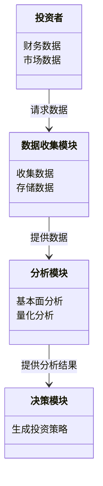
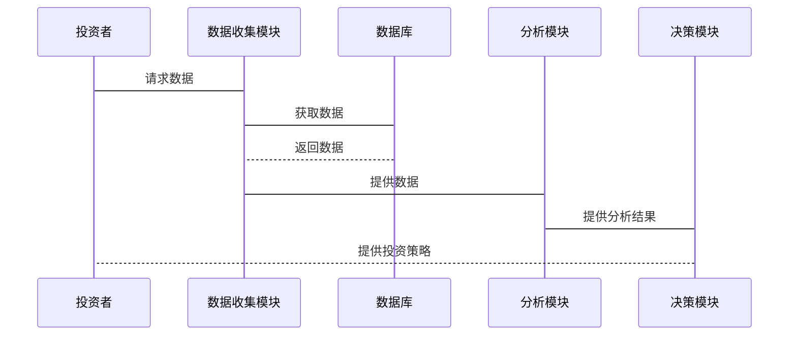

                 


# 托比亚斯·卡尔莱尔的全球价值投资：跨境寻找机会

## 关键词：价值投资，托比亚斯·卡尔莱尔，全球投资，安全边际，竞争优势，跨国投资

## 摘要：托比亚斯·卡尔莱尔的全球价值投资策略强调在全球范围内寻找被低估的投资机会，通过深入的基本面分析和对安全边际的关注，帮助投资者在跨境市场中实现长期稳健的收益。本文将详细介绍价值投资的核心概念、全球投资的机会与挑战、系统化的投资架构，以及实际案例分析，为读者提供全面的全球价值投资策略。

---

# 第一部分: 全球价值投资的背景与核心概念

## 第1章: 价值投资的定义与发展历程

### 1.1 价值投资的定义与核心理念

#### 1.1.1 价值投资的基本定义
价值投资是一种以基本面分析为基础的投资策略，旨在通过识别市场价格与内在价值之间的差异，投资于那些被市场低估的资产。其核心理念在于购买价格低于其内在价值的资产，并长期持有，直到市场认识到其价值。

$$\text{内在价值} = \frac{\text{未来现金流的现值}}{\text{折现率}}$$

价值投资强调安全边际，即市场价格与内在价值之间的差距，以降低投资风险。

#### 1.1.2 价值投资的核心理念
- **长期主义**：投资不是短期的交易，而是长期的价值创造。
- **安全边际**：购买价格低于内在价值，以降低潜在损失。
- **竞争优势**：投资于具有可持续竞争优势的企业。

#### 1.1.3 价值投资与成长投资的区别
| **维度**       | **价值投资**                          | **成长投资**                          |
|----------------|--------------------------------------|--------------------------------------|
| 投资目标       | 寻找价格被低估的资产                   | 寻找高成长潜力的资产                   |
| 投资期限       | 长期持有                              | 短期或中期                            |
| 风险偏好       | 低风险                                | 高风险                                |

### 1.2 全球价值投资的发展历程

#### 1.2.1 价值投资的起源与演变
价值投资起源于20世纪初，由本杰明·格雷厄姆和戴维·多德提出。格雷厄姆的学生沃伦·巴菲特进一步发展了这一理论，强调安全边际和长期持有的理念。

#### 1.2.2 价值投资在不同市场的表现
- **美国市场**：价值投资在20世纪取得了显著成功，特别是在2008年金融危机后，价值股的表现优于成长股。
- **新兴市场**：新兴市场中，价值投资需要考虑更多的风险因素，如政治风险和市场流动性。

#### 1.2.3 价值投资的全球化趋势
随着全球经济一体化，投资者可以更容易地在全球范围内配置资产。价值投资的全球化趋势使得托比亚斯·卡尔莱尔等投资者能够在更广泛的市场中寻找机会。

---

## 第2章: 价值投资的全球机会与挑战

### 2.1 全球市场的多样性与投资机会

#### 2.1.1 不同国家与地区的市场特点
- **成熟市场**：如美国、欧洲，市场流动性高，信息公开透明。
- **新兴市场**：如中国、印度，市场增长快，但风险较高。

#### 2.1.2 全球经济周期对投资的影响
全球经济周期影响着不同市场的表现。例如，在经济衰退期间，新兴市场的表现可能优于成熟市场。

#### 2.1.3 跨国投资的优势与风险
- **优势**：分散风险，捕捉全球机会。
- **风险**：汇率波动、政治风险、市场流动性不足。

### 2.2 价值投资在跨境投资中的应用

#### 2.2.1 跨境投资的基本策略
- **分散投资**：避免过度集中在某一市场或行业。
- **深入研究**：了解目标市场的经济、法律和文化环境。

#### 2.2.2 价值投资在新兴市场的应用
- **案例分析**：以中国为例，分析新兴市场的价值投资机会，如寻找低市盈率、高分红的国有企业。

#### 2.2.3 跨境投资中的风险管理
- **汇率风险管理**：使用金融工具对冲汇率波动。
- **政治风险管理**：关注政策变化，避免投资于高政治风险的国家。

---

# 第二部分: 价值投资的核心概念与策略

## 第3章: 价值投资的核心概念

### 3.1 安全边际的概念与应用

#### 3.1.1 安全边际的定义
安全边际是市场价格与内在价值之间的差距，用于降低投资风险。

$$\text{安全边际} = \text{内在价值} - \text{市场价格}$$

#### 3.1.2 安全边际的计算方法
- **绝对安全边际**：内在价值 - 市场价格 > 0。
- **相对安全边际**：（内在价值 - 市场价格）/ 市场价格。

#### 3.1.3 安全边际在投资决策中的作用
- **降低风险**：确保在市场价格波动时，投资者不会遭受重大损失。
- **提供缓冲区**：即使基本面分析出现误差，安全边际也能保护投资者。

### 3.2 竞争优势的识别与分析

#### 3.2.1 竞争优势的定义与分类
竞争优势是企业在市场上胜过竞争对手的独特优势，可分为成本优势、品牌优势、技术优势等。

#### 3.2.2 行业分析与竞争优势的识别
- **行业分析**：分析行业的竞争结构、增长潜力和周期性。
- **竞争优势识别**：评估企业在行业中的地位和竞争优势。

#### 3.2.3 企业竞争优势的持续性评估
- **可持续性分析**：评估竞争优势是否能够长期持续。
- **案例分析**：以苹果公司为例，分析其在技术、品牌和生态系统方面的竞争优势。

---

## 第4章: 价值投资的量化分析方法

### 4.1 基本面分析的核心指标

#### 4.1.1 市盈率（P/E）的计算与应用
$$\text{市盈率} = \frac{\text{股价}}{\text{每股收益}}$$

- **低市盈率**：可能意味着股票被低估。
- **高市盈率**：可能意味着市场对未来收益的高预期。

#### 4.1.2 市净率（P/B）的计算与应用
$$\text{市净率} = \frac{\text{股价}}{\text{每股净资产}}$$

- **低市净率**：可能意味着股票被低估。

#### 4.1.3 股息率的计算与应用
$$\text{股息率} = \frac{\text{股息 per share}}{\text{股价}} \times 100\%$$

- **高股息率**：可能意味着股票具有较高的收益潜力。

### 4.2 价值投资的量化模型

#### 4.2.1 价值投资模型的构建
- **多因子模型**：结合市盈率、市净率、股息率等多个指标进行综合评估。
- **案例分析**：使用Python代码计算股票的内在价值。

```python
import pandas as pd
import numpy as np

# 示例数据：股票A和股票B的财务数据
data = {
    '公司': ['A', 'B'],
    '净利润': [100, 150],
    '股东权益': [500, 600],
    '营业收入': [1000, 1200],
    '股价': [50, 60]
}

df = pd.DataFrame(data)

# 计算市盈率和市净率
df['市盈率'] = df['股价'] / (df['净利润'] / 1000)
df['市净率'] = df['股价'] / (df['股东权益'] / 1000)

print(df)
```

#### 4.2.2 模型的参数选择与优化
- **参数选择**：根据市场环境调整模型参数。
- **优化方法**：使用回归分析等统计方法优化模型。

#### 4.2.3 模型的实证分析与验证
- **回测分析**：验证模型在历史数据中的表现。
- **风险控制**：确保模型在不同市场环境下的稳健性。

---

# 第三部分: 价值投资的系统化架构与实现

## 第5章: 价值投资的系统化架构

### 5.1 投资系统的整体架构

#### 5.1.1 系统架构的组成模块
- **数据收集模块**：收集全球市场的财务数据、市场数据等。
- **分析模块**：进行基本面分析、量化分析等。
- **决策模块**：基于分析结果生成投资决策。

#### 5.1.2 各模块之间的关系与交互
- 数据收集模块向分析模块提供数据，分析模块向决策模块提供评估结果，决策模块生成投资策略。

#### 5.1.3 系统架构的灵活性与可扩展性
- 灵活性：能够适应不同市场环境的变化。
- 可扩展性：能够添加新的分析模块或数据源。

### 5.2 数据收集与处理模块

#### 5.2.1 数据收集的实现
- **数据来源**：包括股票交易所、财经网站、数据库等。
- **数据清洗**：处理缺失数据、异常值等。

#### 5.2.2 数据处理的实现
- **数据转换**：将数据转换为适合分析的格式。
- **数据存储**：将数据存储在数据库中，以便后续分析。

---

## 第6章: 系统分析与架构设计

### 6.1 问题场景介绍

#### 6.1.1 投资者的背景与目标
- **背景**：投资者有一定的投资经验，希望在全球范围内寻找价值投资机会。
- **目标**：构建一个系统化的价值投资框架，实现跨国投资的自动化分析与决策。

### 6.2 系统功能设计

#### 6.2.1 领域模型（Mermaid 类图）


### 6.3 系统架构设计

#### 6.3.1 系统架构（Mermaid 架构图）
```mermaid
context diagram
   投资者
    数据收集模块
    分析模块
    决策模块
    数据库
    投资决策输出
```

### 6.4 系统接口设计

#### 6.4.1 接口描述
- **数据接口**：投资者请求数据，数据收集模块返回数据。
- **分析接口**：分析模块接收数据，返回分析结果。
- **决策接口**：决策模块接收分析结果，返回投资策略。

### 6.5 系统交互设计

#### 6.5.1 交互流程（Mermaid 序列图）


---

## 第7章: 项目实战

### 7.1 环境安装与配置

#### 7.1.1 安装必要的工具与库
- **Python**：用于数据分析和编程。
- **Pandas**：用于数据处理。
- **Matplotlib**：用于数据可视化。

```bash
pip install pandas matplotlib
```

### 7.2 核心实现源代码

#### 7.2.1 数据收集与处理代码
```python
import pandas as pd
import requests

# 下载数据
url = "https://www.example.com/data"
response = requests.get(url)
data = response.json()

# 转换为DataFrame
df = pd.DataFrame(data)
```

#### 7.2.2 基本面分析代码
```python
def calculate_intrinsic_value(eps, growth_rate, discount_rate):
    return eps / (1 + growth_rate) + eps / (1 + growth_rate)**2 + ...  # 示例代码
```

### 7.3 案例分析与解读

#### 7.3.1 案例分析
以苹果公司为例，分析其在价值投资中的表现：
- **市盈率**：低于行业平均水平。
- **市净率**：低于行业平均水平。
- **竞争优势**：技术领先、品牌价值高。

#### 7.3.2 投资决策
基于分析结果，投资者可以决定是否投资于苹果公司。

### 7.4 项目小结

#### 7.4.1 项目总结
通过实际案例分析，验证了系统化价值投资方法的有效性。

#### 7.4.2 经验教训
- **数据准确性**：数据来源的可靠性至关重要。
- **模型的局限性**：模型无法预测所有市场波动。

---

## 第8章: 最佳实践、小结、注意事项与拓展阅读

### 8.1 最佳实践 tips

#### 8.1.1 数据驱动决策
基于可靠的数据和深入的分析，避免情绪化决策。

#### 8.1.2 持续学习与适应
市场环境不断变化，投资者需要持续学习和调整策略。

### 8.2 小结

托比亚斯·卡尔莱尔的全球价值投资策略通过系统化的方法，帮助投资者在全球范围内寻找机会，实现长期稳健的收益。本文详细介绍了价值投资的核心概念、系统化架构，并通过实际案例分析，验证了其方法的有效性。

### 8.3 注意事项

#### 8.3.1 风险提示
- **市场风险**：市场波动可能导致投资损失。
- **流动性风险**：新兴市场可能流动性不足。
- **政策风险**：政治事件可能影响投资。

#### 8.3.2 投资者能力
- **知识储备**：需要深入理解价值投资的理论和方法。
- **实践经验**：需要通过实践不断优化投资策略。

### 8.4 拓展阅读

#### 8.4.1 推荐书籍
- 《价值投资实战手册》
- 《投资学原理》

#### 8.4.2 在线资源
- 格雷厄姆投资学院
-巴菲特股东大会实录

---

# 结语

托比亚斯·卡尔莱尔的全球价值投资策略为投资者提供了在全球范围内寻找机会的框架。通过系统化的方法和深入的分析，投资者可以在跨境市场中实现长期稳健的收益。价值投资不仅是一种投资策略，更是一种长期坚持的哲学。

---

# 作者

作者：AI天才研究院/AI Genius Institute & 禅与计算机程序设计艺术/Zen And The Art of Computer Programming

