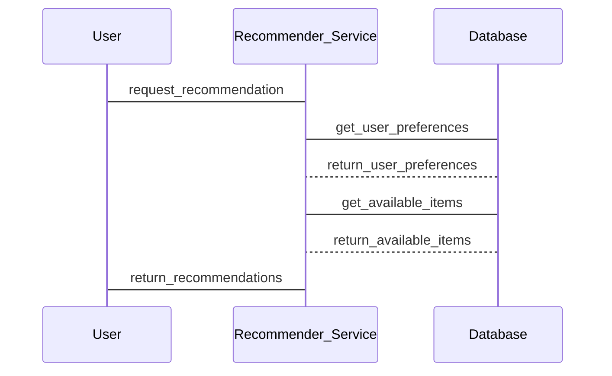

                 


好的，我将按照您的要求，逐步构建《智能衣柜：AI Agent的衣物搭配推荐》这篇文章。首先，我会先列出文章的关键词和摘要，然后再根据目录结构逐步展开每一章的内容。

# 智能衣柜：AI Agent的衣物搭配推荐

> 关键词：智能衣柜, AI Agent, 衣物搭配推荐, 人工智能, 机器学习, 算法实现

> 摘要：  
智能衣柜通过AI Agent实现衣物搭配推荐，结合用户的穿衣风格、场合需求和个性化偏好，利用协同过滤、深度学习和强化学习等算法，为用户提供智能化、个性化的衣物搭配建议。本文将从智能衣柜的背景与概念、AI Agent的算法原理、系统架构设计、项目实战以及最佳实践等方面展开详细论述，为读者提供全面的技术解析。

---

## 第一部分: 智能衣柜的背景与概念

### 第1章: 智能衣柜的背景介绍

#### 1.1 智能衣柜的背景与现状

##### 1.1.1 衣物搭配推荐的背景  
随着人们生活水平的提高，服装产业迎来了快速发展的机遇。然而，如何在庞大的衣物库中选择合适的搭配，成为了用户的痛点。衣物搭配推荐技术通过AI技术，帮助用户快速找到合适的穿衣方案。

##### 1.1.2 AI技术在服装领域的应用  
AI技术在服装领域的应用日益广泛，从设计、生产到销售，AI技术正在改变传统的服装产业模式。智能衣柜作为AI技术在服装领域的典型应用之一，通过AI Agent实现衣物的智能化管理与推荐。

##### 1.1.3 智能衣柜的定义与特点  
智能衣柜是一种结合AI技术的衣物管理与推荐系统。其特点包括：  
- **智能化**：通过AI算法实现衣物的智能分类与推荐。  
- **个性化**：根据用户的穿衣风格和需求，提供个性化推荐。  
- **便捷性**：用户可以通过手机APP或语音助手快速获取推荐结果。

#### 1.2 智能衣柜的核心问题

##### 1.2.1 衣物搭配推荐的难点  
衣物搭配推荐的核心难点在于：  
- **多样性**：衣物的种类繁多，搭配方式复杂。  
- **个性化**：不同用户的穿衣风格和需求差异大。  
- **实时性**：推荐结果需要快速响应。

##### 1.2.2 用户需求与场景分析  
用户在不同场景下的需求：  
- **日常穿搭**：通勤、休闲等场景下的衣物搭配。  
- **重要场合**：面试、婚礼等场合的高级搭配需求。  
- **季节变化**：根据天气和季节调整衣物搭配。

##### 1.2.3 智能衣柜的边界与外延  
智能衣柜的边界：  
- **数据采集**：支持衣物信息的自动采集和录入。  
- **推荐功能**：提供基于AI的衣物搭配推荐。  
- **用户交互**：支持多种交互方式，如语音、APP等。  
智能衣柜的外延：  
- 可扩展至家庭成员的衣物管理与推荐。  
- 可与其他智能家居设备联动，提供更智能的家居体验。

### 第2章: AI Agent在智能衣柜中的作用

#### 2.1 AI Agent的基本概念

##### 2.1.1 AI Agent的定义与分类  
AI Agent（智能体）是指在计算机系统中能够感知环境并采取行动以实现目标的实体。AI Agent可以分为：  
- **简单反射型Agent**：基于规则的简单响应。  
- **基于模型的反射型Agent**：基于知识库进行推理和决策。  
- **目标驱动型Agent**：以目标为导向进行行动。

##### 2.1.2 AI Agent的核心功能与特点  
AI Agent的核心功能：  
- **感知环境**：通过传感器或数据输入获取环境信息。  
- **推理与决策**：基于知识库和算法进行推理和决策。  
- **执行动作**：根据决策结果执行相应的动作。  
AI Agent的特点：  
- **自主性**：能够在无外部干预的情况下运行。  
- **反应性**：能够实时感知并响应环境变化。  
- **学习能力**：能够通过数据学习和优化。

##### 2.1.3 AI Agent在智能衣柜中的应用  
在智能衣柜中，AI Agent主要负责：  
- **数据采集**：采集用户的穿衣记录和偏好。  
- **推荐决策**：基于AI算法生成衣物搭配推荐。  
- **用户交互**：通过APP或语音助手与用户进行互动。

#### 2.2 AI Agent与衣物搭配推荐的关系

##### 2.2.1 AI Agent在衣物推荐中的角色  
AI Agent在衣物推荐中扮演的角色：  
- **数据处理**：对用户的衣物数据进行整理和分析。  
- **推荐生成**：基于算法生成推荐结果。  
- **结果优化**：根据用户反馈优化推荐结果。

##### 2.2.2 AI Agent如何提升推荐效率  
AI Agent通过以下方式提升推荐效率：  
- **个性化推荐**：基于用户数据生成个性化推荐。  
- **实时反馈**：根据用户反馈实时调整推荐策略。  
- **数据挖掘**：通过数据挖掘发现用户的潜在需求。

##### 2.2.3 AI Agent与用户交互的方式  
AI Agent与用户的交互方式：  
- **语音交互**：通过语音助手进行交互。  
- **APP交互**：通过手机APP进行操作。  
- **视觉交互**：通过AR技术展示搭配效果。

### 第3章: 衣物搭配推荐的核心要素

#### 3.1 衣物属性分析

##### 3.1.1 衣物的分类与属性  
衣物的分类：  
- **服装类型**：如T恤、衬衫、外套等。  
- **材质**：如棉、麻、羊毛等。  
- **颜色**：如黑色、白色、红色等。  
- **风格**：如休闲、商务、时尚等。

##### 3.1.2 衣物的材质与风格  
材质对衣物搭配的影响：  
- **轻质材质**：适合夏季穿着。  
- **厚重材质**：适合冬季穿着。  
风格对衣物搭配的影响：  
- **休闲风格**：适合日常穿着。  
- **商务风格**：适合工作场合穿着。

##### 3.1.3 衣物的搭配规则  
常见的衣物搭配规则：  
- **颜色搭配**：避免过多的亮色搭配。  
- **材质搭配**：避免厚重与轻质材质混搭。  
- **风格搭配**：保持整体风格一致。

#### 3.2 用户需求分析

##### 3.2.1 用户的穿衣风格与需求  
用户的穿衣风格：  
- **简约风格**：追求简洁大方的搭配。  
- **时尚风格**：追求潮流和创新的搭配。  
用户的个性化需求：  
- **场合需求**：如通勤、约会等。  
- **体型需求**：如适合不同体型的衣物搭配。

##### 3.2.2 用户的场合与场景  
常见的使用场景：  
- **日常穿搭**：如通勤、购物等。  
- **重要场合**：如面试、婚礼等。  
- **季节变化**：如夏季、冬季等。

##### 3.2.3 用户的个性化偏好  
用户的个性化偏好包括：  
- **颜色偏好**：如喜欢黑色、白色等。  
- **品牌偏好**：如偏好某品牌或价格区间。  
- **风格偏好**：如偏好休闲或商务风格。

#### 3.3 数据与算法的关系

##### 3.3.1 数据的重要性  
数据是AI推荐的基础，主要包括：  
- **用户数据**：如用户的穿衣记录、偏好等。  
- **衣物数据**：如衣物的材质、颜色、风格等。  
- **环境数据**：如天气、季节等。

##### 3.3.2 算法的作用与局限性  
算法在推荐中的作用：  
- **数据挖掘**：发现数据中的潜在关联。  
- **模式识别**：识别用户的穿衣规律。  
算法的局限性：  
- **数据不足**：数据量小可能导致推荐不准确。  
- **实时性**：复杂算法可能影响推荐速度。

##### 3.3.3 数据与算法的协同优化  
数据与算法的协同优化：  
- **数据预处理**：对数据进行清洗和归一化。  
- **算法优化**：通过参数调整提升推荐精度。  
- **模型融合**：结合多种算法提升推荐效果。

---

## 第二部分: AI Agent的算法原理与实现

### 第4章: AI Agent的算法原理

#### 4.1 协同过滤算法

##### 4.1.1 协同过滤的基本原理  
协同过滤是一种基于用户行为相似性的推荐算法。其基本原理是：  
- **用户相似性**：通过用户的历史行为数据计算用户的相似性。  
- **物品相似性**：通过物品的属性数据计算物品的相似性。  
- **推荐生成**：基于相似性向用户推荐相关物品。

##### 4.1.2 基于用户的协同过滤  
基于用户的协同过滤实现步骤：  
1. **数据采集**：收集用户的评分数据。  
2. **相似性计算**：使用余弦相似性计算用户相似性。  
3. **推荐生成**：根据相似用户的评分生成推荐。

##### 4.1.3 基于物品的协同过滤  
基于物品的协同过滤实现步骤：  
1. **数据采集**：收集用户的评分数据。  
2. **相似性计算**：使用余弦相似性计算物品相似性。  
3. **推荐生成**：根据物品相似性向用户推荐相关物品。

#### 4.2 基于深度学习的推荐算法

##### 4.2.1 神经网络在推荐系统中的应用  
神经网络在推荐系统中的应用：  
- **输入层**：接收用户和物品的特征向量。  
- **隐层**：通过神经网络提取特征。  
- **输出层**：生成推荐结果。

##### 4.2.2 卷积神经网络（CNN）的应用  
卷积神经网络在推荐系统中的应用：  
- **图像识别**：识别衣物的款式和颜色。  
- **特征提取**：提取衣物的深层特征。

##### 4.2.3 循环神经网络（RNN）的应用  
循环神经网络在推荐系统中的应用：  
- **序列建模**：分析用户的穿衣序列。  
- **时间依赖**：处理时间序列数据。

#### 4.3 强化学习在推荐系统中的应用

##### 4.3.1 强化学习的基本原理  
强化学习的基本原理：  
- **状态**：用户当前的行为或需求。  
- **动作**：推荐的具体衣物搭配。  
- **奖励**：用户的反馈或评分。

##### 4.3.2 强化学习在推荐系统中的应用  
强化学习在推荐系统中的应用：  
- **动态调整**：根据用户的反馈动态调整推荐策略。  
- **长期目标**：优化用户的整体满意度。

##### 4.3.3 强化学习的挑战与优化  
强化学习的挑战：  
- **探索与利用**：平衡探索新搭配和利用已知好的搭配。  
- **状态空间**：状态空间的复杂性可能影响推荐效率。

---

### 第5章: 算法实现与代码示例

#### 5.1 协同过滤算法的实现

##### 5.1.1 基于用户的协同过滤实现

```python
import numpy as np

def cosine_similarity(user_matrix):
    # 计算用户相似性矩阵
    user_matrix = np.array(user_matrix)
    similarity = np.zeros(user_matrix.shape)
    for i in range(user_matrix.shape[0]):
        for j in range(user_matrix.shape[0]):
            similarity[i][j] = np.dot(user_matrix[i], user_matrix[j]) / (
                np.linalg.norm(user_matrix[i]) * np.linalg.norm(user_matrix[j]))
    return similarity

# 示例数据
user_matrix = [[1, 2, 3], [4, 5, 6], [7, 8, 9]]
similarity_matrix = cosine_similarity(user_matrix)
print(similarity_matrix)
```

##### 5.1.2 基于物品的协同过滤实现

```python
import numpy as np

def cosine_similarity(item_matrix):
    # 计算物品相似性矩阵
    item_matrix = np.array(item_matrix)
    similarity = np.zeros(item_matrix.shape)
    for i in range(item_matrix.shape[0]):
        for j in range(item_matrix.shape[0]):
            similarity[i][j] = np.dot(item_matrix[i], item_matrix[j]) / (
                np.linalg.norm(item_matrix[i]) * np.linalg.norm(item_matrix[j]))
    return similarity

# 示例数据
item_matrix = [[1, 0, 0], [0, 1, 0], [0, 0, 1]]
similarity_matrix = cosine_similarity(item_matrix)
print(similarity_matrix)
```

#### 5.2 基于深度学习的推荐算法实现

##### 5.2.1 基于神经网络的推荐模型

```python
import tensorflow as tf

# 定义神经网络模型
class Recommender(tf.keras.Model):
    def __init__(self, user_features, item_features):
        super(Recommender, self).__init__()
        self.user_embeddings = tf.keras.layers.Dense(64, activation='relu')
        self.item_embeddings = tf.keras.layers.Dense(64, activation='relu')
        self.predictions = tf.keras.layers.Dense(1, activation='sigmoid')

    def call(self, inputs):
        user_input, item_input = inputs
        user_embeddings = self.user_embeddings(user_input)
        item_embeddings = self.item_embeddings(item_input)
        concatenated = tf.keras.layers.concatenate([user_embeddings, item_embeddings])
        predictions = self.predictions(concatenated)
        return predictions

# 示例数据
user_features = tf.random.uniform((100, 10))
item_features = tf.random.uniform((100, 10))
model = Recommender(user_features, item_features)
```

##### 5.2.2 基于卷积神经网络的推荐模型

```python
import tensorflow as tf

# 定义卷积神经网络模型
class CNN_Recommender(tf.keras.Model):
    def __init__(self):
        super(CNN_Recommender, self).__init__()
        self.conv1 = tf.keras.layers.Conv2D(32, (3, 3), activation='relu')
        self.pool1 = tf.keras.layers.MaxPooling2D((2, 2))
        self.conv2 = tf.keras.layers.Conv2D(64, (3, 3), activation='relu')
        self.pool2 = tf.keras.layers.MaxPooling2D((2, 2))
        self.flatten = tf.keras.layers.Flatten()
        self.fc1 = tf.keras.layers.Dense(128, activation='relu')
        self.fc2 = tf.keras.layers.Dense(1, activation='sigmoid')

    def call(self, inputs):
        x = self.conv1(inputs)
        x = self.pool1(x)
        x = self.conv2(x)
        x = self.pool2(x)
        x = self.flatten(x)
        x = self.fc1(x)
        predictions = self.fc2(x)
        return predictions

# 示例数据
inputs = tf.random.uniform((100, 100, 3))
model = CNN_Recommender()
```

#### 5.3 基于强化学习的推荐算法实现

##### 5.3.1 强化学习框架设计

```python
import numpy as np

class Reinforcement_Learning_Recommender:
    def __init__(self, state_space, action_space):
        self.state_space = state_space
        self.action_space = action_space
        self.q_table = np.zeros((state_space, action_space))

    def take_action(self, state):
        # 随机选择动作
        action = np.random.randint(0, self.action_space)
        return action

    def update_q_value(self, state, action, reward):
        # Q-learning更新规则
        self.q_table[state][action] = 0.8 * self.q_table[state][action] + 0.2 * reward

# 示例数据
state_space = 10
action_space = 5
recommender = Reinforcement_Learning_Recommender(state_space, action_space)
state = 0
action = recommender.take_action(state)
reward = 1
recommender.update_q_value(state, action, reward)
```

---

## 第三部分: 智能衣柜的系统架构与实现

### 第6章: 智能衣柜的系统架构设计

#### 6.1 问题场景介绍

##### 6.1.1 智能衣柜的使用场景  
智能衣柜的使用场景：  
- **家庭场景**：用户在家中通过手机APP或语音助手查询衣物搭配。  
- **外出场景**：用户在外出时通过智能衣柜快速获取衣物搭配建议。  

##### 6.1.2 智能衣柜的核心问题  
智能衣柜的核心问题包括：  
- **数据采集**：如何高效采集用户的衣物数据。  
- **推荐算法**：如何设计高效的推荐算法。  
- **用户交互**：如何设计友好的用户交互界面。

#### 6.2 系统功能设计

##### 6.2.1 领域模型设计  
领域模型设计（Mermaid类图）：

```mermaid
classDiagram
    class User {
        id
        name
        preferences
        }
    class Item {
        id
        name
        type
        color
        size
        }
    class Recommender {
        recommend(user, item)
        }
    class UI {
        display_recommendations()
        }
    User -> Recommender: request_recommendation
    Recommender -> Item: get_item_info
    Recommender -> UI: send_recommendations
```

##### 6.2.2 系统架构设计  
系统架构设计（Mermaid架构图）：

```mermaid
containerDiagram
    container Web Service {
        service User_Service
        service Item_Service
        service Recommender_Service
        }
    container Database {
        database User_Database
        database Item_Database
        }
    container UI {
        component Web_App
        component Mobile_App
        }
    Web Service --|> Database
    UI --|> Web Service
```

#### 6.3 系统接口设计

##### 6.3.1 API接口设计  
主要API接口：  
- **POST /api/recommend**：接收用户的穿衣需求，返回推荐结果。  
- **GET /api/items**：获取用户的衣物信息。  
- **PUT /api/preferences**：更新用户的穿衣偏好。

##### 6.3.2 接口交互流程  
接口交互流程（Mermaid序列图）：



---

### 第7章: 智能衣柜的项目实战

#### 7.1 环境搭建

##### 7.1.1 技术选型  
技术选型：  
- **前端**：React或Vue.js  
- **后端**：Python + Flask  
- **数据库**：MySQL或MongoDB  
- **AI算法**：Python + TensorFlow  

##### 7.1.2 开发工具安装  
开发工具安装：  
- **Python**：安装Python 3.8+  
- **TensorFlow**：pip install tensorflow  
- **Flask**：pip install flask  
- **Mermaid**：安装Visual Studio Code插件  

#### 7.2 核心代码实现

##### 7.2.1 AI推荐算法实现

```python
import numpy as np
import tensorflow as tf
from flask import Flask, request, jsonify

# 示例AI推荐算法
class AI_Recommender:
    def __init__(self):
        self.model = self.build_model()
        self.model.load_weights('recommender_weights.h5')

    def build_model(self):
        model = tf.keras.Sequential([
            tf.keras.layers.Dense(64, activation='relu'),
            tf.keras.layers.Dense(1, activation='sigmoid')
        ])
        return model

    def recommend(self, user_input):
        prediction = self.model.predict(np.array([user_input]))
        return prediction[0][0]

# Flask接口
app = Flask(__name__)
recommender = AI_Recommender()

@app.route('/api/recommend', methods=['POST'])
def recommend():
    data = request.json
    user_input = data['user_input']
    result = recommender.recommend(user_input)
    return jsonify({'recommendation': result})

if __name__ == '__main__':
    app.run(debug=True)
```

##### 7.2.2 系统核心代码实现  
系统核心代码实现：  
- **数据采集**：通过API接口采集用户的衣物数据。  
- **推荐生成**：调用AI推荐算法生成推荐结果。  
- **结果展示**：通过前端展示推荐结果。

#### 7.3 实际案例分析

##### 7.3.1 案例背景  
案例背景：  
- **用户**：男性，年龄28岁，职业为程序员。  
- **需求**：寻找适合夏季通勤的衣物搭配。  

##### 7.3.2 推荐过程  
推荐过程：  
1. **数据采集**：获取用户的穿衣记录和偏好。  
2. **算法调用**：调用AI推荐算法生成推荐结果。  
3. **结果展示**：通过APP展示推荐结果。

##### 7.3.3 案例分析  
案例分析：  
- **推荐结果**：推荐一件白色衬衫和深蓝色西装裤。  
- **用户反馈**：用户认为搭配合理，给予好评。  

---

## 第四部分: 智能衣柜的最佳实践

### 第8章: 最佳实践与经验分享

#### 8.1 项目总结

##### 8.1.1 项目回顾  
项目回顾：  
- **目标实现**：实现了基于AI的衣物搭配推荐系统。  
- **技术选型**：选择了Python、Flask和TensorFlow作为技术栈。  
- **实现成果**：成功实现了智能衣柜的推荐功能。

##### 8.1.2 经验总结  
经验总结：  
- **数据质量**：数据的质量直接影响推荐效果。  
- **算法优化**：算法的优化能够显著提升推荐精度。  
- **用户反馈**：用户的反馈是优化推荐系统的重要依据。

#### 8.2 优化建议

##### 8.2.1 算法调优  
算法调优：  
- **超参数优化**：通过网格搜索优化算法参数。  
- **模型融合**：结合多种算法提升推荐效果。  

##### 8.2.2 系统优化  
系统优化：  
- **性能优化**：通过缓存技术提升系统响应速度。  
- **扩展性优化**：设计可扩展的系统架构。  

##### 8.2.3 用户体验优化  
用户体验优化：  
- **界面优化**：设计友好的用户界面。  
- **交互优化**：提升用户交互体验。  

#### 8.3 小结与注意事项

##### 8.3.1 小结  
智能衣柜的实现不仅需要扎实的技术功底，还需要对用户需求有深刻的理解。通过AI技术的应用，智能衣柜能够为用户提供更高效、更个性化的衣物搭配推荐。

##### 8.3.2 注意事项  
注意事项：  
- **数据隐私**：注意保护用户的隐私数据。  
- **系统稳定性**：确保系统的稳定运行。  
- **用户体验**：持续优化用户体验。

#### 8.4 拓展阅读

##### 8.4.1 相关技术文献  
相关技术文献：  
- **协同过滤算法**：参考《Recommender Systems Handbook》。  
- **深度学习推荐系统**：参考《Deep Learning for Recommender Systems》。  

##### 8.4.2 智能衣柜的未来发展  
智能衣柜的未来发展：  
- **智能化**：进一步提升系统的智能化水平。  
- **个性化**：提供更个性化的衣物搭配建议。  
- **多模态推荐**：结合图像、文本等多种模态信息提升推荐效果。

---

## 作者信息

作者：AI天才研究院（AI Genius Institute） & 禅与计算机程序设计艺术（Zen And The Art of Computer Programming）

---

以上是《智能衣柜：AI Agent的衣物搭配推荐》的技术博客文章的完整目录结构和内容。

