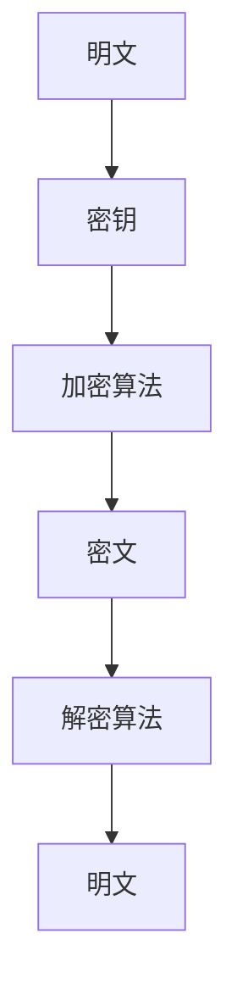
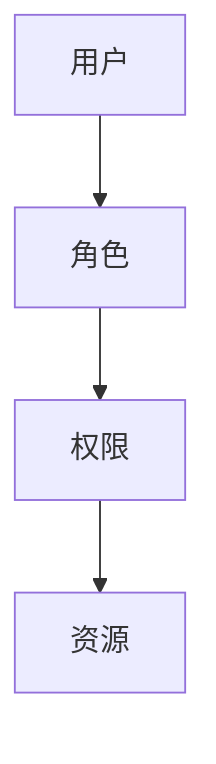
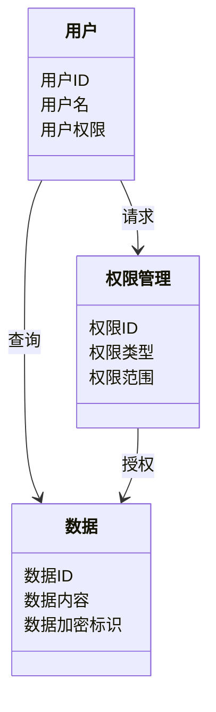
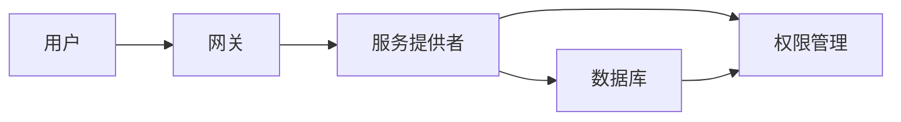
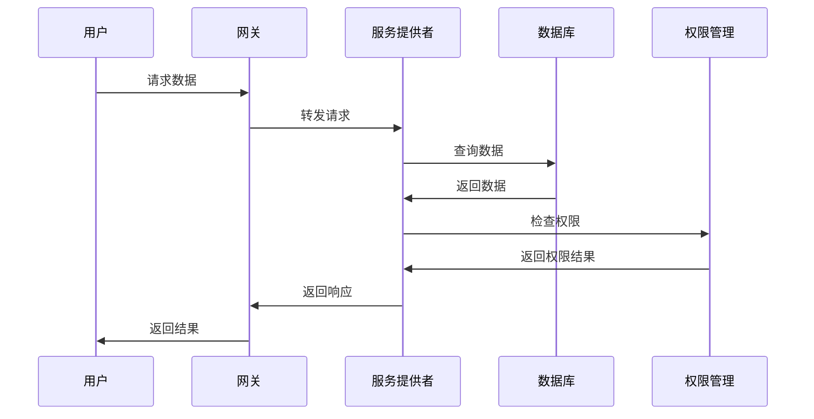

                 


# 确保AI Agent的安全性与隐私保护

> 关键词：AI Agent、安全性、隐私保护、数据加密、访问控制、模型安全、隐私保护技术

> 摘要：本文将深入探讨AI Agent的安全性和隐私保护问题，分析其核心挑战，并提出解决方案。通过背景介绍、核心概念、算法原理、系统架构、项目实战和最佳实践等多角度，详细阐述如何确保AI Agent的安全性和隐私保护，帮助读者全面理解并应对相关技术难题。

---

## 第一部分：AI Agent的安全性与隐私保护背景介绍

### 第1章：AI Agent的基本概念与问题背景

#### 1.1 AI Agent的定义与核心要素

##### 1.1.1 AI Agent的定义
AI Agent（人工智能代理）是一种能够感知环境、自主决策并执行任务的智能实体。它通常具备以下核心功能：感知环境、理解任务目标、制定行动计划、执行任务并适应环境变化。

##### 1.1.2 AI Agent的核心要素
- **感知能力**：通过传感器或其他输入方式获取环境信息。
- **推理能力**：基于感知信息进行逻辑推理，做出决策。
- **执行能力**：通过执行器或其他输出方式实现决策。
- **学习能力**：通过数据或经验优化自身的性能。

##### 1.1.3 AI Agent的类型与应用场景
- **简单反射型AI Agent**：基于规则的简单反应。
- **基于模型的反应型AI Agent**：基于内部模型动态调整行为。
- **目标驱动型AI Agent**：以特定目标为导向。
- **效用驱动型AI Agent**：基于效用函数优化决策。
- **人机协作型AI Agent**：与人类协同工作的AI Agent，如智能助手。

---

#### 1.2 安全性与隐私保护的重要性

##### 1.2.1 AI Agent面临的安全威胁
- **数据泄露**：未经授权的数据访问可能导致隐私泄露。
- **恶意攻击**：攻击者可能通过漏洞控制AI Agent。
- **滥用与欺骗**：AI Agent可能被用于非法目的或被误导。

##### 1.2.2 隐私泄露的风险与影响
- **身份盗窃**：未经授权使用AI Agent可能导致身份盗窃。
- **数据滥用**：收集的个人数据可能被滥用。
- **信任危机**：隐私泄露可能导致用户信任的丧失。

##### 1.2.3 安全性与隐私保护的必要性
- **保护用户隐私**：确保用户数据不被滥用。
- **防止恶意攻击**：保障AI Agent的正常运行。
- **维护系统可信度**：提升用户对AI Agent的信任。

---

### 第2章：AI Agent的安全与隐私问题描述

#### 2.1 数据泄露与滥用问题

##### 2.1.1 数据收集与处理的潜在风险
- **数据收集范围**：AI Agent可能收集大量敏感数据。
- **数据处理流程**：数据处理中的每个环节都可能成为攻击点。

##### 2.1.2 数据滥用的典型案例
- **数据贩卖**：非法收集的数据可能被用于牟利。
- **身份伪造**：利用数据伪造身份进行欺诈。

##### 2.1.3 数据泄露的后果与影响
- **经济损失**：数据泄露可能导致企业经济损失。
- **声誉损害**：数据泄露可能损害企业的声誉。
- **法律责任**：数据泄露可能引发法律诉讼。

---

#### 2.2 恶意攻击与漏洞利用

##### 2.2.1 AI Agent的潜在攻击面
- **软件漏洞**：AI Agent的代码可能存在漏洞。
- **数据接口**：数据接口可能成为攻击点。
- **用户交互**：用户输入可能被利用进行攻击。

##### 2.2.2 恶意攻击的手段与策略
- **注入攻击**：通过输入特殊代码控制AI Agent。
- **拒绝服务攻击（DoS）**：通过大量请求消耗资源。
- **社会工程学攻击**：利用人类的心理弱点进行攻击。

##### 2.2.3 漏洞利用的案例分析
- **典型漏洞案例**：分析已知漏洞案例，总结经验教训。
- **漏洞修复策略**：介绍如何通过代码审查和安全测试发现并修复漏洞。

---

### 第3章：AI Agent的安全性与隐私保护的解决方案

#### 3.1 数据加密与匿名化处理

##### 3.1.1 数据加密技术概述
- **对称加密**：如AES算法，速度快，适合大量数据加密。
- **非对称加密**：如RSA算法，适用于数据签名和加密通信。
- **哈希函数**：如SHA-256，用于数据完整性验证。

##### 3.1.2 数据匿名化的方法与实现
- **数据去标识化**：去除或变形敏感信息。
- **数据脱敏**：对敏感数据进行处理，使其无法还原。

##### 3.1.3 加密与匿名化的优缺点对比
- **优点**：防止数据泄露，保护隐私。
- **缺点**：加密和匿名化处理可能增加计算开销。

---

#### 3.2 访问控制与权限管理

##### 3.2.1 基于角色的访问控制（RBAC）
- **角色定义**：根据用户职责分配角色。
- **权限分配**：基于角色分配访问权限。

##### 3.2.2 基于属性的访问控制（ABAC）
- **属性定义**：根据用户属性（如职位、部门）分配权限。
- **动态权限管理**：权限根据属性动态调整。

##### 3.2.3 权限管理的实现与挑战
- **实现方式**：通过数据库或配置文件管理权限。
- **挑战**：权限冲突、角色继承等复杂问题。

---

#### 3.3 模型安全与对抗攻击防御

##### 3.3.1 模型安全的基本概念
- **模型鲁棒性**：模型在面对攻击时的稳定性。
- **模型隐私保护**：保护模型参数不被窃取。

##### 3.3.2 对抗攻击的防御策略
- **输入预处理**：过滤异常输入。
- **模型增强**：通过训练增强模型的鲁棒性。
- **防御机制**：如检测异常输入并进行过滤。

---

## 第二部分：AI Agent的核心概念与联系

### 第4章：AI Agent的核心概念与联系

#### 4.1 核心概念原理

##### 4.1.1 AI Agent的核心功能模块
- **感知模块**：负责环境感知。
- **推理模块**：负责逻辑推理。
- **执行模块**：负责任务执行。
- **学习模块**：负责优化与学习。

##### 4.1.2 核心概念的数学模型
- **感知模型**：如概率图模型。
- **推理模型**：如逻辑推理框架。
- **执行模型**：如马尔可夫决策过程（MDP）。

---

#### 4.2 核心概念属性特征对比

##### 4.2.1 AI Agent与其他AI模型的对比
| 特性         | AI Agent                 | 其他AI模型（如CNN、RNN） |
|--------------|--------------------------|--------------------------|
| **自主性**    | 高                       | 低                       |
| **交互能力**  | 强                       | 弱                       |
| **适应性**    | 强                       | 中                       |
| **决策能力**  | 强                       | 弱                       |

##### 4.2.2 核心概念的特征分析
- **自主性**：AI Agent能够自主决策，而其他模型通常需要外部干预。
- **交互能力**：AI Agent能够与环境和其他实体进行交互，其他模型则不具备此能力。

---

#### 4.3 AI Agent的ER实体关系图

```mermaid
erDiagram
    actor 用户角色 {
        <属性> 用户ID
        <属性> 用户名
        <属性> 用户权限
    }
    actor 管理员角色 {
        <属性> 管理员ID
        <属性> 管理员名
        <属性> 管理员权限
    }
    entity 数据存储 {
        <属性> 数据ID
        <属性> 数据内容
        <属性> 数据加密标识
    }
    entity 权限控制 {
        <属性> 权限ID
        <属性> 权限类型
        <属性> 权限范围
    }
    用户角色 --> 数据存储 : 查询、修改
    管理员角色 --> 数据存储 : 管理、审核
    用户角色 --> 权限控制 : 请求、分配
    管理员角色 --> 权限控制 : 审批、调整
```

---

## 第三部分：AI Agent的算法原理讲解

### 第5章：AI Agent的算法原理

#### 5.1 数据加密算法

##### 5.1.1 AES加密算法原理



##### 5.1.2 AES算法的Python实现示例

```python
import hashlib

def encrypt_data(data, key):
    # 生成哈希值
    hash_key = hashlib.sha256(key.encode()).hexdigest()
    # 使用哈希值作为AES密钥
    cipher = AES.new(hash_key, AES.MODE_ECB)
    return cipher.encrypt(data)

# 示例用法
data = "这是一个测试数据"
key = "加密密钥"
encrypted_data = encrypt_data(data, key)
print("加密后的数据:", encrypted_data)
```

##### 5.1.3 AES算法的数学模型

$$ \text{加密} = f(\text{明文}, \text{密钥}) $$
$$ \text{解密} = f^{-1}(\text{密文}, \text{密钥}) $$

---

#### 5.2 访问控制算法

##### 5.2.1 RBAC模型的实现



##### 5.2.2 RBAC模型的Python实现示例

```python
class RoleBasedAccessControl:
    def __init__(self):
        self.role_permissions = {
            'admin': ['read', 'write', 'delete'],
            'user': ['read']
        }

    def has_permission(self, user, action, resource):
        # 获取用户角色
        role = self.get_role(user)
        # 检查权限
        if action in self.role_permissions.get(role, []):
            return True
        return False

    def get_role(self, user):
        # 简单示例，根据用户分配角色
        if user == 'admin':
            return 'admin'
        return 'user'

# 示例用法
access_control = RoleBasedAccessControl()
print(access_control.has_permission('admin', 'write', 'data'))
print(access_control.has_permission('user', 'delete', 'data'))
```

---

## 第四部分：AI Agent的系统分析与架构设计

### 第6章：AI Agent的系统分析与架构设计

#### 6.1 系统功能设计

##### 6.1.1 领域模型类图



---

#### 6.2 系统架构设计

##### 6.2.1 系统架构图



---

#### 6.3 系统接口设计

##### 6.3.1 系统接口设计



---

## 第五部分：AI Agent的项目实战

### 第7章：AI Agent的项目实战

#### 7.1 环境安装

##### 7.1.1 系统环境要求
- **操作系统**：建议使用Linux或macOS。
- **Python版本**：建议使用Python 3.6或以上。
- **依赖库**：如AES加密库、RBAC库。

##### 7.1.2 安装依赖
```bash
pip install pyaes python-dotenv
```

---

#### 7.2 核心代码实现

##### 7.2.1 数据加密模块

```python
import pyaes

def encrypt(data, key):
    aes = pyaes.AES(key)
    return aes.encrypt(data)

def decrypt(encrypted_data, key):
    aes = pyaes.AES(key)
    return aes.decrypt(encrypted_data)
```

##### 7.2.2 权限管理模块

```python
class RoleBasedAccessControl:
    def __init__(self):
        self.role_permissions = {
            'admin': ['read', 'write', 'delete'],
            'user': ['read']
        }

    def has_permission(self, user, action, resource):
        role = self.get_role(user)
        return action in self.role_permissions.get(role, [])

    def get_role(self, user):
        if user == 'admin':
            return 'admin'
        return 'user'
```

---

#### 7.3 代码解读与分析

##### 7.3.1 数据加密模块解读
- **加密函数**：将明文数据加密为密文。
- **解密函数**：将密文数据解密为明文。

##### 7.3.2 权限管理模块解读
- **RBAC模型**：基于角色的访问控制，确保用户只能执行其角色允许的操作。

---

#### 7.4 案例分析与实现

##### 7.4.1 案例分析
- **场景**：用户请求访问数据。
- **步骤**：
  1. 用户向系统发起请求。
  2. 系统检查用户权限。
  3. 系统根据权限决定是否允许访问。

##### 7.4.2 实现步骤
1. **安装依赖**：安装所需的Python库。
2. **编写代码**：实现数据加密和权限管理功能。
3. **测试功能**：通过测试案例验证功能。

---

## 第六部分：AI Agent的最佳实践

### 第8章：AI Agent的最佳实践

#### 8.1 最佳实践

##### 8.1.1 数据匿名化与加密
- **数据匿名化**：在数据存储前进行匿名化处理。
- **数据加密**：对敏感数据进行加密存储。

##### 8.1.2 权限管理
- **最小权限原则**：确保用户仅拥有完成任务所需的最小权限。
- **定期审计**：定期审查权限设置，发现并修复潜在问题。

##### 8.1.3 安全审计与监控
- **安全审计**：定期进行安全审计，发现潜在问题。
- **实时监控**：实时监控系统行为，发现异常及时处理。

---

#### 8.2 小结

##### 8.2.1 章节内容总结
- **安全性与隐私保护**：确保AI Agent的安全性和隐私保护是构建可靠系统的基石。
- **技术实现**：通过数据加密、访问控制等技术手段实现安全性与隐私保护。
- **最佳实践**：遵循最佳实践，确保系统的安全性和隐私保护。

---

## 第七部分：注意事项与拓展阅读

### 第9章：注意事项与拓展阅读

#### 9.1 注意事项

##### 9.1.1 安全性与隐私保护的平衡
- **安全性**：确保系统安全，防止数据泄露。
- **隐私保护**：保护用户隐私，遵循相关法律法规。

##### 9.1.2 技术实现的挑战
- **复杂性**：安全性与隐私保护的实现可能较为复杂。
- **性能影响**：某些安全措施可能会影响系统性能。

---

#### 9.2 拓展阅读

##### 9.2.1 推荐书籍
- 《深入理解OAuth 2.0》
- 《加密与隐私保护技术详解》

##### 9.2.2 技术博客与资源
- [OWASP官方文档](https://owasp.org/)
- [GDPR合规指南](https://gdpr-info.eu/)

---

## 作者

**作者：AI天才研究院/AI Genius Institute & 禅与计算机程序设计艺术 /Zen And The Art of Computer Programming**

---

这篇文章详细介绍了AI Agent的安全性和隐私保护问题，从背景介绍、核心概念、算法原理、系统架构、项目实战到最佳实践，全面覆盖了确保AI Agent安全性的各个方面。通过本文的讲解，读者可以深入了解AI Agent的安全性与隐私保护技术，并能够实际应用于相关项目中。

