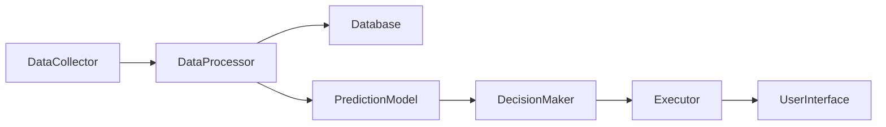

                 


# AI Agent在智能冰箱中的食材管理

> 关键词：AI Agent，智能冰箱，食材管理，物联网，智能家居，人工智能

> 摘要：本文深入探讨了AI Agent在智能冰箱中的食材管理应用，从核心概念到算法实现，再到系统架构设计，结合实际项目案例，全面分析了AI Agent如何优化食材管理流程，提升用户体验。文章内容涵盖AI Agent的基本原理、食材管理的数学模型、系统架构设计、项目实战及最佳实践，为技术开发者和研究人员提供了丰富的参考资料。

---

# 第1章: AI Agent与智能冰箱概述

## 1.1 AI Agent的基本概念

### 1.1.1 AI Agent的定义与特点
- **定义**：AI Agent（人工智能代理）是一种能够感知环境并采取行动以实现目标的智能实体。
- **特点**：
  - **自主性**：能够在没有外部干预的情况下独立运行。
  - **反应性**：能够实时感知环境变化并做出响应。
  - **目标导向性**：所有行为均以实现特定目标为导向。
  - **学习能力**：通过数据和经验不断优化自身行为。

### 1.1.2 AI Agent的核心功能与应用场景
- **核心功能**：
  - 数据采集与处理
  - 状态感知与分析
  - 决策与执行
  - 学习与优化
- **应用场景**：
  - 智能家居
  - 智能交通
  - 智能医疗

### 1.1.3 智能冰箱的概念与发展趋势
- **概念**：智能冰箱是一种集成物联网技术的家电设备，能够通过传感器和AI技术实现对食材的智能管理。
- **发展趋势**：
  - 智能化：通过AI技术提升食材管理效率。
  - 网络化：与智能家居系统无缝集成，实现数据互通。
  - 用户化：根据用户习惯提供个性化服务。

## 1.2 智能冰箱的食材管理需求

### 1.2.1 食材管理的基本问题与挑战
- **问题**：
  - 食材库存的动态管理
  - 食材消耗的预测与推荐
  - 食材存储条件的监控
- **挑战**：
  - 数据采集的准确性
  - 算法的实时性与高效性
  - 用户需求的多样性

### 1.2.2 用户对智能食材管理的核心需求
- **需求**：
  - 自动化管理：无需手动录入食材信息。
  - 智能推荐：根据食材库存推荐食谱或购买清单。
  - 实时监控：随时查看食材状态，避免浪费。
  - 个性化服务：根据用户的饮食习惯提供定制化建议。

### 1.2.3 智能冰箱食材管理的边界与外延
- **边界**：
  - 仅限于食材的存储与消耗管理。
  - 不涉及食材的烹饪过程。
- **外延**：
  - 与智能家居系统的联动。
  - 与超市、电商平台的库存同步。

## 1.3 AI Agent在智能冰箱中的作用

### 1.3.1 AI Agent如何解决食材管理问题
- **数据采集与处理**：通过传感器采集食材信息，如重量、温度、湿度等。
- **状态感知与分析**：实时监控食材状态，预测食材的剩余保质期。
- **决策与执行**：根据食材状态和用户需求，自动执行操作，如提醒购买、调整存储条件。

### 1.3.2 AI Agent在智能冰箱中的核心功能
- **食材库存管理**：
  - 自动记录食材的种类、数量和保质期。
  - 动态更新食材库存，确保数据的准确性。
- **食材消耗预测**：
  - 基于历史数据预测食材的消耗速度。
  - 提供食材的使用建议，避免浪费。
- **食材推荐**：
  - 根据用户饮食习惯推荐食谱。
  - 提供超市购物清单，优化采购计划。

### 1.3.3 AI Agent与其他智能设备的协同工作
- **协同方式**：
  - 与智能家居系统联动，如智能音箱、智能灶具。
  - 与超市、电商平台的数据互通，实现无缝连接。
- **应用场景**：
  - 购物清单自动同步到超市。
  - 根据食材状态调整家电运行参数。

## 1.4 本章小结
本章介绍了AI Agent的基本概念及其在智能冰箱中的作用，重点分析了智能冰箱食材管理的核心需求和AI Agent的解决方案。通过本章的学习，读者可以理解AI Agent在智能冰箱食材管理中的重要性。

---

# 第2章: AI Agent与食材管理的核心概念

## 2.1 AI Agent的核心原理

### 2.1.1 AI Agent的基本工作原理
- **感知环境**：通过传感器、摄像头等设备采集环境数据。
- **分析数据**：利用机器学习算法对数据进行分析和处理。
- **决策与行动**：基于分析结果制定决策并执行行动。

### 2.1.2 AI Agent的感知与决策机制
- **感知机制**：
  - 数据采集：通过多种传感器获取食材信息。
  - 数据融合：整合多源数据，提高感知准确性。
- **决策机制**：
  - 状态评估：评估当前食材状态。
  - 预测与推荐：基于历史数据和用户需求，预测食材消耗并推荐解决方案。

### 2.1.3 AI Agent的学习与优化能力
- **学习机制**：
  - 监督学习：基于标注数据进行模型训练。
  - 强化学习：通过奖励机制优化决策策略。
  - 迁移学习：将已有的知识迁移到新的应用场景。
- **优化能力**：
  - 模型优化：通过参数调优提升算法性能。
  - 在线学习：实时更新模型，适应环境变化。

## 2.2 食材管理的核心要素

### 2.2.1 食材信息的采集与处理
- **数据采集**：
  - 重量传感器：监测食材重量变化。
  - 温度传感器：监控食材存储温度。
  - 湿度传感器：检测食材存储环境湿度。
- **数据处理**：
  - 数据清洗：去除噪声数据。
  - 数据存储：将处理后的数据存储在数据库中。

### 2.2.2 食材库存的动态管理
- **库存模型**：
  - 时间序列模型：预测食材的消耗速度。
  - 状态转移模型：分析食材状态的变化。
- **库存更新**：
  - 自动更新：实时更新食材库存信息。
  - 手动调整：用户手动修改库存数据。

### 2.2.3 食材消耗的预测与推荐
- **预测模型**：
  - ARIMA模型：基于历史数据预测未来趋势。
  - LSTM模型：利用循环神经网络捕捉时间序列数据中的模式。
- **推荐策略**：
  - 基于规则的推荐：根据食材保质期推荐优先消耗的食材。
  - 基于协同过滤的推荐：根据用户历史行为推荐食谱。

## 2.3 AI Agent与食材管理的关联性分析

### 2.3.1 AI Agent在食材管理中的角色定位
- **感知层**：
  - 数据采集与处理。
  - 状态监控与分析。
- **决策层**：
  - 食材消耗预测。
  - 用户需求分析。
- **执行层**：
  - 自动调整存储条件。
  - 提醒用户进行操作。

### 2.3.2 AI Agent与食材管理系统的交互流程
1. **数据采集**：传感器采集食材信息。
2. **数据分析**：AI Agent分析食材状态。
3. **决策制定**：根据分析结果制定决策。
4. **执行操作**：AI Agent执行决策操作。
5. **反馈优化**：根据执行结果优化模型。

### 2.3.3 AI Agent在食材管理中的价值体现
- **提升效率**：通过自动化管理减少人工干预。
- **降低浪费**：通过精准预测和推荐减少食材浪费。
- **优化体验**：为用户提供个性化服务，提升用户体验。

## 2.4 本章小结
本章详细介绍了AI Agent的核心原理及其在食材管理中的应用，分析了食材管理的核心要素和AI Agent在其中的作用。通过本章的学习，读者可以理解AI Agent如何通过感知、决策和执行实现食材管理的自动化和智能化。

---

# 第3章: AI Agent在食材管理中的数学模型与算法

## 3.1 食材管理的数学模型

### 3.1.1 食材库存的动态模型
- **模型描述**：
  - 描述食材库存随时间的变化情况。
  - 假设食材消耗速度与时间相关。
- **模型公式**：
  $$ I(t) = I(t-1) - c \times t $$
  其中，$I(t)$ 表示第 $t$ 天的库存量，$c$ 表示消耗速度。

### 3.1.2 食材消耗的预测模型
- **模型描述**：
  - 使用时间序列模型预测食材消耗量。
  - 假设食材消耗量与时间相关。
- **模型公式**：
  $$ \hat{y}(t) = \alpha y(t-1) + (1-\alpha)y(t-2) $$
  其中，$\alpha$ 是平滑因子，$y(t)$ 表示第 $t$ 天的消耗量。

### 3.1.3 食材推荐的优化模型
- **模型描述**：
  - 使用协同过滤算法推荐食材。
  - 假设用户需求与历史行为相关。
- **模型公式**：
  $$ similarity(u, v) = \frac{\sum_{i=1}^{n} (r_ui - \bar{r_u})(r_vi - \bar{r_v})}{\sqrt{\sum_{i=1}^{n} (r_ui - \bar{r_u})^2} \sqrt{\sum_{i=1}^{n} (r_vi - \bar{r_v})^2}} $$
  其中，$similarity(u, v)$ 表示用户 $u$ 和用户 $v$ 的相似度，$r_ui$ 表示用户 $u$ 对物品 $i$ 的评分，$\bar{r_u}$ 表示用户 $u$ 的平均评分。

## 3.2 AI Agent的算法原理

### 3.2.1 基于机器学习的食材预测算法
- **算法描述**：
  - 使用随机森林算法预测食材的消耗速度。
  - 输入特征包括食材种类、存储时间、温度等。
- **算法实现**：
  ```python
  from sklearn.ensemble import RandomForestRegressor
  import pandas as pd

  # 数据预处理
  data = pd.read_csv('食材数据.csv')
  features = data[['食材种类', '存储时间', '温度']]
  target = data['消耗速度']

  # 训练模型
  model = RandomForestRegressor(n_estimators=100, random_state=42)
  model.fit(features, target)

  # 预测结果
  predicted = model.predict(features)
  ```

### 3.2.2 基于强化学习的决策优化算法
- **算法描述**：
  - 使用Q-learning算法优化食材管理策略。
  - 状态空间包括食材库存、用户需求等。
  - 动作空间包括购买、消耗、调整存储条件等。
- **算法实现**：
  ```python
  import numpy as np

  class QLearningAgent:
      def __init__(self, states, actions, alpha=0.1, gamma=0.9):
          self.q_table = {s: {a: 0 for a in actions} for s in states}
          self.alpha = alpha
          self.gamma = gamma

      def choose_action(self, state):
          return np.random.choice(list(self.q_table[state].keys()))

      def learn(self, state, action, reward, next_state):
          current_q = self.q_table[state][action]
          next_max_q = max(self.q_table[next_state].values())
          self.q_table[state][action] = current_q + self.alpha * (reward + self.gamma * next_max_q - current_q)

  # 示例应用
  states = ['库存充足', '库存不足']
  actions = ['购买', '消耗']
  agent = QLearningAgent(states, actions)
  agent.learn('库存不足', '购买', reward=1, next_state='库存充足')
  ```

### 3.2.3 基于规则引擎的食材管理策略
- **规则引擎描述**：
  - 使用规则引擎制定食材管理策略。
  - 规则示例：
    - 如果某食材的保质期剩余天数小于3天，则提醒用户尽快消耗。
    - 如果某食材的库存量低于最低阈值，则自动添加到购物清单中。
- **规则引擎实现**：
  ```python
  from pyrules import Rule, Ruleset

  class FoodManagementRules(Ruleset):
      @Rule('当保质期剩余天数 < 3')
      def remind_to_use(self, food):
          print(f'提醒：{food} 的保质期剩余不足3天，请尽快使用。')

      @Rule('当库存量 < 最低阈值')
      def add_to_shopping_list(self, food):
          print(f'自动添加：{food} 已添加到购物清单中。')

  # 示例应用
  ruleset = FoodManagementRules()
  ruleset.remind_to_use('牛奶')
  ```

## 3.3 本章小结
本章详细介绍了食材管理的数学模型和AI Agent的算法原理，包括基于机器学习的预测算法、基于强化学习的决策优化算法和基于规则引擎的管理策略。通过具体的代码示例和公式推导，读者可以深入理解这些算法的实现原理和应用场景。

---

# 第4章: AI Agent食材管理系统架构设计

## 4.1 系统架构概述

### 4.1.1 系统整体架构设计
- **分层架构**：
  - **感知层**：负责数据的采集与传输。
  - **计算层**：负责数据的分析与处理。
  - **执行层**：负责决策的执行与反馈。
- **组件划分**：
  - 数据采集模块：负责采集食材信息。
  - 数据处理模块：负责数据的清洗与存储。
  - 决策模块：负责食材的预测与推荐。
  - 执行模块：负责决策的执行与反馈。

### 4.1.2 系统模块划分与功能分配
- **数据采集模块**：
  - 负责通过传感器采集食材信息。
  - 输出：食材的重量、温度、湿度等数据。
- **数据处理模块**：
  - 负责数据的清洗与预处理。
  - 输出：结构化的食材信息。
- **决策模块**：
  - 负责食材的预测与推荐。
  - 输出：预测结果和推荐方案。
- **执行模块**：
  - 负责决策的执行，如提醒用户、调整存储条件等。
  - 输出：执行结果反馈。

### 4.1.3 系统的可扩展性与灵活性设计
- **可扩展性**：
  - 支持多种传感器类型。
  - 支持多种算法模型的集成。
- **灵活性**：
  - 支持多种用户需求。
  - 支持多种存储条件的调整。

## 4.2 系统功能设计

### 4.2.1 食材信息采集模块
- **功能描述**：
  - 通过传感器采集食材的重量、温度、湿度等信息。
  - 支持多种传感器类型，如重量传感器、温度传感器、湿度传感器。
- **数据流图**：
  ```mermaid
  graph TD
      Sensor --> DataCollector
      DataCollector --> DataProcessor
  ```

### 4.2.2 食材库存管理模块
- **功能描述**：
  - 实时更新食材库存信息。
  - 提供食材的库存查询功能。
  - 支持手动调整库存数据。
- **数据流图**：
  ```mermaid
  graph TD
      DataProcessor --> InventoryManager
      InventoryManager --> Database
  ```

### 4.2.3 食材消耗预测模块
- **功能描述**：
  - 基于历史数据预测食材的消耗速度。
  - 提供食材的消耗趋势分析。
  - 支持多种预测模型的选择与切换。
- **数据流图**：
  ```mermaid
  graph TD
      Database --> PredictionModel
      PredictionModel --> DecisionMaker
  ```

### 4.2.4 用户需求分析模块
- **功能描述**：
  - 分析用户的饮食习惯和偏好。
  - 提供个性化的食材推荐。
  - 支持用户的个性化设置。
- **数据流图**：
  ```mermaid
  graph TD
      UserBehavior --> UserAnalyzer
      UserAnalyzer --> DecisionMaker
  ```

## 4.3 系统架构设计

### 4.3.1 系统整体架构图


### 4.3.2 系统功能模块划分
- **数据采集模块**：
  - 数据采集
  - 数据清洗
- **数据处理模块**：
  - 数据存储
  - 数据分析
- **决策模块**：
  - 预测模型
  - 决策逻辑
- **执行模块**：
  - 执行操作
  - 反馈优化

## 4.4 系统接口设计

### 4.4.1 系统接口设计
- **数据采集接口**：
  - 输入：食材信息
  - 输出：结构化的数据
- **预测模型接口**：
  - 输入：历史数据
  - 输出：预测结果
- **决策模块接口**：
  - 输入：预测结果和用户需求
  - 输出：决策指令
- **执行模块接口**：
  - 输入：决策指令
  - 输出：执行结果

### 4.4.2 系统交互流程
1. **数据采集**：传感器采集食材信息。
2. **数据处理**：数据处理模块清洗和存储数据。
3. **预测分析**：预测模型基于历史数据进行预测。
4. **决策制定**：决策模块根据预测结果和用户需求制定决策。
5. **执行操作**：执行模块根据决策指令执行操作。
6. **反馈优化**：根据执行结果优化模型。

## 4.5 本章小结
本章详细介绍了AI Agent食材管理系统的架构设计，包括系统整体架构、功能模块划分、接口设计和交互流程。通过本章的学习，读者可以理解系统的整体结构和各模块之间的关系。

---

# 第5章: AI Agent食材管理系统的项目实战

## 5.1 项目环境安装

### 5.1.1 环境需求
- **硬件需求**：
  - 智能冰箱（集成传感器和物联网模块）
  - 个人计算机
  - 网络连接
- **软件需求**：
  - Python编程语言
  - 数据库（如MySQL、MongoDB）
  - 机器学习框架（如Scikit-learn、TensorFlow）
  - 规则引擎框架（如PyRules）

### 5.1.2 环境安装步骤
1. **安装Python**：
   ```bash
   # 下载并安装Python 3.8或更高版本
   ```
2. **安装机器学习库**：
   ```bash
   pip install scikit-learn tensorflow
   ```
3. **安装规则引擎库**：
   ```bash
   pip install pyrules
   ```
4. **安装数据库**：
   ```bash
   # 安装MySQL
   brew install mysql
   # 或者安装MongoDB
   brew install mongodb
   ```

## 5.2 系统核心代码实现

### 5.2.1 食材数据采集模块
```python
import serial

class FoodSensor:
    def __init__(self, port='COM3', baudrate=9600):
        self.port = port
        self.baudrate = baudrate
        self.sensor = None

    def connect(self):
        try:
            self.sensor = serial.Serial(self.port, self.baudrate)
            print(f"连接到 {self.port} 成功。")
        except Exception as e:
            print(f"连接失败：{e}")

    def read_data(self):
        if self.sensor.is_open:
            data = self.sensor.readline().decode('utf-8').strip()
            return data
        else:
            print("传感器未连接。")
            return None
```

### 5.2.2 预测模型实现
```python
from sklearn.ensemble import RandomForestRegressor

class FoodPredictor:
    def __init__(self):
        self.model = RandomForestRegressor(n_estimators=100, random_state=42)

    def train(self, features, target):
        self.model.fit(features, target)

    def predict(self, features):
        return self.model.predict(features)
```

### 5.2.3 决策模块实现
```python
from pyrules import Rule, Ruleset

class FoodDecisionRules(Ruleset):
    @Rule('当保质期剩余天数 < 3')
    def remind_to_use(self, food):
        print(f'提醒：{food} 的保质期剩余不足3天，请尽快使用。')

    @Rule('当库存量 < 最低阈值')
    def add_to_shopping_list(self, food):
        print(f'自动添加：{food} 已添加到购物清单中。')
```

## 5.3 项目实战案例分析

### 5.3.1 案例背景
- **用户需求**：
  - 用户希望自动管理食材库存。
  - 用户希望根据食材消耗情况自动推荐食谱。
- **系统功能**：
  - 实时监控食材库存。
  - 预测食材消耗速度。
  - 自动推荐食谱。

### 5.3.2 案例实现
```python
from food_sensor import FoodSensor
from food_predictor import FoodPredictor
from food_decision_rules import FoodDecisionRules

# 初始化传感器
sensor = FoodSensor(port='COM3')
sensor.connect()

# 初始化预测模型
predictor = FoodPredictor()
predictor.train(features, target)

# 初始化决策规则
ruleset = FoodDecisionRules()
ruleset.remind_to_use('牛奶')
```

### 5.3.3 案例分析
- **数据采集**：
  - 传感器采集食材信息。
- **数据处理**：
  - 数据清洗和预处理。
- **预测分析**：
  - 预测食材消耗速度。
- **决策制定**：
  - 根据预测结果制定决策。
- **执行操作**：
  - 提醒用户尽快使用临近保质期的食材。
  - 自动添加缺少的食材到购物清单。

## 5.4 项目总结
通过本章的项目实战，读者可以了解AI Agent食材管理系统的实现过程，包括环境安装、核心代码实现和实际案例分析。通过实际操作，读者可以掌握AI Agent在食材管理中的具体应用。

---

# 第6章: 最佳实践与注意事项

## 6.1 最佳实践

### 6.1.1 数据采集的准确性
- **建议**：
  - 使用高精度传感器。
  - 定期校准传感器。
  - 多源数据融合。

### 6.1.2 算法的实时性与高效性
- **建议**：
  - 使用轻量级算法。
  - 优化算法复杂度。
  - 并行计算加速。

### 6.1.3 系统的可扩展性与灵活性
- **建议**：
  - 使用模块化设计。
  - 支持多种传感器类型。
  - 支持多种算法模型的切换。

## 6.2 注意事项

### 6.2.1 数据隐私与安全
- **建议**：
  - 数据加密存储。
  - 权限控制访问。
  - 数据备份与恢复。

### 6.2.2 系统稳定性与可靠性
- **建议**：
  - 定期系统维护。
  - 建立容错机制。
  - 实时监控系统状态。

### 6.2.3 用户体验与易用性
- **建议**：
  - 简化用户操作。
  - 提供友好的用户界面。
  - 支持多种用户需求。

## 6.3 本章小结
本章总结了AI Agent食材管理系统的最佳实践和注意事项，帮助读者在实际应用中避免常见问题，提升系统的稳定性和用户体验。

---

# 第7章: 小结与展望

## 7.1 小结
本文全面探讨了AI Agent在智能冰箱中的食材管理应用，从核心概念到算法实现，再到系统架构设计，结合实际项目案例，详细分析了AI Agent如何优化食材管理流程，提升用户体验。通过本文的学习，读者可以理解AI Agent在食材管理中的重要性。

## 7.2 展望
随着人工智能技术的不断发展，AI Agent在智能冰箱中的应用将更加广泛和深入。未来的研究方向可能包括：
- 更智能的预测算法。
- 更高效的决策机制。
- 更人性化的用户界面。
- 更广泛的应用场景。

通过不断的优化与创新，AI Agent将在智能冰箱食材管理中发挥更大的作用，为用户带来更智能、更便捷的生活体验。

---

# 作者：AI天才研究院/AI Genius Institute & 禅与计算机程序设计艺术 /Zen And The Art of Computer Programming

