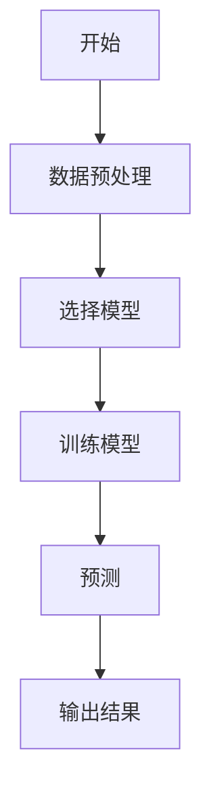
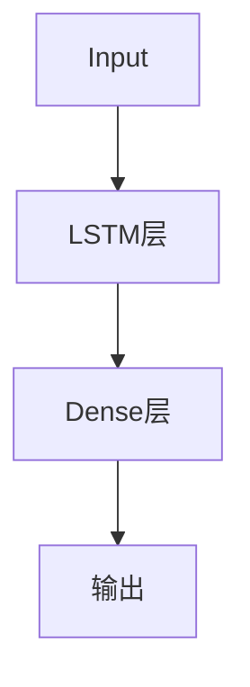
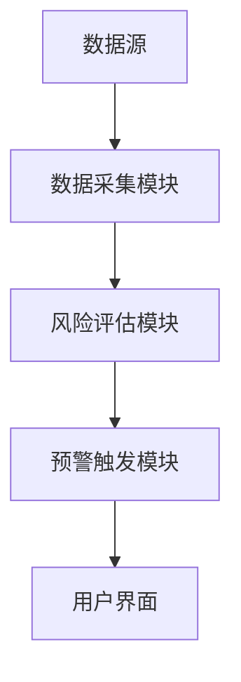
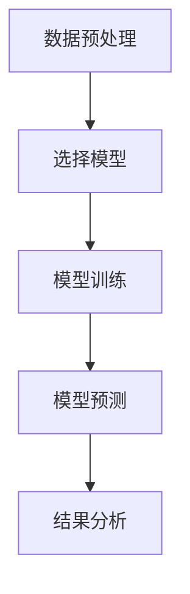
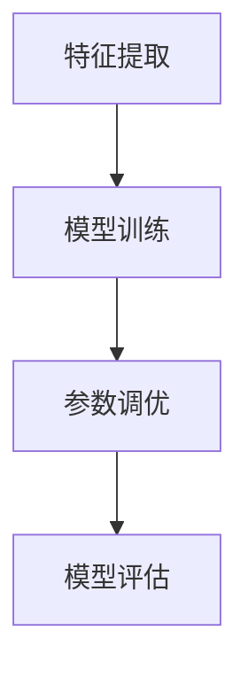
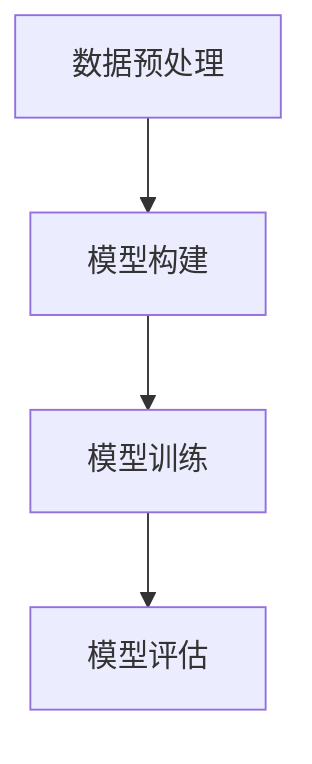
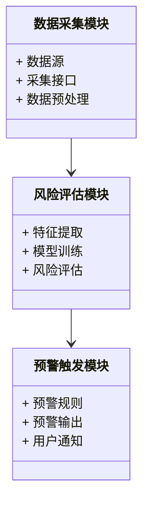
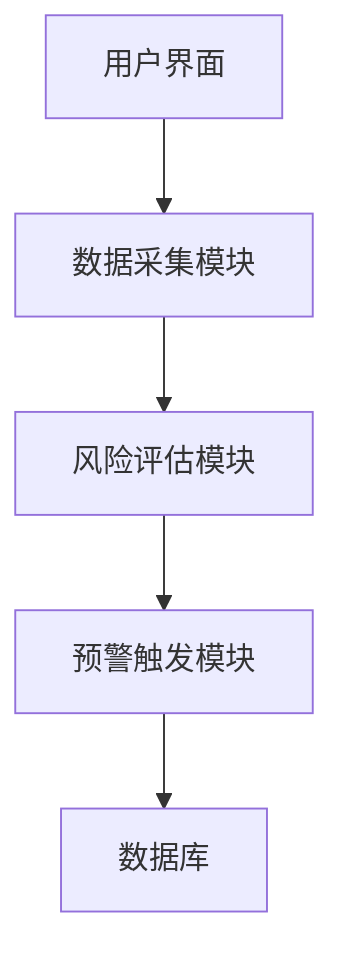
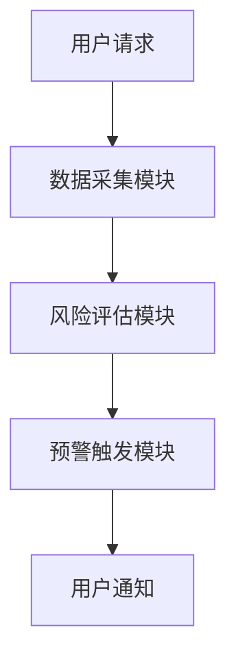

                 


# AI驱动的自适应投资风险预警

## 关键词：
- AI
- 投资风险
- 自适应预警系统
- 机器学习
- 时间序列分析
- 深度学习
- 风险管理

## 摘要：
随着金融市场的复杂化和波动性增加，传统投资风险管理方法逐渐暴露出局限性。本文将深入探讨如何利用人工智能技术构建自适应投资风险预警系统，通过实时数据分析和智能模型预测，实现对潜在风险的早期识别和干预。文章将从核心概念、算法原理、系统架构到项目实战，全面解析AI驱动的自适应投资风险预警的实现过程，帮助读者掌握这一前沿技术的核心思想和实际应用。

---

# 第一部分: AI驱动的自适应投资风险预警背景与概念

## 第1章: AI驱动的自适应投资风险预警概述

### 1.1 投资风险管理的背景与挑战

#### 1.1.1 投资风险管理的基本概念
投资风险管理是指通过识别、评估和应对可能影响投资组合收益的各种风险因素，以实现资产保值和收益最大化的管理过程。传统的投资风险管理方法依赖于历史数据分析和统计模型，但其局限性日益显现。

#### 1.1.2 传统投资风险管理的局限性
- **数据依赖性**：传统方法依赖于历史数据，难以捕捉新兴风险因素。
- **反应滞后性**：基于历史数据的模型无法实时捕捉市场波动。
- **规则 rigidity**：固定的规则无法适应市场的动态变化。

#### 1.1.3 AI技术在投资风险管理中的应用前景
AI技术通过深度学习、自然语言处理和时间序列分析等方法，能够实时处理海量数据，捕捉市场波动中的非线性关系，为投资风险管理提供更精准的工具。

### 1.2 自适应投资风险预警的定义与特点

#### 1.2.1 自适应投资风险预警的定义
自适应投资风险预警是一种基于AI技术的动态风险管理方法，通过实时数据分析和模型自适应调整，实现对投资组合风险的实时监控和预警。

#### 1.2.2 自适应预警的核心特点
- **实时性**：能够实时处理市场数据，快速识别潜在风险。
- **自适应性**：模型能够根据市场变化自动调整参数和结构。
- **智能化**：通过AI算法，实现对复杂市场环境的深度理解。

#### 1.2.3 自适应预警与传统预警的对比
| 特性               | 自适应预警                     | 传统预警                     |
|--------------------|-------------------------------|------------------------------|
| 数据处理能力       | 强大，支持实时和非结构化数据   | 较弱，依赖历史和结构化数据   |
| 模型调整能力       | 自动调整，适应市场变化         | 需人工调整，固定规则         |
| 预警效果           | 更精准，捕捉复杂风险模式       | 较粗糙，难以应对新兴风险     |

### 1.3 自适应投资风险预警的核心要素

#### 1.3.1 数据源的多样性
自适应预警系统需要整合多种数据源，包括市场数据、新闻 sentiment、公司财务数据等。

#### 1.3.2 AI算法的实时性
采用高效的AI算法，能够在短时间内完成数据处理和模型预测。

#### 1.3.3 预警系统的可扩展性
系统架构设计需支持数据量和复杂度的动态扩展。

### 1.4 本章小结
本章介绍了AI驱动的自适应投资风险预警的背景、定义和核心特点，强调了AI技术在投资风险管理中的重要性。

---

# 第二部分: AI驱动的自适应投资风险预警的核心概念与理论基础

## 第2章: 自适应投资风险预警的核心概念

### 2.1 自适应投资风险预警的理论基础

#### 2.1.1 数据驱动的风险分析
通过分析海量数据，识别潜在风险因素及其相互关系。

#### 2.1.2 AI算法的风险预测
利用机器学习和深度学习算法，预测市场波动和风险事件。

#### 2.1.3 自适应模型的构建
通过动态调整模型参数，使其适应市场环境的变化。

### 2.2 自适应投资风险预警的数学模型

#### 2.2.1 时间序列分析模型
时间序列分析是一种基于历史数据预测未来趋势的方法，常用模型包括ARIMA和GARCH。

##### 使用Mermaid进行时间序列分析流程图


#### 2.2.2 机器学习模型
机器学习模型（如随机森林和XGBoost）适用于分类和回归任务，能够捕捉数据中的非线性关系。

##### 使用Python实现的随机森林示例
```python
from sklearn.ensemble import RandomForestClassifier
import pandas as pd

# 加载数据
data = pd.read_csv('risk_data.csv')

# 特征和目标变量
X = data.drop('risk_label', axis=1)
y = data['risk_label']

# 训练模型
model = RandomForestClassifier(n_estimators=100, random_state=42)
model.fit(X, y)

# 预测
predictions = model.predict(X)
```

#### 2.2.3 深度学习模型
深度学习模型（如LSTM）能够捕捉时间序列数据中的长-term依赖关系。

##### LSTM网络结构图


### 2.3 自适应投资风险预警的系统架构

#### 2.3.1 数据采集模块
负责收集市场数据、新闻 sentiment等信息。

#### 2.3.2 风险评估模块
利用AI模型对数据进行分析，评估潜在风险。

#### 2.3.3 预警触发模块
根据评估结果，触发预警信号。

##### 使用Mermaid进行系统架构图


### 2.4 本章小结
本章详细介绍了自适应投资风险预警的核心概念和理论基础，包括数据驱动分析、AI算法和系统架构设计。

---

# 第三部分: AI驱动的自适应投资风险预警的算法原理

## 第3章: 时间序列分析算法

### 3.1 时间序列分析的基本原理

#### 3.1.1 时间序列的定义与特征
时间序列是指按照时间顺序排列的数据点，具有趋势、季节性和随机性等特征。

#### 3.1.2 时间序列分析的方法
常用方法包括移动平均法、指数平滑法和ARIMA模型。

##### 使用Mermaid进行时间序列分析流程图


#### 3.1.3 时间序列分析的Python实现
```python
import statsmodels.api as sm

# 加载数据
data = pd.read_csv('time_series.csv')

# 训练ARIMA模型
model = sm.tsa.ARIMA(data, order=(5, 1, 0))
model_fit = model.fit()

# 预测未来值
forecast = model_fit.forecast(steps=5)
print(forecast)
```

## 第4章: 机器学习模型

### 4.1 机器学习模型的基本原理

#### 4.1.1 机器学习模型的分类
包括监督学习、无监督学习和半监督学习。

#### 4.1.2 机器学习模型的训练过程
包括特征提取、模型训练和参数调优。

##### 使用Mermaid进行机器学习流程图


### 4.2 机器学习模型的Python实现

#### 4.2.1 使用XGBoost进行风险预测
```python
import xgboost as xgb

# 加载数据
data = pd.read_csv('risk_data.csv')

# 特征和目标变量
X = data.drop('risk_label', axis=1)
y = data['risk_label']

# 训练模型
model = xgb.XGBClassifier(n_estimators=100, learning_rate=0.1)
model.fit(X, y)

# 预测
predictions = model.predict(X)
```

## 第5章: 深度学习模型

### 5.1 深度学习模型的基本原理

#### 5.1.1 深度学习模型的结构
包括卷积神经网络（CNN）、循环神经网络（RNN）和长短期记忆网络（LSTM）。

#### 5.1.2 深度学习模型的训练过程
包括数据预处理、模型构建、训练和评估。

##### 使用Mermaid进行深度学习流程图


### 5.2 深度学习模型的Python实现

#### 5.2.1 使用LSTM进行时间序列预测
```python
import tensorflow as tf
from tensorflow.keras.layers import LSTM, Dense

# 加载数据
data = pd.read_csv('time_series.csv')

# 构建LSTM模型
model = tf.keras.Sequential()
model.add(LSTM(50, input_shape=(None, 1)))
model.add(Dense(1))
model.compile(loss='mean_squared_error', optimizer='adam')

# 训练模型
model.fit(X_train, y_train, epochs=50, batch_size=32)
```

---

# 第四部分: 系统分析与架构设计方案

## 第6章: 系统分析与架构设计

### 6.1 问题场景介绍
我们设计一个自适应投资风险预警系统，用于实时监控股票市场波动，预测潜在风险。

### 6.2 系统功能设计

#### 6.2.1 领域模型设计


### 6.3 系统架构设计

#### 6.3.1 系统架构图


### 6.4 系统接口设计

#### 6.4.1 API接口设计
- 数据采集接口：`/api/data/collect`
- 风险评估接口：`/api/risk/evaluate`
- 预警触发接口：`/api/warning/trigger`

### 6.5 系统交互设计

#### 6.5.1 系统交互流程图


---

# 第五部分: 项目实战

## 第7章: 项目实战

### 7.1 环境安装

#### 7.1.1 安装Python和相关库
```bash
pip install numpy pandas scikit-learn tensorflow statsmodels
```

### 7.2 系统核心实现

#### 7.2.1 数据采集模块实现
```python
import pandas as pd
import requests

def fetch_data(api_key):
    url = f"https://api.example.com/risk_data?api_key={api_key}"
    response = requests.get(url)
    data = pd.DataFrame(response.json())
    return data
```

#### 7.2.2 风险评估模块实现
```python
from sklearn.ensemble import RandomForestClassifier

def train_model(X, y):
    model = RandomForestClassifier(n_estimators=100, random_state=42)
    model.fit(X, y)
    return model
```

#### 7.2.3 预警触发模块实现
```python
def trigger_warning(threshold, risk_level):
    if risk_level >= threshold:
        print("触发预警：风险等级为", risk_level)
    else:
        print("未触发预警")
```

### 7.3 项目小结
本章通过实际案例，详细讲解了AI驱动的自适应投资风险预警系统的实现过程，从数据采集到模型训练再到预警触发，每个环节都进行了详细说明。

---

# 第六部分: 最佳实践和小结

## 第8章: 最佳实践与小结

### 8.1 最佳实践

#### 8.1.1 数据质量的重要性
确保数据的完整性和准确性，是系统运行的基础。

#### 8.1.2 模型调优的技巧
通过交叉验证和网格搜索，找到最优模型参数。

#### 8.1.3 系统维护的注意事项
定期更新模型和监控系统性能，确保系统的稳定运行。

### 8.2 小结
本文从理论到实践，全面解析了AI驱动的自适应投资风险预警系统的构建过程，帮助读者掌握这一前沿技术的核心思想和实际应用。

### 8.3 注意事项
- 风险预警系统的结果仅供参考，需结合实际情况进行判断。
- 系统上线前需进行充分的测试和验证。

### 8.4 拓展阅读
- 《Python机器学习实战》
- 《深度学习入门：基于Python和TensorFlow》
- 《时间序列分析：方法与应用》

---

# 作者：
作者：AI天才研究院/AI Genius Institute  
合著者：禅与计算机程序设计艺术/Zen And The Art of Computer Programming

