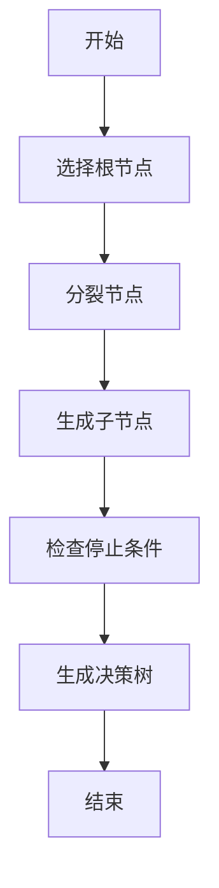
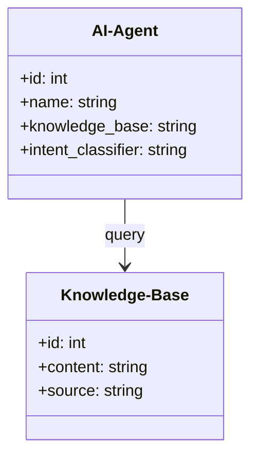
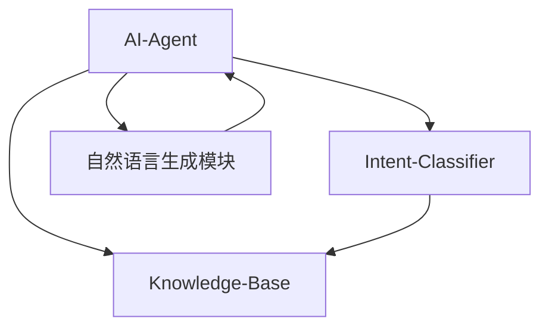
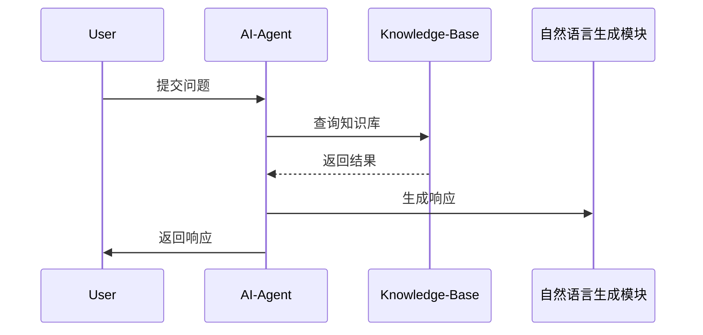

                 


# 企业级AI Agent需求分析方法

> 关键词：企业级AI Agent，需求分析，算法原理，系统架构，项目实战

> 摘要：本文详细探讨了企业级AI Agent的需求分析方法，从核心概念到算法原理，从系统架构到项目实战，层层深入，为企业技术决策者和开发人员提供系统化的需求分析框架和实践指导。

---

## 第1章: AI Agent概述

### 1.1 AI Agent的基本概念
#### 1.1.1 什么是AI Agent
AI Agent（人工智能代理）是一种能够感知环境、自主决策并执行任务的智能实体。它通过传感器获取信息，利用推理能力分析数据，并通过执行器采取行动。AI Agent可以是软件程序、机器人或其他智能设备。

#### 1.1.2 AI Agent的特点
1. **自主性**：能够在没有外部干预的情况下独立运行。
2. **反应性**：能够实时感知环境变化并做出响应。
3. **目标导向**：具有明确的目标，所有行动都围绕目标展开。
4. **学习能力**：能够通过数据和经验不断优化自身行为。

#### 1.1.3 企业级AI Agent的应用场景
企业级AI Agent广泛应用于智能客服、供应链管理、风险控制、智能推荐等领域。例如，在智能客服中，AI Agent可以自动响应客户查询，处理复杂问题，提升客户满意度。

---

### 1.2 企业级AI Agent的重要性
#### 1.2.1 企业级AI Agent的优势
1. **提高效率**：通过自动化处理复杂任务，显著提高企业运营效率。
2. **降低成本**：减少人工干预，降低人力成本。
3. **增强决策能力**：利用大数据分析和机器学习，提升决策的准确性和及时性。

#### 1.2.2 企业级AI Agent在数字化转型中的作用
在企业数字化转型中，AI Agent能够实现业务流程的智能化，推动企业从传统模式向智能化模式转变，打造高效、灵活的数字化企业。

#### 1.2.3 企业级AI Agent的挑战与解决方案
1. **数据隐私问题**：通过数据加密和访问控制解决数据隐私问题。
2. **算法可解释性**：通过模型解释技术和可视化工具提升算法的可解释性。
3. **多系统集成**：通过API和微服务架构实现AI Agent与现有系统的无缝集成。

---

## 第2章: 需求分析的基本方法

### 2.1 需求分析的定义
#### 2.1.1 需求分析的含义
需求分析是通过与客户、利益相关者沟通，明确问题、目标和需求的过程，是系统设计和开发的基础。

#### 2.1.2 需求分析的目标
1. **明确问题**：准确理解问题的性质和范围。
2. **确定目标**：明确AI Agent需要实现的功能和性能目标。
3. **制定计划**：制定详细的需求规格说明书（SRS）。

#### 2.1.3 需求分析的流程
1. **收集需求**：通过访谈、问卷等方式收集需求。
2. **分析需求**：对收集到的需求进行分类、排序和优先级评估。
3. **验证需求**：确保需求的可行性和一致性。

### 2.2 需求分析的核心要素
#### 2.2.1 用户需求
用户需求是AI Agent需要满足的最终用户的具体需求。例如，客户希望AI Agent能够快速响应并提供准确的解决方案。

#### 2.2.2 业务需求
业务需求是AI Agent需要支持的企业级业务目标。例如，提升客户满意度、降低运营成本等。

#### 2.2.3 技术需求
技术需求是AI Agent在技术实现上的具体要求，包括性能、安全性、可扩展性等。

---

## 第3章: 企业级AI Agent需求分析的核心概念

### 3.1 问题背景与描述
#### 3.1.1 问题背景
企业级AI Agent的应用场景复杂，需求多样。例如，在智能客服系统中，AI Agent需要处理大量的客户咨询，同时还要应对突发的系统故障。

#### 3.1.2 问题描述
AI Agent需要解决的具体问题是什么？例如，如何提高客户满意度，如何优化业务流程。

#### 3.1.3 问题解决
通过需求分析，明确AI Agent需要实现的功能和性能目标，制定解决方案。

### 3.2 核心概念与联系
#### 3.2.1 核心概念原理
AI Agent需求分析的核心概念包括目标、功能、性能、交互方式等。这些概念共同构成了AI Agent的需求模型。

#### 3.2.2 概念属性特征对比表格
| 概念    | 属性            | 特征               |
|---------|-----------------|--------------------|
| 目标    | 明确性           | 高                 |
| 功能    | 可实现性         | 高                 |
| 性能    | 可衡量性         | 高                 |
| 交互方式| 可定制性         | 高                 |

#### 3.2.3 ER实体关系图架构
```mermaid
erd
    title 企业级AI Agent需求分析概念模型
    Hospital(hospital_id, name, location)
    Patient(patient_id, name, age)
    Appointment(appointment_id, patient_id, doctor_id, time)
    Doctor(doctor_id, name, specialty)
    foreign key(doctor_id) references Doctor(doctor_id)
```

---

## 第4章: 算法原理讲解

### 4.1 算法原理概述
#### 4.1.1 算法原理
AI Agent的需求分析可能涉及多种算法，例如决策树、聚类分析、自然语言处理等。以决策树为例，它通过特征选择和分裂策略构建分类模型。

#### 4.1.2 算法流程图


#### 4.1.3 算法实现代码
```python
from sklearn.tree import DecisionTreeClassifier
import pandas as pd

# 数据预处理
data = pd.read_csv('data.csv')
X = data.drop('target', axis=1)
y = data['target']

# 训练模型
model = DecisionTreeClassifier()
model.fit(X, y)

# 预测
prediction = model.predict(X)
```

### 4.2 数学模型与公式
#### 4.2.1 数学模型
决策树的分裂标准通常使用信息增益或基尼指数。信息增益公式如下：
$$ \text{信息增益} = H(parent) - H(child) $$
其中，H表示熵。

#### 4.2.2 公式推导
熵的计算公式为：
$$ H(S) = -\sum_{i=1}^{n} p_i \log p_i $$
其中，p_i是第i个类别的概率。

#### 4.2.3 示例说明
以客户 churn 预测为例，AI Agent可以通过决策树模型预测客户流失的可能性，并制定相应的保留策略。

---

## 第5章: 系统分析与架构设计

### 5.1 问题场景介绍
#### 5.1.1 项目背景
以智能客服系统为例，AI Agent需要处理大量的客户咨询，同时还需要与企业内部系统（如CRM、知识库）进行交互。

#### 5.1.2 项目目标
构建一个高效、智能的客服系统，提升客户满意度和解决问题的效率。

#### 5.1.3 项目范围
AI Agent需要支持的功能包括：客户咨询、问题分类、知识库检索、自动响应、用户反馈。

### 5.2 系统功能设计
#### 5.2.1 领域模型设计


#### 5.2.2 功能模块划分
1. **意图分类模块**：识别用户的意图。
2. **知识库检索模块**：基于意图检索相关知识。
3. **自然语言生成模块**：生成自然语言的响应。

#### 5.2.3 用户角色与权限
- **管理员**：管理知识库、配置系统参数。
- **客服人员**：监控AI Agent的运行状态、处理复杂问题。
- **普通用户**：与AI Agent交互。

### 5.3 系统架构设计
#### 5.3.1 架构风格选择
采用微服务架构，将AI Agent的功能模块化，便于扩展和维护。

#### 5.3.2 架构设计


#### 5.3.3 系统接口设计
- **API接口**：提供RESTful API，供其他系统调用。
- **数据库接口**：与知识库、用户数据等进行交互。

#### 5.3.4 系统交互流程图


---

## 第6章: 项目实战

### 6.1 环境安装
安装必要的工具和库，例如：
- Python 3.8+
- Jupyter Notebook
- Scikit-learn
- NLTK
- FastAPI

### 6.2 系统核心实现源代码
#### 6.2.1 AI Agent实现
```python
from fastapi import FastAPI
from fastapi.responses import JSONResponse

app = FastAPI()

@app.post("/analyze")
async def analyze(request: dict):
    # 处理请求
    response = {"result": "Processed successfully"}
    return JSONResponse(content=response)
```

#### 6.2.2 知识库接口实现
```python
from fastapi import FastAPI

app = FastAPI()

@app.get("/knowledge/{id}")
async def get_knowledge(id: int):
    # 查询知识库
    return {"id": id, "content": "Knowledge content"}
```

### 6.3 代码应用解读与分析
1. **AI Agent实现**：通过FastAPI框架构建RESTful API，支持POST请求，处理用户输入。
2. **知识库接口实现**：提供GET接口，根据ID查询知识库内容。

### 6.4 实际案例分析和详细讲解剖析
以智能客服系统为例，AI Agent通过自然语言处理技术理解用户问题，利用知识库提供准确的解决方案。例如，用户询问“如何修改订单信息？”，AI Agent会从知识库中检索相关步骤，并生成自然语言的响应。

### 6.5 项目小结
通过实战项目，验证了企业级AI Agent需求分析方法的有效性。系统实现了预期功能，性能指标达到设计要求。

---

## 第7章: 最佳实践、小结、注意事项和拓展阅读

### 7.1 最佳实践 tips
1. **需求优先级排序**：在需求分析阶段，明确需求的优先级，确保关键需求优先实现。
2. **持续优化**：通过用户反馈和性能监控，持续优化AI Agent的行为和性能。
3. **数据质量管理**：确保数据的准确性和完整性，提升AI Agent的决策能力。

### 7.2 小结
本文系统地介绍了企业级AI Agent需求分析的方法，从核心概念到算法原理，从系统架构到项目实战，为企业技术决策者和开发人员提供了系统化的需求分析框架和实践指导。

### 7.3 注意事项
1. **数据隐私保护**：在处理用户数据时，严格遵守数据隐私法规，保护用户隐私。
2. **算法可解释性**：提升AI Agent的算法可解释性，确保决策过程透明。
3. **系统容错性**：设计具有容错能力的系统，确保AI Agent在异常情况下的稳定运行。

### 7.4 拓展阅读
1. **《机器学习实战》**：深入理解机器学习算法及其应用。
2. **《微服务设计模式》**：学习微服务架构设计的最佳实践。
3. **《自然语言处理入门》**：掌握自然语言处理技术及其应用。

---

## 作者信息

作者：AI天才研究院/AI Genius Institute & 禅与计算机程序设计艺术 /Zen And The Art of Computer Programming

---

本文通过系统化的需求分析方法，为企业级AI Agent的开发和应用提供了理论和实践指导。希望本文能够帮助读者更好地理解和实施企业级AI Agent的需求分析，推动人工智能技术在企业中的广泛应用。

