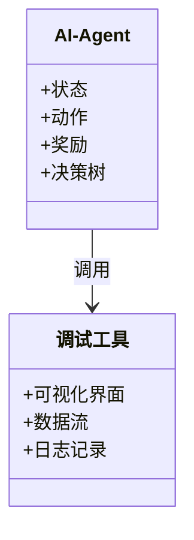
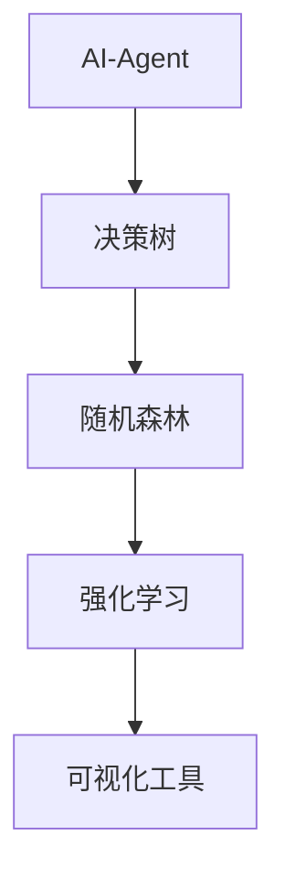

                 


# 可视化调试：深入了解AI Agent的决策过程

> **关键词**：AI Agent、可视化调试、决策过程、强化学习、决策树、系统架构  
> **摘要**：本文深入探讨了AI Agent的决策过程，并通过可视化调试的方法，帮助读者理解其背后的算法原理和数学模型。文章从AI Agent的基本概念出发，结合具体案例，详细分析了决策树、随机森林和强化学习等算法的核心思想，并通过系统架构设计和项目实战，展示了如何通过可视化调试工具来优化AI Agent的决策过程。

---

# 第1章: AI Agent与可视化调试的背景介绍

## 1.1 AI Agent的基本概念

### 1.1.1 什么是AI Agent
AI Agent（人工智能代理）是一种能够感知环境并采取行动以实现目标的智能实体。它可以是一个软件程序、机器人或其他智能系统，通过传感器获取信息，并通过执行器与环境交互。AI Agent的核心目标是通过自主决策和行动，最大化其目标函数的值。

### 1.1.2 AI Agent的分类与特点
AI Agent可以根据其智能水平和应用场景分为多种类型，常见的分类包括：

1. **反应式AI Agent**：基于当前感知做出反应，不依赖历史信息。
2. **认知式AI Agent**：具备复杂的推理和规划能力，能够根据目标和环境信息做出决策。
3. **强化学习AI Agent**：通过与环境的交互，学习最优策略以最大化累积奖励。

AI Agent的特点包括：
- **自主性**：能够在没有外部干预的情况下自主运行。
- **反应性**：能够实时感知环境并做出响应。
- **目标导向性**：通过目标函数指导其决策过程。

### 1.1.3 可视化调试在AI Agent中的作用
AI Agent的决策过程往往涉及复杂的算法和数学模型，这使得调试过程变得困难。可视化调试通过将决策过程中的关键节点和数据流以图形化的方式呈现，帮助开发者快速定位问题、优化算法性能，并提升用户体验。

---

## 1.2 可视化调试的核心概念

### 1.2.1 可视化调试的定义
可视化调试是一种通过图形化界面展示程序运行过程中的关键信息，帮助开发者理解程序行为并定位问题的技术。与传统的日志调试相比，可视化调试更加直观，能够将复杂的逻辑关系以图形化的方式呈现。

### 1.2.2 可视化调试与传统调试的区别
| **方面** | **传统调试** | **可视化调试** |
|----------|--------------|----------------|
| **信息展示** | 文本形式的日志 | 图形化界面展示关键节点和数据流 |
| **操作方式** | 通过断点和调试器命令 | 通过图形界面交互 |
| **适用场景** | 简单逻辑问题 | 复杂算法和系统架构问题 |

### 1.2.3 可视化调试在AI Agent中的应用价值
1. **提升开发效率**：通过图形化界面快速定位问题，减少调试时间。
2. **优化算法性能**：通过可视化工具分析算法的执行路径，优化决策过程。
3. **增强用户体验**：通过可视化展示AI Agent的决策过程，帮助用户更好地理解系统行为。

---

## 1.3 本章小结

本章从AI Agent的基本概念出发，介绍了其分类与特点，并重点探讨了可视化调试的核心概念及其在AI Agent中的应用价值。通过对比分析，读者可以理解可视化调试在AI Agent开发中的重要性。

---

# 第2章: AI Agent决策过程的核心概念与联系

## 2.1 决策树算法

### 2.1.1 决策树的定义与特点
决策树是一种基于树状结构的分类和回归模型，通过递归地将数据划分为不同的子集，最终形成一个决策路径。决策树的特点包括：
- **可解释性强**：决策路径直观易懂。
- **计算效率高**：适合处理中小规模数据集。

### 2.1.2 决策树的构建过程
决策树的构建过程如下：
1. **选择根节点**：根据信息增益或基尼指数选择最优特征作为根节点。
2. **划分数据集**：根据根节点的特征值将数据集划分为不同的子集。
3. **递归构建子树**：对每个子集重复选择根节点和划分数据的过程。
4. **剪枝优化**：为避免过拟合，对决策树进行剪枝优化。

### 2.1.3 决策树的优缺点
| **优点** | **缺点** |
|----------|----------|
| **可解释性强** | **易过拟合** |
| **计算效率高** | **不适合大数据集** |

---

## 2.2 随机森林算法

### 2.2.1 随机森林的定义与特点
随机森林是一种基于决策树的集成学习算法，通过随机选择特征和样本进行决策树的构建，最终通过投票或加权的方式得出最终结果。随机森林的特点包括：
- **抗过拟合能力强**：通过集成多个决策树降低过拟合风险。
- **计算效率高**：适合处理大规模数据集。

### 2.2.2 随机森林的工作原理
随机森林通过以下步骤实现分类或回归：
1. **随机选择特征和样本**：在构建每棵决策树时，随机选择部分特征和样本。
2. **构建决策树**：对选中的特征和样本进行决策树的构建。
3. **集成预测结果**：通过投票（分类）或平均（回归）的方式得出最终结果。

### 2.2.3 随机森林与决策树的对比
| **方面** | **决策树** | **随机森林** |
|----------|------------|--------------|
| **抗过拟合能力** | 较弱 | 较强 |
| **计算效率** | 适合小规模数据 | 适合大规模数据 |

---

## 2.3 强化学习算法

### 2.3.1 强化学习的基本概念
强化学习是一种通过与环境交互来学习最优策略的机器学习方法。强化学习的核心在于通过最大化累积奖励来优化策略。

### 2.3.2 Q-learning算法的原理
Q-learning是一种经典的强化学习算法，其核心思想是通过更新Q值表来学习状态-动作对的最优价值。Q值的更新公式如下：
$$ Q(s, a) = Q(s, a) + \alpha [r + \gamma \max Q(s', a') - Q(s, a)] $$

其中：
- \( \alpha \) 是学习率。
- \( \gamma \) 是折扣因子。
- \( r \) 是即时奖励。
- \( Q(s', a') \) 是后续状态-动作对的Q值。

### 2.3.3 强化学习在AI Agent中的应用
强化学习广泛应用于游戏AI、机器人控制等领域。通过与环境的交互，AI Agent能够逐步学习最优策略，从而实现复杂任务的自主决策。

---

## 2.4 本章小结

本章详细介绍了AI Agent决策过程中的核心算法，包括决策树、随机森林和强化学习。通过对比分析，读者可以理解不同算法的特点及其适用场景。

---

# 第3章: AI Agent决策过程的数学模型与算法原理

## 3.1 决策树的熵与信息增益

### 3.1.1 熵的定义与公式
熵是衡量数据集混乱程度的指标，公式如下：
$$ H(S) = -\sum_{i=1}^{n} p_i \log_2 p_i $$

其中，\( p_i \) 是第\( i \)个类别的概率。

### 3.1.2 信息增益的计算公式
信息增益是决策树分裂的标准之一，公式如下：
$$ \text{信息增益} = H(S) - H(S|A) $$

其中，\( H(S|A) \) 是在特征\( A \)条件下的熵。

---

## 3.2 强化学习中的Q值更新公式

Q值的更新公式如下：
$$ Q(s, a) = Q(s, a) + \alpha [r + \gamma \max Q(s', a') - Q(s, a)] $$

其中，\( \alpha \) 是学习率，\( \gamma \) 是折扣因子，\( r \) 是即时奖励。

---

## 3.3 随机森林的投票机制

### 3.3.1 分类问题的投票机制
在分类问题中，随机森林通过投票机制得出最终类别。

### 3.3.2 回归问题的投票机制
在回归问题中，随机森林通过平均机制得出最终结果。

---

## 3.4 本章小结

本章通过数学公式和算法原理，详细分析了AI Agent决策过程中的核心模型，包括决策树的熵与信息增益，以及强化学习中的Q值更新公式。

---

# 第4章: AI Agent决策过程的系统分析与架构设计

## 4.1 系统功能设计

### 4.1.1 领域模型设计
领域模型是系统功能设计的核心，通过Mermaid类图展示如下：



---

## 4.2 系统架构设计

### 4.2.1 系统架构图
系统架构图展示如下：



---

## 4.3 系统接口设计

### 4.3.1 系统接口
系统接口主要包含以下部分：
- **输入接口**：接收环境感知数据。
- **输出接口**：输出决策结果或执行动作。
- **调试接口**：与可视化调试工具进行交互。

---

## 4.4 本章小结

本章通过系统分析与架构设计，展示了AI Agent决策过程的实现方案，并通过Mermaid图展示了系统的模块关系。

---

# 第5章: AI Agent决策过程的项目实战

## 5.1 环境安装

### 5.1.1 安装Python
需要安装Python 3.8及以上版本。

### 5.1.2 安装依赖库
安装以下依赖库：
- `numpy`
- `scikit-learn`
- `matplotlib`

---

## 5.2 系统核心实现源代码

### 5.2.1 决策树实现
```python
from sklearn.tree import DecisionTreeClassifier
from sklearn.datasets import make_classification
from sklearn.metrics import accuracy_score

# 生成数据集
X, y = make_classification(n_samples=100, n_features=2, n_classes=2, random_state=42)

# 初始化决策树模型
model = DecisionTreeClassifier()

# 训练模型
model.fit(X, y)

# 预测结果
y_pred = model.predict(X)

# 计算准确率
print("Accuracy:", accuracy_score(y, y_pred))
```

### 5.2.2 强化学习实现
```python
import numpy as np
from collections import defaultdict

# 定义Q-learning算法
class QLearning:
    def __init__(self, state_space, action_space):
        self.q_table = defaultdict(dict)
        self.state_space = state_space
        self.action_space = action_space

    def choose_action(self, state, epsilon=0.1):
        if np.random.random() < epsilon:
            return np.random.choice(self.action_space)
        else:
            return max(self.q_table[state], key=lambda k: self.q_table[state][k])

    def update_q_value(self, state, action, reward, next_state, alpha=0.1, gamma=0.9):
        current_q = self.q_table[state].get(action, 0)
        next_max_q = max(self.q_table[next_state].values()) if self.q_table[next_state] else 0
        target = reward + gamma * next_max_q
        self.q_table[state][action] = current_q + alpha * (target - current_q)

# 初始化Q-learning算法
state_space = [0, 1, 2]
action_space = ['left', 'right', 'stay']
q_learning = QLearning(state_space, action_space)

# 训练过程
for _ in range(100):
    state = np.random.choice(state_space)
    action = q_learning.choose_action(state)
    reward = np.random.randint(0, 10)
    next_state = np.random.choice(state_space)
    q_learning.update_q_value(state, action, reward, next_state)
```

---

## 5.3 代码应用解读与分析

### 5.3.1 决策树代码解读
上述代码通过`scikit-learn`库实现了决策树分类模型，展示了如何通过训练数据构建决策树，并进行预测和准确率计算。

### 5.3.2 强化学习代码解读
上述代码通过自定义Q-learning算法，展示了如何通过与环境的交互更新Q值表，并最终实现最优策略。

---

## 5.4 实际案例分析

### 5.4.1 案例1：决策树分类
假设我们有一个简单的分类问题，通过决策树模型可以准确地将数据分为两类。

### 5.4.2 案例2：强化学习控制
通过Q-learning算法，可以训练一个AI Agent在迷宫中找到最优路径。

---

## 5.5 本章小结

本章通过具体的项目实战，展示了如何通过Python代码实现决策树和强化学习算法，并通过实际案例分析，帮助读者更好地理解AI Agent决策过程的实现细节。

---

# 第6章: 总结与展望

## 6.1 总结
本文从AI Agent的基本概念出发，详细探讨了其决策过程的核心算法，并通过可视化调试的方法，展示了如何优化AI Agent的决策过程。通过系统架构设计和项目实战，读者可以更好地理解AI Agent的实现细节。

## 6.2 未来展望
随着人工智能技术的不断发展，AI Agent的决策过程将变得更加复杂和多样化。未来的研究方向包括：
1. **更高效的算法设计**：优化决策树和强化学习算法的计算效率。
2. **更强大的可视化工具**：开发功能更强大的可视化调试工具，帮助开发者更好地理解AI Agent的决策过程。
3. **多模态决策**：结合图像、文本等多种模态信息，提升AI Agent的决策能力。

---

# 作者

作者：AI天才研究院/AI Genius Institute & 禅与计算机程序设计艺术 /Zen And The Art of Computer Programming

