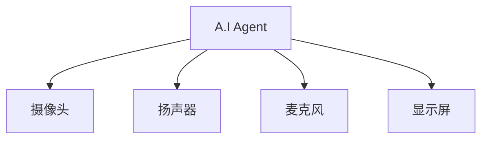
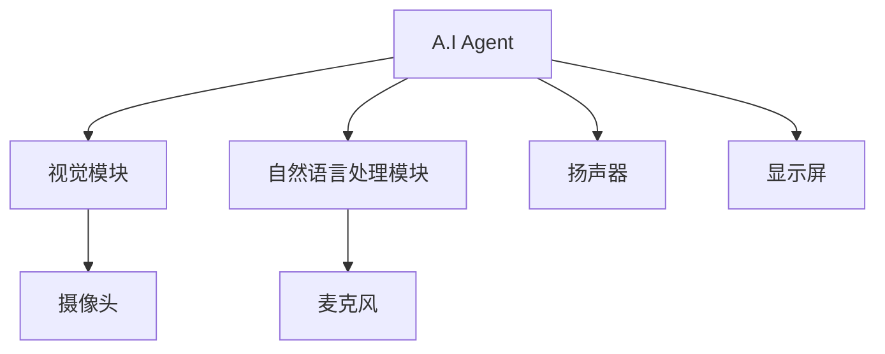
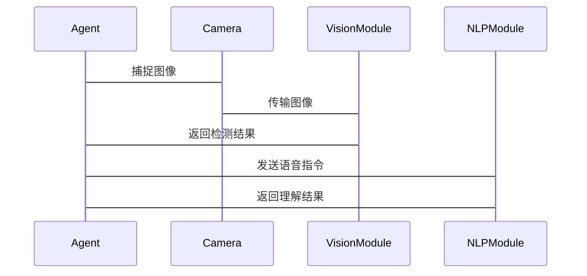

                 


# 开发具有视觉场景理解能力的AI Agent

> 关键词：AI Agent，视觉场景理解，计算机视觉，自然语言处理，目标检测，语义分割

> 摘要：本文将详细介绍开发具有视觉场景理解能力的AI Agent的全过程。从基本概念到核心算法，从系统架构到项目实战，全面解析如何构建能够理解视觉场景的智能代理。文章内容涵盖视觉场景理解的关键技术、AI Agent的开发框架、算法原理与数学模型、系统架构设计、项目实战及扩展阅读等。

---

# 第一章: 视觉场景理解与AI Agent概述

## 1.1 视觉场景理解的背景与意义

### 1.1.1 问题背景与挑战

在人工智能快速发展的今天，AI Agent（智能代理）已广泛应用于各个领域，如智能家居、自动驾驶、机器人助手等。然而，当前大多数AI Agent主要依赖于文本或规则进行交互，难以真正理解复杂的视觉场景。随着计算机视觉和自然语言处理技术的进步，如何让AI Agent具备视觉场景理解能力成为了一个重要研究方向。

**挑战：**

1. **复杂场景的理解**：真实场景中存在大量的物体、人物和环境信息，如何高效准确地提取这些信息是一个难题。
2. **多模态数据的融合**：视觉数据（图像、视频）与语言数据（文本、语音）的融合需要复杂的算法支持。
3. **实时性与计算效率**：在实际应用中，AI Agent需要实时处理视觉信息，这对计算效率提出了更高的要求。

### 1.1.2 问题描述与目标

本文旨在探讨如何通过计算机视觉技术，赋予AI Agent理解复杂视觉场景的能力。具体目标包括：

1. 实现实时的视觉场景感知与理解。
2. 结合自然语言处理技术，实现跨模态的信息融合。
3. 开发高效的算法，确保在实际应用中的计算效率。

### 1.1.3 解决方案与技术路线

1. **技术路线**：
   - 采用深度学习技术，尤其是基于CNN（卷积神经网络）和Transformer的模型。
   - 结合目标检测、语义分割等技术，实现场景理解。
   - 利用多模态数据融合技术，提升理解能力。

2. **实现步骤**：
   - 数据采集与预处理。
   - 模型训练与优化。
   - 系统集成与测试。

---

## 1.2 AI Agent的核心概念与能力

### 1.2.1 AI Agent的定义与特点

AI Agent是一种智能系统，能够感知环境、自主决策并执行任务。其核心特点包括：

1. **自主性**：无需外部干预，自主完成任务。
2. **反应性**：能够实时感知环境并做出反应。
3. **学习能力**：通过数据和经验不断优化自身性能。

### 1.2.2 视觉场景理解的核心能力

1. **目标检测**：识别场景中的物体并确定其位置。
2. **语义分割**：为场景中的每个像素分配语义标签。
3. **场景解析**：理解场景中的物体关系和场景布局。

### 1.2.3 AI Agent与视觉场景理解的结合

通过视觉场景理解，AI Agent能够：

1. 理解周围环境，做出更智能的决策。
2. 提供更精准的服务，如智能家居中的设备控制。
3. 提高交互效率，如在自动驾驶中实时理解道路情况。

---

## 1.3 本书的核心内容与目标

### 1.3.1 本书的主要内容

1. **视觉场景理解的关键技术**：目标检测、语义分割、多模态融合。
2. **AI Agent的开发框架**：TensorFlow、PyTorch等深度学习框架。
3. **算法原理与数学模型**：深度学习模型的数学推导与实现。
4. **系统架构设计**：AI Agent的系统组成与架构设计。
5. **项目实战**：从环境搭建到模型训练，再到系统集成的完整流程。

### 1.3.2 本书的目标读者

1. 人工智能领域的研究人员。
2. 计算机视觉与自然语言处理工程师。
3. 对AI Agent开发感兴趣的开发者。

### 1.3.3 本书的结构安排

1. 第一章：概述AI Agent与视觉场景理解的基本概念。
2. 第二章：深入讲解视觉场景理解的核心技术。
3. 第三章：介绍AI Agent的开发框架与工具。
4. 第四章：分析算法原理与数学模型。
5. 第五章：设计系统架构。
6. 第六章：项目实战与案例分析。
7. 第七章：总结与扩展阅读。

---

## 1.4 本章小结

本章主要介绍了视觉场景理解与AI Agent的基本概念、核心技术和实现目标。通过本章的学习，读者可以对AI Agent的视觉场景理解能力有一个全面的了解，并为后续章节的学习打下基础。

---

# 第二章: 视觉场景理解的关键技术

## 2.1 计算机视觉基础

### 2.1.1 图像处理与特征提取

1. **图像处理**：包括图像的预处理、增强和变换。
2. **特征提取**：通过CNN提取图像的深层特征。

---

### 2.1.2 目标检测与识别

1. **目标检测算法**：
   - YOLO（You Only Look Once）：实时目标检测算法。
   - Faster R-CNN：基于区域建议的目标检测算法。

2. **目标识别**：
   - 使用CNN提取目标特征。
   - 通过分类器进行目标识别。

---

### 2.1.3 语义分割与场景解析

1. **语义分割**：
   - 使用FCN（全卷积网络）进行像素级分割。
   - 基于深度学习的分割模型（如U-Net）。

2. **场景解析**：
   - 通过分割结果理解场景布局。
   - 结合上下文信息进行场景推理。

---

## 2.2 自然语言处理与视觉理解的结合

### 2.2.1 NLP基础与文本理解

1. **词向量表示**：如Word2Vec、GloVe。
2. **文本编码模型**：如BERT、GPT。

---

### 2.2.2 多模态融合技术

1. **多模态模型**：
   - 使用Transformer进行跨模态特征融合。
   - 对齐视觉和语言特征。

---

### 2.2.3 视觉与语言联合建模

1. **联合建模方法**：
   - 基于图像的文本生成。
   - 基于文本的图像生成。

---

## 2.3 视觉场景理解的算法与模型

### 2.3.1 基于CNN的目标检测

1. **YOLO算法流程**：
   - 图像输入 → 特征提取 → 预测边界框和类别。

2. **YOLO的数学模型**：
   - 输入：$224 \times 224$ 的图像。
   - 输出：预测的边界框坐标 $(x, y, w, h)$ 和类别概率分布。

---

### 2.3.2 基于Transformer的视觉模型

1. **Transformer的结构**：
   - 编码器：将输入序列映射为潜层表示。
   - 解码器：生成目标序列。

2. **视觉Transformer的实现**：
   - 使用ViT（Vision Transformer）模型。

---

### 2.3.3 多任务学习与端到端优化

1. **多任务学习的优势**：
   - 联合优化多个任务，提升整体性能。
   - 参数共享，减少模型复杂度。

---

## 2.4 本章小结

本章详细介绍了视觉场景理解的关键技术，包括计算机视觉基础、自然语言处理与视觉理解的结合，以及相关的算法与模型。这些技术为后续AI Agent的开发奠定了基础。

---

# 第三章: AI Agent的开发框架与工具

## 3.1 开发AI Agent的常见框架

### 3.1.1 基于TensorFlow的开发框架

1. **TensorFlow的优势**：
   - 支持多平台部署。
   - 丰富的库和教程。

2. **TensorFlow的使用流程**：
   - 数据预处理 → 模型构建 → 模型训练 → 模型部署。

---

### 3.1.2 基于PyTorch的开发框架

1. **PyTorch的优势**：
   - 动态计算图，便于调试。
   - 生态系统完善。

2. **PyTorch的使用流程**：
   - 数据加载 → 模型定义 → 模型训练 → 模型推理。

---

### 3.1.3 其他开源框架简介

1. **Keras**：
   - 高度模块化，易于上手。

2. **Caffe**：
   - 专注于视觉任务，适合快速部署。

---

## 3.2 视觉场景理解的工具与库

### 3.2.1 OpenCV图像处理库

1. **OpenCV的功能**：
   - 图像处理 → 视频处理 → 特征提取。

2. **OpenCV的安装与使用**：
   - 安装：`pip install opencv-python`
   - 示例代码：读取图像、显示图像。

---

### 3.2.2 Mask R-CNN目标检测模型

1. **Mask R-CNN的优势**：
   - 同时实现目标检测与语义分割。

2. **Mask R-CNN的实现流程**：
   - 数据预处理 → 提取建议区域 → 特征提取 → 分类与分割。

---

### 3.2.3 MMF框架与多模态任务

1. **MMF的功能**：
   - 支持多模态任务，如视觉问答、图像描述生成。

2. **MMF的安装与使用**：
   - 安装：`pip install mmf`

---

## 3.3 选择合适的开发工具与框架

### 3.3.1 根据需求选择框架

1. **选择TensorFlow的情况**：
   - 需要快速部署，注重生产环境的稳定性。

2. **选择PyTorch的情况**：
   - 需要进行复杂的研究与开发，注重灵活性。

---

### 3.3.2 开发环境的搭建与配置

1. **安装Python**：推荐使用Anaconda。
2. **安装深度学习框架**：如TensorFlow、PyTorch。
3. **安装视觉库**：如OpenCV、MMF。

---

### 3.3.3 常见工具的优缺点对比

| 工具名称 | 优点 | 缺点 |
|---------|------|------|
| TensorFlow | 支持多平台，部署方便 | 学习曲线较陡 |
| PyTorch   | 动态计算图，易于调试 | 生态系统不如TensorFlow完善 |

---

## 3.4 本章小结

本章介绍了AI Agent开发的主要框架与工具，包括TensorFlow、PyTorch、OpenCV和MMF等。通过合理选择工具和框架，可以显著提高开发效率。

---

# 第四章: 算法原理与数学模型

## 4.1 目标检测算法详解

### 4.1.1 YOLO算法的原理与流程

1. **YOLOv3的网络结构**：
   - 输入：416x416的图像。
   - 输出：19x19的网格，每个网格预测多个边界框。

2. **YOLO的数学模型**：
   - 输入：$x_{in}, y_{in}, w_{in}, h_{in}$（图像尺寸）。
   - 输出：预测的边界框坐标 $(x, y, w, h)$ 和类别概率。

---

### 4.1.2 Faster R-CNN的结构与优化

1. **Faster R-CNN的流程**：
   - 提取建议区域 → 特征提取 → 分类与回归。

2. **Faster R-CNN的数学模型**：
   - 输入：图像。
   - 输出：目标的边界框和类别。

---

### 4.1.3 检测算法的性能评估指标

1. **指标包括**：
   - 精准率（Precision）。
   - 召回率（Recall）。
   - F1分数。

---

## 4.2 语义分割算法详解

### 4.2.1 FCN的结构与实现

1. **FCN的网络结构**：
   - 编码器：提取特征。
   - 解码器：上采样生成分割结果。

2. **FCN的数学模型**：
   - 输入：$W \times H$ 的图像。
   - 输出：$W \times H$ 的分割结果。

---

### 4.2.2 U-Net的实现与应用

1. **U-Net的结构**：
   - 编码器：下采样提取特征。
   - 解码器：上采样恢复图像尺寸。

2. **U-Net的应用场景**：
   - 医疗图像分割。
   - 图像修复。

---

## 4.3 多任务学习与端到端优化

### 4.3.1 多任务学习的优势

1. **参数共享**：减少模型参数数量。
2. **联合优化**：提升整体性能。

---

### 4.3.2 端到端优化的实现

1. **端到端模型的设计**：
   - 输入：图像。
   - 输出：目标检测结果、语义分割结果。

2. **端到端模型的训练**：
   - 使用同一损失函数优化多个任务。

---

## 4.4 本章小结

本章详细讲解了目标检测和语义分割的核心算法，并分析了多任务学习在视觉场景理解中的应用。这些算法为后续系统设计奠定了基础。

---

# 第五章: 系统架构设计

## 5.1 问题场景介绍

### 5.1.1 问题背景

AI Agent需要在复杂环境中实时理解视觉场景，实现自主决策和交互。

---

### 5.1.2 问题描述

设计一个能够实时理解视觉场景的AI Agent系统，包括数据采集、处理、分析和决策等环节。

---

## 5.2 项目介绍

### 5.2.1 项目目标

开发一个具备视觉场景理解能力的AI Agent，能够实现目标检测、语义分割和多模态交互。

---

### 5.2.2 项目范围

1. **视觉理解模块**：目标检测、语义分割。
2. **交互模块**：自然语言处理、语音识别。

---

## 5.3 系统功能设计

### 5.3.1 领域模型（ER实体关系图）



---

### 5.3.2 系统架构设计



---

### 5.3.3 系统接口设计

1. **视觉模块接口**：
   - 输入：图像数据。
   - 输出：目标检测结果、语义分割结果。

2. **自然语言处理模块接口**：
   - 输入：语音指令。
   - 输出：文本理解结果。

---

## 5.4 系统交互流程设计

### 5.4.1 交互流程图



---

## 5.5 本章小结

本章通过系统架构设计，明确了AI Agent的各个模块及其交互流程，为后续的开发奠定了基础。

---

# 第六章: 项目实战

## 6.1 环境安装与配置

### 6.1.1 安装Python与必要的库

```bash
pip install python
pip install numpy
pip install tensorflow
pip install opencv-python
pip install mmf
```

---

### 6.1.2 安装深度学习框架

```bash
pip install tensorflow
pip install pytorch
```

---

## 6.2 系统核心实现

### 6.2.1 视觉模块实现

```python
import cv2

def detect_object(image):
    # 使用YOLO模型进行目标检测
    # 返回检测结果
    pass

def semantic_segmentation(image):
    # 使用U-Net模型进行语义分割
    # 返回分割结果
    pass
```

---

### 6.2.2 自然语言处理模块实现

```python
import transformers

def text_processing(text):
    # 使用BERT模型进行文本理解
    # 返回理解结果
    pass
```

---

## 6.3 代码应用解读与分析

### 6.3.1 视觉模块代码解读

```python
def detect_object(image):
    # 图像预处理
    image = cv2.resize(image, (416, 416))
    image = image / 255.0
    image = image[np.newaxis, :, :, :]
    
    # 使用YOLO模型进行预测
    prediction = model.predict(image)
    return prediction

def semantic_segmentation(image):
    # 图像预处理
    image = cv2.resize(image, (224, 224))
    image = image / 255.0
    image = image[np.newaxis, :, :, :]
    
    # 使用U-Net模型进行预测
    prediction = model.predict(image)
    return prediction
```

---

### 6.3.2 自然语言处理模块代码解读

```python
def text_processing(text):
    # 文本预处理
    inputs = tokenizer(text, return_tensors='pt')
    
    # 使用BERT模型进行预测
    outputs = model(**inputs)
    return outputs
```

---

## 6.4 实际案例分析

### 6.4.1 案例描述

假设我们开发一个智能家居AI Agent，能够通过摄像头感知家庭环境，并根据用户的语音指令执行相应的操作。

---

### 6.4.2 案例实现与分析

1. **视觉模块**：
   - 检测家庭中的物体（如电视、沙发）。
   - 进行语义分割，识别物体的位置。

2. **自然语言处理模块**：
   - 理解用户的语音指令（如“打开电视”）。
   - 调用相应的设备进行操作。

---

## 6.5 本章小结

本章通过实际案例，详细讲解了AI Agent的开发流程，包括环境搭建、核心模块实现、系统集成与测试。

---

# 第七章: 总结与扩展阅读

## 7.1 本章总结

本文详细介绍了开发具有视觉场景理解能力的AI Agent的全过程，包括视觉场景理解的核心技术、AI Agent的开发框架、系统架构设计以及项目实战等内容。

---

## 7.2 扩展阅读与学习资源

### 7.2.1 推荐书籍

1. 《Deep Learning》——Ian Goodfellow
2. 《Computer Vision: A Modern Approach》——Richard Szeliski

---

### 7.2.2 推荐博客与技术文章

1. TensorFlow官方博客。
2. PyTorch官方文档。

---

## 7.3 最佳实践 Tips

1. **数据预处理**：高质量的数据是模型性能的关键。
2. **模型优化**：合理选择模型参数，避免过拟合。
3. **系统测试**：进行全面的测试，确保各模块协同工作。

---

## 7.4 本章小结

通过本文的学习，读者可以全面掌握开发具有视觉场景理解能力的AI Agent的核心技术与实现方法。同时，本文还提供了丰富的扩展阅读资源和最佳实践建议，帮助读者进一步深入学习和实践。

---

# 作者

作者：AI天才研究院/AI Genius Institute & 禅与计算机程序设计艺术 /Zen And The Art of Computer Programming

